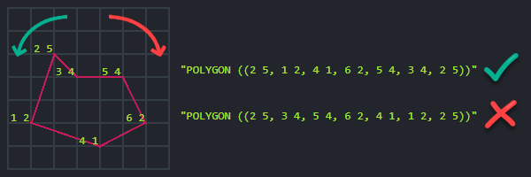

import Admonition from '@theme/Admonition';
import Tabs from '@theme/Tabs';
import TabItem from '@theme/TabItem';
import ContentFrame from '@site/src/components/ContentFrame';
import Panel from '@site/src/components/Panel';

<Admonition type="note" title="">

* Documents that contain spatial data can be queried by spatial queries that employ geographical criteria.  
  You can use either _Dynamic spatial query_ or _Spatial index query_.  
  
    * **Dynamic spatial query**  
      Make a dynamic spatial query on a collection (described below).  
      An auto-index will be created by the server.  

    * **Spatial index query**  
      Index your documents' spatial data in a static-index (see [indexing spatial data](../../../../indexes/indexing-spatial-data.mdx)) 
      and then make a spatial query on this index (see [query a spatial index](../../../../indexes/querying/spatial.mdx)).  

* To perform a spatial search,  
  use the `spatial` method, which provides a wide range of spatial functionalities.

* When making a dynamic spatial query from Studio,  
  results are also displayed on the global map. See [spatial queries map view](../../../../studio/database/queries/spatial-queries-map-view.mdx).
* In this article:

  * [Search by radius](../../../../client-api/session/querying/how-to-make-a-spatial-query.mdx#search-by-radius)  
  * [Search by shape](../../../../client-api/session/querying/how-to-make-a-spatial-query.mdx#search-by-shape)
      * [Circle](../../../../client-api/session/querying/how-to-make-a-spatial-query.mdx#circle)
      * [Polygon](../../../../client-api/session/querying/how-to-make-a-spatial-query.mdx#polygon)    
  * [Spatial sorting](../../../../client-api/session/querying/how-to-make-a-spatial-query.mdx#spatial-sorting)
      * [Order by distance](../../../../client-api/session/querying/how-to-make-a-spatial-query.mdx#order-by-distance)
      * [Order by distance desc](../../../../client-api/session/querying/how-to-make-a-spatial-query.mdx#order-by-distance-descending)
      * [Sort results by rounded distance](../../../../client-api/session/querying/how-to-make-a-spatial-query.mdx#sort-results-by-rounded-distance)
      * [Control null placement when sorting by distance](../../../../client-api/session/querying/how-to-make-a-spatial-query.mdx#control-null-placement-when-sorting-by-distance)
      * [Get resulting distance](../../../../client-api/session/querying/how-to-make-a-spatial-query.mdx#get-resulting-distance)
  * [Spatial API](../../../../client-api/session/querying/how-to-make-a-spatial-query.mdx#spatial-api)

</Admonition>

<Panel heading="Search by radius">

Use the `withinRadius` method to search for all documents containing spatial data that is located  
within the specified distance from the given center point.

<Tabs groupId='languageSyntax'>
<TabItem value="Query" label="Query">
```js
// This query will return all matching employee entities
// that are located within 20 kilometers radius
// from point (47.623473 latitude, -122.3060097 longitude).

// Define a dynamic query on 'employees' collection
const employeesWithinRadius = await session
    .query({ collection: "employees" })
     // Call 'spatial' method
    .spatial(
        // Specify the  document fields containing the spatial data
        new PointField("address.location.latitude", "address.location.longitude"),
        // Set the geographical area in which to search for matching documents
        // Call 'withinRadius', pass the radius and the center points coordinates  
        criteria => criteria.withinRadius(20, 47.623473, -122.3060097))
    .all();
```
</TabItem>
<TabItem value="RQL" label="RQL">
```sql
// This query will return all matching employee entities
// that are located within 20 kilometers radius
// from point (47.623473 latitude, -122.3060097 longitude).

from "employees"
where spatial.within(
    spatial.point(address.location.latitude, address.location.longitude),
    spatial.circle(20, 47.623473, -122.3060097)
)
```
</TabItem>
</Tabs>

</Panel>

<Panel heading="Search by shape"> 

* Use the `relatesToShape` method to search for all documents containing spatial data that is located  
  in the specified relation to the given shape.

* The shape is specified as either a **circle** or a **polygon** in a [WKT](https://en.wikipedia.org/wiki/Well-known_text_representation_of_geometry) format.

* The relation to the shape can be one of: `Within`, `Contains`, `Disjoint`, `Intersects`.

---
    
### Circle

<Tabs groupId='languageSyntax'>
<TabItem value="Query" label="Query">
```js
// This query will return all matching employee entities
// that are located within 20 kilometers radius
// from point (47.623473 latitude, -122.3060097 longitude).

// Define a dynamic query on 'employees' collection
const employeesWithinShape = await session
    .query({ collection: "employees" })
     // Call 'spatial' method
    .spatial(
        // Specify the  document fields containing the spatial data
        new PointField("address.location.latitude", "address.location.longitude"),
        // Set the geographical search criteria, call 'relatesToShape'
        criteria => criteria.relatesToShape(
            // Specify the WKT string. Note: longitude is written FIRST
            "CIRCLE(-122.3060097 47.623473 d=20)",
            // Specify the relation between the WKT shape and the documents spatial data
            "Within",
            // Customize radius units (default is Kilometers) and error percentage (Optional)
            "Miles",
            0))
    .all();
```
</TabItem>
<TabItem value="RQL" label="RQL">
```sql
// This query will return all matching employee entities
// that are located within 20 kilometers radius
// from point (47.623473 latitude, -122.3060097 longitude).

from "employees"
where spatial.within(
    spatial.point(address.location.latitude, address.location.longitude),
    spatial.wkt("CIRCLE(-122.3060097 47.623473 d=20)", "miles")
)
```
</TabItem>
</Tabs>

### Polygon

<Tabs groupId='languageSyntax'>
<TabItem value="Query" label="Query">
```js
// This query will return all matching company entities
// that are located within the specified polygon.

// Define a dynamic query on 'companies' collection
const companiesWithinShape = await session
    .query({ collection: "employees" })
    // Call 'spatial' method
    .spatial(
        // Specify the  document fields containing the spatial data
        new PointField("address.location.latitude", "address.location.longitude"),
        // Set the geographical search criteria, call 'relatesToShape'
        criteria => criteria.relatesToShape(
            // Specify the WKT string
            `POLYGON ((
                -118.6527948 32.7114894,
                -95.8040242 37.5929338,
                -102.8344151 53.3349629,
                -127.5286633 48.3485664,
                -129.4620208 38.0786067,
                -118.7406746 32.7853769,
                -118.6527948 32.7114894
            ))`,
            // Specify the relation between the WKT shape and the documents spatial data
            "Within"))
    .all();
```
</TabItem>
<TabItem value="RQL" label="RQL">
```sql
// This query will return all matching company entities
// that are located within the specified polygon.

from "companies"
where spatial.within(
    spatial.point(address.location.latitude, address.location.longitude),
    spatial.wkt("POLYGON ((
        -118.6527948 32.7114894,
        -95.8040242 37.5929338,
        -102.8344151 53.3349629,
        -127.5286633 48.3485664,
        -129.4620208 38.0786067,
        -118.7406746 32.7853769,
        -118.6527948 32.7114894))")
)
```
</TabItem>
</Tabs>

<Admonition type="info" title="">

#### Polygon rules    

* The polygon's coordinates must be provided in counterclockwise order.

* The first and last coordinates must mark the same location to form a closed region.



</Admonition>

</Panel>

<Panel heading="Spatial sorting">   

* Use `orderByDistance` or `orderByDistanceDescending` to sort the results by distance from a given point.

* By default, distance in RavenDB measured in **kilometers**.  
  The distance can be rounded to a specific range.  

---
    
#### Order by distance

<Tabs groupId='languageSyntax'>
<TabItem value="Query" label="Query">
```js
// Return all matching employee entities located within 20 kilometers radius
// from point (47.623473 latitude, -122.3060097 longitude).

// Sort the results by their distance from a specified point,
// the closest results will be listed first.

const employeesSortedByDistance = await session
    .query({ collection: "employees" })
     // Provide the query criteria:
    .spatial(
        new PointField("address.location.latitude", "address.location.longitude"),
        criteria => criteria.withinRadius(20, 47.623473, -122.3060097))
     // Call 'orderByDistance'
    .orderByDistance(
        // Specify the document fields containing the spatial data
        new PointField("address.location.latitude", "address.location.longitude"),
        // Sort the results by their distance from this point: 
        47.623473, -122.3060097)
    .all();
```
</TabItem>
<TabItem value="RQL" label="RQL">
```sql
// Return all matching employee entities located within 20 kilometers radius
// from point (47.623473 latitude, -122.3060097 longitude).

// Sort the results by their distance from a specified point,
// the closest results will be listed first.

from "employees"
where spatial.within(
    spatial.point(address.location.latitude, address.location.longitude),
    spatial.circle(20, 47.623473, -122.3060097)
)
order by spatial.distance(
    spatial.point(address.location.latitude, address.location.longitude),
    spatial.point(47.623473, -122.3060097)
)
```
</TabItem>
</Tabs>

---
    
#### Order by distance descending

<Tabs groupId='languageSyntax'>
<TabItem value="Query" label="Query">
```js
// Return all employee entities sorted by their distance from a specified point.
// The farthest results will be listed first.

const employeesSortedByDistanceDesc = await session
    .query({ collection: "employees" })
     // Call 'orderByDistanceDescending'
    .orderByDistanceDescending(
        // Specify the document fields containing the spatial data
        new PointField("address.location.latitude", "address.location.longitude"),
        // Sort the results by their distance (descending) from this point: 
        47.623473, -122.3060097)
    .all();
```
</TabItem>
<TabItem value="RQL" label="RQL">
```sql
// Return all employee entities sorted by their distance from a specified point.
// The farthest results will be listed first.

from "employees"
order by spatial.distance(
    spatial.point(address.location.latitude, address.location.longitude),
    spatial.point(47.623473, -122.3060097)
) desc
```
</TabItem>
</Tabs>

---    

#### Sort results by rounded distance

<Tabs groupId='languageSyntax'>
<TabItem value="Query" label="Query">
```js
// Return all employee entities.
// Results are sorted by their distance to a specified point rounded to the nearest 100 km interval.
// A secondary sort can be applied within the 100 km range, e.g. by field lastName.

const employeesSortedByRoundedDistance = await session
    .query({ collection: "employees" })
     // Call 'orderByDistanceDescending'
    .orderByDistance(
        // Specify the document fields containing the spatial data
        new PointField("address.location.latitude", "address.location.longitude")
             // Round up distance to 100 km 
            .roundTo(100),
        // Sort the results by their distance (descending) from this point: 
        47.623473, -122.3060097)
     // A secondary sort can be applied
    .orderBy("lastName")
    .all();
```
</TabItem>
<TabItem value="RQL" label="RQL">
```sql
// Return all employee entities.
// Results are sorted by their distance to a specified point rounded to the nearest 100 km interval.
// A secondary sort can be applied within the 100 km range, e.g. by field lastName.

from "employees"
order by spatial.distance(
    spatial.point(address.location.latitude, address.location.longitude),
    spatial.point(47.623473, -122.3060097),
    100
), lastName
```
</TabItem>
</Tabs>

---
    
#### Control null placement when sorting by distance    

* Some documents may have `null` or missing spatial values.  
  When sorting by distance with the [Corax](../../../../indexes/search-engine/corax.mdx) search engine,  
  you can control whether these documents appear first or last in the sorted results.

* Use:
  * `"First"`  
    to place documents with `null` or missing spatial values **before** documents with spatial values.
  * `"Last"`  
    to place documents with `null` or missing spatial values **after** documents with spatial values.
  * `"Default"`  
    to use the default configuration, which is set by the [Indexing.Querying.Corax.NullsSortMode](../../../../server/configuration/indexing-configuration.mdx#indexingqueryingcoraxnullssortmode) configuration key.

* The requested null placement is independent of the sorting direction.  
  For example, `"Last"` will place documents with `null` or missing spatial values last when using either `orderByDistance` or `orderByDistanceDescending`.

<Tabs groupId='languageSyntax'>
<TabItem value="Query" label="Query">
```js
// Return all employee entities sorted by their distance from a specified point.
// Documents with null or missing spatial values will be placed last.

const employeesSortedByDistance = await session
    .query({ collection: "employees" })
     // Call 'orderByDistance'
    .orderByDistance(
        // Specify the document fields containing the spatial data
        new PointField("address.location.latitude", "address.location.longitude"),
        // Sort the results by their distance from this point
        47.623473, -122.3060097,
        // Place documents with null or missing spatial values last
        "Last")
    .all();
```
</TabItem>
<TabItem value="RQL" label="RQL">
```sql
// Return all employee entities sorted by their distance from a specified point.
// Documents with null or missing spatial values will be placed last.

from "employees"
order by spatial.distance(
    spatial.point(address.location.latitude, address.location.longitude),
    spatial.point(47.623473, -122.3060097)
) nulls last
```
</TabItem>
</Tabs>

---
    
#### Get resulting distance

* The distance is available in the `@spatial` metadata property within each result.

* Note the following difference between the underlying search engines:

    * When using **Lucene**:  
      This metadata property is always available in the results.

    * When using **Corax**:  
      In order to enhance performance, this property is not included in the results by default.  
      To get this metadata property you must set the [Indexing.Corax.IncludeSpatialDistance](../../../../server/configuration/indexing-configuration.mdx#indexingcoraxincludespatialdistance) configuration value to _true_.  
      Learn about the available methods for setting an indexing configuration key in this [indexing-configuration](../../../../server/configuration/indexing-configuration.mdx) article.

```js
// Get the distance of the results:
// ================================

// Call 'GetMetadataFor', pass an entity from the resulting employees list
const metadata = session.advanced.getMetadataFor(employeesSortedByDistance[0]);

// The distance is available in the '@spatial' metadata property
const spatialResults = metadata["@spatial"];

const distance = spatialResults.Distance;   // The distance of the entity from the queried location
const latitude = spatialResults.Latitude;   // The entity's latitude value
const longitude = spatialResults.Longitude; // The entity's longitude value
```

</Panel>

<Panel heading="Spatial API">

### `Spatial`

```js
spatial(fieldName, clause);
spatial(field, clause);
```
<br/>

| Parameters    | Type                                           | Description                                                                                                                |
|---------------|------------------------------------------------|----------------------------------------------------------------------------------------------------------------------------|
| **fieldName** | `string`                                       | Path to spatial field in an index<br/>(when querying an index).                                                             |
| **field**     | `DynamicSpatialField`                          | Object that contains the document's spatial fields,<br/>either `PointField` or `WktField`<br/>(when making a dynamic query). |
| **clause**    | `(SpatialCriteriaFactory) => SpatialCrieteria` | Spatial criteria that will be executed on a given spatial field.                                                           |
    
### `DynamicSpatialField`

```js
class PointField {
    latitude;
    longitude;
}

class WktField {
    wkt;
}
```
<br/>

| Parameters    | Type     | Description                                             |
|---------------|----------|---------------------------------------------------------|
| **latitude**  | `string` | Path to the document field that contains the latitude   |
| **longitude** | `string` | Path to the document field that contains the longitude  |
| **wktPath**   | `string` | Path to the document field that contains the WKT string |
    
### `SpatialCriteriaFactory`

```js
relatesToShape(shapeWkt, relation);
relatesToShape(shapeWkt, relation, units, distErrorPercent);
intersects(shapeWkt);
intersects(shapeWkt, distErrorPercent);
intersects(shapeWkt, distErrorPercent);
intersects(shapeWkt, units, distErrorPercent);
contains(shapeWkt);
contains(shapeWkt, units);
contains(shapeWkt, distErrorPercent);
contains(shapeWkt, units, distErrorPercent);
disjoint(shapeWkt);
disjoint(shapeWkt, units);
disjoint(shapeWkt, distErrorPercent);
disjoint(shapeWkt, units, distErrorPercent);
within(shapeWkt);
within(shapeWkt, units);
within(shapeWkt, distErrorPercent);
within(shapeWkt, units, distErrorPercent);
withinRadius(radius, latitude, longitude);
withinRadius(radius, latitude, longitude, radiusUnits);
withinRadius(radius, latitude, longitude, radiusUnits, distErrorPercent);
```
<br/>

| Parameter                                 | Type     | Description                                                                                                                         |
|-------------------------------------------|----------|-------------------------------------------------------------------------------------------------------------------------------------|
| **shapeWkt**                              | `string` | [WKT](https://en.wikipedia.org/wiki/Well-known_text_representation_of_geometry)-based shape used in query criteria                  |
| **relation**                              | `string` | Relation of the shape to the spatial data in the document/index.<br/>Can be `Within`, `Contains`, `Disjoint`, `Intersects`.         |
| **distErrorPercent**                      | `number` | Maximum distance error tolerance in percents. Default: 0.025                                                                        |
| **radius** / **latitude** / **longitude** | `number` | Used to define a radius of a circle                                                                                                 |
| **radiusUnits** / **units**               | `string` | Determines if circle or shape should be calculated in `Kilometers` or `Miles`.<br/>By default, distances are measured in kilometers. |
    
### `orderByDistance`

```js
orderByDistance(field, latitude, longitude);
orderByDistance(field, latitude, longitude, nulls);
orderByDistance(field, shapeWkt);
orderByDistance(field, shapeWkt, nulls);
orderByDistance(fieldName, latitude, longitude);
orderByDistance(fieldName, latitude, longitude, nulls);
orderByDistance(fieldName, latitude, longitude, roundFactor);
orderByDistance(fieldName, latitude, longitude, roundFactor, nulls);
orderByDistance(fieldName, shapeWkt);
orderByDistance(fieldName, shapeWkt, nulls);
orderByDistance(fieldName, shapeWkt, roundFactor, nulls);
```
<br/>
    
### `orderByDistanceDescending`

```js
orderByDistanceDescending(field, latitude, longitude);
orderByDistanceDescending(field, latitude, longitude, nulls);
orderByDistanceDescending(field, shapeWkt);
orderByDistanceDescending(field, shapeWkt, nulls);
orderByDistanceDescending(fieldName, latitude, longitude);
orderByDistanceDescending(fieldName, latitude, longitude, nulls);
orderByDistanceDescending(fieldName, latitude, longitude, roundFactor);
orderByDistanceDescending(fieldName, latitude, longitude, roundFactor, nulls);
orderByDistanceDescending(fieldName, shapeWkt);
orderByDistanceDescending(fieldName, shapeWkt, nulls);
orderByDistanceDescending(fieldName, shapeWkt, roundFactor, nulls);
```
<br/>

| Parameter                    | Type                  | Description                                                                                                                                                                                                                                            
|------------------------------|-----------------------|-------------------------------------------------------------------------------------------------------------------------------------------------------------------------------------------------------------------------------------------------------|
| **fieldName**                | `string`              | Path to spatial field in index<br/>(when querying an index).                                                                                                                                                                                          |
| **field**                    | `DynamicSpatialField` | Object that contains the document's spatial fields,<br/>either `PointField` or `WktField`<br/>(when making a dynamic query).                                                                                                                          |
| **shapeWkt**                 | `string`              | [WKT](https://en.wikipedia.org/wiki/Well-known_text_representation_of_geometry)-based shape to be used as a point from which distance will be measured. If the shape is not a single point, then the center of the shape will be used as a reference. |
| **latitude** / **longitude** | `number`              | Used to define a point from which distance will be measured                                                                                                                                                                                           |
| **roundFactor**              | `number`              | A distance interval in kilometers.<br/>The distance from the point is rounded up to the nearest interval.<br/>Use `orderBy` to apply a secondary sort to results within the same distance interval.                                                   |
| **nulls**                    | `string`              | Controls whether documents with `null` or missing spatial values appear first or last in the sorted results.<br/>Possible values: `Default`, `First`, `Last`.<br/>Supported only when using [Corax](../../../../indexes/search-engine/corax.mdx).      |

</Panel>
