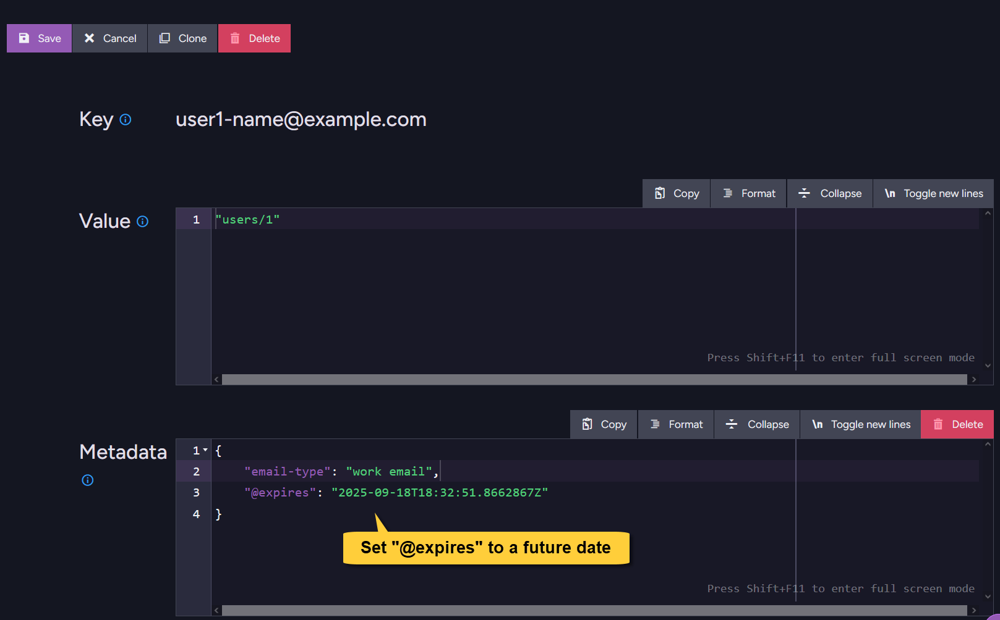

import Admonition from '@theme/Admonition';
import Tabs from '@theme/Tabs';
import TabItem from '@theme/TabItem';
import CodeBlock from '@theme/CodeBlock';

<Admonition type="note" title="">

* Compare-exchange items can be set to be deleted automatically in a future time.     
    
* **To schedule expiration for a compare-exchange item**, set the `@expires` field in the item's **metadata**.  
  This can be done when creating a new item or updating an existing one.

* RavenDB scans the database periodically to remove expired items.
  Any compare-exchange item whose `@expires` timestamp has passed at the time of the scan will be automatically removed.
  
* The **scan frequency** is configurable -  
  see the [Cluster.CompareExchangeExpiredDeleteFrequencyInSec](../compare-exchange/configuration#clustercompareexchangeexpireddeletefrequencyinsec) configuration key. 
  The default is 60 seconds.  

* To manually remove a compare-exchange item, see [Delete compare-exchange items](../compare-exchange/delete-cmpxchg-items).

* Note: The compare-exchange expiration feature is not related to [document expiration](../server/extensions/expiration).  
  You do NOT need to enable document expiration in order to use compare-exchange expiration.
  
---

* In this article:  
  * [Add expiration date using the **Client API**](../compare-exchange/cmpxchg-expiration#add-expiration-date-using-the-client-api)   
  * [Add expiration date using the **Studio**](../compare-exchange/cmpxchg-expiration#add-expiration-date-using-the-studio)  
  * [Syntax](../compare-exchange/cmpxchg-expiration#syntax)   

</Admonition>

---

## Add expiration date using the Client API

<Tabs groupId='languageSyntax'>
<TabItem value="Cluster_wide_session" label="Cluster_wide_session">
```js
// The session must be opened in cluster-wide mode
const session = documentStore.openSession({
    transactionMode: "ClusterWide"
});

// Call 'createCompareExchangeValue', specify the item's KEY and VALUE  
const item = session.advanced.clusterTransaction.createCompareExchangeValue(
    "user1-name@example.com", "users/1"  // key, value
);

// Add METADATA fields to the item
// Set a future UTC DateTime in the `@expires` field to schedule expiration 
// "CONSTANTS.Documents.Metadata.EXPIRES" = "@expires"   
const expireAt = new Date(Date.now() + 7 * 24 * 60 * 60 * 1000).toISOString(); // expire in 7 days
item.metadata[CONSTANTS.Documents.Metadata.EXPIRES] = expireAt;

// The item will be created on the server once 'SaveChanges' is called   
await session.saveChanges();   
```
</TabItem>
<TabItem value="Store_operation" label="Store_operation">
```js
// Define the metadata with the future expiration date
const expireAt = new Date(Date.now() + 7 * 24 * 60 * 60 * 1000).toISOString(); // expire in 7 days

const metadata = {
    // CONSTANTS.Documents.Metadata.EXPIRES = "@expires"
    [CONSTANTS.Documents.Metadata.EXPIRES]: expireAt
};

// Pass the metadata when creating the item
const putCmpXchgOp = new PutCompareExchangeValueOperation(
    "user1-name@example.com", "users/1", 0, metadata);

// Execute the operation
const result = await documentStore.operations.send(putCmpXchgOp);
```
</TabItem>
</Tabs>

---

## Add expiration date using the Studio

* You can set or update the expiration date of a compare-exchange item directly from the Studio.

* Go to **Documents > Compare Exchange**.  
  Edit an existing item or create a new one.  
  In the item's metadata, set the `@expires` field to a future UTC date/time (ISO 8601 format).  



---

## Syntax

* The syntax for **creating** a compare-exchange item is available in [Create compare-exchange item - Syntax](../compare-exchange/create-cmpxchg-items#syntax)
* The syntax for **updating** a compare-exchange item is available in [Update compare-exchange item - Syntax](../compare-exchange/update-cmpxchg-item#syntax)
