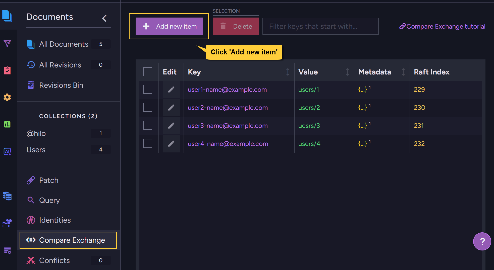
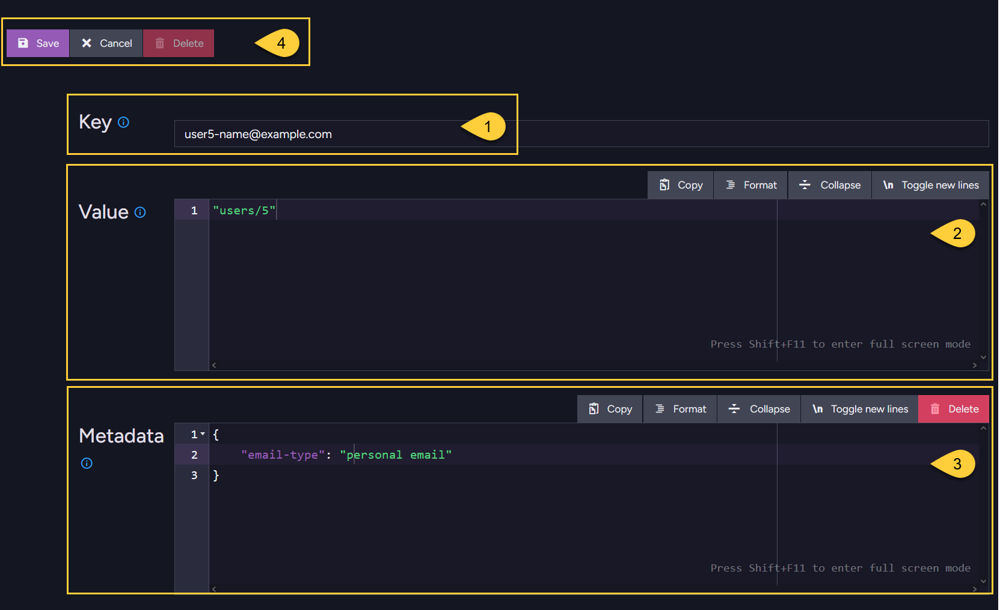

import Admonition from '@theme/Admonition';
import Tabs from '@theme/Tabs';
import TabItem from '@theme/TabItem';
import CodeBlock from '@theme/CodeBlock';

<Admonition type="note" title="">

* A new compare-exchange item can be created in the following ways:
  * Using a cluster-wide session  
  * Using a store operation  
  * Using the Studio   

* To create a new compare-exchange item, you must provide:  
  * **A unique key** (string, up to 512 bytes)  
  * **An associated value** (number, string, array, or any valid JSON object)
  * You can optionally add **metadata** (a valid JSON object) to store extra information with the item.    
    A common use case is to set an expiration time for the compare-exchange item in its metadata.  
    Learn more in [Set expiration for compare-exchange items](../compare-exchange/cmpxchg-expiration).  
 
* To modify an existing compare-exchange item, see: [Update compare-exchange item](../compare-exchange/update-cmpxchg-item). 

* In this article:  
  * [Create item using a **cluster-wide session**](../compare-exchange/create-cmpxchg-items#create-item-using-a-cluster-wide-session)  
    * [Ex.1 - Create compare-exchange item - with string value](../compare-exchange/create-cmpxchg-items#ex1---create-compare-exchange-item---with-string-value)  
    * [Ex.2 - Create compare-exchange item - with custom object value](../compare-exchange/create-cmpxchg-items#ex2---create-compare-exchange-item---with-custom-object-value)  
    * [Ex.3 - Create compare-exchange item - with metadata](../compare-exchange/create-cmpxchg-items#ex3---create-compare-exchange-item---with-metadata)  
    * [Ex.4 - Create multiple items](../compare-exchange/create-cmpxchg-items#ex4---create-multiple-items)  
  * [Create item using a **store operation**](../compare-exchange/create-cmpxchg-items#create-item-using-a-store-operation)  
    * [Ex.5 - Create compare-exchange item - with string value](../compare-exchange/create-cmpxchg-items#ex5---create-compare-exchange-item---with-string-value)  
    * [Ex.6 - Create compare-exchange item - with custom object value](../compare-exchange/create-cmpxchg-items#ex6---create-compare-exchange-item---with-custom-object-value)  
    * [Ex.7 - Create compare-exchange item - with metadata](../compare-exchange/create-cmpxchg-items#ex7---create-compare-exchange-item---with-metadata)
  * [Create item using the **Studio**](../compare-exchange/create-cmpxchg-items#create-item-using-the-studio)
  * [Syntax](../compare-exchange/create-cmpxchg-items#syntax)
  

</Admonition>

---

## Create item using a cluster-wide session

* Create compare-exchange items using a cluster-wide session when you want the creation to be part of a transaction committed via `SaveChanges()`. 
  This is suitable if you want to include compare-exchange item creation and document changes in the same transaction.
  Learn more about cluster-wide sessions in [Cluster transactions - overview](../client-api/session/cluster-transaction/overview).  

* Use `CreateCompareExchangeValue()` to register the creation of a new compare-exchange item in the session.  
  The item will be created as part of the cluster-wide transaction when _SaveChanges()_ is called.

* Exceptions:  
  An `InvalidOperationException` is thrown if the session is not opened in cluster-wide mode.  
  If the key already exists, _SaveChanges()_ will throw a `ClusterTransactionConcurrencyException`.

* Examples:

    #### Ex.1 - Create compare-exchange item - with string value
    
    <Tabs groupId='languageSyntax'>
    <TabItem value="Cluster_wide_session" label="Cluster_wide_session">
    ```csharp
    // The session must be opened in cluster-wide mode
    using (var session = store.OpenSession(
        new SessionOptions { TransactionMode = TransactionMode.ClusterWide }))
    {
         // Call 'CreateCompareExchangeValue' to register the creation of a new compare-exchange item 
         // as part of the cluster-wide transaction. Specify the item's KEY and VALUE.  
         // The item will be created only when 'SaveChanges' is called.
         CompareExchangeValue<string> item = 
             session.Advanced.ClusterTransaction.CreateCompareExchangeValue(
                 key: "user1-name@example.com",
                 value: "users/1" 
         );    
    
         // Commit the cluster-wide transaction.
         // This will create the compare-exchange item,
         // or throw a 'ClusterTransactionConcurrencyException' if the key already exists.
         session.SaveChanges();
    }
    ```
    </TabItem>
    <TabItem value="Cluster_wide_session_async" label="Cluster_wide_session_async">
    ```csharp
    // The session must be opened in cluster-wide mode
    using (var asyncSession = store.OpenAsyncSession(
        new SessionOptions { TransactionMode = TransactionMode.ClusterWide }))
    {
         // Call 'CreateCompareExchangeValue' to register the creation of a new compare-exchange item 
         // as part of the cluster-wide transaction. Specify the item's KEY and VALUE. 
         // The item will be created only when 'SaveChanges' is called.
         CompareExchangeValue<string> item = 
             asyncSession.Advanced.ClusterTransaction.CreateCompareExchangeValue(
                 key: "user1-name@example.com",
                 value: "users/1" 
        );
        
         // Commit the cluster-wide transaction.
         // This will create the compare-exchange item,
         // or throw a 'ClusterTransactionConcurrencyException' if the key already exists.
         await asyncSession.SaveChangesAsync();
    }
    ```
    </TabItem>
    </Tabs>

    #### Ex.2 - Create compare-exchange item - with custom object value
    
    <Tabs groupId='languageSyntax'>
    <TabItem value="Cluster_wide_session" label="Cluster_wide_session">
    ```csharp
    // Define the object to be stored as the value
    var user1Info = new UserInfo()
    {
        UserDocumentId = "users/1",
        AdditionalInfo = "someInfo.."
    };
    
    // The session must be opened in cluster-wide mode
    using (var session = store.OpenSession(
        new SessionOptions { TransactionMode = TransactionMode.ClusterWide }))
    {
         // Call 'CreateCompareExchangeValue' to register the creation of a new compare-exchange item 
         // as part of the cluster-wide transaction. Specify the item's KEY and VALUE. 
         // The item will be created only when 'SaveChanges' is called.
         CompareExchangeValue<UserInfo> item = 
             session.Advanced.ClusterTransaction.CreateCompareExchangeValue(
                 key: "user1-name@example.com",
                 value: user1Info // Pass the object instance
         );    
    
         // Commit the cluster-wide transaction.
         // This will create the compare-exchange item,
         // or throw a 'ClusterTransactionConcurrencyException' if the key already exists.
         session.SaveChanges();
    }
    ```
    </TabItem>
    <TabItem value="Cluster_wide_session_async" label="Cluster_wide_session_async">
    ```csharp
    // Define the object to be stored as the value
    var user1Info = new UserInfo()
    {
        UserDocumentId = "users/1",
        AdditionalInfo = "someInfo.."
    };
    
    // The session must be opened in cluster-wide mode
    using (var asyncSession = store.OpenAsyncSession(
        new SessionOptions { TransactionMode = TransactionMode.ClusterWide }))
    {
         // Call 'CreateCompareExchangeValue' to register the creation of a new compare-exchange item 
         // as part of the cluster-wide transaction. Specify the item's KEY and VALUE. 
         // The item will be created only when 'SaveChanges' is called.
         CompareExchangeValue<UserInfo> item = 
             asyncSession.Advanced.ClusterTransaction.CreateCompareExchangeValue(
                 key: "user1-name@example.com",
                 value: user1Info // Pass the object instance
        );
        
         // Commit the cluster-wide transaction.
         // This will create the compare-exchange item,
         // or throw a 'ClusterTransactionConcurrencyException' if the key already exists.
         await asyncSession.SaveChangesAsync();
    }
    ```
    </TabItem>
    </Tabs>
    
    #### Ex.3 - Create compare-exchange item - with metadata
     
    <Tabs groupId='languageSyntax'>
    <TabItem value="Cluster_wide_session" label="Cluster_wide_session">
    ```csharp
    // The session must be opened in cluster-wide mode
    using (var session = store.OpenSession(
        new SessionOptions { TransactionMode = TransactionMode.ClusterWide }))
    {
         // Call 'CreateCompareExchangeValue', specify the item's KEY and VALUE:  
         CompareExchangeValue<string> item = 
             session.Advanced.ClusterTransaction.CreateCompareExchangeValue(
                 key: "user1-name@example.com",
                 value: "users/1" 
         );
         
         // Add METADATA fields to the item:
         item.Metadata["field-name"] = "some value"; 
         item.Metadata["email-type"] = "work email"; // e.g. describe the email type
    
         // Commit the cluster-wide transaction.
         // This will create the compare-exchange item,
         // or throw a 'ClusterTransactionConcurrencyException' if the key already exists.
         session.SaveChanges();
    }
    ```
    </TabItem>
    <TabItem value="Cluster_wide_session_async" label="Cluster_wide_session_async">
    ```csharp
    // The session must be opened in cluster-wide mode
    using (var asyncSession = store.OpenAsyncSession(
        new SessionOptions { TransactionMode = TransactionMode.ClusterWide }))
    {
         // Call 'CreateCompareExchangeValue', specify the item's KEY and VALUE:  
         CompareExchangeValue<string> item = 
             asyncSession.Advanced.ClusterTransaction.CreateCompareExchangeValue(
                 key: "user1-name@example.com",
                 value: "users/1" 
         );
         
         // Add METADATA fields to the item:
         item.Metadata["field-name"] = "some value"; 
         item.Metadata["email-type"] = "work email"; // e.g. describe the email type
    
         // Commit the cluster-wide transaction.
         // This will create the compare-exchange item,
         // or throw a 'ClusterTransactionConcurrencyException' if the key already exists.
         await asyncSession.SaveChangesAsync();
    }
    ```
    </TabItem>
    </Tabs>
    
    #### Ex.4 - Create multiple items
    
    You can create multiple compare-exchange items in the same cluster-wide transaction.
     
    <Tabs groupId='languageSyntax'>
    <TabItem value="Cluster_wide_session" label="Cluster_wide_session">
    ```csharp
    // The session must be opened in cluster-wide mode
    using (var session = store.OpenSession(
        new SessionOptions { TransactionMode = TransactionMode.ClusterWide }))
    { 
         // You can create multiple compare-exchange items before calling 'SaveChanges'.
         // Call 'CreateCompareExchangeValue' for each item you want to create in the transaction.
         session.Advanced.ClusterTransaction.CreateCompareExchangeValue(
                 key: "user7-name@example.com", value: "users/7" 
         );    
         
         session.Advanced.ClusterTransaction.CreateCompareExchangeValue(
                 key: "user8-name@example.com", value: "users/8" 
         ); 
         
         session.Advanced.ClusterTransaction.CreateCompareExchangeValue(
                 key: "user9-name@example.com", value: "users/9" 
         );          
         
         // All three items will be created atomically as part of the same transaction. 
         // If any creation fails (e.g., due to an existing key), the entire transaction is rolled back
         // and none of the new items will be created.
         session.SaveChanges();
    }
    ```
    </TabItem>
    <TabItem value="Cluster_wide_session_async" label="Cluster_wide_session_async">
    ```csharp
    // The session must be opened in cluster-wide mode
    using (var asyncSession = store.OpenAsyncSession(
        new SessionOptions { TransactionMode = TransactionMode.ClusterWide }))
    { 
         // You can create multiple compare-exchange items before calling 'SaveChanges'.
         // Call 'CreateCompareExchangeValue' for each item you want to create in the transaction.
         asyncSession.Advanced.ClusterTransaction.CreateCompareExchangeValue(
                 key: "user7-name@example.com", value: "users/7" 
         );    
         
         asyncSession.Advanced.ClusterTransaction.CreateCompareExchangeValue(
                 key: "user8-name@example.com", value: "users/8" 
         ); 
         
         asyncSession.Advanced.ClusterTransaction.CreateCompareExchangeValue(
                 key: "user9-name@example.com", value: "users/9" 
         );          
         
         // All three items will be created atomically as part of the same transaction. 
         // If any creation fails (e.g., due to an existing key), the entire transaction is rolled back
         // and none of the new items will be created.
         await asyncSession.SaveChangesAsync();
    }
    ```
    </TabItem>
    </Tabs>

---

## Create item using a store operation
  
* Use the `PutCompareExchangeValueOperation` [store operation](../client-api/operations/what-are-operations) to create a compare-exchange item independently, without opening a session.
  This is ideal for stand-alone tasks where you need to perform a direct compare-exchange operation without involving document transactions.  

* Creating a new compare-exchange item will succeed only if:
  * The passed index is 0, and
  * The specified key does not already exist in the database.

* The operation will return a failed result (no exception is thrown) in the following cases:
  * A new key is provided, but the index is not 0.
  * The key already exists, even if the passed index is 0.

* Examples:

    #### Ex.5 - Create compare-exchange item - with string value
    
    <Tabs groupId='languageSyntax'>
    <TabItem value="Put_operation" label="Put_operation">
    ```csharp
    // Create a new compare-exchange item:
    // ===================================
    
    // Define the put compare-exchange operation. Pass:
    // * KEY: a new unique string identifier (e.g. a user's email)
    // * VALUE: an associated value (e.g. the user's document ID)
    // * INDEX: pass '0' to indicate that this is a new compare-exchange item
    var putCmpXchgOp = new PutCompareExchangeValueOperation<string>(
        "user1-name@example.com", "users/1", 0);
    
    // Execute the operation by passing it to Operations.Send
    CompareExchangeResult<string> putResult = store.Operations.Send(putCmpXchgOp);
    
    // Check results
    bool successful = putResult.Successful; // Has operation succeeded
    long indexForItem = putResult.Index;    // The version number assigned to the new item
    
    // If 'successful' is true, then a new compare-exchange item has been created
    // with the unique email key and the associated value.
    ```
    </TabItem>
    <TabItem value="Put_operation_async" label="Put_operation_async">
    ```csharp
    // Create a new compare-exchange item:
    // ===================================
    
    // Define the put compare-exchange operation. Pass:
    // * KEY: a new unique string identifier (e.g. a user's email)
    // * VALUE: an associated value (e.g. the user's document ID)
    // * INDEX: pass '0' to indicate that this is a new compare-exchange item
    var putCmpXchgOp = new PutCompareExchangeValueOperation<string>(
        "user1-name@example.com", "users/1", 0);
    
    // Execute the operation by passing it to Operations.SendAsync    
    CompareExchangeResult<string> putResult = await store.Operations.SendAsync(putCmpXchgOp);
    
    // Check results
    bool successful = putResult.Successful; // Has operation succeeded
    long indexForItem = putResult.Index;    // The version number assigned to the new item
    
    // If 'successful' is true, then a new compare-exchange item has been created
    // with the unique email key and the associated value.
    ```
    </TabItem>
    </Tabs>

    #### Ex.6 - Create compare-exchange item - with custom object value
    
    <Tabs groupId='languageSyntax'>
    <TabItem value="Put_operation" label="Put_operation">
    ```csharp
    // Create a new compare-exchange item:
    // ===================================
    
    // Define the object to be stored as the value
    var user1Info = new UserInfo()
    {
        UserDocumentId = "users/1",
        AdditionalInfo = "someInfo.."
    };
    
    // Define the put compare-exchange operation.
    // Pass the key, the object instance, and '0' to indicate that this is a new item.
    // Specify the object type in the generic <T> parameter.
    var putCmpXchgOp = new PutCompareExchangeValueOperation<UserInfo>(
        "user1-name@example.com", user1Info, 0);
    
    // Execute the operation by passing it to Operations.Send
    CompareExchangeResult<UserInfo> putResult = store.Operations.Send(putCmpXchgOp);
    
    // Check results
    bool successful = putResult.Successful; // Has operation succeeded
    long indexForItem = putResult.Index;    // The version number assigned to the new item
    
    // If 'successful' is true, then a new compare-exchange item has been created
    // with the unique email key and the associated value.
    ```
    </TabItem>
    <TabItem value="Put_operation_async" label="Put_operation_async">
    ```csharp
    // Create a new compare-exchange item:
    // ===================================
    
    // Define the object to be stored as the value
    var user1Info = new UserInfo()
    {
        UserDocumentId = "users/1",
        AdditionalInfo = "someInfo.."
    };
    
    // Define the put compare-exchange operation.
    // Pass the key, the object instance, and '0' to indicate that this is a new item.
    // Specify the object type in the generic <T> parameter.
    var putCmpXchgOp = new PutCompareExchangeValueOperation<UserInfo>(
        "user1-name@example.com", user1Info, 0);
        
    // Execute the operation by passing it to Operations.SendAsync    
    CompareExchangeResult<UserInfo> putResult = await store.Operations.SendAsync(putCmpXchgOp);
    
    // Check results
    bool successful = putResult.Successful; // Has operation succeeded
    long indexForItem = putResult.Index;    // The version number assigned to the new item
    
    // If 'successful' is true, then a new compare-exchange item has been created
    // with the unique email key and the associated value.
    ```
    </TabItem>
    </Tabs>

    #### Ex.7 - Create compare-exchange item - with metadata
    
    <Tabs groupId='languageSyntax'>
    <TabItem value="Put_operation" label="Put_operation">
    ```csharp
    // Create a new compare-exchange item with metadata:
    // =================================================
    
    // Define the metadata - must be a valid JSON object
    var metadata = new MetadataAsDictionary
    {
         { "email-type", "work email" }
    };
    
    // Define the put compare-exchange operation.
    // Pass a 4'th parameter with the metadata object.
    var putCmpXchgOp = new PutCompareExchangeValueOperation<string>(
        "user1-name@example.com", "users/1", 0, metadata);
    
    // Execute the operation by passing it to Operations.Send
    CompareExchangeResult<string> putResult = store.Operations.Send(putCmpXchgOp);
    
    // Check results
    bool successful = putResult.Successful; // Has operation succeeded
    long indexForItem = putResult.Index;    // The version number assigned to the new item
    
    // If successful is true then a new compare-exchange item has been created
    // with the unique key, value, and metadata.
    ```
    </TabItem>
    <TabItem value="Put_operation_async" label="Put_operation_async">
    ```csharp
    // Create a new compare-exchange item with metadata:
    // =================================================
    
    // Define the metadata - must be a valid JSON object
    var metadata = new MetadataAsDictionary
    {
         { "email-type", "work email" }
    };
    
    // Define the put compare-exchange operation.
    // Pass a 4'th parameter with the metadata object.
    var putCmpXchgOp = new PutCompareExchangeValueOperation<string>(
        "user1-name@example.com", "users/1", 0, metadata);
        
    // Execute the operation by passing it to Operations.SendAsync    
    CompareExchangeResult<string> putResult = await store.Operations.SendAsync(putCmpXchgOp);
    
    // Check results
    bool successful = putResult.Successful; // Has operation succeeded
    long indexForItem = putResult.Index;    // The version number assigned to the new item
    
    // If successful is true then a new compare-exchange item has been created
    // with the unique key, value, and metadata.
    ```
    </TabItem>
    </Tabs>

---

## Create item using the Studio

To create compare-exchange items using the Studio, go to **Documents > Compare Exchange**.





1. **Key**  
   Enter a unique identifier for the compare-exchange item (up to 512 bytes).  
   This key must be unique across the entire database.
2. **Value**  
    Enter the value to associate with the key.  
    Can be a number, string, array, or any valid JSON object.
3. **Metadata** (optional)  
    Add any additional data you want to store with the item.  
    Must be a valid JSON object.  
    Can be used to [set expiration time](../todo..) for the compare-exchange item.  
4. **Save**  
   Click to create the compare-exchange item.  
   If the key already exists, an error message will be shown.

---

## Syntax

---

### `PutCompareExchangeValueOperation`  
Create compare-exchange item using a store operation: 

<TabItem value="" label="">
```csharp
public PutCompareExchangeValueOperation(
    string key, T value, long index, IMetadataDictionary metadata = null)
```
</TabItem>

| Parameter    | Type                  | Description |
|--------------|-----------------------|-------------|
| **key**      | `string`              | <ul><li>A unique identifier in the database scope.</li><li>Can be up to 512 bytes.</li></ul> |
| **value**    | `T`                   | <ul><li>A value to be saved for the specified _key_.</li><li>Can be any object (number, string, array, or any valid JSON object).</li></ul> |
| **index**    | `long`                | <ul><li>Pass `0` to create a new key.</li><li>When updating an existing key, pass the current number for concurrency control.</li></ul> |
| **metadata** | `IMetadataDictionary` | <ul><li>Optional metadata to be saved for the specified _key_.</li><li>Must be a valid JSON object.</li></ul> |


**Returned object**:

<TabItem value="" label="">
```csharp
public class CompareExchangeResult<T>
{
    public bool Successful;
    public T Value;
    public long Index;
}
```
</TabItem>

| Return Value  | Type   | Description |
|---------------|--------|-------------|
| **Successful**| `bool` | <ul><li>`true` if the put operation has completed successfully.</li><li>`false` if the put operation has failed.</li></ul> |
| **Value**     | `T`    | <ul><li>Upon success - the value of the compare-exchange item that was saved.</li><li>Upon failure - the existing value on the server.</li></ul> |
| **Index**     | `long` | <ul><li>The compare-exchange item's version.</li><li>This number increases with each successful modification of the `value` or `metadata`.</li><li>Upon success - the updated version of the compare-exchange item that was saved.</li><li>Upon failure - the existing version number on the server.</li></ul> |

---

### `CreateCompareExchangeValue`  
Create compare-exchange item using cluster-wide session:

<TabItem value="" label="">
```csharp
session.Advanced.ClusterTransaction.CreateCompareExchangeValue<T>(key, value);
```
</TabItem>

| Parameter  | Type     | Description                                                        |
|------------|----------|--------------------------------------------------------------------|
| **key**    | `string` | The compare-exchange item key. This string can be up to 512 bytes. |
| **value**  | `T`      | The associated value to store for the key.<br/>Can be a number, string, array, or any valid JSON object. |

| `CreateCompareExchangeValue` returns: | Description                                                                                      |
|---------------------------|---------------------------------------------------------------------------------------------------------------------|
| `CompareExchangeValue<T>` | The compare-exchange item that is added to the transaction.<br/>It will be created when `SaveChanges()` is called.  |

The returned `CompareExchangeValue` contains:

| Property   | Type     | Description                                                        |
|------------|----------|--------------------------------------------------------------------|
| **key**    | `string` | The compare-exchange item key. This string can be up to 512 bytes. |
| **value**  | `T`      | The value associated with the key.                                 |
| **index**  | `long`   | The index used for concurrency control.<br/>Will be `0` when calling `CreateCompareExchangeValue`. |   
