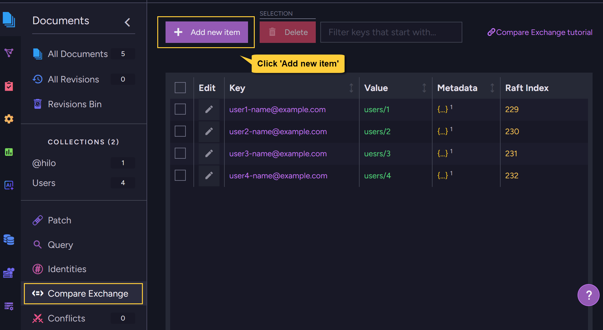

import Admonition from '@theme/Admonition';
import Tabs from '@theme/Tabs';
import TabItem from '@theme/TabItem';
import CodeBlock from '@theme/CodeBlock';

<Admonition type="note" title="">

* A new compare-exchange item can be created in the following ways:  
  * Using a cluster-wide session
  * Using a store operation  
  * Using the Studio  

* To create a new compare-exchange item, you must provide:  
  * **A unique key** (string, up to 512 bytes)  
  * **An associated value** (number, string, array, or any valid JSON object)
  * You can optionally add **metadata** (a valid JSON object) to store extra information with the item.    
    A common use case is to set an expiration time for the compare-exchange item in its metadata.  
    Learn more in [Set expiration for compare-exchange items](../compare-exchange/cmpxchg-expiration).     
 
* To modify an existing compare-exchange item, see: [Update compare-exchange item](../compare-exchange/update-cmpxchg-item).

* In this article:  
  * [Create item using a **cluster-wide session**](../compare-exchange/create-cmpxchg-items#create-item-using-a-cluster-wide-session)
  * [Create item using the **Studio**](../compare-exchange/create-cmpxchg-items#create-item-using-the-studio)
  * [Syntax](../compare-exchange/create-cmpxchg-items#syntax)

</Admonition>

---

## Create item using a cluster-wide session

* Create compare-exchange items using a cluster-wide session when you want the creation to be part of a transaction committed via `save_changes()`. 
  This is suitable if you want to include compare-exchange item creation and document changes in the same transaction.
  Learn more about cluster-wide sessions in [Cluster transactions - overview](../client-api/session/cluster-transaction/overview).     
  
* Use `create_compare_exchange_value()` to register the creation of a new compare-exchange item in the session.  
  The item will be created as part of the cluster-wide transaction when _save_changes()_ is called.

* Exceptions:  
  A `RuntimeError` is thrown when the session is Not opened in cluster-wide mode.  
  If the key already exists, save_changes()_ will throw a `ConcurrencyException`.

#### Example

<TabItem value="" label="">
```python
# The session must be first opened with cluster-wide mode

session.advanced.cluster_transaction.create_compare_exchange_value(
  key="Best NoSQL Transactional Database",
  item="RavenDB",
)

session.save_changes();
```
</TabItem>

---

## Create item using the Studio

To create compare-exchange items using the Studio, go to **Documents > Compare Exchange**.




1. **Key**  
   Enter a unique identifier for the compare-exchange item (up to 512 bytes).  
   This key must be unique across the entire database.
2. **Value**  
    Enter the value to associate with the key.  
    Can be a number, string, array, or any valid JSON object.
3. **Metadata** (optional)  
    Add any additional data you want to store with the item.  
    Must be a valid JSON object.  
    Can be used to set expiration time for the compare-exchange item.  
4. **Save**  
   Click to create the compare-exchange item.  
   If the key already exists, an error message will be shown.

---

## Syntax

---

### `create_compare_exchange_value`  
Create compare-exchange item using cluster-wide session:

<TabItem value="" label="">
```python
session.advanced.cluster_transaction.create_compare_exchange_value(key, value)
```
</TabItem>

| Parameter  | Type  | Description                                                        |
|------------|-------|--------------------------------------------------------------------|
| **key**    | `str` | The compare-exchange item key. This string can be up to 512 bytes. |
| **value**  | `T`   | The associated value to store for the key.<br/>Can be a number, string, array, or any valid JSON object. |

| `create_compare_exchange_value` returns: | Description                                                                                           |
|---------------------------|----------------------------------------------------------------------------------------------------------------------|
| `CompareExchangeValue[T]` | The compare-exchange item that is added to the transaction.<br/>It will be created when `save_changes()` is called.  |

The `CompareExchangeValue`:

| Property   | Type   | Description                                                        |
|------------|--------|--------------------------------------------------------------------|
| **key**    | `str`  | The compare-exchange item key. This string can be up to 512 bytes. |
| **value**  | `T`    | The value associated with the key.                                 |
| **index**  | `int`  | The index used for concurrency control.<br/>Will be `0` when calling `create_compare_exchange_value`. |   
