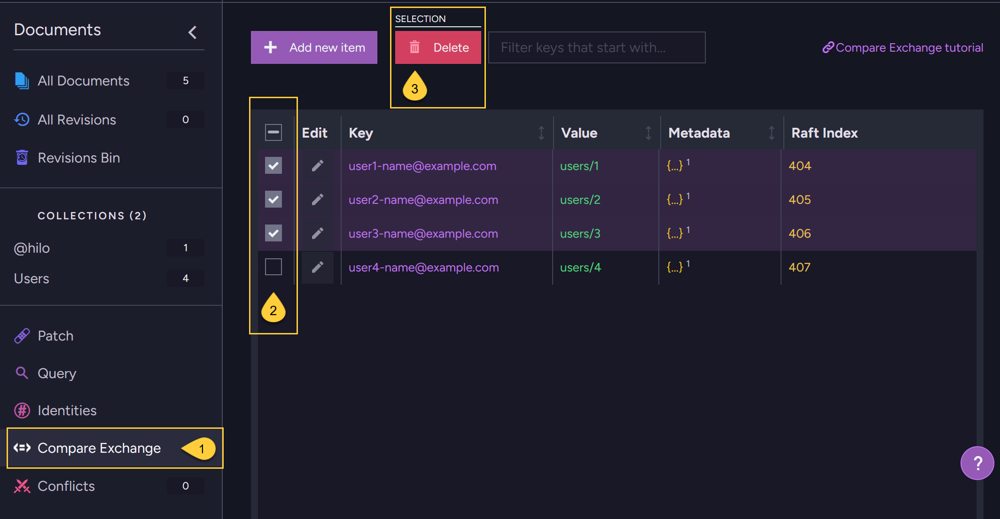

import Admonition from '@theme/Admonition';
import Tabs from '@theme/Tabs';
import TabItem from '@theme/TabItem';
import CodeBlock from '@theme/CodeBlock';

<Admonition type="note" title="">

* **Custom compare-exchange items can be deleted**:  
  You can delete your own custom compare-exchange items.
  An item is deleted only if the index you provide in the request matches the current index stored on the server for the specified key.  
  
* **Delete items by expiration**:  
  Compare-exchange items can also be deleted by adding an expiration date to them.  
  Learn more in [Compare-exchange expiration](../compare-exchange/cmpxchg-expiration).
  
* **Compare-exchange tombstones**:  
  Whenever a compare-exchange item is deleted, a compare-exchange tombstone is created for it.  
  These tombstones are used to indicate to other RavenDB processes that the compare-exchange item was deleted,  
  so they can react accordingly.  
  For example, indexes referencing the deleted item will update themselves to remove those references.  
  Compare-exchange tombstones that are eligible for deletion are removed periodically by an internal cleanup task.  
  See: [Cluster.CompareExchangeTombstonesCleanupIntervalInMin](../compare-exchange/configuration#clustercompareexchangetombstonescleanupintervalinmin).

* <Admonition type="warning" title="">
  Do NOT attempt to delete [atomic guards](../compare-exchange/atomic-guards), which RavenDB uses internally to ensure ACID guarantees in cluster-wide transactions.
  These compare-exchange items are created automatically and must not be modified or removed.  
  
  If your custom compare-exchange item was set up to protect the consistency of a transaction, deleting it will break the ACID guarantees.
  Only delete or modify such items if you truly know what you're doing.    
  </Admonition>  
  
---
  
* In this article:  
  * [Delete compare-exchange item using a **cluster-wide session**](../compare-exchange/delete-cmpxchg-items#delete-compare-exchange-item-using-a-cluster-wide-session) 
    * [Delete by item](../compare-exchange/delete-cmpxchg-items#delete-by-item)  
    * [Delete by key and index](../compare-exchange/delete-cmpxchg-items#delete-by-key-and-index)  
    * [Delete multiple items](../compare-exchange/delete-cmpxchg-items#delete-multiple-items)  
  * [Delete compare-exchange item using a **store operation**](../compare-exchange/delete-cmpxchg-items#delete-compare-exchange-item-using-a-store-operation)  
  * [Delete compare-exchange items using the **Studio**](../compare-exchange/delete-cmpxchg-items#delete-compare-exchange-items-using-the-studio)
  * [Syntax](../compare-exchange/delete-cmpxchg-items#syntax)

</Admonition>

---

## Delete compare-exchange item using a cluster-wide session
  
* Delete compare-exchange items using a cluster-wide session when you want the deletion to be part of a transaction committed via `SaveChanges()`. 
  This is suitable if you want to include compare-exchange deletions alongside other operations, such as putting or deleting documents and compare-exchange items, in a single transaction.  
  Learn more about cluster-wide sessions in [Cluster transactions - overview](../client-api/session/cluster-transaction/overview).   

* Use `DeleteCompareExchangeValue()` to register the deletion of an existing compare-exchange item in the session.  
  The item will be deleted as part of the cluster-wide transaction when _SaveChanges()_ is called.

* If the item's index (its version) on the server is different from the index you provide, _SaveChanges()_ will throw a `ClusterTransactionConcurrencyException`.
  This means the item was modified by another operation after it was loaded into the session, and the entire transaction will be rejected.  
  
* Examples:

    #### Delete by item
    
    <Tabs groupId='languageSyntax'>
    <TabItem value="Cluster_wide_session" label="Cluster_wide_session">
    ```csharp
    // The session must be opened in cluster-wide mode.
    // An `InvalidOperationException` is thrown if the session is not opened in cluster-wide mode.  
    using (var session = store.OpenSession(
        new SessionOptions { TransactionMode = TransactionMode.ClusterWide }))
    {
        // Get the latest version of the existing compare-exchange item to be deleted.
        CompareExchangeValue<string> itemToDelete = session.Advanced.ClusterTransaction
            .GetCompareExchangeValue<string>("user1-name@example.com");
        
        if (itemToDelete != null)
        {
            // Call 'DeleteCompareExchangeValue' to register the deletion as part of the cluster-wide
            // transaction. Pass the item to delete.
            session.Advanced.ClusterTransaction.DeleteCompareExchangeValue(itemToDelete);
            
            // Commit the cluster-wide transaction. This will delete the compare-exchange item,
            // or throw a 'ClusterTransactionConcurrencyException' if the item's index (its version)
            // on the server is different than the one provided in the delete request.
            session.SaveChanges();
        }
    }
    ```
    </TabItem>
    <TabItem value="Cluster_wide_session_async" label="Cluster_wide_session_async">
    ```csharp
    // The session must be opened in cluster-wide mode.
    // An `InvalidOperationException` is thrown if the session is not opened in cluster-wide mode.  
    using (var asyncSession = store.OpenAsyncSession(
        new SessionOptions { TransactionMode = TransactionMode.ClusterWide }))
    {
        // Get the latest version of the existing compare-exchange item to be deleted.
        CompareExchangeValue<string> itemToDelete = await asyncSession.Advanced.ClusterTransaction
            .GetCompareExchangeValueAsync<string>("user1-name@example.com");
        
        if (itemToDelete != null)
        {
            // Call 'DeleteCompareExchangeValue' to register the deletion as part of the cluster-wide
            // transaction. Pass the item to delete.
            asyncSession.Advanced.ClusterTransaction.DeleteCompareExchangeValue(itemToDelete);
            
            // Commit the cluster-wide transaction. This will delete the compare-exchange item,
            // or throw a 'ClusterTransactionConcurrencyException' if the item's index (its version)
            // on the server is different than the one provided in the delete request.
            await asyncSession.SaveChangesAsync();
        }
    }
    ```
    </TabItem>
    </Tabs>

    #### Delete by key and index
    
    <Tabs groupId='languageSyntax'>
    <TabItem value="Cluster_wide_session" label="Cluster_wide_session">
    ```csharp
    // The session must be opened in cluster-wide mode.
    // An `InvalidOperationException` is thrown if the session is not opened in cluster-wide mode.  
    using (var session = store.OpenSession(
        new SessionOptions { TransactionMode = TransactionMode.ClusterWide }))
    {
        // Get the latest version of the existing compare-exchange item to be deleted.
        CompareExchangeValue<string> itemToDelete = session.Advanced.ClusterTransaction
            .GetCompareExchangeValue<string>("user1-name@example.com");
        
        if (itemToDelete != null)
        {
            // Call 'DeleteCompareExchangeValue' to register the deletion as part of the cluster-wide
            // transaction. Specify the item's KEY and current INDEX (its version).
            session.Advanced.ClusterTransaction.DeleteCompareExchangeValue(
                itemToDelete.Key, itemToDelete.Index);
            
            // Commit the cluster-wide transaction. This will delete the compare-exchange item,
            // or throw a 'ClusterTransactionConcurrencyException' if the item's index (its version)
            // on the server is different than the one provided in the delete request.
            session.SaveChanges();
        }
    }
    ```
    </TabItem>
    <TabItem value="Cluster_wide_session_async" label="Cluster_wide_session_async">
    ```csharp
    // The session must be opened in cluster-wide mode.
    // An `InvalidOperationException` is thrown if the session is not opened in cluster-wide mode.  
    using (var asyncSession = store.OpenAsyncSession(
        new SessionOptions { TransactionMode = TransactionMode.ClusterWide }))
    {
        // Get the latest version of the existing compare-exchange item to be deleted.
        CompareExchangeValue<string> itemToDelete = await asyncSession.Advanced.ClusterTransaction
            .GetCompareExchangeValueAsync<string>("user1-name@example.com");
        
        if (itemToDelete != null)
        {
            // Call 'DeleteCompareExchangeValue' to register the deletion as part of the cluster-wide
            // transaction. Specify the item's KEY and current INDEX (its version).
            asyncSession.Advanced.ClusterTransaction.DeleteCompareExchangeValue(
                itemToDelete.Key, itemToDelete.Index);
            
            // Commit the cluster-wide transaction. This will delete the compare-exchange item,
            // or throw a 'ClusterTransactionConcurrencyException' if the item's index (its version)
            // on the server is different than the one provided in the delete request.
            await asyncSession.SaveChangesAsync();
        }
    }
    ```
    </TabItem>
    </Tabs>
    
    #### Delete multiple items
    
    <Tabs groupId='languageSyntax'>
    <TabItem value="Cluster_wide_session" label="Cluster_wide_session">
    ```csharp
    // The session must be opened in cluster-wide mode  
    using (var session = store.OpenSession(
        new SessionOptions { TransactionMode = TransactionMode.ClusterWide }))
    {
        // Get the latest version of the items to be deleted.        
        CompareExchangeValue<string> itemToDelete1 = session.Advanced.ClusterTransaction
            .GetCompareExchangeValue<string>("user1-name@example.com");
        CompareExchangeValue<string> itemToDelete2 = session.Advanced.ClusterTransaction
            .GetCompareExchangeValue<string>("user2-name@example.com");
        CompareExchangeValue<string> itemToDelete3 = session.Advanced.ClusterTransaction
            .GetCompareExchangeValue<string>("user3-name@example.com");
        
        // You can delete multiple compare-exchange items before calling 'SaveChanges'.
        // Call 'DeleteCompareExchangeValue' for each item you want to delete in the transaction.
        session.Advanced.ClusterTransaction.DeleteCompareExchangeValue(itemToDelete1);
        session.Advanced.ClusterTransaction.DeleteCompareExchangeValue(itemToDelete2);
        session.Advanced.ClusterTransaction.DeleteCompareExchangeValue(itemToDelete3);
      
        // All items will be deleted atomically as part of the same transaction. 
        // If any deletion fails, the entire transaction is rolled back
        // and none of the items will be deleted.  
        session.SaveChanges();
    }
    ```
    </TabItem>
    <TabItem value="Cluster_wide_session_async" label="Cluster_wide_session_async">
    ```csharp
    // The session must be opened in cluster-wide mode  
    using (var asyncSession = store.OpenAsyncSession(
        new SessionOptions { TransactionMode = TransactionMode.ClusterWide }))
    {
        // Get the latest version of the items to be deleted.        
        CompareExchangeValue<string> itemToDelete1 = await asyncSession.Advanced.ClusterTransaction
            .GetCompareExchangeValue<string>("user1-name@example.com");
        CompareExchangeValue<string> itemToDelete2 = await asyncSession.Advanced.ClusterTransaction
            .GetCompareExchangeValue<string>("user2-name@example.com");
        CompareExchangeValue<string> itemToDelete3 = await asyncSession.Advanced.ClusterTransaction
            .GetCompareExchangeValue<string>("user3-name@example.com");
        
        // You can delete multiple compare-exchange items before calling 'SaveChanges'.
        // Call 'DeleteCompareExchangeValue' for each item you want to delete in the transaction.
        asyncSession.Advanced.ClusterTransaction.DeleteCompareExchangeValue(itemToDelete1);
        asyncSession.Advanced.ClusterTransaction.DeleteCompareExchangeValue(itemToDelete2);
        asyncSession.Advanced.ClusterTransaction.DeleteCompareExchangeValue(itemToDelete3);
      
        // All items will be deleted atomically as part of the same transaction. 
        // If any deletion fails, the entire transaction is rolled back
        // and none of the items will be deleted.  
        await asyncSession.SaveChangesAsync();
    }
    ```
    </TabItem>
    </Tabs>    

---

## Delete compare-exchange item using a store operation
  
* Use the `DeleteCompareExchangeValueOperation` [store operation](../client-api/operations/what-are-operations) to delete a compare-exchange item by its key and index, without opening a session.
  This is ideal for stand-alone tasks that don't require batching multiple commands into a single transactional session. 
  
* The delete operation will only succeed if the item's current index on the server is the same as the one you provide.  
  If the indexes do not match, the item is not deleted and no exception is thrown.

* Examples:

    <Tabs groupId='languageSyntax'>
    <TabItem value="Delete_operation" label="Delete_operation">
    ```csharp
    // Get the latest version of the existing compare-exchange item to be deleted
    var getCmpXchgOp = new GetCompareExchangeValueOperation<string>("user1-name@example.com");
    CompareExchangeValue<string> itemToDelete = store.Operations.Send(getCmpXchgOp);
    
    if (itemToDelete != null)
    {
        // Define the delete compare-exchange operation 
        // Pass the item's KEY and INDEX (its version)
        var deleteCmpXchgOp = new DeleteCompareExchangeValueOperation<string>(
            itemToDelete.Key, itemToDelete.Index);
        
        // Execute the delete operation by passing it to Operations.Send
        CompareExchangeResult<string> resultOfDelete = store.Operations.Send(deleteCmpXchgOp);
        
        // Check results
        bool successful = resultOfDelete.Successful; // Has operation succeeded
        long indexOfItem = resultOfDelete.Index;     // The version of the deleted item
        
        // If 'successful' is true - the compare-exchange item was deleted.
        // If 'successful' is false - the item was not deleted (index mismatch).
    }
    ```
    </TabItem>
    <TabItem value="Delete_operation_async" label="Delete_operation_async">
    ```csharp
    // Get the latest version of the existing compare-exchange item to be deleted
    var getCmpXchgOp = new GetCompareExchangeValueOperation<string>("user1-name@example.com");
    CompareExchangeValue<string> itemToDelete = await store.Operations.SendAsync(getCmpXchgOp);
    
    if (itemToDelete != null)
    {
        // Define the delete compare-exchange operation 
        // Pass the item's KEY and its INDEX (its version)
        var deleteCmpXchgOp = new DeleteCompareExchangeValueOperation<string>(
            itemToDelete.Key, itemToDelete.Index);
        
        // Execute the delete operation by passing it to Operations.SendAsync
        CompareExchangeResult<string> resultOfDelete = await store.Operations.SendAsync(deleteCmpXchgOp);
        
        // Check results
        bool successful = resultOfDelete.Successful; // Has operation succeeded
        long indexOfItem = resultOfDelete.Index;     // The version of the deleted item
        
        // If 'successful' is true - the compare-exchange item was deleted.
        // If 'successful' is false - the item was not deleted (index mismatch).
    }
    ```
    </TabItem>
    </Tabs>  

---

## Delete compare-exchange items using the Studio

You can delete one or multiple compare-exchange items from the Studio.



1. Go to **Documents > Compare Exchange**.
2. Select the compare-exchange items you want to delete.  
3. Click **Delete**.

---

## Syntax

---

### `DeleteCompareExchangeValueOperation`  
Delete compare-exchange item using a store operation: 

<TabItem value="" label="">
```csharp
public DeleteCompareExchangeValueOperation(string key, long index)
```
</TabItem>

| Parameter | Type     | Description |
|-----------|----------|-------------|
| **key**   | `string` | The unique key of the compare-exchange item. |
| **index** | `long`   | The current version of the item.<br/>Deletion will only succeed if this matches the version stored on the server. |

**Returned object**:

<TabItem value="" label="">
```csharp
public class CompareExchangeResult<T>
{
    public bool Successful;
    public T Value;
    public long Index;
}
```
</TabItem>

| Return Value  | Type   | Description |
|---------------|--------|-------------|
| **Successful**| `bool` | <ul><li>`true` if the delete operation completed successfully.</li><li>`true` if _key_ doesn't exist</li><li>`false` if the delete operation has failed, e.g. when the index version doesn't match.</li></ul> |
| **Value**     | `T`    | <ul><li>The value that was deleted upon a successful delete.</li><li>`null` if _key_ doesn't exist</li><li>The currently existing value on the server if the delete operation has failed.</li></ul> |
| **Index**     | `long` | <ul><li>The next available version number upon success.</li><li>The next available version number if _key_ doesn't exist.</li><li>The currently existing index on the server if the delete operation has failed.</li></ul> |

---

### `DeleteCompareExchangeValue`  
Delete compare-exchange item using cluster-wide session:

<TabItem value="" label="">
```csharp
// Available overloads:
void DeleteCompareExchangeValue<T>(CompareExchangeValue<T> item);
void DeleteCompareExchangeValue(string key, long index);
```
</TabItem>

| Parameter | Type                      | Description |
|-----------|---------------------------|-------------|
| **item**  | `CompareExchangeValue<T>` | The compare-exchange item to delete.         |
| **key**   | `string`                  | The unique key of the compare-exchange item. |
| **index** | `long`                    | The current version of the item.<br/>Deletion will only succeed if this matches the version stored on the server. |
