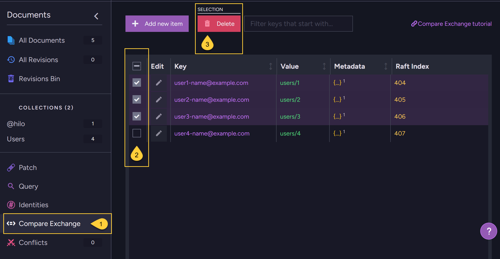

import Admonition from '@theme/Admonition';
import Tabs from '@theme/Tabs';
import TabItem from '@theme/TabItem';
import CodeBlock from '@theme/CodeBlock';

<Admonition type="note" title="">

* **Custom compare-exchange items can be deleted**:  
  You can delete your own custom compare-exchange items.
  An item is deleted only if the index you provide in the request matches the current index stored on the server for the specified key.  
  
* **Delete items by expiration**:  
  Compare-exchange items can also be deleted by adding an expiration date to them.  
  Learn more in [Compare-exchange expiration](../compare-exchange/cmpxchg-expiration).
  
* **Compare-exchange tombstones**:  
  Whenever a compare-exchange item is deleted, a compare-exchange tombstone is created for it.  
  These tombstones are used to indicate to other RavenDB processes that the compare-exchange item was deleted,  
  so they can react accordingly.  
  For example, indexes referencing the deleted item will update themselves to remove those references.  
  Compare-exchange tombstones that are eligible for deletion are removed periodically by an internal cleanup task.  
  See: [Cluster.CompareExchangeTombstonesCleanupIntervalInMin](../compare-exchange/configuration#clustercompareexchangetombstonescleanupintervalinmin).

* <Admonition type="warning" title="">
  Do not attempt to delete [atomic guards](../compare-exchange/atomic-guards), which RavenDB uses internally to ensure ACID guarantees in cluster-wide transactions.
  These items are created automatically and must not be modified or removed.  
  
  If your custom compare-exchange item was set up to protect the consistency of a transaction, deleting it will break the ACID guarantees.
  Only delete or modify such items if you truly know what you're doing.    
  </Admonition>  
  
---

* In this article:
  * [Delete compare-exchange item using a **store operation**](../compare-exchange/delete-cmpxchg-items#delete-compare-exchange-item-using-a-store-operation)  
  * [Delete compare-exchange items using the **Studio**](../compare-exchange/delete-cmpxchg-items#delete-compare-exchange-items-using-the-studio)
  * [Syntax](../compare-exchange/delete-cmpxchg-items#syntax)

</Admonition>

---

## Delete compare-exchange item using a store operation

* Use the `DeleteCompareExchangeValueOperation` [store operation](../client-api/operations/what-are-operations) to delete a compare-exchange item by its key and index, without opening a session.
  This is ideal for stand-alone tasks that don't require batching multiple commands into a single transactional session. 
  
* The delete operation will only succeed if the item's current index on the server is the same as the one you provide.  
  If the indexes do not match, the item is not deleted and no exception is thrown.

* Example:

    <Tabs groupId='languageSyntax'>
    <TabItem value="Delete_operation" label="Delete_operation">
    ```java
    // Get the latest version of the existing compare-exchange item to be deleted
    CompareExchangeValue<User> itemToDelete = store.operations().send(
        new GetCompareExchangeValueOperation<>(User.class, "AdminUser"));
    
    // Execute the delete operation 
    CompareExchangeResult<User> deleteResult = store.operations().send(
        new DeleteCompareExchangeValueOperation<>(User.class, "AdminUser", itemToDelete.getIndex()));    
    
    // Check results    
    boolean deleteResultSuccessful = deleteResult.isSuccessful();
    ```
    </TabItem>
    </Tabs>  

---

## Delete compare-exchange items using the Studio

You can delete one or multiple compare-exchange items from the Studio.



1. Go to **Documents > Compare Exchange**.
2. Select the compare-exchange items you want to delete.  
3. Click **Delete**.

---

## Syntax

---

### `DeleteCompareExchangeValueOperation`  
Delete compare-exchange item using a store operation: 

<TabItem value="" label="">
```java
public DeleteCompareExchangeValueOperation(Class<T> clazz, String key, long index)
```
</TabItem>

| Parameter | Type     | Description |
|-----------|----------|-------------|
| **key**   | `string` | The unique key of the compare-exchange item. |
| **index** | `long`   | The current version of the item.<br/>Deletion will only succeed if this matches the version stored on the server. |

**Returned object**:

<TabItem value="" label="">
```java
public class CompareExchangeResult<T> {
  private T value;
  private long index;
  private boolean successful;

  public T getValue() {
      return value;
  }

  public void setValue(T value) {
      this.value = value;
  }

  public long getIndex() {
      return index;
  }

  public void setIndex(long index) {
      this.index = index;
  }

  public boolean isSuccessful() {
      return successful;
  }

  public void setSuccessful(boolean successful) {
      this.successful = successful;
  }
}
```
</TabItem>

| Return Value  | Type      | Description |
|---------------|-----------|-------------|
| **Successful**| `boolean` | <ul><li>`true` if the delete operation completed successfully.</li><li>`true` if _key_ doesn't exist</li><li>`false` if the delete operation has failed, e.g. when the index version doesn't match.</li></ul> |
| **Value**     | `T`       | <ul><li>The value that was deleted upon a successful delete.</li><li>`null` if _key_ doesn't exist</li><li>The currently existing value on the server if the delete operation has failed.</li></ul> |
| **Index**     | `long`    | <ul><li>The next available version number upon success.</li><li>The next available version number if _key_ doesn't exist.</li><li>The currently existing index on the server if the delete operation has failed.</li></ul> |
