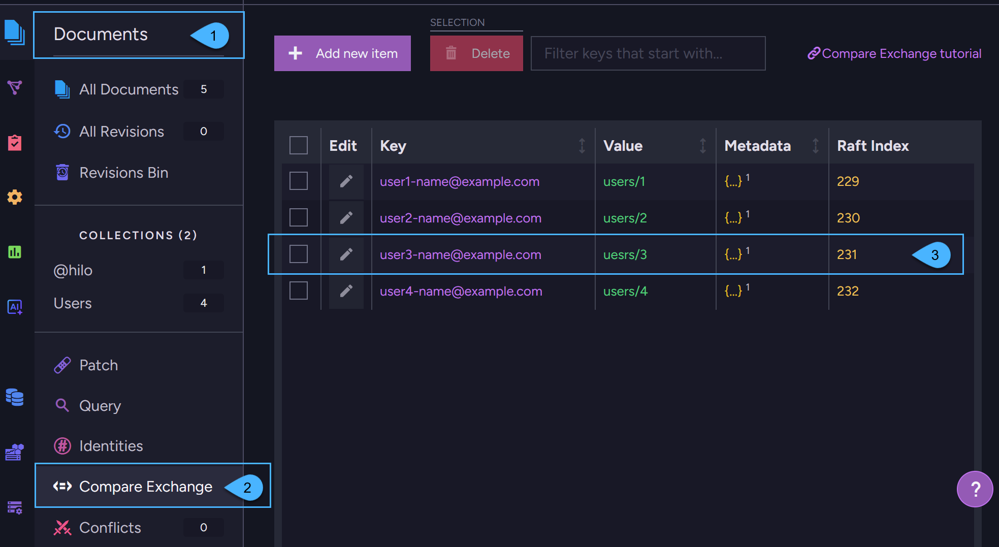

import Admonition from '@theme/Admonition';
import Tabs from '@theme/Tabs';
import TabItem from '@theme/TabItem';
import CodeBlock from '@theme/CodeBlock';

<Admonition type="note" title="">

* Compare-exchange items are **key/value pairs** where the key is unique across your database. 

* Compare-exchange items can be used to coordinate work between sessions that are trying to modify a shared resource (such as a document) at the same time.

* Compare-exchange items are [not replicated externally](../compare-exchange/overview#why-compare-exchange-items-are-not-replicated-to-external-databases) to other databases.

* In this article:  
  * [What compare-exchange items are](../compare-exchange/overview#what-compare-exchange-items-are)  
  * [Ways to create and manage compare-exchange items](../compare-exchange/overview#ways-to-create-and-manage-compare-exchange-items)  
  * [Why compare-exchange items are not replicated to external databases](../compare-exchange/overview#why-compare-exchange-items-are-not-replicated-to-external-databases)  
  * [Example I - Email address reservation](../compare-exchange/overview#example-i---email-address-reservation)  
  * [Example II - Reserve a shared resource](../compare-exchange/overview#example-ii---reserve-a-shared-resource)  

</Admonition>

---
    
## What compare-exchange items are

Compare-exchange items are key/value pairs where the key serves as a unique value across your database.

* Each compare-exchange item contains: 
  * **A key** - A unique string identifier in the database scope.
  * **A value** - Can be any object (a number, string, array, or any valid JSON object). 
  * **Metadata** - Optional data that is associated with the compare-exchange item. Must be a valid JSON object.  
    For example, the metadata can be used to set expiration time for the compare-exchange item.  
    Learn more in [compare-exchange expiration](../compare-exchange/cmpxchg-expiration).  
  * **Raft index** - The compare-exchange item's version.  
    Any change to the value or metadata will increase this number.  

* Creating and modifying a compare-exchange item is an atomic, thread-safe [compare-and-swap](https://en.wikipedia.org/wiki/Compare-and-swap)
  interlocked compare-exchange operation. These operations require cluster consensus to ensure consistency across all nodes.  
  Once a consensus is reached, the compare-exchange items are distributed through the Raft algorithm to all nodes in the database group.  

---

## Ways to create and manage compare-exchange items
  
Compare exchange items can be created and managed using any of the following approaches:

* **Document Store Operations**  
  You can create and manage compare-exchange items using _document store_ operations.  
  For example, see [Create items using a store operation](../compare-exchange/create-cmpxchg-items#create-items-using-a-store-operation).

* **Cluster-Wide Sessions**  
  You can create and manage compare-exchange items from within a [Cluster-Wide session](../client-api/session/cluster-transaction/overview#cluster-wide-transaction-vs-single-node-transaction).  
  For example, see [Create items using a cluster-wide session](../compare-exchange/create-cmpxchg-items#create-items-using-a-cluster-wide-session).     
  When using a cluster-wide session, the compare-exchange item is created as part of the cluster-wide transaction.  
  If the session fails, the item creation also fails, and none of the nodes in the database group will store the new compare-exchange item.
  
* **Atomic Guards**  
  When creating _documents_ using a cluster-wide session, RavenDB automatically creates [Atomic Guards](../compare-exchange/atomic-guards),  
  which are special compare-exchange items that guarantee ACID transactions.  
  See [Cluster-wide transaction vs. Single-node transaction](../client-api/session/cluster-transaction/overview#cluster-wide-transaction-vs-single-node-transaction) for a session comparison overview.  

* **Studio**  
  All compare-exchange items can also be managed from the **Compare-Exchange view** in the [Studio](../todo..):  
    
    

    1. Open the **Documents** section in the Studio sidebar.
    2. Click on the **Compare-Exchange** tab.
    3. This is a compare-exchange item.  
       In this view you can create, edit, and delete compare-exchange items.
  
---

## Why compare-exchange items are not replicated to external databases 

* Each cluster defines its own policies and configurations, and should ideally have sole responsibility for managing its own documents. 
  Read [Consistency in a Globally Distributed System](https://ayende.com/blog/196769-B/data-ownership-in-a-distributed-system) 
  to learn more about why global database modeling is more efficient this way.
   
* When creating a compare-exchange item, a Raft consensus is required from the nodes in the database group.
  Externally replicating such data is problematic because the target database may reside within a cluster that is in an
  unstable state where Raft decisions cannot be made. In such a state, the compare-exchange item will not be persisted in the target database.

* Conflicts between documents that occur between two databases are resolved using the documents' change-vector. 
  Compare-exchange conflicts cannot be resolved in the same way, as they lack a similar conflict resolution mechanism.

* To ensure unique values between two databases without using compare-exchange items see [Example III](../compare-exchange/overview#example-iii---ensuring-unique-values-without-using-compare-exchange).

* Learn more about Replication in RavenDB in [Replication overview](../server/clustering/replication/replication-overview).
  For details about what is and what isn't replicated in [What is Replicated](../server/ongoing-tasks/external-replication#what-is-replicated).
    
---
    
## Example I - Email address reservation  

The following example shows how to use compare-exchange to create documents with unique values.  
The scope is within the database group on a single cluster. 

Compare-exchange items are not externally replicated to other databases.  
To establish uniqueness without using compare-exchange see [Example III](../compare-exchange/overview#example-iii---ensuring-unique-values-without-using-compare-exchange).
    
<TabItem value="" label="">    
```java
String email = "user@example.com";

User user = new User();
user.setEmail(email);

try (IDocumentSession session = store.openSession()) {
    session.store(user);

    // At this point, the user document has an Id assigned

    // Try to reserve a new user email
    // Note: This operation takes place outside of the session transaction,
    //       It is a cluster-wide reservation
    CompareExchangeResult<String> cmpXchgResult = store
        .operations().send(
            new PutCompareExchangeValueOperation<>(email, user.getId(), 0));

    if (!cmpXchgResult.isSuccessful()) {
        throw new RuntimeException("Email is already in use");
    }

    // At this point we managed to reserve/save the user email -
    // The document can be saved in SaveChanges
    session.saveChanges();
}
```
</TabItem>

**Implications**:

* This compare-exchange item was [created as an operation](../compare-exchange/create-cmpxchg-items#create-items-using-a-store-operation)
  rather than with a [cluster-wide session](../compare-exchange/create-cmpxchg-items#create-items-using-a-cluster-wide-session).  
  Thus, if `session.SaveChanges` fails, then the email reservation is Not rolled back automatically.  
  It is your responsibility to do so.  

* The compare-exchange value that was saved can be accessed in a query using the `CmpXchg` method:  

<Tabs groupId='languageSyntax'>

<TabItem value="Query" label="Query">
<CodeBlock language="java">
{`try (IDocumentSession session = store.openSession()) {
    List<User> query = session.advanced().rawQuery(User.class,
        "from Users as s where id() == cmpxchg(\\"ayende@ayende.com\\")")
        .toList();

    IDocumentQuery<User> q = session.advanced()
        .documentQuery(User.class)
        .whereEquals("id", CmpXchg.value("ayende@ayende.com"));
}
`}
</CodeBlock>
</TabItem>
<TabItem value="RQL" label="RQL">
```sql
from "Users" 
where id() == cmpxchg("ayende@ayende.com")
limit 0, 1 // take the first result
```
</TabItem>
</Tabs>

---

## Example II - Reserve a shared resource  

In the following example, we use compare-exchange to reserve a shared resource.  
The scope is within the database group on a single cluster.

The code also checks for clients which never release resources (i.e. due to failure) by using timeout.  

<TabItem value="" label="">
<CodeBlock language="java">
{`private class SharedResource \{
    private LocalDateTime reservedUntil;

    public LocalDateTime getReservedUntil() \{
        return reservedUntil;
    \}

    public void setReservedUntil(LocalDateTime reservedUntil) \{
        this.reservedUntil = reservedUntil;
    \}
\}

public void printWork() throws InterruptedException \{
    // Try to get hold of the printer resource
    long reservationIndex = lockResource(store, "Printer/First-Floor", Duration.ofMinutes(20));

    try \{
        // Do some work for the duration that was set.
        // Don't exceed the duration, otherwise resource is available for someone else.
    \} finally \{
        releaseResource(store, "Printer/First-Floor", reservationIndex);
    \}
\}

public long lockResource(IDocumentStore store, String resourceName, Duration duration) throws InterruptedException \{
    while (true) \{
        LocalDateTime now = LocalDateTime.now();

        SharedResource resource = new SharedResource();
        resource.setReservedUntil(now.plus(duration));

        CompareExchangeResult<SharedResource> saveResult =
            store.operations().send(
                new PutCompareExchangeValueOperation<SharedResource>(resourceName, resource, 0));

        if (saveResult.isSuccessful()) \{
            // resourceName wasn't present - we managed to reserve
            return saveResult.getIndex();
        \}

        // At this point, Put operation failed - someone else owns the lock or lock time expired
        if (saveResult.getValue().reservedUntil.isBefore(now)) \{
            // Time expired - Update the existing key with the new value
            CompareExchangeResult<SharedResource> takeLockWithTimeoutResult =
                store.operations().send(
                    new PutCompareExchangeValueOperation<>(resourceName, resource, saveResult.getIndex()));

            if (takeLockWithTimeoutResult.isSuccessful()) \{
                return takeLockWithTimeoutResult.getIndex();
            \}
        \}

        // Wait a little bit and retry
        Thread.sleep(20);
    \}
\}

public void releaseResource(IDocumentStore store, String resourceName, long index) \{
    CompareExchangeResult<SharedResource> deleteResult = store
        .operations().send(
            new DeleteCompareExchangeValueOperation<>(SharedResource.class, resourceName, index));

    // We have 2 options here:
    // deleteResult.Successful is true - we managed to release resource
    // deleteResult.Successful is false - someone else took the lock due to timeout
\}
`}
</CodeBlock>
</TabItem>
