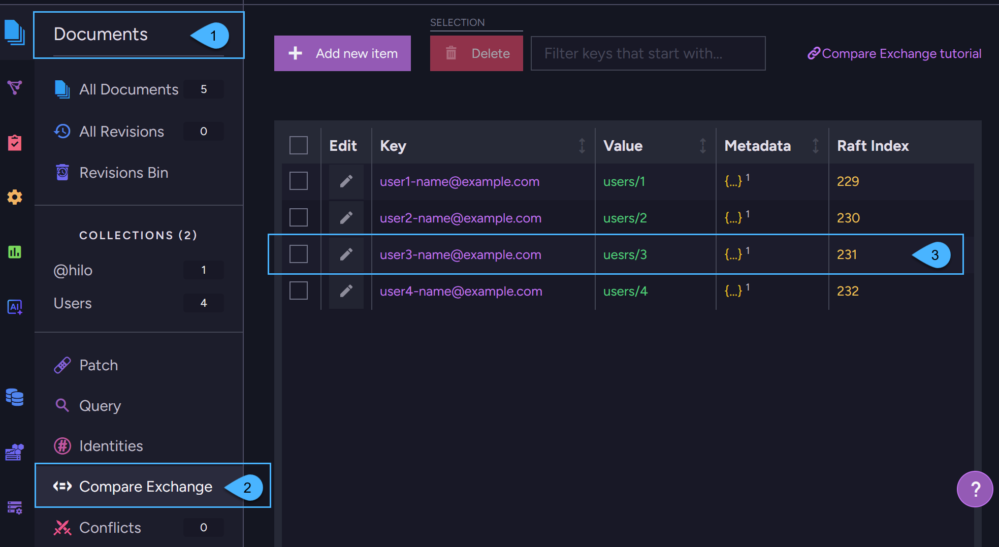

import Admonition from '@theme/Admonition';
import Tabs from '@theme/Tabs';
import TabItem from '@theme/TabItem';
import CodeBlock from '@theme/CodeBlock';
import Panel from "@site/src/components/Panel";
import ContentFrame from "@site/src/components/ContentFrame";

<Admonition type="note" title="">

* Compare-exchange items are **key/value pairs** where the key is a globally unique identifier in the database.  
  Items are versioned and managed at the cluster level.

* Compare-exchange provides a built-in consensus mechanism for safe coordination across sessions and nodes.  
  It ensures global consistency in the database and prevents conflicts when multiple clients try to modify or reserve  
  the same resource, allowing you to:  
  * Enforce global uniqueness (e.g., prevent duplicate usernames or emails).
  * Assign work to a single client or reserve a resource once.
  * Handle concurrency safely, without external services or custom locking logic.  

* Compare-exchange items are also suitable for storing shared or global values that aren't tied to a specific document -
  such as configuration flags, feature toggles, or reusable identifiers stored under a unique key.  
  However, [unlike regular documents](../../compare-exchange/overview.mdx#why-not-use-regular-documents-to-enforce-uniqueness),
  compare-exchange provides atomic updates, version-based conflict prevention, and Raft-based consistency for distributed safety.
  
* Compare-exchange items are [not replicated externally](../../compare-exchange/overview.mdx#why-compare-exchange-items-are-not-replicated-to-external-databases) to other databases.   

* In this article:  
    * [What compare-exchange items are](../../compare-exchange/overvie.mdxw#what-compare-exchange-items-are)  
    * [Ways to create and manage compare-exchange items](../../compare-exchange/overview.mdx#ways-to-create-and-manage-compare-exchange-items)  
    * [Why compare-exchange items are not replicated to external databases](../../compare-exchange/overview.mdx#why-compare-exchange-items-are-not-replicated-to-external-databases)  
    * [Why not use regular documents to enforce uniqueness](../../compare-exchange/overview.mdx#why-not-use-regular-documents-to-enforce-uniqueness)  
    * [Example I - Email address reservation](../../compare-exchange/overview.mdx#example-i-email-address-reservation)  
    * [Example II - Reserve a shared resource](../../compare-exchange/overview.mdx#example-ii-reserve-a-shared-resource)  
    * [Use cases](../../compare-exchange/overview.mdx#use-cases)  

</Admonition>

<Panel heading="What compare-exchange items are">

Compare-exchange items are key/value pairs where the key serves as a unique value across your database.

* Each compare-exchange item contains: 
  * **A key** - A unique string identifier in the database scope.
  * **A value** - Can be any value (a number, string, array, or any valid JSON object). 
  * **Metadata** - Optional data that is associated with the compare-exchange item. Must be a valid JSON object.  
    For example, the metadata can be used to set expiration time for the compare-exchange item.  
    Learn more in [compare-exchange expiration](../../compare-exchange/cmpxchg-expiration.mdx).  
  * **Raft index** - The compare-exchange item's version.  
    Any change to the value or metadata will increase this number.  

* Creating and modifying a compare-exchange item follows the same principle as the [compare-and-swap](https://en.wikipedia.org/wiki/Compare-and-swap) operation in multi-threaded systems,
  but in RavenDB, this concept is applied to a distributed environment across multiple nodes instead of within a single multi-threaded process.  
  These operations require cluster consensus to ensure consistency.
  Once consensus is reached, the compare-exchange items are distributed through the Raft algorithm to all nodes in the database group.

</Panel>

<Panel heading="Ways to create and manage compare-exchange items">
  
Compare exchange items can be created and managed using any of the following approaches:

* **Document Store Operations**  
  You can create and manage compare-exchange items using _document store_ operations.  
  For example, see [Create items using a store operation](../../compare-exchange/create-cmpxchg-items.mdx#create-items-using-a-store-operation).

* **Cluster-Wide Sessions**  
  You can create and manage compare-exchange items from within a [Cluster-Wide session](../../client-api/session/cluster-transaction/overview.mdx#cluster-wide-transaction-vs-single-node-transaction).  
  For example, see [Create items using a cluster-wide session](../../compare-exchange/create-cmpxchg-items.mdx#create-items-using-a-cluster-wide-session).     
  When using a cluster-wide session, the compare-exchange item is created as part of the cluster-wide transaction.  
  If the session fails, the item creation also fails, and none of the nodes in the database group will store the new compare-exchange item.
  
* **Atomic Guards**  
  When creating _documents_ using a cluster-wide session, RavenDB automatically creates [Atomic Guards](../../compare-exchange/atomic-guards.mdx),  
  which are special compare-exchange items that guarantee ACID transactions.  
  See [Cluster-wide transaction vs. Single-node transaction](../../client-api/session/cluster-transaction/overview.mdx#cluster-wide-transaction-vs-single-node-transaction) for a session comparison overview.  

* **Studio**  
  All compare-exchange items can also be managed from the **Compare-Exchange view** in Studio:  
    
    

    1. Open the **Documents** section in the Studio sidebar.
    2. Click on the **Compare-Exchange** tab.
    3. This is a compare-exchange item.  
       In this view you can create, edit, and delete compare-exchange items.

</Panel>

<Panel heading="Why compare-exchange items are not replicated to external databases">

* Each cluster defines its own policies and configurations, and should ideally have sole responsibility for managing its own documents. 
  Read [Consistency in a Globally Distributed System](https://ayende.com/blog/196769-B/data-ownership-in-a-distributed-system) 
  to learn more about why global database modeling is more efficient this way.
   
* When creating a compare-exchange item, a Raft consensus is required from the nodes in the database group.
  Externally replicating such data is problematic because the target database may reside within a cluster that is in an
  unstable state where Raft decisions cannot be made. In such a state, the compare-exchange item will not be persisted in the target database.

* Conflicts between documents that occur between two databases are resolved using the documents' change-vector. 
  Compare-exchange conflicts cannot be resolved in the same way, as they lack a similar conflict resolution mechanism.

* Learn more about Replication in RavenDB in [Replication overview](../../server/clustering/replication/replication-overview.mdx).
  For details about what is and what isn't replicated in [What is Replicated](../../server/ongoing-tasks/external-replication.mdx#what-is-replicated).

</Panel>

<Panel heading="Why not use regular documents to enforce uniqueness">

* You might consider storing a document with a predictable ID (for example, _phones/123456_) as a way to enforce uniqueness, 
  and then checking for its existence before allowing another document to use the same value.

* While this might work in a single-node setup or with external replication,
  it does not reliably enforce uniqueness in a clustered environment.
 
* If a node was not part of the cluster when the document was created, it might not be aware of its existence when it comes back online. 
  In such cases, attempting to load the document on this node may return _null_, leading to duplicate values being inserted.

* To reliably enforce uniqueness across all cluster nodes, you must use compare-exchange items,
  which are designed for this purpose and ensure global consistency.

</Panel>

<Panel heading="Example I - Email address reservation">  

The following example shows how to use compare-exchange to create documents with unique values.  
The scope is within the database group on a single cluster. 

<TabItem value="" label="">
<CodeBlock language="php">
{`$email = "user@example.com";

$user = new User();
$user->setEmail($email);

$session = $store->openSession();
try \{
    $session->store($user);

    // At this point, the user object has a document ID assigned by the session.

    // Try to reserve the user email using a compare-exchange item.
    // Note: This 'put compare-exchange operation' is not part of the session transaction, 
    //       It is a separate, cluster-wide reservation.

    /** @var CompareExchangeResult $cmpXchgResult */
    $cmpXchgResult = $store->operations()->send(
        // Parameters passed to the operation:
        // $email - the unique key of the compare-exchange item
        // $user->getId() - the value associated with the key
        // 0 - ensures the item is created only if it doesn't already exist
        // If a compare-exchange item with the given key already exists, the operation will fail.
        new PutCompareExchangeValueOperation($email, $user->getId(), 0));

    if (!$cmpXchgResult->isSuccessful()) \{
        throw new RuntimeException("Email is already in use");
    \}

    // At this point, the email has been successfully reserved/saved.
    // We can now save the user document to the database.
    $session->saveChanges();
\} finally \{
    $session->close();
\}
`}
</CodeBlock>
</TabItem>  

**Implications**:

* This compare-exchange item was [created as an operation](../../compare-exchange/create-cmpxchg-items.mdx#create-items-using-a-store-operation)
  rather than with a [cluster-wide session](../../compare-exchange/create-cmpxchg-items.mdx#create-items-using-a-cluster-wide-session).  
  Thus, if `session.SaveChanges` fails, then the email reservation is Not rolled back automatically.  
  It is your responsibility to do so.  

* The compare-exchange value that was saved can be accessed in a query using the `CmpXchg` method:  
    
<Tabs groupId='languageSyntax'>
<TabItem value="query" label="query">
<CodeBlock language="php">
{`$query = $session->advanced()->rawQuery(User::class,
    "from Users as s where id() == cmpxchg(\\"emails/ayende@ayende.com\\")")
    ->toList();
`}
</CodeBlock>
</TabItem>  
<TabItem value="documentQuery" label="documentQuery">
<CodeBlock language="php">
{`$q = $session->advanced()
    ->documentQuery(User::class)
    ->whereEquals("id", CmpXchg::value("emails/ayende@ayende.com"));
`}
</CodeBlock>
</TabItem>  
<TabItem value="RQL" label="RQL">
<CodeBlock language="sql">
{`from Users as s where id() == cmpxchg("emails/ayende@ayende.com")
`}
</CodeBlock>
</TabItem>
</Tabs>   

</Panel>

<Panel heading="Example II - Reserve a shared resource">

In the following example, we use compare-exchange to reserve a shared resource.  
The scope is within the database group on a single cluster.

The code also checks for clients which never release resources (i.e. due to failure) by using timeout.  

<TabItem value="" label="">
<CodeBlock language="php">
{`class SharedResource
\{
    private ?DateTime $reservedUntil = null;

    public function getReservedUntil(): ?DateTime
    \{
        return $this->reservedUntil;
    \}

    public function setReservedUntil(?DateTime $reservedUntil): void
    \{
        $this->reservedUntil = $reservedUntil;
    \}
\}

class CompareExchangeSharedResource
\{
    private ?DocumentStore $store = null;

    public function printWork(): void
    \{
        // Try to get hold of the printer resource
        $reservationIndex = $this->lockResource($this->store, "Printer/First-Floor", Duration::ofMinutes(20));

        try \{
            // Do some work for the duration that was set (TimeSpan.FromMinutes(20)).
            //
            // In a distributed system (unlike a multi-threaded app), a process may crash or exit unexpectedly  
            // without releasing the resource it reserved (i.e. never reaching the 'finally' block).  
            // This can leave the resource locked indefinitely.
            //
            // To prevent that, each reservation includes a timeout (TimeSpan.FromMinutes(20)).  
            // If the process fails or exits, the resource becomes available again once the timeout expires.
            //
            // Important: Ensure the work completes within the timeout period.  
            // If it runs longer, another client may acquire the same resource at the same time.
        \} finally \{
            $this->releaseResource($this->store, "Printer/First-Floor", $reservationIndex);
        \}
    \}

    /**  throws InterruptedException */
    public function lockResource(DocumentStoreInterface $store, ?string $resourceName, Duration $duration): int
    \{
        while (true) \{
            $now = new DateTime();

            $resource = new SharedResource();
            $resource->setReservedUntil($now->add($duration->toDateInterval()));

            /** @var CompareExchangeResult<SharedResource> $saveResult */
            $saveResult = $store->operations()->send(
                new PutCompareExchangeValueOperation($resourceName, $resource, 0));

            if ($saveResult->isSuccessful()) \{
                // resourceName wasn't present - we managed to reserve
                return $saveResult->getIndex();
            \}

            // At this point, another process owns the resource.
            // But if that process crashed and never released the resource, the reservation may have expired,
            // so we can try to take the lock by overwriting the value using the current index.
            if ($saveResult->getValue()->getReservedUntil() < $now) \{
                // Time expired - Update the existing key with the new value
                /** @var CompareExchangeResult<SharedResource> takeLockWithTimeoutResult */
                $takeLockWithTimeoutResult = $store->operations()->send(
                    new PutCompareExchangeValueOperation($resourceName, $resource, $saveResult->getIndex()));

                if ($takeLockWithTimeoutResult->isSuccessful()) \{
                    return $takeLockWithTimeoutResult->getIndex();
                \}
            \}

            // Wait a little bit and retry
            usleep(20000);
        \}
    \}

    public function releaseResource(DocumentStoreInterface $store, ?string $resourceName, int $index): void
    \{
        $deleteResult = $store->operations()->send(
            new DeleteCompareExchangeValueOperation(SharedResource::class, $resourceName, $index)
        );

        // We have 2 options here:
        // $deleteResult->isSuccessful is true - we managed to release resource
        // $deleteResult->isSuccessful is false - someone else took the lock due to timeout
    \}
\}
`}
</CodeBlock>
</TabItem>

</Panel>

<Panel heading="Use cases">

<Admonition type="note" title="">

### Enforce unique usernames or emails

* Use compare-exchange to enforce global uniqueness in your database even under concurrent operations.  
  For example, ensure that no two users can register with the same username or email, even if they do so simultaneously on different servers.
  Compare-exchange guarantees that a specific value can only be claimed once across the cluster reliably and without race conditions.

* ✅ Why compare-exchange?  
      It provides a guaranteed, cluster-wide check for uniqueness.

* How it works:
  * When a user registers, the app attempts to create a compare-exchange item like   
    (**key**: `"emails/john@example.com"`, **value**: `"users/1-A"`).
  * Only the first attempt to claim this key succeeds.
  * Any concurrent or repeated attempts to claim the same key fail automatically.

* This makes it easy to enforce rules like:
  * No two users can register with the same email address.
  * No two orders can use the same external reference ID.

</Admonition>

<Admonition type="note" title="">

### Claim a job or task once

* Use compare-exchange to safely assign client-side jobs or tasks in a distributed system,  
  ensuring that each task is claimed only once.

* ✅ Why compare-exchange?  
  It provides a reliable, cluster-wide locking mechanism for coordination within your database scope.

* How it works:
  * Each worker attempts to create a compare-exchange item like  
    (**key**: `"locks/job/1234"`, **value**: `"worker-A"`).
  * The first worker to succeed gets the job.
  * Other workers trying to claim the same job will fail - they can back off or retry later.

* This ensures:
  * No two workers process the same job.
  * Each job runs exactly once, even with multiple competing workers or nodes.

* Also useful for:
  * Implementing mutex-style locks between clients.
  * Ensuring that scheduled tasks or batch jobs run only once across the cluster.

</Admonition>

<Admonition type="note" title="">

### Reserve a resource  

* Need to reserve a table in a restaurant app or a seat at an event?  
  Use compare-exchange to lock the reservation and prevent double booking, even under concurrent access.

* ✅ Why compare-exchange?  
  It gives you a reliable, cluster-wide way to reserve something exactly once - no race conditions, no conflicts.

* How it works:
  * Try to create a Compare-Exchange item for the resource   
    (e.g., **key**: `"reservations/seat/17"`, **value**: `"user/123"`).
  * If the item doesn't exist, the reservation is successful.
  * If it already exists, someone else claimed it - you can show an error or let the user pick another.

* This pattern is useful for:
  * Reserving seats, tables, or event slots.
  * Assigning support engineers to incoming tickets.
  * Allocating limited resources like promotion codes or serial numbers.

* Only one client can claim the item so your reservation logic stays safe and simple, even under high load.
    
</Admonition>

<Admonition type="note" title="">

### Prevent double processing

* Use compare-exchange to make sure an operation runs only once even in a distributed setup.  
  This is useful for avoiding things like sending the same email twice, processing the same order multiple times,  
  or executing duplicate actions after retries.

* ✅ Why compare-exchange?  
  It acts as a once-only flag - a lightweight, atomic check to prevent duplicate processing.

* How it works:
  * Before running the operation, try to create a compare-exchange key like `processed/orders/9876`.
  * If the key creation succeeds - run the operation.
  * If the key already exists - skip processing. It's already been handled.

* This approach is especially useful in retry scenarios, background jobs, or any flow where idempotency matters.

</Admonition>

<Admonition type="note" title="">

### Run business logic only if data hasn't changed  

* Use compare-exchange as a version guard to ensure the data wasn't modified while you were working on it.  
  This is useful when applying business logic that depends on the current state of the data - like approving a request, processing a payment, or updating a workflow step.

* ✅ Why compare-exchange?  
  It helps detect changes and prevents acting on stale or outdated data.

* How it works:
  * Load the compare-exchange item that tracks the current version or state of the resource.
  * After performing your checks and logic, attempt to update the item - but only if the version is still current.
  * If the item was modified in the meantime, the update fails and you can abort or retry your business logic.

* This pattern helps you maintain correctness and consistency in flows that involve multiple steps,  
  long-running tasks, or user input.

</Admonition>

<Admonition type="note" title="">

### Lock a document for editing  

* In collaborative systems, it's common to allow only one user edit a document at a time.  
  Use compare-exchange to create a lightweight, distributed lock on the document.

* ✅ Why compare-exchange?  
  It ensures that only one client can acquire the lock - preventing conflicting edits across users or servers.

* How it works:
  * When a user starts editing a document (e.g., `task/72`), try to create a compare-exchange item:  
    (**key**: `"editing/task/72"`, **value**: `"user/123"`).
  * If the item is created successfully, the user holds the lock.
  * Other users attempting the same key will fail and can be blocked, shown a message, or put into read-only mode.
  * When editing is done, delete the compare-exchange item to release the lock.

* This is useful for:
  * Locking tasks, issues, or shared forms during editing.
  * Preventing data loss or conflicts from simultaneous updates.
  * Letting users know who’s currently editing a shared resource.

* Simple to implement and works seamlessly across the cluster.

</Admonition>

<Admonition type="note" title="">

### Add safety to cluster-wide transactions

* When using cluster-wide sessions to handle documents, RavenDB automatically creates internal compare-exchange items,
  called [atomic guards](../../compare-exchange/atomic-guards.mdx), to enforce atomic document modifications.
  These items coordinate access and prevent conflicting writes across nodes.  

* ✅ Why compare-exchange?  
  It provides a Raft-based coordination mechanism that ensures consistency and safety during multi-node transactions.

* How it works:
  * When you store or update a document in a cluster-wide session,  
    RavenDB creates an atomic guard to track the document’s version across the cluster.
  * If another session modifies the document in the meantime,  
    your transaction fails with a `ConcurrencyException`, ensuring data consistency.

* This protects you from:
  * Writing over documents that were modified by other sessions.
  * Acting on stale data in a distributed environment.
  * Violating ACID guarantees in multi-node clusters.

* You don’t need to manage these guards manually -   
  RavenDB handles everything automatically when you use a session in cluster-wide mode.

</Admonition>
    
</Panel>   