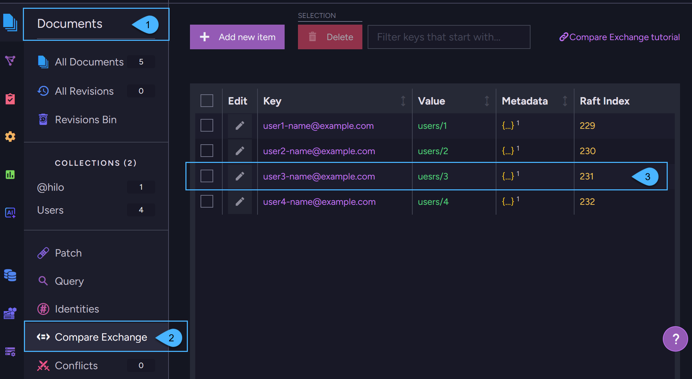

import Admonition from '@theme/Admonition';
import Tabs from '@theme/Tabs';
import TabItem from '@theme/TabItem';
import CodeBlock from '@theme/CodeBlock';

<Admonition type="note" title="">

* Compare-exchange items are **key/value pairs** where the key is a globally unique identifier in the database.  
  Items are versioned and managed at the cluster level.

* Compare-exchange provides a built-in consensus mechanism for safe coordination across sessions and nodes.  
  It ensures global consistency in the database and prevents conflicts when multiple clients try to modify or reserve  
  the same resource, allowing you to:  
  * Enforce global uniqueness (e.g., prevent duplicate usernames or emails).
  * Assign work to a single client or reserve a resource once.
  * Handle concurrency safely, without external services or custom locking logic.  

* Compare-exchange items are also suitable for storing shared or global values that aren't tied to a specific document -
  such as configuration flags, feature toggles, or reusable identifiers stored under a unique key.  
  However, [unlike regular documents](../compare-exchange/overview#why-not-use-regular-documents-to-enforce-uniqueness),
  compare-exchange provides atomic updates, version-based conflict prevention, and Raft-based consistency for distributed safety.
  
* Compare-exchange items are [not replicated externally](../compare-exchange/overview#why-compare-exchange-items-are-not-replicated-to-external-databases) to other databases.   

* In this article:  
    * [What compare-exchange items are](../compare-exchange/overview#what-compare-exchange-items-are)  
    * [Ways to create and manage compare-exchange items](../compare-exchange/overview#ways-to-create-and-manage-compare-exchange-items)  
    * [Why compare-exchange items are not replicated to external databases](../compare-exchange/overview#why-compare-exchange-items-are-not-replicated-to-external-databases)  
    * [Why not use regular documents to enforce uniqueness](../compare-exchange/overview#why-not-use-regular-documents-to-enforce-uniqueness)  
    * [Example I - Email address reservation](../compare-exchange/overview#example-i---email-address-reservation)  
    * [Example II - Reserve a shared resource](../compare-exchange/overview#example-ii---reserve-a-shared-resource)  

</Admonition>

---
    
## What compare-exchange items are

Compare-exchange items are key/value pairs where the key serves as a unique value across your database.

* Each compare-exchange item contains: 
  * **A key** - A unique string identifier in the database scope.
  * **A value** - Can be any value (a number, string, array, or any valid JSON object). 
  * **Metadata** - Optional data that is associated with the compare-exchange item. Must be a valid JSON object.  
    For example, the metadata can be used to set expiration time for the compare-exchange item.  
    Learn more in [compare-exchange expiration](../compare-exchange/cmpxchg-expiration).  
  * **Raft index** - The compare-exchange item's version.  
    Any change to the value or metadata will increase this number.  

* Creating and modifying a compare-exchange item follows the same principle as the [compare-and-swap](https://en.wikipedia.org/wiki/Compare-and-swap) operation in multi-threaded systems,
  but in RavenDB, this concept is applied to a distributed environment across multiple nodes instead of within a single multi-threaded process.  
  These operations require cluster consensus to ensure consistency.
  Once consensus is reached, the compare-exchange items are distributed through the Raft algorithm to all nodes in the database group.

---

## Ways to create and manage compare-exchange items
  
Compare exchange items can be created and managed using any of the following approaches:

* **Document Store Operations**  
  You can create and manage compare-exchange items using _document store_ operations.  
  For example, see [Create items using a store operation](../compare-exchange/create-cmpxchg-items#create-items-using-a-store-operation).

* **Cluster-Wide Sessions**  
  You can create and manage compare-exchange items from within a [Cluster-Wide session](../client-api/session/cluster-transaction/overview#cluster-wide-transaction-vs-single-node-transaction).  
  For example, see [Create items using a cluster-wide session](../compare-exchange/create-cmpxchg-items#create-items-using-a-cluster-wide-session).     
  When using a cluster-wide session, the compare-exchange item is created as part of the cluster-wide transaction.  
  If the session fails, the item creation also fails, and none of the nodes in the database group will store the new compare-exchange item.
  
* **Atomic Guards**  
  When creating _documents_ using a cluster-wide session, RavenDB automatically creates [Atomic Guards](../compare-exchange/atomic-guards),  
  which are special compare-exchange items that guarantee ACID transactions.  
  See [Cluster-wide transaction vs. Single-node transaction](../client-api/session/cluster-transaction/overview#cluster-wide-transaction-vs-single-node-transaction) for a session comparison overview.  

* **Studio**  
  All compare-exchange items can also be managed from the **Compare-Exchange view** in the [Studio](../todo..):  
    
    

    1. Open the **Documents** section in the Studio sidebar.
    2. Click on the **Compare-Exchange** tab.
    3. This is a compare-exchange item.  
       In this view you can create, edit, and delete compare-exchange items.

---

## Why compare-exchange items are not replicated to external databases 

* Each cluster defines its own policies and configurations, and should ideally have sole responsibility for managing its own documents. 
  Read [Consistency in a Globally Distributed System](https://ayende.com/blog/196769-B/data-ownership-in-a-distributed-system) 
  to learn more about why global database modeling is more efficient this way.
   
* When creating a compare-exchange item, a Raft consensus is required from the nodes in the database group.
  Externally replicating such data is problematic because the target database may reside within a cluster that is in an
  unstable state where Raft decisions cannot be made. In such a state, the compare-exchange item will not be persisted in the target database.

* Conflicts between documents that occur between two databases are resolved using the documents' change-vector. 
  Compare-exchange conflicts cannot be resolved in the same way, as they lack a similar conflict resolution mechanism.

* To ensure unique values between two databases without using compare-exchange items see [Example III](../compare-exchange/overview#example-iii---ensuring-unique-values-without-using-compare-exchange).

* Learn more about Replication in RavenDB in [Replication overview](../server/clustering/replication/replication-overview).
  For details about what is and what isn't replicated in [What is Replicated](../server/ongoing-tasks/external-replication#what-is-replicated).

---

## Why not use regular documents to enforce uniqueness

* You might consider storing a document with a predictable ID (for example, _phones/123456_) as a way to enforce uniqueness, 
  and then checking for its existence before allowing another document to use the same value.

* While this might work in a single-node setup or with external replication,
  it does not reliably enforce uniqueness in a clustered environment.
 
* If a node was not part of the cluster when the document was created, it might not be aware of its existence when it comes back online. 
  In such cases, attempting to load the document on this node may return _null_, leading to duplicate values being inserted.

* To reliably enforce uniqueness across all cluster nodes, you must use compare-exchange items,
  which are designed for this purpose and ensure global consistency.

---

## Example I - Email address reservation  

The following example shows how to use compare-exchange to create documents with unique values.  
The scope is within the database group on a single cluster. 

<TabItem value="" label="">
<CodeBlock language="python">
{`email = "user@example.com"

user = User(email=email)

with store.open_session() as session:
    session.store(user)
    # At this point, the user object has a document ID assigned by the session.

    # Try to reserve the user email using a compare-exchange item.
    # Note: This 'put compare-exchange operation' is not part of the session transaction, 
    #       It is a separate, cluster-wide reservation.
    cmp_xchg_result = store.operations.send(
        # Parameters passed to the operation:
        # email   - the unique key of the compare-exchange item
        # user.Id - the value associated with the key
        # 0       - ensures the item is created only if it doesn't already exist
        # If a compare-exchange item with the given key already exists, the operation will fail.
        PutCompareExchangeValueOperation(email, user.Id, 0)
    )

    if cmp_xchg_result.successful is False:
        raise RuntimeError("Email is already in use")

    # At this point, the email has been successfully reserved/saved.
    # We can now save the user document to the database.
    session.save_changes()
`}
</CodeBlock>
</TabItem>  

**Implications**:

* This compare-exchange item was [created as an operation](../compare-exchange/create-cmpxchg-items#create-items-using-a-store-operation)
  rather than with a [cluster-wide session](../compare-exchange/create-cmpxchg-items#create-items-using-a-cluster-wide-session).  
  Thus, if `session.SaveChanges` fails, then the email reservation is Not rolled back automatically.  
  It is your responsibility to do so.  

* The compare-exchange value that was saved can be accessed in a query using the `CmpXchg` method:  

<Tabs groupId='languageSyntax'>
<TabItem value="Query" label="Query">
<CodeBlock language="python">
{`query = sesion.query(object_type=User).where_equals("Id", CmpXchg.value("emails/ayende@ayende.com"))
`}
</CodeBlock>
</TabItem>  
<TabItem value="RQL" label="RQL">
<CodeBlock language="sql">
{`from Users as s where id() == cmpxchg("emails/ayende@ayende.com")
`}
</CodeBlock>
</TabItem>
</Tabs>

---

## Example II - Reserve a shared resource  

In the following example, we use compare-exchange to reserve a shared resource.  
The scope is within the database group on a single cluster.

The code also checks for clients which never release resources (i.e. due to failure) by using timeout.  

<TabItem value="" label="">
<CodeBlock language="python">
{`class SharedResource:
    def __init__(self, reserved_until: datetime = None):
        self.reserved_until = reserved_until

def print_work() -> None:
    # Try to get hold of the printer resource
    reservation_index = lock_resource(store, "Printer/First-Floor", timedelta(minutes=20))

    try:
        ...
        # Do some work for the duration that was set (TimeSpan.FromMinutes(20)).
        #
        # In a distributed system (unlike a multi-threaded app), a process may crash or exit unexpectedly  
        # without releasing the resource it reserved (i.e. never reaching the 'finally' block).  
        # This can leave the resource locked indefinitely.
        #
        # To prevent that, each reservation includes a timeout (TimeSpan.FromMinutes(20)).  
        # If the process fails or exits, the resource becomes available again once the timeout expires.
        #
        # Important: Ensure the work completes within the timeout period.  
        # If it runs longer, another client may acquire the same resource at the same time.
    finally:
        release_resource(store, "Printer/First-Floor", reservation_index)

def lock_resource(document_store: DocumentStore, resource_name: str, duration: timedelta):
    while True:
        now = datetime.utcnow()

        resource = SharedResource(reserved_until=now + duration)
        save_result = document_store.operations.send(
            PutCompareExchangeValueOperation(resource_name, resource, 0)
        )

        if save_result.successful:
            # resource_name wasn't present - we managed to reserve
            return save_result.index

        # At this point, another process owns the resource.
        # But if that process crashed and never released the resource, the reservation may have expired,
        # so we can try to take the lock by overwriting the value using the current index.
        if save_result.value.reserved_until < now:
            # Time expired - Update the existing key with new value
            take_lock_with_timeout_result = document_store.operations.send(
                PutCompareExchangeValueOperation(resource_name, resource, save_result.index)
            )

            if take_lock_with_timeout_result.successful:
                return take_lock_with_timeout_result.index

        # Wait a little bit and retry
        time.sleep(0.02)

def release_resource(store: DocumentStore, resource_name: str, index: int) -> None:
    delete_result = store.operations.send(DeleteCompareExchangeValueOperation(resource_name, index))

    # We have 2 options here:
    # delete_result.successful is True - we managed to release resource
    # delete_result.successful is False - someone else took the lock due to timeout
`}
</CodeBlock>
</TabItem>
