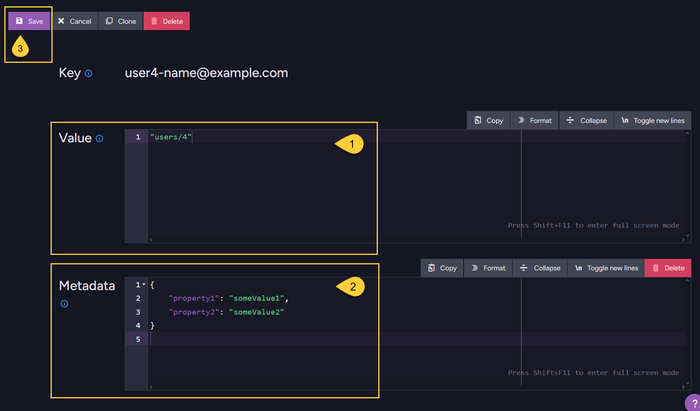

import Admonition from '@theme/Admonition';
import Tabs from '@theme/Tabs';
import TabItem from '@theme/TabItem';
import CodeBlock from '@theme/CodeBlock';

<Admonition type="note" title="">

* An existing compare-exchange item can be updated in the following ways:
  * Using a cluster-wide session
  * Using a store operation
  * Using the Studio

* In this article:  
  * [Update compare-exchange item using a **cluster-wide session**](../compare-exchange/update-cmpxchg-item#update-compare-exchange-item-using-a-cluster-wide-session)  
  * [Update compare-exchange item using a **store operation**](../compare-exchange/update-cmpxchg-item#update-compare-exchange-item-using-a-store-operation)  
  * [Update compare-exchange item using the **Studio**](../compare-exchange/update-cmpxchg-item#update-compare-exchange-item-using-the-studio)  
  * [Syntax](../compare-exchange/update-cmpxchg-item#syntax)   

</Admonition>

---

## Update compare-exchange item using a cluster-wide session

<Tabs groupId='languageSyntax'>
<TabItem value="Update_using_session" label="Update_using_session">
```csharp
// The session must be opened in cluster-wide mode.
const session = documentStore.openSession({
    transactionMode: "ClusterWide"
});

// Get the existing item from the server
// =====================================

const item = await session.advanced.clusterTransaction
    .getCompareExchangeValue("user1-name@example.com");

// The item is now tracked in the session's internal state
// Modify the value / metadata as needed
// =====================================

item.value = "users/99";
item.metadata["email-type"] = "work email";
item.metadata["updated-at"] = new Date().toISOString();

// Save changes for the update to take effect
// ==========================================

await session.saveChanges();

// A 'ClusterTransactionConcurrencyException' is thrown if the compare-exchange item
// no longer exists on the server at the time of calling saveChanges().
// This can happen if another client deletes or modifies the item before your update is saved.
```
</TabItem>
</Tabs>

---

## Update compare-exchange item using a Store operation
    
* Use `PutCompareExchangeValueOperation` to **update the _value_ and/or _metadata_** of an existing compare-exchange item.
  This operation is also used to create new compare-exchange items, see [Create compare-exchange item](../compare-exchange/create-cmpxchg-items).

* To perform an update, provide:
  * The existing key
  * A new value and/or metadata
  * The expected index (version) of the item, which must match the current version stored on the server.

* The update will succeed only if the index you provide matches the current index stored on the server for that key.
  This ensures that the item hasn’t been modified by another client since you last read it.

* If the index does not match, or if the specified key does not exist:
  * The item is not updated.
  * No exception is thrown.
  * The operation result has `Successful = false`.
  
* If the update is successful:
  * The value and/or metadata are updated.
  * The server increments the index number of the item.
  * The operation result has `Successful = true` and will contain the new value and new index.

<Tabs groupId='languageSyntax'>
<TabItem value="Update_operation" label="Update_operation">
```js
// Get the existing item from the server
// =====================================

const getCmpXchgOp = new GetCompareExchangeValueOperation("user1-name@example.com");
const item = await documentStore.operations.send(getCmpXchgOp);

// Modify the value / metadata as needed
// =====================================

const newValue = "users/99"; // Modify the value associated with the unique email key
const newMetadata = {
    "email-type": "work email",
    "updated-at": new Date().toISOString()  // Add entries / modify the metadata
};

// Update the item
// ===============

// The put operation will succeed only if the 'index' of the compare-exchange item
// has not changed between the read and write operations.
const putCmpXchgOp = new PutCompareExchangeValueOperation(item.key, newValue, item.index, newMetadata);
const putResult = await documentStore.operations.send(putCmpXchgOp);

// Check results
// =============

const successful = putResult.successful; // Has operation succeeded
const indexForItem = putResult.index;    // The new version number assigned if update succeeded
```
</TabItem>
</Tabs>

---

## Update compare-exchange item using the Studio

You can update any existing compare-exchange item from the Studio.


1. Go to **Documents > Compare Exchange**.
2. Click to edit a compare-exchange item.

---



1. Enter the value.
2. Enter the metadata (optional).
3. Click _Save_ to update the item.

---

## Syntax

**Method**:

<TabItem value="" label="">
```js
// Available overloads:
// ====================
const putCmpXchgOp = new PutCompareExchangeValueOperation(key, value, index);
const putCmpXchgOp = new PutCompareExchangeValueOperation(key, value, index, metadata);
```
</TabItem>

| Parameter    | Type     | Description                                                                                                             |
|--------------|----------|-------------------------------------------------------------------------------------------------------------------------|
| **key**      | `string` | The unique identifier in the database scope.                                                                            |
| **value**    | `object` | The value to be saved for the specified _key_.<br/>Can be any object (number, string, array, or any valid JSON object). |
| **index**    | `number` | The current version of the item when updating an existing item.<br/>Pass `0` to [create a new key](../compare-exchange/create-cmpxchg-items). |
| **metadata** | `object` | Metadata to be saved for the specified key.<br/>Must be a valid JSON object. |

**Returned object**:

<TabItem value="" label="">
```js
// Return value of store.operations.send(putCmpXchgOp)
// ===================================================
class CompareExchangeResult {
    successful;
    value;
    index;
}
```
</TabItem>

| Return Value  | Type   | Description                                                                                                                                       |
|---------------|--------|---------------------------------------------------------------------------------------------------------------------------------------------------|
| **Successful**| `bool` | <ul><li>_true_ if the put operation has completed successfully.</li><li>_false_ if the put operation failed.</li></ul>                            |
| **Value**     | `T`    | <ul><li>Upon success - the value of the compare-exchange item that was saved.</li><li>Upon failure - the existing value on the server.</li></ul>  |
| **Index**     | `long` | <ul><li>Upon success - the updated version (the incremented index of the modified item).</li><li>Upon failure (if indexes do not match) - the existing version from the server.</li></ul> |
