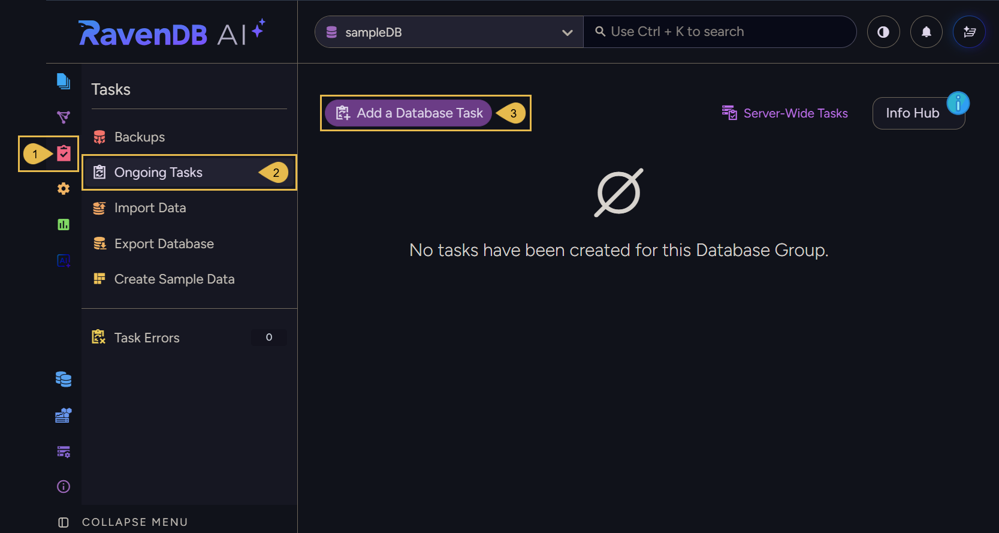
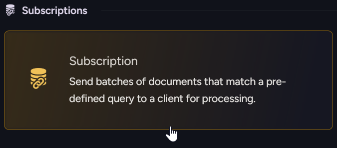
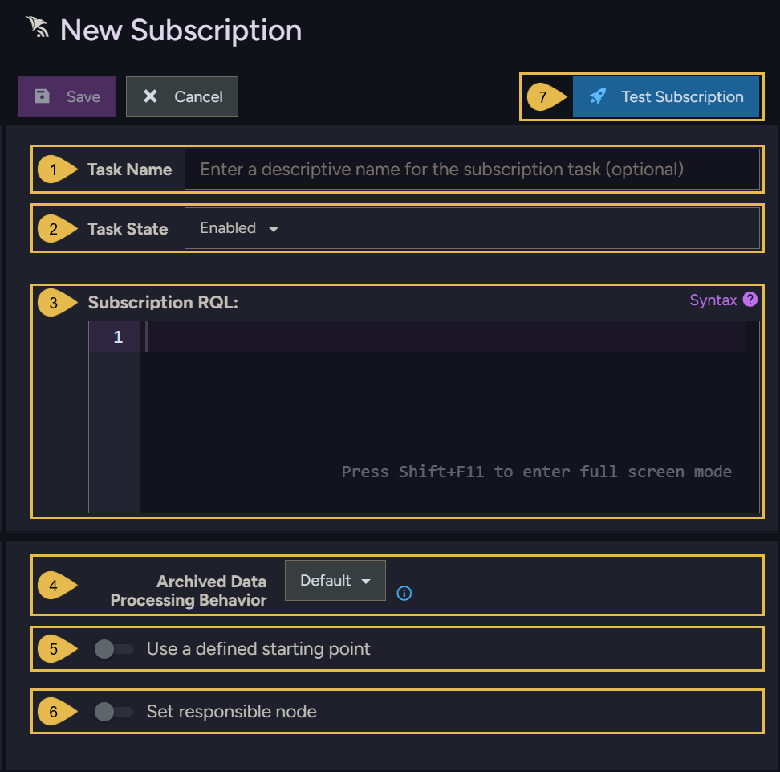
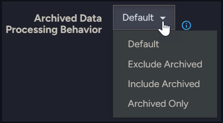
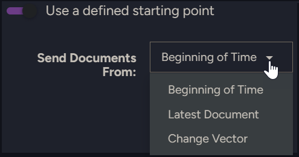
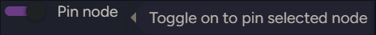
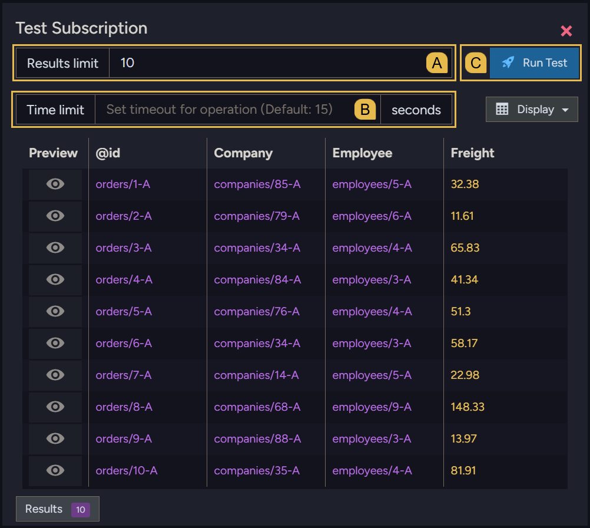

import Admonition from '@theme/Admonition';
import Panel from "@site/src/components/Panel";
import ContentFrame from "@site/src/components/ContentFrame";

# Creating a data subscription: Studio
<Admonition type="note" title="">

* This page explains how to create a data subscription using Studio.  
  You can also [create a subscription using the Client API](../../data-subscriptions/creating-subscription/creating-subscription_api.mdx).  

* In this article:
   * [Defining the subscription task](../../data-subscriptions/creating-subscription/creating-subscription_studio.mdx#defining-the-subscription-task)

</Admonition>

<Panel heading="Defining the subscription task">

<ContentFrame>

To create a subscription, open **`Tasks` > `Ongoing Tasks` > `Add a database task`** and select **Subscription**.  

1. Open the **Tasks** menu.
2. Select **Ongoing Tasks**.
3. Click **Add a database task** and select **Subscription**.
   

</ContentFrame>

<ContentFrame>

Enter a task name, then define the subscription:

1. **Task name**  
   Enter a name for the subscription task.  

2. **Task state**  
   Enable or disable the task.  

3. **Subscription RQL**  
   The RQL query that defines the documents the server sends to the worker.  
   e.g., `from Orders`  
   Click **Syntax** for help writing the query.  

4. **Archived data processing behavior**  
   
   Set how the subscription processes archived documents.  
   * **Default**: use the archived-data behavior [configured for the server or database](../../data-subscriptions/configuration.mdx#subscriptionsarchiveddataprocessingbehavior).  
   * **Exclude archived**: Only non-archived documents will be included in processing.  
   * **Include archived**: Both archived and non-archived documents will be included in processing.
   * **Archived only**: Only archived documents will be included in processing.  
  
5. **Use a defined starting point**  
   
   Set the point from which the server sends the first batch.  
   * **Beginning of Time** (default): the server sends every document matching the query, regardless of its creation time.  
   * **Latest Document**: start from the first document added after the subscription is created.  
   * **Change Vector**: start from a specified document change vector.  

6. **Set responsible node**  
   
   Toggle **Set responsible node** to choose the responsible node yourself.  
   By default, the server selects the responsible node. If that node goes down and your license includes
   [highly available tasks](../../server/clustering/distribution/highly-available-tasks.mdx), the server
   automatically reassigns the subscription to another node.  
    * When you select a responsible node manually, you can also **pin** it to the task. Pinning prevents
      another node from taking over if the responsible node goes down.  
      

7. **Test subscription**  
   
   Testing shows the documents that match the subscription's query, so you can verify it before saving the task.  
   * **A. Results limit** - The maximum number of documents to retrieve for the test.  
   * **B. Time limit** - The test run time, in seconds. Default: 15.  
   * **C. Run Test** - Click to run the test and preview the matching documents in the results table.  

Click **Save** to create the task, or **Cancel** to discard it.

</ContentFrame>
</Panel>
