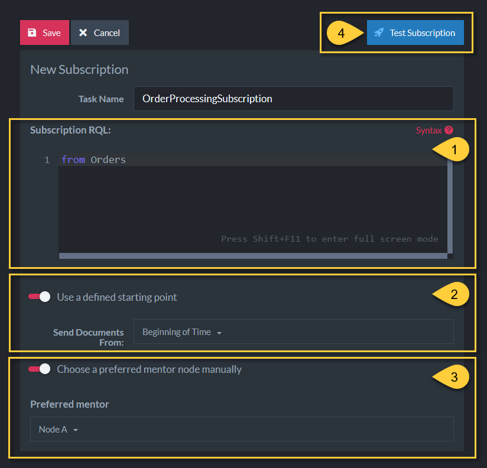
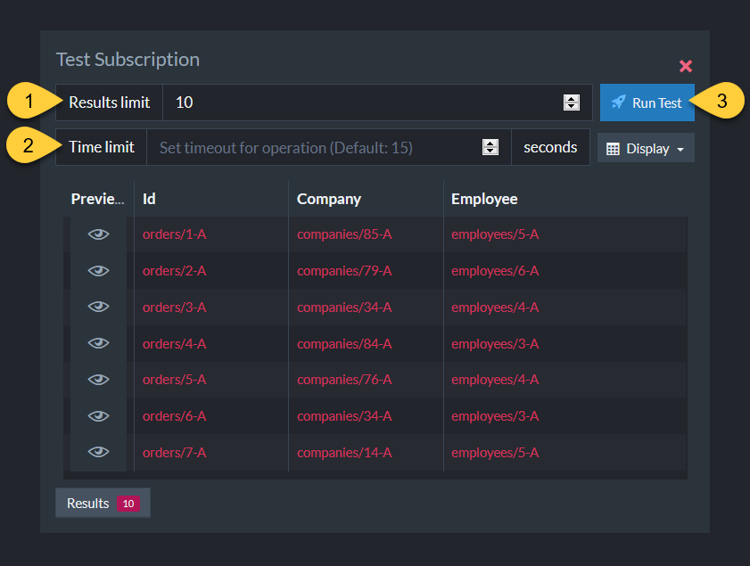

import Admonition from '@theme/Admonition';
import Panel from "@site/src/components/Panel";
import ContentFrame from "@site/src/components/ContentFrame";

# Creating a data subscription: Studio
<Admonition type="note" title="">

* This page explains how to create a data subscription task from Studio.  
  To create one using the Client API, see
  [Creating a data subscription: API](../../data-subscriptions/creating-subscription/creating-subscription_api.mdx).  

* In this article:
   * [Defining the subscription task](../../data-subscriptions/creating-subscription/creating-subscription_studio.mdx#defining-the-subscription-task)
   * [Testing the subscription](../../data-subscriptions/creating-subscription/creating-subscription_studio.mdx#testing-the-subscription)

</Admonition>

<Panel heading="Defining the subscription task">

To create a subscription task, open **`Tasks` > `Ongoing Tasks`**, add a new task, and choose
**Subscription**.  
Enter a task name, then define the subscription:

1. **Subscription RQL**  
   The RQL query that selects which documents the subscription sends to the client.  
   Click **Syntax** for query assistance.  

2. **Use a defined starting point**  
   Set the point from which the first batch is sent:  
   * **Beginning of Time** (default): send all documents matching the query, regardless of when
     they were created.  
   * **Latest Document**: start from the first document created after the subscription is created.  
   * **Change Vector**: start from a document change vector you specify.  

3. **Choose a preferred mentor node manually**  
   Select the node you want to be responsible for the subscription task.  

4. **Test Subscription**  
   Preview which documents match the query before saving. See
   [Testing the subscription](../../data-subscriptions/creating-subscription/creating-subscription_studio.mdx#testing-the-subscription) below.  

Click **Save** to create the task, or **Cancel** to discard it.

</Panel>

<Panel heading="Testing the subscription">

Testing shows which documents match the subscription query, so you can verify the query before
you save the task.

1. **Results limit**  
   The maximum number of documents to retrieve for the test.  

2. **Time limit**  
   How long, in seconds, the test runs before stopping automatically. Default: 15.  

3. **Run Test**  
   Run the test and preview the matching documents in the results table.  

</Panel>
