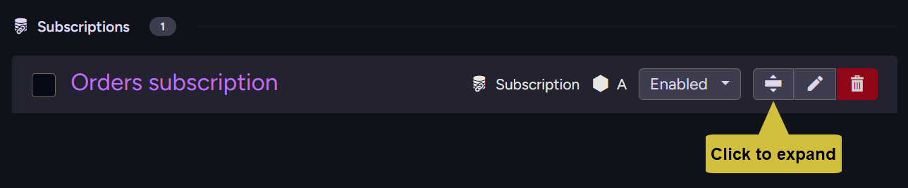
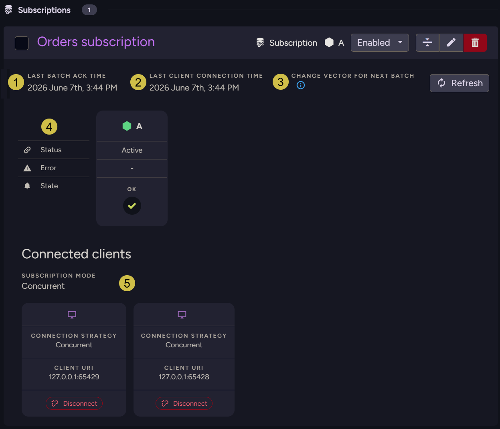
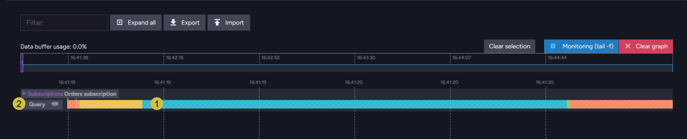
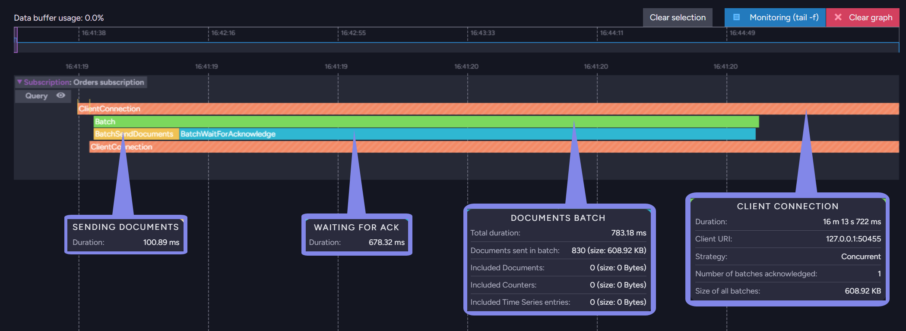

import Admonition from '@theme/Admonition';
import Panel from "@site/src/components/Panel";
import ContentFrame from "@site/src/components/ContentFrame";

# Monitoring a data subscription

<Admonition type="note" title="">

* This page explains how to monitor a running data subscription using Studio.  

* The Ongoing Tasks view shows a subscription's current status, its progress, and the clients
  currently connected to it.  

* The Ongoing Task Stats graph tracks a subscription's activity over time, from each client
  connection down to the individual batches and the time spent on each.  

* In this article:
   * [Subscription details](../data-subscriptions/monitoring.mdx#subscription-details)
   * [Subscription performance](../data-subscriptions/monitoring.mdx#subscription-performance)

</Admonition>

<Panel heading="Subscription details">

<ContentFrame>

Open **`Tasks` > `Ongoing Tasks`**, where subscription tasks are listed under **Subscriptions**.  
Expand a subscription bar to view its current status and connected clients.

</ContentFrame>

<ContentFrame>

### Status and connected clients

1. **Last batch acknowledgment time**  
   The last time a worker acknowledged a batch.  

2. **Last client connection time**  
   The last time a worker connected to the subscription.  

3. **Change vector for next batch**  
   The point from which the server sends the next batch. Hover the info icon for the value.  

4. **Status**  
   The responsible node, the connection status (**Active** while a worker is connected, otherwise
   not active), any error, and the task's overall state.  

5. **Connected clients**  
   The workers currently consuming the subscription.  
   The **subscription mode** is shown (here **Concurrent**), and each connected worker is listed with
   its connection strategy and client URI. Click **Disconnect** to drop an individual worker.  

For the API equivalents of disconnecting, see
[Dropping a worker](../data-subscriptions/concurrent-subscriptions.mdx#dropping-a-worker)
and [Dropping a connection](../data-subscriptions/maintenance-operations.mdx#dropping-a-connection).  

</ContentFrame>

</Panel>

<Panel heading="Subscription performance">

<ContentFrame>

Open **`Stats` > `Ongoing Task Stats`**, where a bar on the performance timeline shows the
subscription's activity.

1. **Subscription bar**  
   The subscription's bar on the performance timeline. Click it to open the breakdown below.  

2. **Query**  
   The server-side query that selects the documents. Click the eye icon to view it.  

</ContentFrame>

<ContentFrame>

Expanding the bar breaks each client connection into the batches it processed and the time spent
in each phase. Hover any bar for its metrics:

* **Client connection**  
  The worker's entire connection: duration, client URI, strategy, number of batches acknowledged,
  and the total size of all batches.  

* **Documents batch**  
  A single batch the server sent: total duration, the number and size of documents sent, and the
  number and size of any included documents, counters, and time-series entries.  

* **Sending documents**  
  Within a batch, the time the server spent sending the documents to the worker.  

* **Waiting for ACK**  
  Within a batch, the time spent waiting for the worker to acknowledge the batch.  

</ContentFrame>

</Panel>
