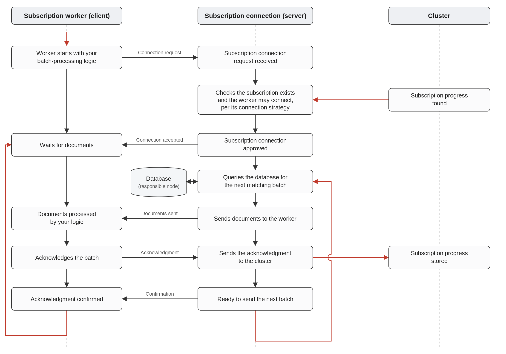

import Admonition from '@theme/Admonition';
import CodeBlock from '@theme/CodeBlock';
import Panel from "@site/src/components/Panel";
import ContentFrame from "@site/src/components/ContentFrame";

# Data subscriptions: Overview

<Admonition type="note" title="">

* A data subscription is a server-side task that selects documents by a defined query. The server
  sends the selected documents in batches to consuming clients (**workers**) for processing.  

* The server sends a batch, the worker processes and acknowledges it, and only then does the
  server send the next batch.  

* The server keeps track of the batches the worker has acknowledged, so a worker that stops and
  reconnects to the subscription continues after the last acknowledged batch instead of starting
  over.  

* In this article:
   * [What is a data subscription](../data-subscriptions/overview.mdx#what-is-a-data-subscription)
   * [How documents are processed](../data-subscriptions/overview.mdx#how-documents-are-processed)
      * [Processing order and re-sending](../data-subscriptions/overview.mdx#processing-order-and-re-sending)
      * [Progress persistence and failover](../data-subscriptions/overview.mdx#progress-persistence-and-failover)
   * [How the worker communicates with the server](../data-subscriptions/overview.mdx#how-the-worker-communicates-with-the-server)
   * [What the worker receives](../data-subscriptions/overview.mdx#what-the-worker-receives)
   * [Consuming and managing the subscription](../data-subscriptions/overview.mdx#consuming-and-managing-the-subscription)
   * [Security considerations](../data-subscriptions/overview.mdx#security-considerations)
   * [Usage example](../data-subscriptions/overview.mdx#usage-example)

</Admonition>

<Panel heading="What is a data subscription">

A data subscription is an ongoing task that runs on the server and selects documents for clients to
process. The subscription's query defines the documents the server sends to the worker. You can
shape the query to filter the documents, project specific fields, and include related data.  

A client consumes the subscription using a **worker**. The worker connects to the subscription,
receives a batch of documents, and runs your processing code over the batch. Processing can take
anywhere from seconds to hours, depending on your code. When the worker finishes processing a batch,
it acknowledges the batch to the server, and the server then sends the next batch to the worker.  

Two definitions shape every subscription:

* **The subscription definition**, set when the subscription is created, determines the documents
  the server sends to the worker and their shape.  
* **The worker options**, set when a worker connects to the subscription, determine the batch
  size, the processing logic, and how the worker interacts with other workers of the same
  subscription.  

To get started, create a data subscription using the
[Client API](../data-subscriptions/creating-subscription/creating-subscription_api.mdx) or
[Studio](../data-subscriptions/creating-subscription/creating-subscription_studio.mdx), and
[consume it using a worker](../data-subscriptions/consuming-subscription.mdx).  

</Panel>

<Panel heading="How documents are processed">

<ContentFrame>

### Processing order and re-sending

The server sends documents to the worker in batches, ordered by each document's [Etag](../glossary/etag.mdx),
which reflects the order in which the documents were last modified. The server persists the progress
only after the worker has processed and acknowledged the whole batch.  

Because the server sends documents in Etag order, a document the worker has already acknowledged is
not sent again, except in these cases:

* The document was modified after the server sent it.  
* The document belongs to a batch the worker received but did not acknowledge.  
* The subscription was reassigned to another node, for example after a node failure. The new node
  cannot always locate the exact same starting point, so some documents may be processed again.  

<Admonition type="note" title="">
Plan for at-least-once delivery. Make your processing idempotent, so reprocessing a document that
the server sends again has no unintended effect.
</Admonition>

</ContentFrame>

---

<ContentFrame>

### Progress persistence and failover

The server persists each subscription's progress. This lets a subscription pause and resume, avoid
missing documents, and continue on another node after a failure:

* Because the progress is stored on the server, you can pause the subscription and later resume it
  from the last acknowledged point.  
* No documents are missed even when a failure occurs, whether on the client, in the connection, or
  elsewhere.  
* The progress is stored at the cluster level, so it is available on all database nodes. If the
  responsible node goes down, the subscription can continue on another node.  

The server uses **change vectors** to track progress, so when a subscription fails over to another
node, processing resumes close to the last acknowledged point rather than starting over.  

</ContentFrame>

</Panel>

<Panel heading="How the worker communicates with the server">

A worker communicates with its subscription over a long-lived TCP connection, using a dedicated
protocol. Each successful batch goes through these stages:

1. The server sends a batch of documents to the worker.  
2. The worker processes the batch and sends an acknowledgment to the server.  
3. The server persists the acknowledgment and notifies the worker that it is ready to send the next
   batch.  

The server also uses the connection to tell whether a worker is active. The connection is kept alive
and monitored with heartbeat messages. If the connection breaks, processing of the current batch
restarts.  

The diagram below traces the full lifecycle of a subscription connection, from the worker's
connection request through the processing and acknowledgment of each batch:



<Admonition type="note" title="">
When the node responsible for the subscription goes down, the subscription can continue on another
node. If your license includes [Highly Available Tasks](../server/clustering/distribution/highly-available-tasks.mdx),
the cluster reassigns the subscription to another node automatically. Otherwise, the subscription
resumes on its original node once that node is back online.
</Admonition>

</Panel>

<Panel heading="What the worker receives">

You can set these options while creating a subscription:  

* **Filtering**  
  Send to the worker only the documents that match a condition, for example only orders shipped to a
  specific country.  
  [Filtering documents](../data-subscriptions/creating-subscription/creating-subscription_api.mdx#example-filtering-documents)  

* **Projections**  
  Send to the worker only selected fields, or computed values, instead of the full document.  
  [Projecting fields](../data-subscriptions/creating-subscription/creating-subscription_api.mdx#example-filtering-and-projecting-fields)  
  [Projecting from a related document](../data-subscriptions/creating-subscription/creating-subscription_api.mdx#example-projecting-from-a-related-document)  

* **Includes**  
  Include related documents or counters alongside each item, so the worker has them without
  issuing additional requests to the server.  
  [Including documents](../data-subscriptions/creating-subscription/creating-subscription_api.mdx#example-including-documents)  
  [Including counters](../data-subscriptions/creating-subscription/creating-subscription_api.mdx#example-including-counters)  

* **Revisions**  
  Process consecutive pairs of document revisions instead of current documents, so the worker can
  act on what changed between versions.  
  [Revisions support](../data-subscriptions/revisions-support.mdx)  

</Panel>

<Panel heading="Consuming and managing the subscription">

These options and operations control how a subscription is consumed and managed:  

* **Worker strategies**  
  Control how a worker connects to a subscription that another worker is already consuming: connect
  only if free, take over from the current worker, or wait for the current worker to disconnect.  
  [Worker strategies](../data-subscriptions/consuming-subscription.mdx#worker-strategies)  

* **Concurrent subscriptions**  
  Let multiple workers consume the same subscription at once and divide the processing load between
  them to speed it up.  
  [Concurrent subscriptions](../data-subscriptions/concurrent-subscriptions.mdx)  

* **Maintenance operations**  
  You can list, update, enable, disable, and delete subscriptions, and drop their active
  connections.  
  [Maintenance operations](../data-subscriptions/maintenance-operations.mdx)  

* **Monitoring**  
  Watch a running subscription's status, connected clients, and performance in Studio.  
  [Monitoring](../data-subscriptions/monitoring.mdx)  

* **Configuration**  
  Set server-wide or per-database defaults, such as how archived documents are handled and the
  maximum number of concurrent connections per subscription.  
  [Configuration](../data-subscriptions/configuration.mdx)  

</Panel>

<Panel heading="Security considerations">

Two things shape a subscription's security: who is allowed to manage and consume it, and what its
query exposes to a consumer.

* **Access control**  
  Unlike most ongoing tasks, which require database admin clearance to manage, a data subscription
  can be created, updated, and deleted by any client with
  [Read/Write access](../server/security/authorization/security-clearance-and-permissions.mdx#readwrite)
  to the database, and consumed by any client with
  [Read Only access](../server/security/authorization/security-clearance-and-permissions.mdx#read-only).
  There is no permission specific to the subscription itself.  

* **Connection security**  
  On a secure server, a worker authenticates with a
  [client certificate](../server/security/authentication/client-certificate-usage.mdx), and its
  connection to the server is encrypted like any other client connection.  

* **Data exposure**  
  Because a subscription's filter, projection, and includes run on the server, a consumer receives
  whatever the query exposes: not only the matching documents but also any related documents and
  counters the query loads alongside them. Define the query to expose only the data its consumers
  are meant to see.  

</Panel>

<Panel heading="Usage example">

The following example creates a subscription for a specific company's orders, then runs a worker
that processes the documents the server sends.

```csharp
public async Task ConsumeSubscription(IDocumentStore store, CancellationToken cancellationToken)
{
    // Create the subscription task on the server.
    // The server will send every Order placed by company "companies/11".
    string subscriptionName = await store.Subscriptions
        .CreateAsync<Order>(order => order.Company == "companies/11");

    // Create a worker on the client to consume the subscription
    SubscriptionWorker<Order> worker =
        store.Subscriptions.GetSubscriptionWorker<Order>(subscriptionName);

    // Run the worker and process each batch the server sends
    await worker.Run(batch =>
    {
        foreach (var item in batch.Items)
        {
            Console.WriteLine($"Order {item.Result.Id} will be shipped via {item.Result.ShipVia}");
        }
    }, cancellationToken);
}
```

</Panel>
