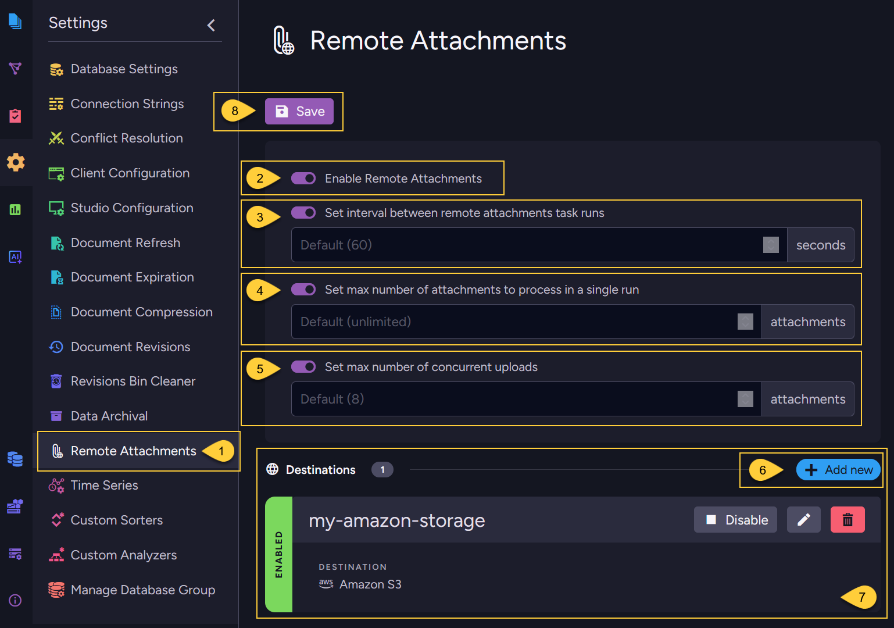
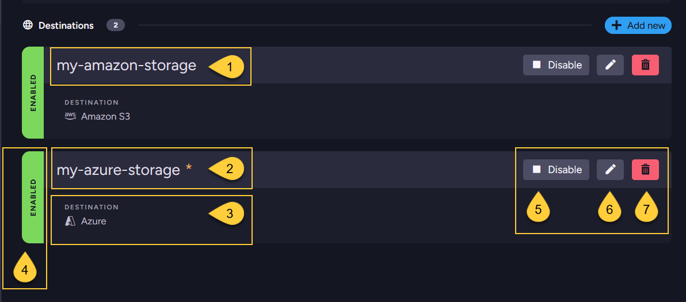
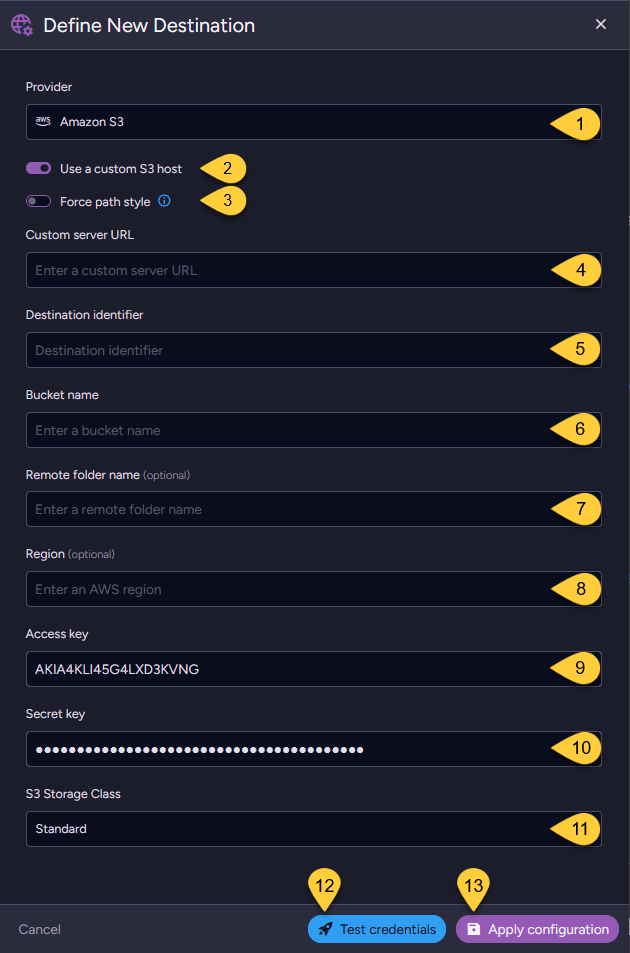
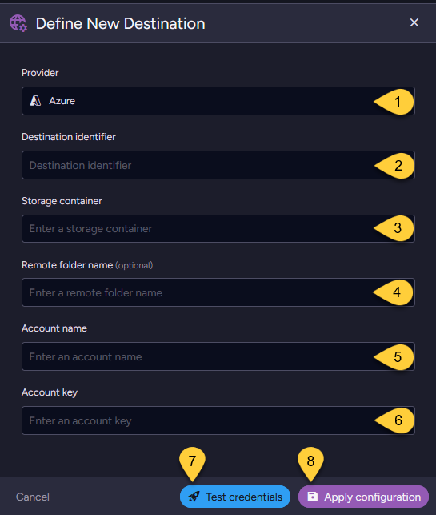

import Admonition from '@theme/Admonition';
import Tabs from '@theme/Tabs';
import TabItem from '@theme/TabItem';
import CodeBlock from '@theme/CodeBlock';
import ContentFrame from '@site/src/components/ContentFrame';
import Panel from '@site/src/components/Panel';

<Admonition type="note" title="">

* Storing attachments in a remote storage destination is an optional feature that helps reduce the amount of data stored on the local disk
  by moving the attachments content to external storage of your choice.
    
* To store an attachment in a remote storage destination, you must:  
    * Enable the feature.
    * Configure the remote destinations.  
      (Currently, Azure Blob Storage and Amazon S3 or any S3-compatible storage service are supported).
    * Mark the attachment for remote storage, either when [storing](../../document-extensions/attachments/store-attachments/store-attachments-remote)
      it or later using a [patch](../../document-extensions/attachments/store-attachments/store-attachments-remote#schedule-existing-attachments-for-remote-upload) operation.

* When the Remote Attachments feature is enabled:  
  * RavenDB runs a **background task** that periodically scans the database for attachments marked for remote upload.  
    If the upload time for an attachment has passed when the task runs,  
    the task sends the attachment to the configured remote storage destinations.  
  * Uploading attachments to remote storage runs in the background and does not block other client operations. 
    
* In this article:  
    * [Configuring remote attachments settings - from the Studio](../../document-extensions/attachments/configure-remote-attachments#configuring-remote-attachments-settings-from-the-studio)
    * [Configuring remote attachments settings - using the Client API](../../document-extensions/attachments/configure-remote-attachments#configuring-remote-attachments-settings-using-the-client-api)
      * [Configure remote attachments settings](../../document-extensions/attachments/configure-remote-attachments#configure-remote-attachments-settings)
      * [Get remote attachments settings](../../document-extensions/attachments/configure-remote-attachments#get-remote-attachments-settings)
    * [Syntax](../../document-extensions/attachments/configure-remote-attachments#syntax)
    
</Admonition>  

<Panel heading="Configuring remote attachments settings - from the Studio">

### Remote attachments settings  
    
  

1. Go to **"Settings > Remote Attachments"**  
    
2. **Enable remote attachments**  
   Toggle ON to enable storing attachments in a remote storage destination.  
    
3. **Set interval between remote attachments task runs**  
   Toggle ON to specify the delay (in seconds) between background task runs after the task completes the upload of attachments from the previous batch.  
   Default: `60` seconds.  
    
4. **Set max number of attachments to process in a single run**  
   Toggle ON to specify the maximum number of attachments processed in a single background task run.  
   Default: `unlimited`. 
    
5. **Set max number of concurrent uploads**  
    Toggle ON to define the maximum number of attachments that can be uploaded to remote storage concurrently.  
    Default: `8` attachments. 
    
6. **Add new**  
    Click the _Add New_ button to define a new remote storage destination.  
    
7. **Destinations**  
   All defined destinations will be listed in this section.
   There is no limit to the number of destinations you can define.

8. **Save**  
   Click the _Save_ button to save all your changes and apply the configuration.

---

### Destinations    
   
  
 
1. **Destination Identifier**  
    The unique identifier string (_case-insensitive_) that you have assigned to this remote storage destination.  
2. **Unsaved Changes (yellow star)**  
    A yellow star next to the destination's identifier indicates unsaved changes in its configuration.  
3. **Remote Storage**  
   The remote storage provider configured for this destination.  
4. **Destination Status**  
     When set to _Disabled_, the destination is ignored by the background task,  
     and no attachments are uploaded to it, even if their scheduled upload time has passed.  
5. **Enable/Disable**  
    Click to toggle the destination's status between _Enabled_ and _Disabled_.  
6. **Edit**  
   Click to modify the configuration settings of this destination.  
7. **Delete**  
   Click to remove this destination from the configuration list.  

---

### Define destination - Amazon S3 storage
    
  

1. **Provider**   
   Select **Amazon S3** as the remote storage provider. 
2. **Use a custom S3 host**  
   Toggle ON to specify a custom S3-compatible host other than Amazon's official service.  
3. **Force path style**  
   Toggle ON if your custom S3 host requires path-style access instead of virtual-hosted-style URLs.  
    For example: `https://{Server-URL}/{Bucket-Name}` instead of `https://{Bucket-Name}.{Server-URL}`.  
4. **Custom server URL**    
   Enter the URL of the custom S3-compatible server (only required if using a custom S3 host).  
   The URL should include the protocol (`http://` or `https://`) and may include a port number.
5. **Destination identifier**  
   Enter a unique custom identifier (_case-insensitive_) for this Amazon S3 destination.  
   The background task will use this identifier to reference this destination configuration. 
6. **Bucket name**  
   Specify the name of the S3 bucket where attachments will be stored.  
   Bucket names must follow AWS S3 naming rules:  
     * Must be globally unique across all AWS accounts.
     * Must be between 3 and 63 characters long.
     * Must consist only of lowercase letters, numbers, dots, and hyphens.
     * Must begin and end with a letter or number.
7. **Remote folder name** (optional)  
   Define a folder within the bucket to organize uploaded attachments.  
   Leave blank to use the root of the bucket.
8. **Region** (optional)  
   Specify the AWS region where the S3 bucket is located (e.g., `us-east-1`).
9. **Access key**  
   Provide the AWS access key ID for this S3 bucket. 
10. **Secret key**  
    Provide the corresponding AWS secret key for this S3 bucket.  
11. **Storage class**  
    Choose an Amazon S3 storage class based on how often you access your data and its retention requirements.  
    For available options, see [S3StorageClass](../../document-extensions/attachments/configure-remote-attachments#s3storageclass). Default: `STANDARD`.
12. **Test credentials**  
    Click this option to verify whether the connection to the S3 storage works successfully. 
13. **Apply configuration**    
    Click to add this destination to the destination list.  
    Note: Remember to click the _Save_ button to save all changes.  

---

### Define destination - Azure storage
    
    

1. **Provider**  
   Select **Azure** as the remote storage provider.  
2. **Destination identifier**  
   Enter a unique custom identifier (_case-insensitive_) for this Azure destination.  
   The background task will use this identifier to reference this destination configuration. 
3. **Storage container**  
   Specify the name of the Azure Storage container where attachments will be stored.
4. **Remote folder name** (optional)  
   Define a folder within the storage container to organize uploaded attachments.  
   Leave blank to use the root of the container.  
5. **Account name**  
   Enter the Azure Storage account name.  
6. **Account key**  
   Provide the corresponding access key for the Azure Storage account.  
7. **Test credentials**  
   Click to verify whether the connection to the Azure storage works successfully.  
8. **Apply configuration**  
   Click to add this destination to the destination list.  
   Note: remember to click the _Save_ button to save all changes.  
    
</Panel>

<Panel heading="Configuring remote attachments settings - using the Client API">
    
### Configure remote attachments settings
    
* Use the `ConfigureRemoteAttachmentsOperation` to configure remote attachment settings.  

* You can add multiple destinations as needed.  
  Ensure that each destination has a unique identifier for accurate reference.  

* Note:  
  Configuring remote attachment settings will **override** any existing configurations on the server.  
  If you need to add new destinations without losing existing ones,  
  make sure to [Get the current remote attachmets settings](../../document-extensions/attachments/configure-remote-attachments#get-remote-attachments-settings) first, 
  update it, and then send it back to the server.  

* The following example demonstrates how to configure both Amazon S3 and Azure destinations:
    
<Tabs groupId='languageSyntax'>
<TabItem value="Sync" label="Sync">
```csharp
// Define remote storage settings:
// ===============================

// Provide all necessary credentials and configuration for accessing your AMAZON S3 storage
var s3Settings = new RemoteAttachmentsS3Settings
{
    BucketName = "your-bucket-name",         
    AwsAccessKey = "your-amazon-access-key", 
    AwsSecretKey = "your-amazon-secret-key", 
    AwsRegionName = "your-region-name"   // For example, "us-east-1" 
    RemoteFolderName = "your-s3-folder", // Optional
};

// Provide the necessary details for your AZURE Storage container
var azureSettings = new RemoteAttachmentsAzureSettings
{
    StorageContainer = "your-azure-container-name",
    AccountName = "your-azure-account-name",
    AccountKey = "your-azure-account-key",
    RemoteFolderName = "your-azure-folder" // Optional
};
 
// Define the remote attachments configuration:
// ============================================
    
var configuration = new RemoteAttachmentsConfiguration
{
    // Add the remote storage destinations to the configuration
    Destinations = new Dictionary<string, RemoteAttachmentsDestinationConfiguration>
    {
        {
             // Provide a custom identifier for this remote destination (case-insensitive)
            "my-amazon-storage",
    
            new RemoteAttachmentsDestinationConfiguration
            {
                S3Settings = s3Settings, // The Amazon S3 settings
                Disabled = false         // Set to 'true' to disable this destination only
            }
        },
        {
             // Provide a custom identifier for this remote destination
            "my-azure-storage",
    
            new RemoteAttachmentsDestinationConfiguration
            {
                AzureSettings = azureSettings, // The Azure Storage settings
                Disabled = false               // Set to 'true' to disable this destination only
            }
        }
    },

    // OPTIONAL settings to control the remote attachments feature and its background task:
    
    // Set to 'true' to disable the entire remote attachments feature
    Disabled = false,          
    // The time interval (in seconds) between background task runs
    CheckFrequencyInSec = 600,
    // The maximum number of attachments processed in a single background task run
    MaxItemsToProcess = 25,
    // The maximum number of attachments that can be uploaded to remote storage concurrently
    ConcurrentUploads = 6
};

// Apply the remote attachments configuration to the server:
// =========================================================
    
// This operation will override any existing remote attachment configurations on the server.
// Ensure all necessary destinations and settings are included in this configuration.
store.Maintenance.Send(new ConfigureRemoteAttachmentsOperation(configuration));
```
</TabItem>
<TabItem value="Async" label="Async">
```csharp
// Define remote storage settings:
// ===============================

// Provide all necessary credentials and configuration for accessing your AMAZON S3 storage
var s3Settings = new RemoteAttachmentsS3Settings
{
    BucketName = "your-bucket-name",         
    AwsAccessKey = "your-amazon-access-key", 
    AwsSecretKey = "your-amazon-secret-key", 
    AwsRegionName = "your-region-name"   // For example, "us-east-1" 
    RemoteFolderName = "your-s3-folder", // Optional
};
    
// Provide the necessary details for your AZURE Storage container
var azureSettings = new RemoteAttachmentsAzureSettings
{
    StorageContainer = "your-azure-container-name",
    AccountName = "your-azure-account-name",
    AccountKey = "your-azure-account-key",
    RemoteFolderName = "your-azure-folder" // Optional
};
    
// Define the remote attachments configuration:
// ============================================
    
var configuration = new RemoteAttachmentsConfiguration
{
    // Add the remote storage destinations to the configuration
    Destinations = new Dictionary<string, RemoteAttachmentsDestinationConfiguration>
    {
        {
             // Provide a custom identifier for this remote destination (case-insensitive)
            "my-amazon-storage",
    
            new RemoteAttachmentsDestinationConfiguration
            {
                S3Settings = s3Settings, // The Amazon S3 settings
                Disabled = false         // Set to 'true' to disable this destination only
            }
        },
        {
             // Provide a custom identifier for this remote destination
            "my-azure-storage",
    
            new RemoteAttachmentsDestinationConfiguration
            {
                AzureSettings = azureSettings, // The Azure Storage settings
                Disabled = false               // Set to 'true' to disable this destination only
            }
        }
    },

    // OPTIONAL settings to control the remote attachments feature and its background task:
    
    // Set to 'true' to disable the entire remote attachments feature
    Disabled = false,          
    // The time interval (in seconds) between background task runs
    CheckFrequencyInSec = 600,
    // The maximum number of attachments processed in a single background task run
    MaxItemsToProcess = 25,
    // The maximum number of attachments that can be uploaded to remote storage concurrently
    ConcurrentUploads = 6
};

// Apply the remote attachments configuration to the server:
// =========================================================
    
// This operation will override any existing remote attachment configurations on the server.
// Ensure all necessary destinations and settings are included in this configuration.
await store.Maintenance.SendAsync(new ConfigureRemoteAttachmentsOperation(configuration));
```
</TabItem>
</Tabs>
    
---
    
### Get remote attachments settings

Use the `GetRemoteAttachmentsConfigurationOperation` to retrieve the current remote attachment settings.
    
<Tabs groupId='languageSyntax'>
<TabItem value="Sync" label="Sync">
```csharp
// Get the current remote attachments settings
var configuration = store.Maintenance.Send(
    new GetRemoteAttachmentsConfigurationOperation());

// Display current settings
if (configuration != null)
{
    Console.WriteLine(
        $"Time interval between task runs: {configuration.CheckFrequencyInSec} seconds");
    Console.WriteLine(
        $"Concurrent Uploads: {configuration.ConcurrentUploads}");
    
    foreach (var destination in configuration.Destinations)
    {
        Console.WriteLine($"Destination ID: {destination.Key}");
    
        if (destination.Value.S3Settings != null)
        {
            Console.WriteLine(
                $"S3 Bucket: {destination.Value.S3Settings.BucketName}");
        }
        if (destination.Value.AzureSettings != null)
        {
            Console.WriteLine(
                $"Azure Container: {destination.Value.AzureSettings.StorageContainer}");
        }
    }
}
else
{
    Console.WriteLine("No remote attachments configuration found.");
}
```
</TabItem>
<TabItem value="Async" label="Async">
```csharp
// Get the current remote attachments settings asynchronously
var configuration = await store.Maintenance.SendAsync(
    new GetRemoteAttachmentsConfigurationOperation());

// Display current settings
if (configuration != null)
{
    Console.WriteLine(
        $"Time interval between task runs: {configuration.CheckFrequencyInSec} seconds");
    Console.WriteLine(
        $"Concurrent Uploads: {configuration.ConcurrentUploads}");
    
    foreach (var destination in configuration.Destinations)
    {
        Console.WriteLine($"Destination ID: {destination.Key}");
    
        if (destination.Value.S3Settings != null)
        {
            Console.WriteLine(
                $"S3 Bucket: {destination.Value.S3Settings.BucketName}");
        }
        if (destination.Value.AzureSettings != null)
        {
            Console.WriteLine(
                $"Azure Container: {destination.Value.AzureSettings.StorageContainer}");
        }
    }
}
else
{
    Console.WriteLine("No remote attachments configuration found.");
}
```
</TabItem>
</Tabs>
    
</Panel>

<Panel heading="Syntax">

### `ConfigureRemoteAttachmentsOperation`  

<TabItem value="" label="">
```csharp
// Configure the remote attachments settings using a store operation 
public ConfigureRemoteAttachmentsOperation(RemoteAttachmentsConfiguration configuration)
```
</TabItem>

### `GetRemoteAttachmentsConfigurationOperation`  

<TabItem value="" label="">
```csharp
// Get the current remote attachments settings using a store operation 
public GetRemoteAttachmentsConfigurationOperation
```
</TabItem>

| Parameter         | Type                             | Description                                 |
|-------------------|----------------------------------|---------------------------------------------|
| **configuration** | `RemoteAttachmentsConfiguration` | The remote attachments configuration class. |
    
---     
    
#### `RemoteAttachmentsConfiguration`
    
<TabItem value="" label="">
```csharp
public class RemoteAttachmentsConfiguration
{
    // A dictionary of remote storage destinations, where each key is the destination identifier 
    public Dictionary<string, RemoteAttachmentsDestinationConfiguration> Destinations { get; set; }
    
    // The time interval (in seconds) between background task runs
    // Default: 60 seconds
    public long? CheckFrequencyInSec { get; set; }
    
    // The maximum number of attachments processed in a single background task run
    // Default: int.MaxValue (unlimited)
    public long? MaxItemsToProcess { get; set; }
    
    // The maximum number of attachments that can be uploaded to remote storage concurrently
    // Default: 8 attachments
    public int? ConcurrentUploads { get; set; }
    
    // Set to 'true' to disable the entire remote attachments feature
    // Default: false
    public bool Disabled { get; set; }
}
```
</TabItem>
    
#### `RemoteAttachmentsDestinationConfiguration`
    
<TabItem value="" label="">
```csharp
public class RemoteAttachmentsDestinationConfiguration
{
    // Set to 'true' to disable this destination only
    public bool Disabled { get; set; }
    
    // Amazon S3 settings for the remote storage destination
    public RemoteAttachmentsS3Settings S3Settings { get; set; }
    
    // Azure Blob Storage settings for the remote storage destination
    public RemoteAttachmentsAzureSettings AzureSettings { get; set; }
}
```
</TabItem>
    
#### `RemoteAttachmentsS3Settings`
    
<TabItem value="" label="">
```csharp
public class RemoteAttachmentsS3Settings
{
    public string AwsAccessKey { get; set; }
    public string AwsSecretKey { get; set; }
    public string AwsSessionToken { get; set; }
    public string AwsRegionName { get; set; }
    public string BucketName { get; set; }
    public string RemoteFolderName { get; set; }
    public string CustomServerUrl { get; set; }
    public bool ForcePathStyle { get; set; }
    public S3StorageClass? StorageClass { get; set; }
}
```
</TabItem>
    
#### `RemoteAttachmentsAzureSettings`
    
<TabItem value="" label="">
```csharp
public class RemoteAttachmentsAzureSettings
{
    public string StorageContainer { get; set; }
    public string RemoteFolderName { get; set; }
    public string AccountName { get; set; }
    public string AccountKey { get; set; }
    public string SasToken { get; set; }
}
```
</TabItem>
    
#### `S3StorageClass`
    
<TabItem value="" label="">
```csharp
public class S3StorageClass
{
    // Default class for frequently accessed data with high durability and low latency. 
    public string Standard { get; set; }
    
    For infrequently accessed, long-lived data; cheaper storage, retrieval fees apply.  
    public string StandardInfrequentAccess { get; set; }
    
    // Similar to Standard-IA but stored in one availability zone; 
    // less resilient to failures but more cost-efficient.  
    public string OneZoneInfrequentAccess { get; set; }
    
    // Automatically optimizes costs by moving data between access tiers.  
    public string IntelligentTiering { get; set; }
    
    // Low-cost storage for archives; fast retrieval with retrieval fees. 
    public string GlacierInstantRetrieval { get; set; }
    
    // Cheaper archival class; retrieval takes minutes to hours, 
    // suitable for data that doesn’t need immediate access. 
    public string Glacier { get; set; }
    
    // Lowest-cost storage for rarely accessed data; retrieval may take hours.  
    public string DeepArchive { get; set; }
    
    // Cheaper storage with lower durability, suitable for non-critical data.
    public string ReducedRedundancy { get; set; }
    
    // Faster access to objects stored in only one availability zone.
    public string ExpressOneZone { get; set; }
}
```
</TabItem>
    
</Panel>