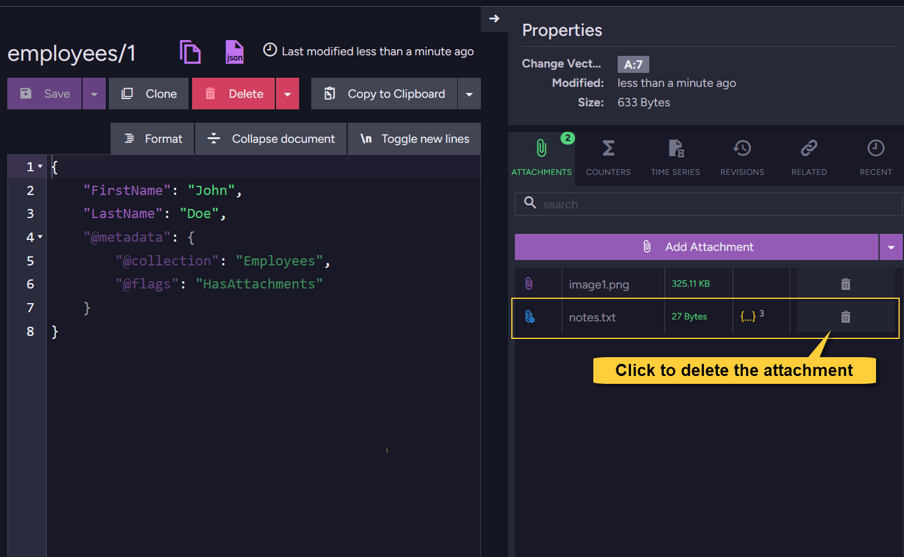

import Admonition from '@theme/Admonition';
import Tabs from '@theme/Tabs';
import TabItem from '@theme/TabItem';
import CodeBlock from '@theme/CodeBlock';
import ContentFrame from '@site/src/components/ContentFrame';
import Panel from '@site/src/components/Panel';

<Admonition type="note" title="">

* This article explains how to delete attachments from documents in RavenDB.    

* **Deleting a LOCAL attachment**:  
  * The reference to the attachment is removed from the document’s metadata.  
  * The binary content is deleted from local storage only if no other documents in the database reference the exact same content.

* **Deleting a REMOTE attachment**:   
  * Only the reference to the remote attachment is removed from the document’s metadata.  
  * RavenDB does not delete the binary data from the remote storage.  
    It is your responsibility to remove the file from the cloud provider manually.  

* **When deleting a DOCUMENT**:  
  * All local attachments referenced by the document are also deleted,  
    (as long as no other document references the same binary content).  
  * Remote attachments are not deleted from the cloud provider - you must remove them manually.
    
* In this article:
  * [Delete attachment using the **Studio**](../../document-extensions/attachments/delete-attachment#delete-attachment-using-the-studio)  
  * [Delete attachment using the **Client API**](../../document-extensions/attachments/delete-attachment#delete-attachment-using-the-client-api)
    * [Delete attachment - via the session](../../document-extensions/attachments/delete-attachment#delete-attachment---via-the-session)    
    * [Delete attachment - via an operation](../../document-extensions/attachments/delete-attachment#delete-attachment---via-an-operation)  
  * [Syntax](../../document-extensions/attachments/delete-attachment#syntax)  
 
</Admonition>

<Panel heading="Delete attachment using the Studio">
    
In the Studio, open the document view.  
To delete an attachment from the document, click the trash can icon next to the attachment name.
    
  
    
</Panel>

<Panel heading="Delete attachment using the Client API">
    
### Delete attachment - via the session    
    
<Tabs groupId='languageSyntax'>
<TabItem value="Delete_attachment" label="Delete_attachment">
```csharp 
using (var session = store.OpenSession())
{    
    Employee employee = session.Load<Employee>("employees/1");
    
    // Mark the attachment for deletion:
    // Provide the document entity and the attachment name
    session.Advanced.Attachments.Delete(employee, "image1.png");
    
    // Or - provide the document ID and the attachment name
    // session.Advanced.Attachments.Delete("employees/1", "image1.png");

    // The attachment is deleted when 'SaveChanges" is called
    session.SaveChanges();
}
```
</TabItem>  
<TabItem value="Delete_attachment_async" label="Delete_attachment_async">
```csharp
using (var asyncSession = store.OpenAsyncSession())
{
    Employee employee = await asyncSession.LoadAsync<Employee>("employees/1");

    // Mark the attachment for deletion:
    // Provide the document entity and the attachment name
    asyncSession.Advanced.Attachments.Delete(employee, "image1.png");

     // Or - provide the document ID and the attachment name
     // asyncSession.Advanced.Attachments.Delete("employees/1", "image1.png");

    // The attachment is deleted when 'SaveChangesAsync' is called
    await asyncSession.SaveChangesAsync();
}
```
</TabItem>
</Tabs> 

--- 

### Delete attachment - via an operation
    
<Tabs groupId='languageSyntax'>
<TabItem value="Delete_attachment" label="Delete_attachment">
```csharp 
// Define the delete attachment operation
// Specify the document ID and the attachment name
var deleteAttachmentOp = new DeleteAttachmentOperation("employees/1", "image1.png", null);

// Execute the operation by passing it to 'Operations.Send'
store.Operations.Send(deleteAttachmentOp);
```
</TabItem>  
<TabItem value="Delete_attachment_async" label="Delete_attachment_async">
```csharp
// Define the delete attachment operation
// Specify the document ID and the attachment name
var deleteAttachmentOp = new DeleteAttachmentOperation("employees/1", "image1.png", null);

// Execute the operation asynchronously by passing it to 'Operations.SendAsync'
await store.Operations.SendAsync(deleteAttachmentOp);
```
</TabItem>
</Tabs>
    
</Panel>

<Panel heading="syntax">

#### Delete attachment via operation

<TabItem>
```csharp
public DeleteAttachmentOperation(string documentId, string name, string changeVector = null)    
```
</TabItem>
    
| Parameter        | Type     | Description |
|------------------|----------|-------------|
| **documentId**   | `string` | The ID of the document from which to delete the attachment. |
| **name**         | `string` | The name of the attachment to delete. |
| **changeVector** | `string` | The document's change vector used for concurrency control.<br/>If set to `null`, no concurrency check will be performed and the attachment will be deleted regardless of the document's current state. |
    
---

#### Delete attachment via session    
 
<TabItem>
```csharp
// Available overloads:
// ====================

void Delete(object entity, string name);
void Delete(string documentId, string name);
```
</TabItem>
    
| Parameter      | Type     | Description |
|----------------|----------|-------------|
| **documentId** | `string` | The ID of the document from which to delete the attachment. |
| **entity**     | `string` | The document entity from which to delete the attachment. |
| **name**       | `string` | The name of the attachment to delete. |
    
</Panel>