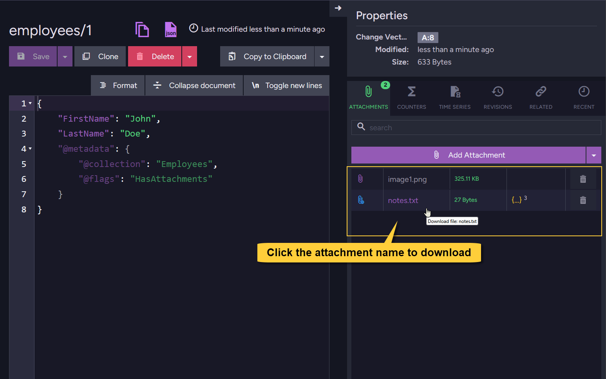

import Admonition from '@theme/Admonition';
import Tabs from '@theme/Tabs';
import TabItem from '@theme/TabItem';
import CodeBlock from '@theme/CodeBlock';
import ContentFrame from '@site/src/components/ContentFrame';
import Panel from '@site/src/components/Panel';

<Admonition type="note" title="">

* This article explains how to retrieve attachments that are already stored in the database, both local and remote.  
  You can:  
  * Get a single attachment, multiple attachments, or just a part of an attachment.
  * Retrieve attachment names only, or check if an attachment exists.
    
* In this article:
  * [Get attachments using the **Studio**](../../document-extensions/attachments/get-attachments#get-attachments-using-the-studio)  
  * [Get attachments using the **Client API**](../../document-extensions/attachments/get-attachments#get-attachments-using-the-client-api)
    * [Get attachment details (excluding content)](../../document-extensions/attachments/get-attachments#get-attachment-details-excluding-content)    
    * [Get single attachment from document](../../document-extensions/attachments/get-attachments#get-single-attachment-from-document)  
    * [Get single attachment from revision](../../document-extensions/attachments/get-attachments#get-single-attachment-from-revision)  
    * [Get multiple attachments](../../document-extensions/attachments/get-attachments#get-multiple-attachments)  
    * [Get partial content](../../document-extensions/attachments/get-attachments#get-partial-content)  
    * [Check if an attachment exists](../../document-extensions/attachments/get-attachments#check-if-an-attachment-exists)  
  * [Syntax](../../document-extensions/attachments/get-attachments#syntax)  
 
</Admonition>

<Panel heading="Get attachments using the Studio">
    
In the Studio, open the document view. To download an attachment, simply click its name.  
The file, whether stored locally or in remote storage, will be downloaded to your browser’s default download location.
    
    
    
</Panel>

## Get attachments using the Client API

<Panel heading="Get attachment details (excluding content)">

* Use the session's `GetNames()` method to retrieve the attachment names and related details for a given document, excluding the attachment content.
  Returned entries include both **local** and **remote** attachments.
    
* To get the attachment content stream as well, see the other sections below,
  e.g. [Get single attachment](../../document-extensions/attachments/get-attachments#get-single-attachment-from-document).  
    
<Tabs groupId='languageSyntax'>
<TabItem value="Get_attachment_details" label="Get_attachment_details">
```csharp 
using (var session = store.OpenSession())
{
    // Load the document entity
    Employee employee = session.Load<Employee>("employees/1");
    
    // Call 'GetNames', pass the document entity
    AttachmentName[] attachmentNames = session.Advanced.Attachments.GetNames(employee);
    
    // Iterate over results
    foreach (AttachmentName attachmentName in attachmentNames)
    {
        // The attachment name:  
        string name = attachmentName.Name;
        
        // Access details:
        string contentType = attachmentName.ContentType;
        string hash = attachmentName.Hash;
        long size = attachmentName.Size;
        var remoteParams = attachmentName.RemoteParameters;
        
        // If the attachment is stored locally, RemoteParameters will be null
        if (remoteParams != null) 
        {
            // Remote attachment info:
            string identifier = remoteParams.Identifier;
            DateTime at = remoteParams.At;
        }
    }
}   
```
</TabItem>  
<TabItem value="Get_attachment_details_async" label="Get_attachment_details_async">
```csharp
using (var asyncSession = store.OpenAsyncSession())
{
    // Load the document entity
    Employee employee = await asyncSession.LoadAsync<Employee>("employees/1");
    
    // Call 'GetNames', pass the document entity
    AttachmentName[] attachmentNames = session.Advanced.Attachments.GetNames(employee);
    
    // Iterate over results
    foreach (AttachmentName attachmentName in attachmentNames)
    {
        // The attachment name:    
        string name = attachmentName.Name;
    
        // Access details:
        string contentType = attachmentName.ContentType;
        string hash = attachmentName.Hash;
        long size = attachmentName.Size;
        var remoteParams = attachmentName.RemoteParameters;
        
        // If the attachment is stored locally, RemoteParameters will be null
        if (remoteParams != null) 
        {
            // Remote attachment info:
            string identifier = remoteParams.Identifier;
            DateTime at = remoteParams.At;
        }
    }
}
```
</TabItem>
</Tabs>    
    
</Panel>

<Panel heading="Get single attachment from document">

### Get attachment - using the session
    
* Use the session's `Get()` method to retrieve a single attachment by name, along with its content stream and related details.
  You can pass either the document entity or the document ID.

* The method seamlessly retrieves attachments from both **local** and **remote** storage.
    
* No exception is thrown if the document does not exist, or if the attachment is missing from the document.  
  In such cases, the returned _AttachmentResult_ will be _null_.
    
<Tabs groupId='languageSyntax'>
<TabItem value="Get_attachment" label="Get_attachment">
```csharp 
using (var session = store.OpenSession())
{
    // Option 1: Load the document entity
    Employee employee = session.Load<Employee>("employees/1");
    // Call 'Get', pass the document entity and the name of the attachment to retrieve
    AttachmentResult attachment = session.Advanced.Attachments.Get(employee, "notes.txt");
    
    // Option 2: Call 'Get' and pass the document ID directly
    // AttachmentResult attachment = 
    //     session.Advanced.Attachments.Get("employees/1", "notes.txt");
    
    if (attachment != null) 
    {
        // Access the content stream:
        var stream = attachment.Stream;
    
        // Optionally, decode the stream to a string (for text-based attachments)
        using (var ms = new MemoryStream())
        {
            await stream.CopyToAsync(ms);
            string decodedContent = Encoding.UTF8.GetString(ms.ToArray());
        }
    
        // Access attachment details:
        var details = attachment.Details;
    
        string name = details.Name;
        string hash = details.Hash;
        long size = details.Size;
        string contentType = details.ContentType;
        string documentId = details.DocumentId;
        string changeVector = details.ChangeVector;
        var remoteParams = details.RemoteParameters;
    
         // If the attachment is stored locally, remoteParams will be null
        if (remoteParams != null)
        {
            // Remote attachment info:
            string identifier = remoteParams.Identifier;
            DateTime at = remoteParams.At;
        }
    }
} 
```
</TabItem>
<TabItem value="Get_attachment_async" label="Get_attachment_async">
```csharp
using (var asyncSession = store.OpenAsyncSession())
{
    // Option 1: Load the document entity
    Employee employee = await asyncSession.LoadAsync<Employee>("employees/1");
    // Call 'GetAsync', pass the document entity and the name of the attachment to retrieve
    AttachmentResult attachment = 
        await asyncSession.Advanced.Attachments.GetAsync(employee, "notes.txt");

    // Option 2: Pass the document ID directly
    // AttachmentResult attachment = 
    //     await asyncSession.Advanced.Attachments.GetAsync("employees/1", "notes.txt");

    if (attachment != null) 
    {
        // Access the content stream:
        var stream = attachment.Stream;
    
        // Optionally, decode the stream to a string (for text-based attachments)
        using (var ms = new MemoryStream())
        {
            await stream.CopyToAsync(ms);
            string decodedContent = Encoding.UTF8.GetString(ms.ToArray());
        }
    
        // Access attachment details:
        var details = attachment.Details;
    
        string name = details.Name;
        string hash = details.Hash;
        long size = details.Size;
        string contentType = details.ContentType;
        string documentId = details.DocumentId;
        string changeVector = details.ChangeVector;
        var remoteParams = details.RemoteParameters;
    
         // If the attachment is stored locally, remoteParams will be null
        if (remoteParams != null)
        {
            // Remote attachment info:
            string identifier = remoteParams.Identifier;
            DateTime at = remoteParams.At;
        }
    }
}
```
</TabItem>
</Tabs>
    
---
    
### Get attachment - using an operation
    
* Use `GetAttachmentOperation` to retrieve a single attachment outside of the session context.  
  The result includes both the content stream and related attachment details.

* The operation retrieves attachments seamlessly from both **local** and **remote** storage.
    
* No exception is thrown if the document does not exist, or if the attachment is missing from the document.  
  In such cases, the returned _AttachmentResult_ will be _null_.
    
<Tabs groupId='languageSyntax'>
<TabItem value="Get_attachment" label="Get_attachment">
```csharp 
// Define the get attachment operation
// Specify the document ID and the attachment name.
// Use 'AttachmentType.Document' to indicate that the attachment is from the document itself 
// (not from a revision).
var getAttachmentOp = new GetAttachmentOperation("employees/1", "notes.txt", AttachmentType.Document, null);

// Execute the operation by passing it to 'Operations.Send'
AttachmentResult attachment = store.Operations.Send(getAttachmentOp);

if (attachment != null) 
{
    // The result includes both the content stream and attachment details
    var stream = attachment.Stream;
    var details = attachment.Details;
}
```
</TabItem>
<TabItem value="Get_attachment_async" label="Get_attachment_async">
```csharp
// Define the get attachment operation
// Specify the document ID and the attachment name.
// Use 'AttachmentType.Document' to indicate that the attachment is from the document itself
// (not from a revision).
var getAttachmentOp = new GetAttachmentOperation("employees/1", "notes.txt", AttachmentType.Document, null);

// Execute the operation by passing it to 'Operations.SendAsync'
AttachmentResult attachment = await store.Operations.SendAsync(getAttachmentOp);

if (attachment != null) 
{    
    // The result includes both the content stream and attachment details
    var stream = attachment.Stream;
    var details = attachment.Details;
}
```
</TabItem>
</Tabs>
    
</Panel>

<Panel heading="Get single attachment from revision">
    
### Get attachment from a revision - using the session
    
* Use the session’s `GetRevision()` method to retrieve a single attachment from a specific document revision.  
  The method seamlessly retrieves attachments from both **local** and **remote** storage.
    
* No exception is thrown if the revision does not exist, or if the attachment is missing from the revision.  
  In such cases, the returned _AttachmentResult_ will be _null_.

<Tabs groupId='languageSyntax'>
<TabItem value="Get_attachment_of_revision" label="Get_attachment_of_revision">
```csharp 
using (var session = store.OpenSession())
{
    // Call 'GetRevision'
    // Pass the document ID, the attachment name and the revision change vector
    AttachmentResult attachment = session.Advanced.Attachments.GetRevision(
        "employees/1", "notes.txt", changeVector: "A:8-T9HdPKqrYUism8P0z7GA1A");

    if (attachment != null)
    {
        // Access the content stream:
        var stream = attachment.Stream;

        // Access attachment details:
        var details = attachment.Details;
    }
}
```
</TabItem>
<TabItem value="Get_attachment_of_revision_async" label="Get_attachment_of_revision_async">
```csharp
using (var asyncSession = store.OpenAsyncSession())
{
    // Call 'GetRevision'
    // Pass the document ID, the attachment name and the revision change vector
    AttachmentResult attachment = await asyncSession.Advanced.Attachments.GetRevisionAsync(
        "employees/1", "notes.txt", changeVector: "A:8-T9HdPKqrYUism8P0z7GA1A");

    if (attachment != null)
    {
        // Access the content stream:
        var stream = attachment.Stream;

        // Access attachment details:
        var details = attachment.Details;
    }
}
```
</TabItem>
</Tabs>
    
---
    
### Get attachment from a revision - using an operation  

* Use `GetAttachmentOperation` to retrieve a single attachment from a document revision outside of the session context.
  The result includes both the content stream and related attachment details.

* The operation retrieves attachments seamlessly from both **local** and **remote** storage.
    
* No exception is thrown if the document does not exist, or if the attachment is missing from the revision.  
  In such cases, the returned _AttachmentResult_ will be _null_.
    
<Tabs groupId='languageSyntax'>
<TabItem value="Get_attachment_of_revision" label="Get_attachment_of_revision">
```csharp 
// Define the get attachment operation
// Specify the document ID and the attachment name.
// Use 'AttachmentType.Revision' to indicate that the attachment is from a revision
// and provide the revision change vector.
var getAttachmentOp = new GetAttachmentOperation("employees/1", "notes.txt",
    AttachmentType.Revision, changeVector: "A:8-T9HdPKqrYUism8P0z7GA1A");

// Execute the operation by passing it to 'Operations.Send'
AttachmentResult attachment = store.Operations.Send(getAttachmentOp);

if (attachment != null) 
{
    var stream = attachment.Stream;
    var details = attachment.Details;
}
```
</TabItem>    
<TabItem value="Get_attachment_of_revision_async" label="Get_attachment_of_revision_async">
```csharp
// Define the get attachment operation
// Specify the document ID and the attachment name.
// Use 'AttachmentType.Revision' to indicate that the attachment is from a revision
// and provide the revision change vector.
var getAttachmentOp = new GetAttachmentOperation("employees/1", "notes.txt",
    AttachmentType.Revision, changeVector: "A:8-T9HdPKqrYUism8P0z7GA1A");

// Execute the operation by passing it to 'Operations.SendAsync'
AttachmentResult attachment = await store.Operations.SendAsync(getAttachmentOp);

if (attachment != null) 
{
    var stream = attachment.Stream;
    var details = attachment.Details;
}
```
</TabItem>
</Tabs>
    
</Panel>

<Panel heading="Get multiple attachments">
    
* To retrieve multiple attachments in one call, first get the attachment names,  
  then build a list of `AttachmentRequest` objects and pass them to the session’s `Get()` method.    
    
* The method returns attachments from both **local** and **remote** storage.
    
<Tabs groupId='languageSyntax'>
<TabItem value="Get_multiple_attachments" label="Get_multiple_attachments">
```csharp 
using (var session = store.OpenSession())
{
    // Load the document
    var emp = session.Load<Employee>("employees/1");
    
    // Get the list of attachment names for the document
    var attNames = session.Advanced.Attachments.GetNames(emp);
    
    // Build a list of 'AttachmentRequest' objects (document ID + attachment name)
    IEnumerable<AttachmentRequest> attList = attNames.Select(x => 
        new AttachmentRequest("employees/1", x.Name));
    
    // Retrieve multiple attachments in a single call
    IEnumerator<AttachmentEnumeratorResult> att = session.Advanced.Attachments.Get(attList);
    
    // Iterate through the results to access both content and details
    while (att.MoveNext())
    {
      AttachmentEnumeratorResult res = att.Current;
      
      // Attachment metadata (name, content type, size, hash, etc.)
      AttachmentDetails attachmentDetails = res.Details;
      
      // Attachment content stream
      Stream attachmentStream = res.Stream;
    }
}
```
</TabItem>    
<TabItem value="Get_multiple_attachments_async" label="Get_multiple_attachments_async">
```csharp
using (var asyncSession = store.OpenAsyncSession())
{
    // Load the document
    var emp = await asyncSession.LoadAsync<Employee>("employees/1");
    
    // Get the list of attachment names for the document
    var attNames = asyncSession.Advanced.Attachments.GetNames(emp);

    // Build a list of AttachmentRequest objects (document ID + attachment name)
    IEnumerable<AttachmentRequest> attList = attNames.Select(x => 
        new AttachmentRequest("employees/1", x.Name));

    // Retrieve multiple attachments asynchronously
    IEnumerator<AttachmentEnumeratorResult> att = 
        await asyncSession.Advanced.Attachments.GetAsync(attList);

    // Iterate through the results to access both content and details
    while (att.MoveNext())
    {
        AttachmentEnumeratorResult res = att.Current;

        // Attachment metadata (name, content type, size, hash, etc.)
        AttachmentDetails attachmentDetails = res.Details;

        // Attachment content stream
        Stream attachmentStream = res.Stream;
    }
}
```
</TabItem>
</Tabs>
    
</Panel>

<Panel heading="Get partial content">

* Use `GetRange()` to retrieve a specific byte range of an attachment stream.

* Getting a partial stream is supported for **local attachments only**.  
  It is NOT supported for remote attachments.
    
* An _InvalidAttachmentRangeException_ will be thrown if the requested range is invalid for the file. 

---
    
### Get partial content - using the session
  
<Tabs groupId='languageSyntax'>
<TabItem value="Get_partial_content" label="Get_partial_content">
```csharp 
using (var session = store.OpenSession())
{
    // Option 1: Load the document entity
    Employee employee = session.Load<Employee>("employees/1");
    
    // Retrieve a part of the attachment (e.g. bytes 100-200)
    AttachmentResult attachmentPartial = session.Advanced.Attachments.GetRange(
        entity: employee, name: "notes.txt",  from: 100, to: 200);
    
    // Option 2: Call 'GetRange', pass the document ID (instead of the entity)
    // AttachmentResult attachment =
    //     AttachmentResult attachmentPartial = session.Advanced.Attachments.GetRange(
    //         documentId: "employees/1", name: "notes.txt",  from: 100, to: 200);

    if (attachmentPartial != null)
    {
        // Access the content stream:
        // Only the requested byte range is available in the stream 
        var stream = attachmentPartial.Stream;

        // Access attachment details:
        var details = attachmentPartial.Details;
    }
}
```
</TabItem>
<TabItem value="Get_partial_content_async" label="Get_partial_content_async">
```csharp
using (var asyncSession = store.OpenAsyncSession())
{
    // Option 1: Load the document entity
    Employee employee = await asyncSession.LoadAsync<Employee>("employees/1");

    // Retrieve a part of the attachment (e.g. bytes 100-200)
    AttachmentResult attachmentPartial = await asyncSession.Advanced.Attachments.GetRangeAsync(
        entity: employee, name: "notes.txt", from: 100, to: 200);

    // Option 2: Call 'GetRangeAsync', pass the document ID (instead of the entity)
    // AttachmentResult attachment =
    //     await asyncSession.Advanced.Attachments.GetRangeAsync(
    //         documentId: "employees/1", name: "notes.txt", from: 100, to: 200);

    if (attachmentPartial != null)
    {
        // Access the content stream:
        // Only the requested byte range is available in the stream 
        var stream = attachmentPartial.Stream;

        // Access attachment details:
        var details = attachmentPartial.Details;
    }
}
```
</TabItem>
</Tabs>
    
---

### Get partial content - using an operation
 
<Tabs groupId='languageSyntax'>
<TabItem value="Get_partial_content" label="Get_partial_content">
```csharp 
// Define the get attachment operation
// Specify 'from' and 'to' to retrieve a part of the attachment (e.g. bytes 100-200)
var getAttachmentOp = new GetAttachmentOperation(documentId: "employees/1", 
    name: "notes - Copy.txt", type: AttachmentType.Document, changeVector: null, 
    from: 100, to: 200);

// Execute the operation by passing it to 'Operations.Send'
AttachmentResult attachment = store.Operations.Send(getAttachmentOp);

if (attachment != null) 
{
    // Only the requested byte range is available in the stream 
    var stream = attachment.Stream;
    var details = attachment.Details;
}
```
</TabItem>
<TabItem value="Get_partial_content_async" label="Get_partial_content_async">
```csharp
// Define the get attachment operation
// Specify 'from' and 'to' to retrieve a part of the attachment (e.g. bytes 100-200)
var getAttachmentOp = new GetAttachmentOperation(documentId: "employees/1", 
    name: "notes - Copy.txt", type: AttachmentType.Document, changeVector: null,
    from: 100, to: 200);

// Execute the operation by passing it to 'Operations.SendAsync'
AttachmentResult attachment = await store.Operations.SendAsync(getAttachmentOp);

if (attachment != null) 
{
    // Only the requested byte range is available in the stream 
    var stream = attachment.Stream;
    var details = attachment.Details;
}
```
</TabItem>
</Tabs>
    
</Panel>

<Panel heading="Check if an attachment exists">

Use the session to check whether a specific attachment exists for a given document.  
This works for both **local** and **remote** attachments.
    
<Tabs groupId='languageSyntax'>
<TabItem value="Check_if_attachment_exist" label="Check_if_attachment_exist">
```csharp 
using (var session = store.OpenSession())
{    
    // Check if the document has an attachment named "notes.txt"
    // Call method 'Exists', pass the document ID
    bool exists = session.Advanced.Attachments.Exists("employees/1", "notes.txt");
}    
```
</TabItem>  
<TabItem value="Check_if_attachment_exist_async" label="Check_if_attachment_exist_async">
```csharp
using (var asyncSession = store.OpenAsyncSession())
{
    // Check if the document has an attachment named "notes.txt"
    // Call method 'Exists', pass the document ID
    bool exists = await asyncSession.Advanced.Attachments.ExistsAsync(
        "employees/1", "notes.txt");
}
```
</TabItem>
</Tabs>
    
</Panel>

<Panel heading="Syntax">

### Get attachment via operation

<TabItem>
```csharp    
public GetAttachmentOperation(string documentId, 
    string name, AttachmentType type, string changeVector, long? from, long? to)    
```
</TabItem>
    
| Parameter            | Type                         | Description |
|----------------------|------------------------------|-------------|
| **documentId**       | `string`                     | The ID of the document from which to retrieve the attachment. |
| **name**             | `string`                     | The name of the attachment to retrieve. |
| **type**             | `AttachmentType`             | Specify whether the attachment is from the current document or a document revision. |
| **changeVector**     | `string`                     | The change vector of the revision to retrieve the attachment from. Use `null` when retrieving from the current document. |   
| **from**             | `long`                       | (Optional) The starting byte position (inclusive) for partial content retrieval. |   
| **to**               | `long`                       | (Optional) The ending byte position (inclusive) for partial content retrieval. |   
    
| Return value       | Description |
|--------------------|-------------|
| [AttachmentResult](../../document-extensions/attachments/get-attachments#attachmentresult) | The retrieved attachment |

---

### Get attachment via session

<TabItem>
```csharp
// Avialable overloads:
// ====================

bool Exists(string documentId, string name);
Task<bool> ExistsAsync(string documentId, string name, CancellationToken token = default);
    
AttachmentResult Get(object entity, string name);
Task<AttachmentResult> GetAsync(object entity, string name, CancellationToken token = default);    
    
AttachmentResult Get(string documentId, string name);
Task<AttachmentResult> GetAsync(string documentId, string name, CancellationToken token = default);
    
AttachmentResult GetRange(object entity, string name, long? from, long? to);
Task<AttachmentResult> GetRangeAsync(object entity, string name, long? from, long? to,
    CancellationToken token = default);
    
AttachmentResult GetRange(string documentId, string name, long? from, long? to);
Task<AttachmentResult> GetRangeAsync(string documentId, string name, long? from, long? to,  
    CancellationToken token = default);
    
AttachmentResult GetRevision(string documentId, string name, string changeVector);
Task<AttachmentResult> GetRevisionAsync(string documentId, string name, string changeVector, 
    CancellationToken token = default);
    
IEnumerator<AttachmentEnumeratorResult> Get(IEnumerable<AttachmentRequest> attachments);
Task<IEnumerator<AttachmentEnumeratorResult>> GetAsync(IEnumerable<AttachmentRequest> attachments, 
    CancellationToken token = default);
```
</TabItem>  
    
| Parameter            | Type                             | Description |
|----------------------|----------------------------------|-------------|
| **documentId**       | `string`                         | The ID of the document from which to retrieve the attachment. |
| **entity**           | `string`                         | The loaded document entity from which to retrieve the attachment. |
| **name**             | `string`                         | The name of the attachment to retrieve (case-insensitive). |
| **changeVector**     | `string`                         | The change vector of the revision to retrieve the attachment from. |
| **from**             | `long`                           | (Optional) The starting byte position (inclusive) for partial content retrieval. |   
| **to**               | `long`                           | (Optional) The ending byte position (inclusive) for partial content retrieval. |     
| **attachments**      | `IEnumerable<AttachmentRequest>` | A list of attachment requests to retrieve multiple attachments in a single call.|     

| Return value       | Description                                       |
|--------------------|---------------------------------------------------|
| `AttachmentResult` | An object with the retrieved attachment's details |
 
---
    
### `AttachmentResult`
    
<TabItem>
```csharp 
public class AttachmentResult
{
    public Stream Stream;
    public AttachmentDetails Details;
}
    
public class AttachmentDetails : AttachmentName
{
    public string ChangeVector;
    public string DocumentId;
}
    
public class AttachmentName
{
    public string Name;
    public string Hash;
    public string ContentType;
    public long Size;
}  
```
</TabItem> 
    
</Panel>