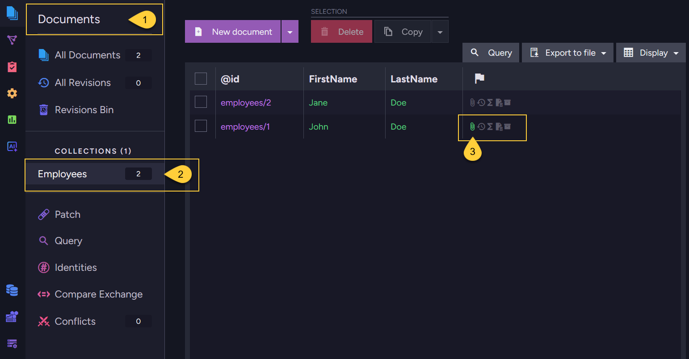
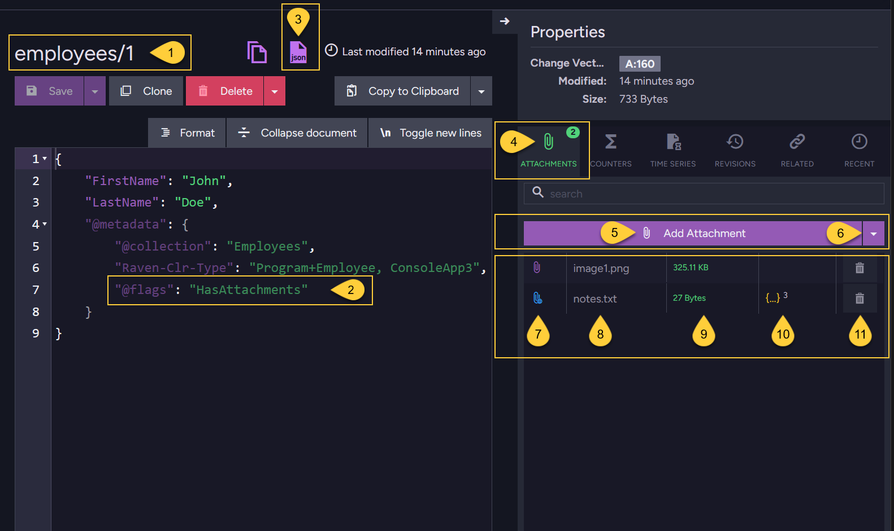
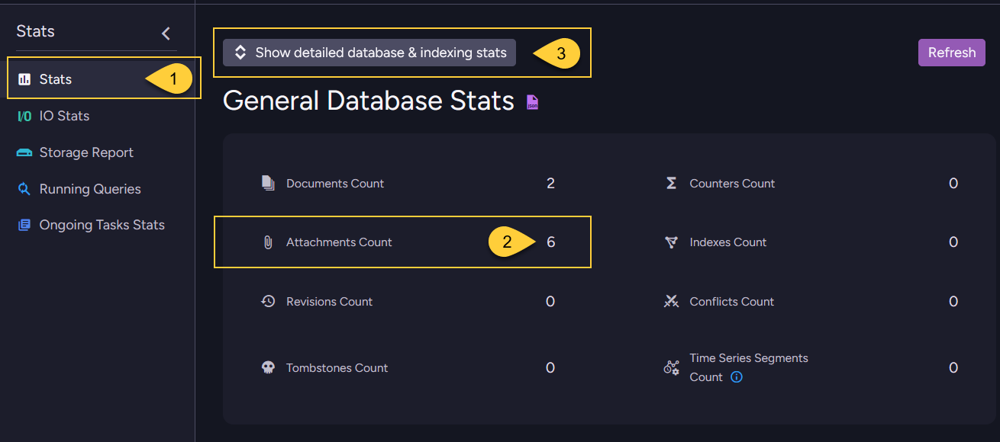
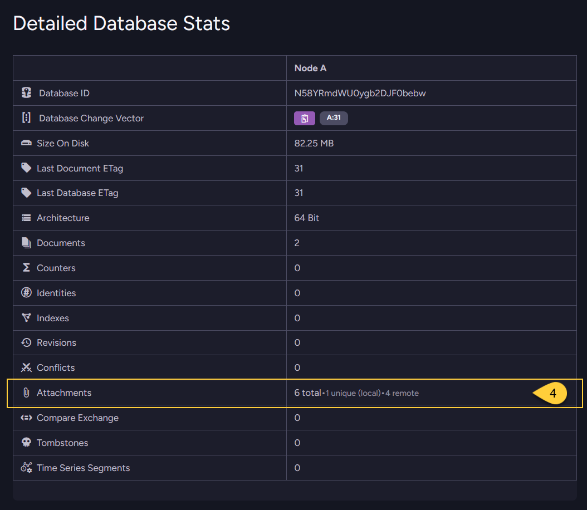

import Admonition from '@theme/Admonition';
import Tabs from '@theme/Tabs';
import TabItem from '@theme/TabItem';
import CodeBlock from '@theme/CodeBlock';
import ContentFrame from '@site/src/components/ContentFrame';
import Panel from '@site/src/components/Panel';

<Admonition type="note" title="">

* RavenDB allows you to store files, such as images, PDFs, videos, text files, or any other format, as **attachments** alongside your JSON documents. 

* Each attachment is associated with a specific document and is identified by a unique name and an optional content type (e.g. _image/png_, _application/pdf_).
  A single document can have any number of attachments, which are listed in the document’s metadata.  
    
* Attachments are stored as **binary data**, regardless of content type, and are handled as streams to enable efficient upload and retrieval.

* Attachments can be stored **locally** on your RavenDB server,
  or **remotely** in external storage such as Amazon S3 or any S3-compatible storage service, or Azure Blob Storage.

  * **Local storage**:  
    By default, attachments are stored locally in RavenDB's internal storage.  
    They are stored separately from the document itself in a dedicated attachment storage.  
    This avoids bloating your JSON document with large binary content.    
    See [Store attachments in local storage](../../document-extensions/attachments/store-attachments/store-attachments-local).
  * **Remote storage**:  
    RavenDB does not enforce a hard limit on the size of locally stored attachments.  
    However, to reduce local disk usage, you can optionally configure RavenDB to offload attachments to remote storage.
    See [Store attachments in remote storage](../../document-extensions/attachments/store-attachments/store-attachments-remote).
    
* In this article:
  * [Attachments in the documents list view](../../document-extensions/attachments/overview#attachments-in-the-documents-list-view)
  * [Attachments in the document view](../../document-extensions/attachments/overview#attachments-in-the-document-view)
  * [Attachments stats](../../document-extensions/attachments/overview#attachments-stats)
    
</Admonition>  

<Panel heading="Attachments in the documents list view">
    

    
1. Open the _Documents_ section in the Studio navigation bar.  
2. Select a collection (e.g., _Employees_) to display the documents list view.
3. The attachment flag is displayed for any document that has one or more attachments.

</Panel>

<Panel heading="Attachments in the document view">



1. **The document ID**:  
   The unique identifier of the document.

2. **Document metadata**:  
   The Studio does not show the full attachment metadata in the document editor.  
   It only shows the `@flags` property with the value `HasAttachments` in the document's `@metadata` section
   to indicate that the document has attachments.

3. **Viewing the full metadata**:  
   Click this JSON button to view the document's raw content, including its full metadata.  
   You can also get the metadata programmatically using the Client API, see [Get entity metadata](../../client-api/session/how-to/get-and-modify-entity-metadata).  
   For details on the structure of attachment metadata, refer to:  
   * [The attachment metadata - local](../../document-extensions/attachments/store-attachments/store-attachments-local#the-attachment-metadata)
   * [The attachment metadata - remote](../../document-extensions/attachments/store-attachments/store-attachments-remote#the-attachment-metadata)

4. **Attachments tab**:  
   All attachments associated with the document are listed under the _Attachments_ tab in the document _Properties_ pane.  

5. **Add attachment to local storage**:  
    Click to add a new attachment to the document that will be stored in RavenDB's local storage.  
    Learn more in [Store attachments in local storage](../../document-extensions/attachments/store-attachments/store-attachments-local).
    
6. **Add attachment to remote storage**:  
    Click to add a new attachment to the document that will be uploaded and stored in a remote destination.  
    Learn more in [Store attachments in remote storage](../../document-extensions/attachments/store-attachments/store-attachments-remote).
    
7. **Storage location**:  
   The clip icon indicates where the attachment content is stored:  
   * Purple clip: The attachment is stored locally on the RavenDB server.  
   * Blue clip: The attachment is stored remotely (e.g., in Amazon S3 or Azure Storage).  
    
8. **Attachment name**:  
    The name assigned to the attachment when it was added to the document.
    
9. **Attachment size**:  
    The size of the attachment file.
    
10. **Remote attachment details**:  
   Additional information specific to the remote attachment such as upload time and destination identifier.
    
11. **Delete attachment**:  
    Click to remove the attachment from the document and delete it from local RavenDB storage.  
    Learn more in [Delete attachments](../../document-extensions/attachments/delete-attachment).    

</Panel>

<Panel heading="Attachments stats">
    
### View attachments stats in the Studio
    
* The overall number of attachments in the database can be viewed in the **General Database Stats** view in the Studio.
       

    
1. Go to the **Stats** section in the Studio navigation bar.
2. This it the total number of attachments in the database, from all collections.
3. Click "Show detailed database & indexing stats" to expand the detailed section.
    

    
3. **Attachments details**:  
   `total`:  
    The total number of attachments in the database, from all collections.  
   `unique`:  
    The number of unique attachments stored **locally** in the database.   
    Learn more in [Deduplicating local attachments](../../document-extensions/attachments/store-attachments/store-attachments-local#deduplicating-local-attachments).  
   `remote`:  
    The total number of attachments stored in remote storage.   

---
    
### Get attachments stats via the Client API

* Use the `GetDetailedStatisticsOperation` to retrieve statistics about attachments in the database.  
  For a list of all available statistics properties, see [Get statistics](../../client-api/operations/maintenance/get-stats). 
    
<Tabs groupId='languageSyntax'>
<TabItem value="Get_stats_operation" label="Get_stats_operation">
```csharp
var detailedStats = store.Maintenance.Send(new GetDetailedStatisticsOperation());

// Total number of attachments in the database (Local & Remote)
var totalAttachments = detailedStats.CountOfAttachments;

// Total number of unique attachments in the database (Local only)
var uniqueLocalAttachments = detailedStats.CountOfUniqueAttachments;

// Total number of Remote attachments in the database
var remoteAttachments = detailedStats.CountOfRemoteAttachments;  
```
</TabItem>
<TabItem value="Get_stats_operation_async" label="Get_stats_operation_async">
```csharp
var detailedStats = await store.Maintenance.SendAsync(new GetDetailedStatisticsOperation());

// Total number of attachments in the database (Local & Remote)
var totalAttachments = detailedStats.CountOfAttachments;

// Total number of unique attachments in the database (Local only)
var uniqueLocalAttachments = detailedStats.CountOfUniqueAttachments;

// Total number of Remote attachments in the database
var remoteAttachments = detailedStats.CountOfRemoteAttachments;  

```
</TabItem>
</Tabs>
    
</Panel>