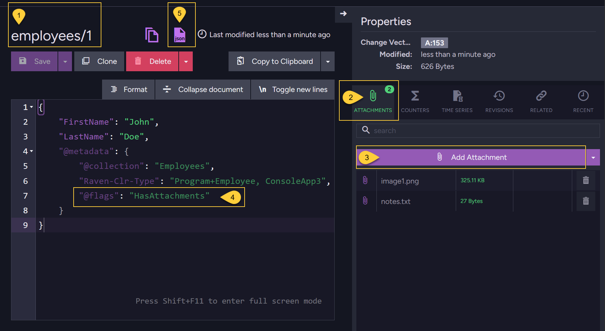

import Admonition from '@theme/Admonition';
import Tabs from '@theme/Tabs';
import TabItem from '@theme/TabItem';
import CodeBlock from '@theme/CodeBlock';
import ContentFrame from '@site/src/components/ContentFrame';
import Panel from '@site/src/components/Panel';

<Admonition type="note" title="">

* This article focuses on **storing attachments locally**.  
  To learn about remote storage, see [Store attachments in remote storage](../../../document-extensions/attachments/store-attachments/store-attachments-remote).
    
* In this article
  * [Overview](../../../document-extensions/attachments/store-attachments/store-attachments-local#overview)  
  * [Store attachments using the **Studio**](../../../document-extensions/attachments/store-attachments/store-attachments-local#store-attachments-using-the-studio)  
  * [Store attachments using the **Client API**](../../../document-extensions/attachments/store-attachments/store-attachments-local#store-attachments-using-the-client-api)  
    * [Store via the Session](../../../document-extensions/attachments/store-attachments/store-attachments-local#store-attachments-via-the-session)  
    * [Store via an Operation](../../../document-extensions/attachments/store-attachments/store-attachments-local#store-attachments-via-an-operation) 
  * [The attachment metadata](../../../document-extensions/attachments/store-attachments/store-attachments-local#the-attachment-metadata)  
  * [Deduplicating local attachments](../../../document-extensions/attachments/store-attachments/store-attachments-local#deduplicating-local-attachments)  
  * [Syntax](../../../document-extensions/attachments/store-attachments/store-attachments-local#syntax)  
 
</Admonition>

<Panel heading="Overview">

* **To store attachments**:  
    * First, create or load a document.  
    * Then, attach any number of files using the Studio or the Client API.

* The document’s metadata is updated to reference each attachment that is added.  
  This metadata update is considered a document change, which causes the document to be replicated to all other nodes in the database group.  
  Any actions associated with the document change, such as indexing or ongoing tasks configured for the document, will be triggered.
  Learn more in [Attachments and other features](../../../document-extensions/attachments/attachments-and-other-features).  
    
* When stored **locally**, attachments are not embedded within the document.
  Instead, they are saved in a dedicated attachment storage area on the RavenDB server, separate from the document store.  
  This avoids bloating your JSON documents with large binary data and enables efficient storage and retrieval.     
    
* **Storing attachments with the same name**:  
  If you add an attachment with a name that is already associated with the document (case-insensitive),  
  the new content will replace the existing content in the local storage.    
    
</Panel>

<Panel heading="Store attachments using the Studio">

You can add and manage attachments directly in the Studio.



1. Open the _Document_ view. The example shows document _employees/1_.
2. Open the _Attachments_ tab in the document _Properties_ pane.    
3. Click **Add Attachment** and select the file to attach.  
   The file will appear in the list and will be automatically associated with the document.  
4. The Studio does not show detailed attachment metadata in the document editor.  
   It only shows the `@flags` property with the value `HasAttachments` in the document's `@metadata` section  
   to indicate that the document has attachments.
5. Click this JSON button to view the document's raw content, including its full metadata.  
   Learn more about the attachment metadata in [The attachment metadata](../../../document-extensions/attachments/store-attachments/store-attachments-local#the-attachment-metadata).

</Panel>

<Panel heading="Store Attachments using the Client API">

### Store attachments via the Session

* Use `session.Advanced.Attachments.Store` to associate an attachment with an **existing** document,  
  The document can be newly stored in the current session or loaded from the database.  
  An exception will be thrown if you attempt to add an attachment to a document that does not exist.

* **Transaction support**:
    
  * Like documents, attachments are tracked by the session and are not sent to the server immediately.  
    They are persisted only when you call `session.SaveChanges()`, along with all other changes made in the session, 
    as part of a single [unit of work](../../../client-api/session/what-is-a-session-and-how-does-it-work#unit-of-work-pattern).
    
  * If you store both the document and its attachment in the same session, they are saved transactionally:  
    if saving the document fails, the attachment is not stored, and vice versa.    

#### Example
    
<Tabs groupId='languageSyntax'>
<TabItem value="Store_attachment_sync" label="Store_attachment_sync">
```csharp
using (var session = store.OpenSession())
{
    // Store a new document:
    // =====================
    var employee1 = new Employee
    {
        FirstName = "John",
        LastName = "Doe"
        // ... other properties
    };    
    
    session.Store(employee1, "employees/1");    
    
    // Or load an existing document:
    // =============================
    var employee2 = session.Load<Employee>("employees/2");

    // Store attachments locally for new and existing documents:
    // =========================================================
    
    // Define paths to your source files
    var attachmentPath1 = @"C:\temp\image1.png";
    var attachmentPath2 = @"C:\temp\notes.txt";
    
    // Define the names under which the attachments will be stored
    var attachmentName1 = "image1.png";
    var attachmentName2 = "notes.txt";
    
    using (var stream1 = File.Open(attachmentPath1, FileMode.Open, FileAccess.Read))
    using (var stream2 = File.Open(attachmentPath2, FileMode.Open, FileAccess.Read))
    {
        // Add attachments to the new document (employee1)
        session.Advanced.Attachments.Store(employee1, attachmentName1, stream1, "image/png");
        session.Advanced.Attachments.Store(employee1, attachmentName2, stream2, "text/plain");
        
        // Upon save changes:
        // Document 'employees/1' will be created with 2 attachments
        session.SaveChanges(); 
    }
    
    using (var stream1 = File.Open(attachmentPath1, FileMode.Open, FileAccess.Read))
    using (var stream2 = File.Open(attachmentPath2, FileMode.Open, FileAccess.Read))
    {
        // Add attachments to the existing document (employee2)
        session.Advanced.Attachments.Store(employee2, attachmentName1, stream1, "image/png");
        session.Advanced.Attachments.Store(employee2, attachmentName2, stream2, "text/plain");
        
        // Upon save changes:
        // 2 attachments will be added to the already existing document 'employees/2'
        session.SaveChanges();
    }
}
```
</TabItem>
<TabItem value="Store_attachment_async" label="Store_attachment_async">
```csharp
using (var asyncSession = store.OpenAsyncSession())
{
    // Store a new document:
    // =====================
    var employee1 = new Employee
    {
        FirstName = "John",
        LastName = "Doe"
        // ... other properties
    };

    await asyncSession.StoreAsync(employee1, "employees/1");

    // Or load an existing document:
    // =============================
    var employee2 = await asyncSession.LoadAsync<Employee>("employees/2");

    // Store attachments locally for new and existing documents:
    // =========================================================
    
    // Define paths to your source files
    var attachmentPath1 = @"C:\temp\image1.png";
    var attachmentPath2 = @"C:\temp\notes.txt";
    
    // Define the names under which the attachments will be stored
    var attachmentName1 = "image1.png";
    var attachmentName2 = "notes.txt";

    await using (var stream1 = File.Open(attachmentPath1, FileMode.Open, FileAccess.Read))
    await using (var stream2 = File.Open(attachmentPath2, FileMode.Open, FileAccess.Read))
    {
        // Add attachments to the new document (employee1)
        asyncSession.Advanced.Attachments.Store(employee1, attachmentName1, stream1, "image/png");
        asyncSession.Advanced.Attachments.Store(employee1, attachmentName2, stream2, "text/plain");

        // Save changes:
        // Document 'employees/1' will be created with 2 attachments
        await asyncSession.SaveChangesAsync();
    }

    await using (var stream1 = File.Open(attachmentPath1, FileMode.Open, FileAccess.Read))
    await using (var stream2 = File.Open(attachmentPath2, FileMode.Open, FileAccess.Read))
    {
        // Add attachments to the existing document (employee2)
        asyncSession.Advanced.Attachments.Store(employee2, attachmentName1, stream1, "image/png");
        asyncSession.Advanced.Attachments.Store(employee2, attachmentName2, stream2, "text/plain");

        // Save changes:
        // 2 attachments will be added to the already existing document 'employees/2'
        await asyncSession.SaveChangesAsync();
    }
}
```
</TabItem>
</Tabs>   
    
---
    
### Store attachments via an Operation 
    
* Use the `PutAttachmentOperation` operation to store an attachment outside the context of a session. 

* This is ideal when you need to add an attachment as an independent action and not as part of the transactional _SaveChanges()_ batch.

* To store multiple attachments, call the operation separately for each attachment you want to add. 

* An exception will be thrown if you attempt to add an attachment to a document that does not exist.  

#### Example   
    
<Tabs groupId='languageSyntax'>
<TabItem value="Put_attachment_operation_sync" label="Put_attachment_operation_sync">
```csharp
// The path to your source file
var attachmentPath = @"C:\temp\image1.png";

// Open the file stream
using (var stream = File.Open(attachmentPath, FileMode.Open, FileAccess.Read))
{
    var documentId = "employees/1";
    var attachmentName = "image1.png";
    var contentType = "image/png";
    
    // Define the put attachment operation
    var operation = new PutAttachmentOperation(documentId, attachmentName, stream, contentType);
    
    // Execute the operation by passing it to 'Operations.Send'
    var result = store.Operations.Send(operation);
}
```
</TabItem>
<TabItem value="Put_attachment_operation_async" label="Put_attachment_operation_async">
```csharp
// The path to your source file
var attachmentPath = @"C:\temp\image1.png";
    
// Open the file stream
await using (var stream = new FileStream(attachmentPath, 
    FileMode.Open, FileAccess.Read, FileShare.Read, 4096, useAsync: true))
{
    var documentId = "employees/1";
    var attachmentName = "image1.png";
    var contentType = "image/png";
    
    // Define the put attachment operation
    var operation = new PutAttachmentOperation(documentId, attachmentName, stream, contentType);
    
    // Execute the operation by passing it to 'Operations.SendAsync'
    var result = await store.Operations.SendAsync(operation);
}
```
</TabItem>
</Tabs>   
    
</Panel>

<Panel heading="The attachment metadata">

* When an attachment is added to a document, RavenDB updates the document’s `@metadata` to include information about the attachment within a dedicated `@attachments` section.
    
* For example, the metadata of document _employees/1_ from the session's example above contains the following:

<TabItem value="sample-metadata" label="sample-metadata">
```json
"@metadata": {
  "@attachments": [
    {
      "Name": "image1.png",
      "Hash": "6MsVgv2an8udIvA1GeRYg/kjvS47EZjb3xKCkwCPBqw=",
      "ContentType": "image/png",
      "Size": 332916
    },
    {
      "Name": "notes.txt",
      "Hash": "EjTWwES/SOdzvXkVlT3VIOsIwaiz0jsqOk+VuO/Sbq0=",
      "ContentType": "text/plain",
      "Size": 27
    }
  ],
  "@collection": "Employees",
  "@change-vector": "A:42-5nIqMb8v3kGQLYhhU90jWg",
  "@flags": "HasAttachments",
  "@id": "employees/1",
  "@last-modified": "2025-11-23T13:48:15.4922720Z"
}
```
</TabItem>
    
The properties listed in the `@attachments` array include the following information:   
    
`Name`:  
The name of the attachment (e.g. photo.png).  
`Hash`:  
A Base64-encoded SHA-256 hash of the attachment’s content.  
Used to detect and avoid storing the same attachment content more than once in the local storage (deduplication).  
`ContentType`:  
The MIME type of the attachment (e.g. image/png, application/pdf).  
`Size`:   
The size of the attachment in bytes.    
    
</Panel>

<Panel heading="Deduplicating local attachments">
    
* RavenDB avoids storing duplicate binary content in its attachment storage by using content-based deduplication.
   
* RavenDB computes a SHA-256 hash of the attachment’s binary content.  
  This hash is used as the key to the internal attachment storage.
   
  If multiple attachments (even with different names and across different documents) share the **same hash**, their binary content is stored only once on disk.
  Each document still maintains its own metadata reference to the attachment, but the underlying stream is shared.
  
  A deduplicated stream is removed only when no attachments reference it anymore.
    
</Panel>

<Panel heading="Syntax">

### `PutAttachmentOperation`  
Add an attachment to a document using a store operation. 
    
<TabItem>
```csharp
// Available overloads:
// ===================
    
public PutAttachmentOperation(
    string documentId, string name, Stream stream, string contentType = null,
    RemoteAttachmentParameters remoteParameters = null, string changeVector = null)

public PutAttachmentOperation(string documentId, StoreAttachmentParameters parameters)
```
</TabItem>
    
| Return value         | Description                                 |
|----------------------|---------------------------------------------|
| [AttachmentDetails](../../../document-extensions/attachments/store-attachments/store-attachments-local#attachmentdetails) | An object with the new attachment's details |
    
---
    
### `Session.Advanced.Attachments.Store`  
Add an attachment to a document using a session. 

<TabItem>
```csharp
// Available overloads:
// ====================

void Store(string documentId, StoreAttachmentParameters parameters);
void Store(string documentId, string name, Stream stream, string contentType = null);
void Store(object entity, string name, Stream stream, string contentType = null);
```
</TabItem>

---

| Parameter            | Type                         | Description |
|----------------------|------------------------------|-------------|
| **documentId**       | `string`                     | The ID of the document to which the attachment will be added. |
| **entity**           | `object`                     | The tracked entity instance to which the attachment will be associated. |
| **name**             | `string`                     | The name under which the attachment will be stored on the server. |
| **stream**           | `Stream`                     | The stream containing the binary content of the attachment. |
| **contentType**      | `string`                     | The MIME type of the attachment (optional).<br/>Common examples include:<br/>`image/png`, `application/pdf`, `text/plain`, `video/mp4`. |
| **parameters**       | `StoreAttachmentParameters`  | An object that encapsulates all parameters required to store an attachment. |
| **remoteParameters** | `RemoteAttachmentParameters` | Parameters for uploading the attachment to [Remote storage](../../../document-extensions/attachments/store-attachments/store-attachments-remote).<br/>Set to _null_ or omit to store the attachment **locally**. |
| **changeVector**     | `string`                     | The document's change vector used for concurrency control.<br/>If set to `null`, no concurrency check will be performed and the attachment will be added regardless of the document's current state. |

<TabItem>
```csharp 
public class StoreAttachmentParameters
{
    public string Name { get; set; }   // The name of the attachment to store.
    public Stream Stream { get; set; } // The stream containing the attachment data.
    public string ChangeVector { get; set; } 
    public string ContentType { get; set; }
    
    // Set to null or omit to store the attachment *locally*
    public RemoteAttachmentParameters RemoteParameters { get; set; }
}
```
</TabItem>
    
<TabItem >
```csharp 
public class RemoteAttachmentParameters
{
    // The scheduled date and time when the attachment should be uploaded to the remote destination.
    // Preferably in UTC.
    public DateTime At { get; set; }
    
    // The identifier of the remote storage destination to which the attachment should be uploaded.
    public string Identifier { get; set; }
}
```
</TabItem>
    
---
    
### `AttachmentDetails`
    
<TabItem>
```csharp 
public class AttachmentDetails : AttachmentName
{
    public string ChangeVector;
    public string DocumentId;
}
    
public class AttachmentName
{
    public string Name;
    public string Hash;
    public string ContentType;
    public long Size;
}    
```
</TabItem> 
    
</Panel>