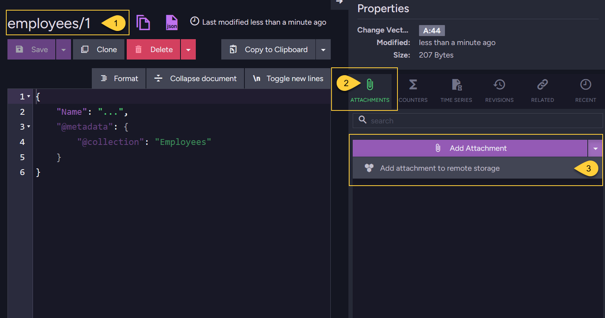
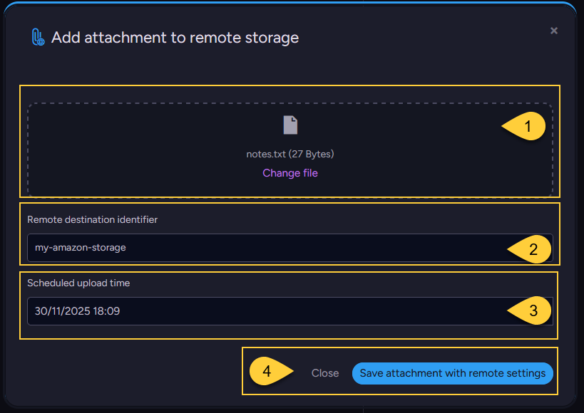
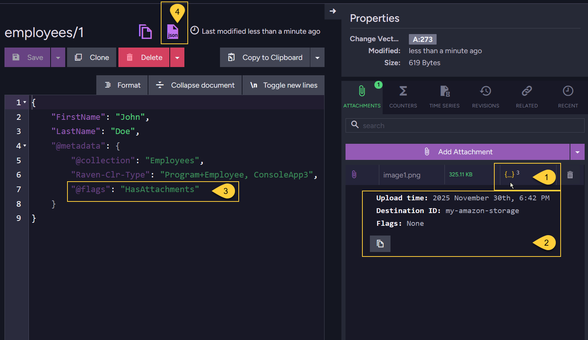
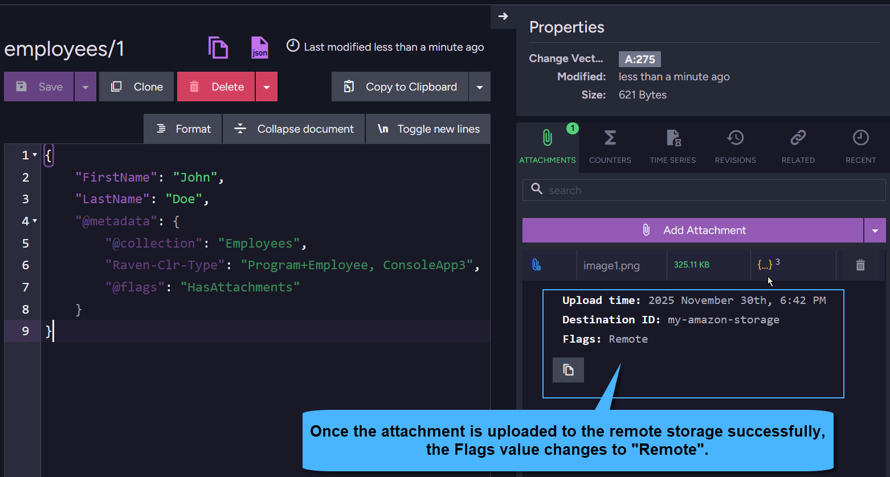

import Admonition from '@theme/Admonition';
import Tabs from '@theme/Tabs';
import TabItem from '@theme/TabItem';
import CodeBlock from '@theme/CodeBlock';
import ContentFrame from '@site/src/components/ContentFrame';
import Panel from '@site/src/components/Panel';

<Admonition type="note" title="">

* This article focuses on **storing attachments in a remote storage**.  
  To learn about local storage, see [Store attachments in local storage](../../../document-extensions/attachments/store-attachments/store-attachments-local).
    
* A document can have any number of attachments, including both local attachments (stored in RavenDB)  
  and remote attachments (stored in external storage such as Amazon S3 or Azure.  

* **To store attachments in remote storage**, first enable the feature and configure one or more remote destinations.  
  See [Configure remote attachments](../../../document-extensions/attachments/configure-remote-attachments).  
    
* In this article
  * [Overview](../../../document-extensions/attachments/store-attachments/store-attachments-remote#overview)  
    * [Remote attachment upload - flow](../../../document-extensions/attachments/store-attachments/store-attachments-remote#remote-attachment-upload---flow)  
    * [Remote attachment upload – considerations](../../../document-extensions/attachments/store-attachments/store-attachments-remote#remote-attachment-upload--considerations)  
  * [Store attachments remotely - using the **Studio**](../../../document-extensions/attachments/store-attachments/store-attachments-remote#store-attachments-remotely-using-the-studio)  
  * [Store attachments remotely - using the **Client API**](../../../document-extensions/attachments/store-attachments/store-attachments-remote#store-attachments-remotely-using-the-client-api)  
    * [Store via the Session](../../../document-extensions/attachments/store-attachments/store-attachments-remote#store-attachments-remotely---via-the-session)  
    * [Store via an Operation](../../../document-extensions/attachments/store-attachments/store-attachments-remote#store-attachments-remotely---via-an-operation)  
  * [Schedule existing attachments for remote upload](../../../document-extensions/attachments/store-attachments/store-attachments-remote#schedule-existing-attachments-for-remote-upload)  
  * [The attachment metadata](../../../document-extensions/attachments/store-attachments/store-attachments-remote#the-attachment-metadata)  
  * [Deduplicating remote attachments](../../../document-extensions/attachments/store-attachments/store-attachments-remote#deduplicating-remote-attachments)  
  * [Syntax](../../../document-extensions/attachments/store-attachments/store-attachments-remote#syntax)  
 
</Admonition>

<Panel heading="Overview">
    
### Remote attachment upload - flow
    
* Ensure the Remote Attachments feature is enabled in the database and that remote destinations are configured.  
  See [Configure remote attachments](../../../document-extensions/attachments/configure-remote-attachments).

* Create or load a document.  

* Add an attachment to the document using the Studio or the Client API, specifying:   
    * The remote destination identifier  
    * The desired upload time

* The attachment is first **stored locally** in RavenDB’s dedicated attachment storage,  
  and the document's metadata is updated with information about the attachment and the remote upload parameters.

* This metadata update is treated as a document update, causing the document to replicate to all nodes in the database group.
  As a result, the attachment content is stored locally on all nodes. 

* RavenDB runs a **background task** that periodically scans the database for attachments marked for remote upload.  
  If the upload time of the attachment has passed when the task runs, the task uploads the attachment to the specified remote storage.

* **After a successful upload:**:
  * The document’s metadata is updated to indicate that the attachment was uploaded.
  * The attachment is **deleted from the local storage** of the server that performed the upload.
  * The document replicates again, and all other nodes delete their local copies of the attachment.
  * Any actions triggered by the document change, such as indexing or ongoing tasks configured for the document, will be executed. 
    Learn more in [Attachments and other features](../../../todo..).

---
    
### Remote attachment upload – considerations
    
* **Can the upload process be canceled?**   
  Once an upload to the remote destination begins, it cannot be canceled.   
  You can only stop the upload by disabling or deleting the database while it is still running.  
    
* **Can a remote attachment be pulled back into local storage?**    
  There is no built-in mechanism to reverse the upload. To "un-remote" an attachment,  
  you'll need to manually retrieve it from the remote storage and store it again in the database.
    
* **Why is my attachment not uploading?**  
  Remote upload will not occur in the following cases:  
  * Configuration issues:  
    The Remote Attachments feature is disabled, or the specified destination is disabled,  
    or the destination identifier is invalid or not configured. See [Configure remote attachments](../../../document-extensions/attachments/configure-remote-attachments). 
  * The upload time has not yet arrived.
  * The server cannot connect to the remote storage destination.    
  * Revisions are enabled for the document’s collection. See [Remote attchments and revisions](../../../todo...).    
    
* **What happens if the upload fails?**  
  If the upload attempt fails (e.g., due to a network issue or misconfiguration),  
  the background task will try again during the next scheduled scan.
  
</Panel>

<Panel heading="Store attachments remotely - using the Studio">


    
1. Open the _Document_ view. The example shows document _employees/1_.
2. Open the _Attachments_ tab in the document _Properties_ pane.    
3. Click the dropdown menu next to the _Add Attachment_ button and select **Add attachment to remote storage**.
    


1. **Add an attachment**:  
   Drag a file here or click to browse.    
2. **Remote destination identifier**:  
   Select or enter the custom destination identifier defined for the remote storage.  
3. **Schedule upload time**:  
   Pick the date and time when the attachment should be uploaded to the remote storage.  
4. **Save the attachment with remote settings**  
   Clicking _Save_ adds the attachment to the document along with the specified remote upload configuration. 
    


1. The file will appear in the list and will be automatically associated with the document.  
   Hover over this entry to see the attachment details.
2. This tooltip displays the **attachment details**:   
   * `Upload time`: The scheduled time when the attachment will be uploaded to the remote storage.
   * `Destination ID`: The identifier of the remote destination where the attachment will be uploaded.
   * `Flags`: While the file is still stored locally and pending upload, this value is `None`.
3. The Studio does not show detailed attachment metadata in the document editor.  
   It only shows the `@flags` property with the value `HasAttachments` in the document's `@metadata` section  
   to indicate that the document has attachments.
4. Click this JSON button to view the document's raw content, including its full metadata.  
   Learn more about the attachment metadata in [The attachment metadata](../../../document-extensions/attachments/store-attachments/store-attachments-remote#the-attachment-metadata).

    
    
</Panel>

<Panel heading="Store attachments remotely - using the Client API">

### Store attachments remotely - via the Session

* Use `session.Advanced.Attachments.Store` to associate an attachment with an **existing** document,  
  The document can be newly stored in the current session or loaded from the database.  
  An exception will be thrown if you attempt to add an attachment to a document that does not exist.

* When storing remote attachments, you must specify the **destination identifier** and the **scheduled upload time**.  
  The destination identifier must be pre-configured. See [Configure remote attachments](../../../document-extensions/attachments/configure-remote-attachments).

* **Transaction support**:
    
  * Like documents, attachments are tracked by the session and are not sent to the server immediately.  
    They are persisted only when you call `session.SaveChanges()`, along with all other changes made in the session, 
    as part of a single [unit of work](../../../client-api/session/what-is-a-session-and-how-does-it-work#unit-of-work-pattern).
    
  * If you store both the document and its attachment in the same session, they are saved transactionally:  
    if saving the document fails, the attachment is not stored, and vice versa.    

#### Example
    
<Tabs groupId='languageSyntax'>
<TabItem value="Store_attachment_sync" label="Store_attachment_sync">
```csharp
using (var session = store.OpenSession())
{
    // Store a new document (Or load an existing document):
    // ====================================================
    var employee = new Employee
    {
        FirstName = "John",
        LastName = "Doe"
        // ... other properties
    };
    
    session.Store(employee, "employees/1");    

    // Store attachments in a remote destination:
    // ==========================================
    
    // Define paths to your source files
    var attachmentPath1 = @"C:\temp\image1.png";
    var attachmentPath2 = @"C:\temp\notes.txt";
    
    // Define the names used to reference the attachments in the document
    var attachmentName1 = "image1.png";
    var attachmentName2 = "notes.txt";
    
    // Define the remote parameters for the attachments
    var remoteParameters = new RemoteAttachmentParameters(
        identifier: "my-amazon-storage", // The remote destination ID you’ve defined
        at: DateTime.UtcNow.AddDays(1)); // When to upload to the remote storage
    
    using (var stream1 = File.Open(attachmentPath1, FileMode.Open, FileAccess.Read))
    using (var stream2 = File.Open(attachmentPath2, FileMode.Open, FileAccess.Read))
    {
        var storeParameters1 = new StoreAttachmentParameters(attachmentName1, stream1)
        {
            RemoteParameters = remoteParameters,
            ContentType = "image/png"
        };
        
        var storeParameters2 = new StoreAttachmentParameters(attachmentName2, stream2)
        {
            RemoteParameters = remoteParameters,
            ContentType = "text/plain"
        };
    
        // Add the attachments to the document
        session.Advanced.Attachments.Store("employees/1", storeParameters1);
        session.Advanced.Attachments.Store("employees/1", storeParameters2);
        
        session.SaveChanges();

        // The attachments will be stored locally 
        // and then uploaded to the remote destination at the scheduled time.
        // After the upload completes, RavenDB will delete them from the local storage.
    
        // The document itself will continue to reference the attachment metadata,
        // allowing future operations like retrieving the data from the remote location.
    }
}
```
</TabItem>
<TabItem value="Store_attachment_async" label="Store_attachment_async">
```csharp
using (var asyncSession = store.OpenAsyncSession())
{
    // Store a new document (Or load an existing document):
    // ====================================================
    var employee = new Employee
    {
        FirstName = "John",
        LastName = "Doe"
        // ... other properties
    };
    
    await asyncSession.StoreAsync(employee, "employees/1");

    // Store attachments in a remote destination:
    // ==========================================

    // Define paths to your source files
    var attachmentPath1 = @"C:\temp\image1.png";
    var attachmentPath2 = @"C:\temp\notes.txt";

    // Define the names used to reference the attachments in the document
    var attachmentName1 = "image1.png";
    var attachmentName2 = "notes.txt";

    // Define the remote parameters for the attachments
    var remoteParameters = new RemoteAttachmentParameters(
        identifier: "my-amazon-storage", // The remote destination ID you’ve defined
        at: DateTime.UtcNow.AddDays(1)); // When to upload to the remote storage

    using (var stream1 = File.Open(attachmentPath1, FileMode.Open, FileAccess.Read))
    using (var stream2 = File.Open(attachmentPath2, FileMode.Open, FileAccess.Read))
    {
        var storeParameters1 = new StoreAttachmentParameters(attachmentName1, stream1)
        {
            RemoteParameters = remoteParameters,
            ContentType = "image/png"
        };

        var storeParameters2 = new StoreAttachmentParameters(attachmentName2, stream2)
        {
            RemoteParameters = remoteParameters,
            ContentType = "text/plain"
        };

        // Add the attachments to the document
        asyncSession.Advanced.Attachments.Store("employees/1", storeParameters1);
        asyncSession.Advanced.Attachments.Store("employees/1", storeParameters2);

        await asyncSession.SaveChangesAsync();

        // The attachments will be stored locally 
        // and then uploaded to the remote destination at the scheduled time.
        // After the upload completes, RavenDB will delete them from the local storage.
    
        // The document itself will continue to reference the attachment metadata,
        // allowing future operations like retrieving the data from the remote location.
    }
}
```
</TabItem>
</Tabs>
    
---
    
### Store attachments remotely - via an Operation 
    
* Use the `PutAttachmentOperation` operation to store an attachment outside the context of a session. 
    
* This is ideal when you need to add an attachment as an independent action and not as part of the transactional _SaveChanges()_ batch.
    
* To store multiple attachments, call the operation separately for each attachment you want to add.
    
* An exception will be thrown if you attempt to add an attachment to a document that does not exist.  

#### Example   
    
<Tabs groupId='languageSyntax'>
<TabItem value="Put_attachment_operation_sync" label="Put_attachment_operation_sync">
```csharp
// The path to your source file
var attachmentPath = @"C:\temp\image1.png";
    
using (var stream = File.Open(attachmentPath, FileMode.Open, FileAccess.Read))
{
    var documentId = "employees/1";
    
    // The name used to reference the attachment in the document
    var attachmentName = "image1.png";
    
    var contentType = "image/png";
    // Define the remote parameters for the attachments
    var remoteParameters = new RemoteAttachmentParameters(
      identifier: "my-amazon-storage", // The remote destination ID you’ve defined
      at: DateTime.UtcNow.AddDays(1)); // When to upload to the remote storage
    
    var storeParams = new StoreAttachmentParameters(attachmentName, stream)
    {
        RemoteParameters = remoteParameters,
        ContentType = "image/png"
    };
         
    // Define the put attachment operation
    var operation = new PutAttachmentOperation(documentId, storeParams);
    
    // Execute the operation by passing it to 'Operations.Send'
    var result = store.Operations.Send(operation);
} 
```
</TabItem>
<TabItem value="Put_attachment_operation_async" label="Put_attachment_operation_async">
```csharp
// The path to your source file
var attachmentPath = @"C:\temp\image1.png";
    
// Open the file asynchronously as a FileStream
await using (var stream = new FileStream(attachmentPath, 
    FileMode.Open, FileAccess.Read, FileShare.Read, bufferSize: 4096, useAsync: true))
{
    var documentId = "employees/1";
    
    // The name used to reference the attachment in the document
    var attachmentName = "image1.png";
    
    var contentType = "image/png";
    
    // Define the remote parameters for the attachments
    var remoteParameters = new RemoteAttachmentParameters(
      identifier: "my-amazon-storage", // The remote destination ID you’ve defined
      at: DateTime.UtcNow.AddDays(1)); // When to upload to the remote storage
    
    var storeParams = new StoreAttachmentParameters(attachmentName, stream)
    {
        RemoteParameters = remoteParameters,
        ContentType = "image/png"
    };
         
    // Define the put attachment operation
    var operation = new PutAttachmentOperation(documentId, storeParams);
    
    // Execute the operation by passing it to 'Operations.SendAsync'
    var result = await store.Operations.SendAsync(operation);
} 
```
</TabItem>
</Tabs>   
    
</Panel>

<Panel heading="Schedule existing attachments for remote upload">
    
* You can schedule existing **local** attachments for remote upload using a **patch operation**.  
  Learn more about patching in general in [Single document patch operations](../../../client-api/operations/patching/single-document).  
    
* In the patch script, specify:  
  * The name of the existing local attachment to mark
  * The remote destination identifier
  * The scheduled upload time

* Once patching is successful:
  * The document's metadata is updated with the requested remote attachment parameters,  
    as described in [The attachment metadata](../../../document-extensions/attachments/store-attachments/store-attachments-remote#the-attachment-metadata).
    
  * If the feature is enabled and destinations are defined (see [Configure remote attachments](../../../document-extensions/attachments/configure-remote-attachments)),  
    the background task will upload the attachment to the specified remote destination when the scheduled time arrives.    
    
<Tabs groupId='languageSyntax'>
<TabItem value="Mark_attachment_as_remote" label="Mark_attachment_as_remote">
```csharp
// Define the path request    
var patch = new PatchRequest
{
    // The script to execute:
    Script = "attachments(this, args.name).remote(args.identifier, args.at);",

    // Provide values for the script arguments:
    Values =
    {
        // The name of the existing attachment to mark for remote upload 
        { "name", "image1.png" },

        // The remote destination identifier
        { "identifier", "my-amazon-storage" },

        // The scheduled time for uploading to remote storage
        { "at", DateTime.UtcNow.AddDays(1) },
    }
};

// Define the patch operation
// Specify the document that contains the attachment to mark for remote upload
var patchOperation = new PatchOperation("employees/1", null, patch);
    
// Execute the operation by passing it to 'Operations.Send'
PatchStatus patchResult = store.Operations.Send(patchOperation);

// Possible outcomes:
// ==================
    
// * PatchStatus.Patched: 
//   The attachment was successfully marked as remote.
//   The actual upload will be performed by the background task
    
// * PatchStatus.NotModified:
//   The attachment does not exist; no exception is thrown.
    
// * PatchStatus.DocumentDoesNotExist: 
//   The document does not exist; no exception is thrown.
```
</TabItem>
<TabItem value="Mark_attachment_as_remote_async" label="Mark_attachment_as_remote_async">
```csharp
// Define the path request    
var patch = new PatchRequest
{
    // The script to execute:
    Script = "attachments(this, args.name).remote(args.identifier, args.at);",

    // Provide values for the script arguments:
    Values =
    {
        // The name of the existing attachment to mark for remote upload 
        { "name", "image1.png" },

        // The remote destination identifier
        { "identifier", "my-amazon-storage" },

        // The scheduled time for uploading to remote storage
        { "at", DateTime.UtcNow.AddDays(1) },
    }
};

// Define the patch operation
// Specify the document that contains the attachment to mark for remote upload
var patchOperation = new PatchOperation("employees/1", null, patch);
    
// Execute the operation by passing it to 'Operations.SendAsync'
PatchStatus patchResult = await store.Operations.SendAsync(patchOperation);
```
</TabItem>
</Tabs>      
    
</Panel>

<Panel heading="The attachment metadata">

* When an attachment is added to a document, RavenDB updates the document’s `@metadata` to include information about the attachment within a dedicated `@attachments` section.

* Note the `RemoteParameters` object added to the metadata when the attachment is configured for **remote storage**.
    
* For example, the metadata of document _employees/1_ from the session's example above contains the following:

<Tabs groupId='languageSyntax'>
<TabItem value="sample-metadata-BEFORE-upload" label="sample-metadata-BEFORE-upload">
```json
"@metadata": {
  "@attachments": [
    {
      "Name": "image1.png",
      "Hash": "6MsVgv2an8udIvA1GeRYg/kjvS47EZjb3xKCkwCPBqw=",
      "ContentType": "image/png",
      "Size": 332916,
      "RemoteParameters": {
        "Identifier": "my-amazon-storage",
        "At": "2025-11-30T06:42:37.3969030Z",
        "Flags": "None" 
      }
    }
  ],
  "@collection": "Employees",
  "@change-vector": "A:42-5nIqMb8v3kGQLYhhU90jWg",
  "@flags": "HasAttachments",
  "@id": "employees/1",
  "@last-modified": "2025-11-23T13:48:15.4922720Z"
}
```
</TabItem>
<TabItem value="sample-metadata-AFTER-upload" label="sample-metadata-AFTER-upload">
```json
"@metadata": {
  "@attachments": [
    {
      "Name": "image1.png",
      "Hash": "6MsVgv2an8udIvA1GeRYg/kjvS47EZjb3xKCkwCPBqw=",
      "ContentType": "image/png",
      "Size": 332916,
      "RemoteParameters": {
        "Identifier": "my-amazon-storage",
        "At": "2025-11-30T06:42:37.3969030Z",
        "Flags": "Remote" 
      }
    }
  ],
  "@collection": "Employees",
  "@change-vector": "A:42-5nIqMb8v3kGQLYhhU90jWg",
  "@flags": "HasAttachments",
  "@id": "employees/1",
  "@last-modified": "2025-11-23T13:48:15.4922720Z"
}
```
</TabItem>
</Tabs>
    
The properties listed in the `@attachments` array include the following information:   
    
`Name`:  
The name of the attachment (e.g. photo.png).  
`Hash`:  
A Base64-encoded SHA-256 hash of the attachment’s content.  
Used to detect and avoid storing the same attachment content more than once in the local storage (deduplication).  
`ContentType`:  
The MIME type of the attachment (e.g. image/png, application/pdf).  
`Size`:   
The size of the attachment in bytes.  
`RemoteParameters`:  
A nested object that is added to the metadata if the attachment is configured for remote storage.  
It includes the following sub-properties:    
  * `Identifier`: The identifier of the remote destination (e.g. "my-amazon-storage").
  * `At`: The timestamp when the attachment is scheduled to be uploaded to remote storage.
  * `Flags`: Indicates the status of the attachment:
    * `None`: **The attachment is pending upload to remote storage**.
    * `Remote`: **The attachment has been successfully uploaded to remote storage**.
    
</Panel>
    
<Panel heading="Deduplicating remote attachments">
    
RavenDB employs an efficient deduplication mechanism when storing attachments in a remote destination.  
This ensures that identical attachment content is not uploaded multiple times, optimizing storage and transfer costs.
    
**Remote attachment naming**:  
Attachments are stored in the remote destination using a **file name** based on a Base64-encoded SHA-256 hash  
of their content, under the path defined by the destination’s container or bucket:  
`{ContainerOrBucket}/{RemoteFolderName}/{Base64Hash}`.

**Remote deduplication is based on hash & size**:  
Unlike [local attachments](../../../document-extensions/attachments/store-attachments/store-attachments-local#deduplicating-local-attachments),
which deduplicate files based only on their SHA-256 hash,  
remote attachments are deduplicated based on **both the hash and the file size**.    
    
**Pre-upload check**:  
Before uploading an attachment to the remote destination, RavenDB:  
  * Checks if a file with the same hash already exists in the remote storage.
  * If such a file exists, it verifies that the size matches:  
    * **If the hash and size match**, the file is not uploaded again.
    * **If the hash matches but the size differs**, the file is treated as partially uploaded or corrupted,
      and RavenDB re-uploads it to ensure completeness.
   
</Panel>

<Panel heading="Syntax">

Please refer to [the syntax section](../../../document-extensions/attachments/store-attachments/store-attachments-local#syntax)
in the _Store local attachments_ article for all available overloads and syntax options.  
    
</Panel>