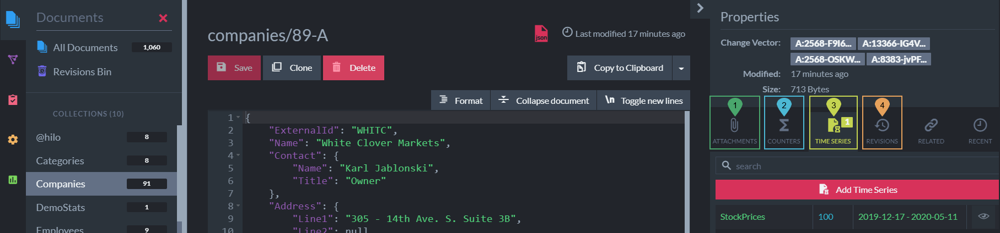

import Admonition from '@theme/Admonition';
import Tabs from '@theme/Tabs';
import TabItem from '@theme/TabItem';
import CodeBlock from '@theme/CodeBlock';
import LanguageSwitcher from "@site/src/components/LanguageSwitcher";
import LanguageContent from "@site/src/components/LanguageContent";
import ContentFrame from '@site/src/components/ContentFrame';
import Panel from '@site/src/components/Panel';

<Admonition type="note" title="">

* Document extensions are data entities associated with documents.  

* Document extensions are stored separately, so **modifying** an extension (e.g., a counter or time series entry)  
  does not modify the parent document.

* **Creating or deleting** an extension modifies the parent document's metadata.  
  This change may trigger indexing, ETL tasks, or other operations.

* On a [sharded database](../sharding/overview.mdx), document extensions are stored in the same bucket as their parent document.  
  Learn more in [Sharding: Document Extensions](../sharding/document-extensions.mdx).  

* In this article:  
   * [Document extensions](../document-extensions/overview#document-extensions)  
   * [Document extensions in the Studio](../document-extensions/overview#document-extensions-in-the-studio)  

</Admonition>

<Panel heading="Document extensions">

* [Counters](../document-extensions/counters/overview.mdx)  
  RavenDB’s distributed counters are numeric values attached to documents,  
  used to maintain and increment counts in the database, across all nodes in the cluster.  
  They are suitable for counting tasks in a distributed environment, such as tracking views, votes, or usage metrics.

* [Attachments](../document-extensions/attachments/overview.mdx)  
  Attachments are binary streams (e.g., videos, images, PDFs) that can be associated with an existing document.

* [Time Series](../document-extensions/timeseries/overview.mdx)  
  Time series are sequences of timestamped values collected over time, stored consecutively,  
  and optimized for efficient, high-performance data handling across the cluster.

* [Revisions](../document-extensions/revisions/overview.mdx)  
  Revisions are snapshots of documents and their associated data,  
  allowing access to the document’s full history over time.

</Panel>

<Panel heading="Document extensions in the Studio">

### Extensions flags

1. **Documents Tab**  
   Open the _Documents_ tab.  
2. **Collection**  
   Select a collection. 
3. **Extensions flags**  
   View which types of extensions are associated with the documents.
   

---

### Extensions in the document view

Open a specific document to view and manage its extensions.  

1. Attachments
2. Counters
3. Time Series
4. Revisions
    
</Panel>