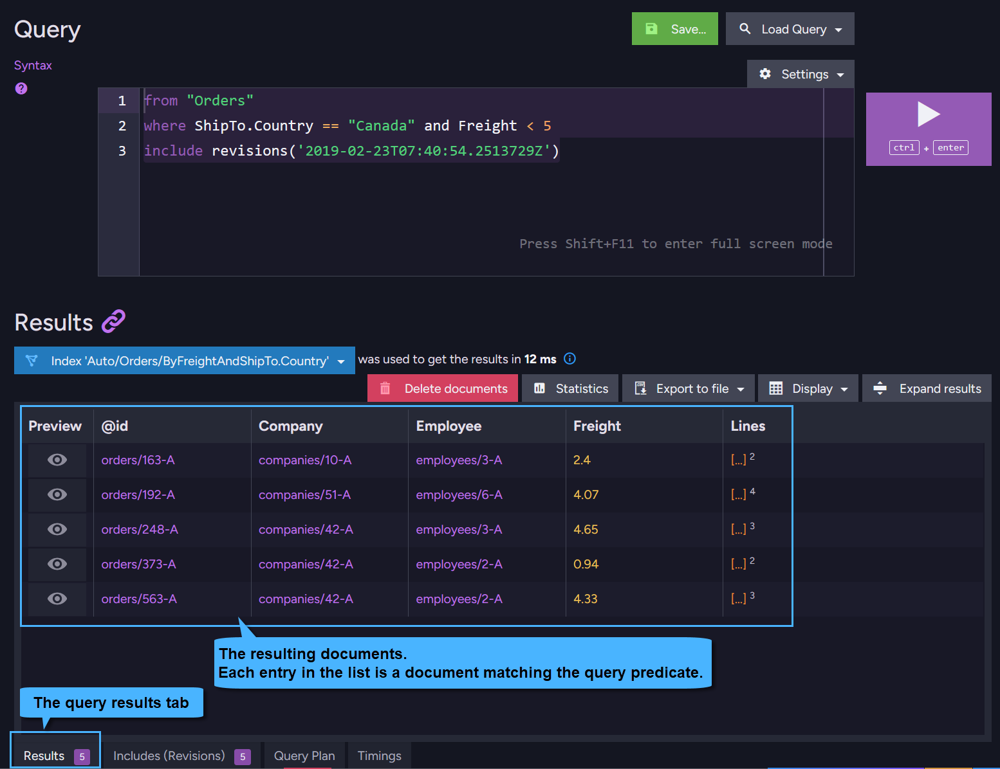
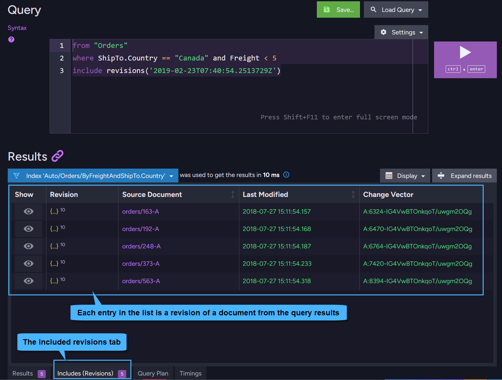

import Admonition from '@theme/Admonition';
import Tabs from '@theme/Tabs';
import TabItem from '@theme/TabItem';
import CodeBlock from '@theme/CodeBlock';
import Panel from "@site/src/components/Panel";
import ContentFrame from "@site/src/components/ContentFrame";

<Admonition type="note" title="">

* Document revisions can be [included](../../../../../client-api/how-to/handle-document-relationships.mdx#includes) in results when:  
  * **Making a query** (`session.query`/`session.advanced.rawQuery`)
  * **Loading a document** (`session.load`) from the server  

* The revisions to include can be specified by:
  * **Creation time** - use this to include a **single** revision
  * **Change vector** - use this to include **one or more** revisions

* In this article:
  * [Overview:](../../../../../document-extensions/revisions/client-api/session/including.mdx#overview)
      * [Why include revisions](../../../../../document-extensions/revisions/client-api/session/including.mdx#why-include-revisions)
      * [Including by creation time](../../../../../document-extensions/revisions/client-api/session/including.mdx#including-by-creation-time)
      * [Including by change vector](../../../../../document-extensions/revisions/client-api/session/including.mdx#including-by-change-vector)
  * [Include revisions when Loading](../../../../../document-extensions/revisions/client-api/session/including.mdx#include-revisions-when-loading)
  * [Include revisions when Querying - High-level query](../../../../../document-extensions/revisions/client-api/session/including.mdx#include-revisions-when-querying-high-level-query)
  * [Include revisions when Querying - Raw query](../../../../../document-extensions/revisions/client-api/session/including.mdx#include-revisions-when-querying-raw-query)
  * [View included revisions in Studio](../../../../../document-extensions/revisions/client-api/session/including.mdx#view-included-revisions-in-studio)
  * [Patching the revision change vector](../../../../../document-extensions/revisions/client-api/session/including.mdx#patching-the-revision-change-vector)
  * [Syntax](../../../../../document-extensions/revisions/client-api/session/including.mdx#syntax)

</Admonition>

<Panel heading="Overview">

<Admonition type="note" title="">

#### Why include revisions:

* Including revisions may be useful, for example, when an auditing application loads or queries for a document.  
  The document's past revisions can be included with the document to make the document's history available for instant inspection.  

* Once revisions are loaded into the session, accessing them requires no additional trips to the server.  
  [Getting](../../../../../document-extensions/revisions/client-api/session/loading.mdx) a revision that was included with the document will retrieve it directly from the session.  
  This also holds true when attempting to include revisions but none are found.

</Admonition>

<Admonition type="note" title="">

#### Including by creation time:

* When specifying a creation time, only a **single** revision can be included per document.  
  To include **multiple** revisions, use [change vectors](../../../../../document-extensions/revisions/client-api/session/including.mdx#including-by-change-vector) instead.

* You can pass local time or UTC, either way the server will convert it to UTC.  

* **If the provided time matches** the creation time of a document revision, this revision will be included.

* **If no exact match is found**, then the first revision that precedes the specified time will be returned.

</Admonition>

<Admonition type="note" title="">

#### Including by change vector:

* Unlike using [creation time](../../../../../document-extensions/revisions/client-api/session/including.mdx#including-by-creation-time), which limits you to a **single** revision,  
  including by change vector allows you to include **one or more** revisions per document.

* Each time a document is modified, its [Change Vector](../../../../../server/clustering/replication/change-vector.mdx) is updated.  

* When a revision is created,  
  the revision's change vector is the change vector of the document at the time of the revision's creation.  

* To include single or multiple document revisions by their change vectors:   

  * When modifying the document, store its updated change vector in a property in the document.  
    This can be done by [patching](../../../../../document-extensions/revisions/client-api/session/including.mdx#patching-the-revision-change-vector) the document from the Client API or from the Studio.  
  
  * Specify the **path** to this property when including the revisions, see examples below.  
  
  * For example:  
    Each time an employee's contract document is modified (e.g. when their salary is raised),  
    you can add the current change vector of the document to a dedicated property in the document.  
    Whenever the time comes to re-evaluate an employee's terms and their contract is loaded,  
    its past revisions can be easily included with it by their change vectors.

</Admonition>

</Panel>

<Panel heading="Include revisions when Loading">

#### Include a revision by creation time:

<TabItem>
<CodeBlock language="php">
{`// The revision creation time
// For example - looking for a revision from last month
$creationTime = (new DateTime())->sub(new DateInterval("P1M"));

// Load a document and include its revision from the specified time
$order = $session->load(Order::class, "orders/1-A", function($builder) use ($creationTime) \{
        return $builder
            // * Pass the revision creation time to 'includeRevisionsBefore'.
            //   The revision will be 'loaded' to the session along with the document.
            // * If no revision was created at this exact time,
            //   then the first revision preceding it will be included.
            ->includeRevisionsBefore($creationTime);
    \});

// Get the revision by creation time - it will be retrieved from the SESSION
// No additional trip to the server is made.
$revision = $session
    ->advanced()->revisions()->get(Order::class, "orders/1-A", $creationTime);
`}
</CodeBlock>
</TabItem>

#### Include revisions by change vector: 
   
<Tabs>    
<TabItem value="Load_and_include_revisions" label="Load_and_include_revisions">
<CodeBlock language="php">
{`// Load a document:
$contract = $session->load(Contract::class, "contracts/1-A", function($builder) \{

// Load a document:
$contract = $session->load(Contract::class, "contracts/1-A", function($builder) {
    return $builder
        // To include a SINGLE revision,
        // pass the path to the document property that contains the revision change vector.
        ->includeRevisions("RevisionChangeVector")
        
        // To include MULTIPLE revisions,
        // pass the path to the document property that contains the list of change vectors.
        ->includeRevisions("RevisionChangeVectors");
\});

// The revision(s) will be 'loaded' to the session along with the document.

// Get the revision(s) by change vectors - it will be retrieved from the SESSION
// No additional trip to the server is made
$revision = $session->advanced()->revisions()->get(Contract::class, "RevisionChangeVector");
$revisions = $session->advanced()->revisions()->get(Contract::class, "RevisionChangeVectors");
`}
</CodeBlock>
</TabItem>
<TabItem value="Sample_document" label="Sample document">
<CodeBlock language="php">
{`// Sample Contract document
class Contract
\{
    private ?string $id = null;
    private ?string $name = null;
    private ?string $revisionChangeVector = null; // A single change vector
    private ?array $revisionChangeVectors = null; // A list of change vectors

    public function getId(): ?string
    \{
        return $this->id;
    \}

    public function setId(?string $id): void
    \{
        $this->id = $id;
    \}

    public function getName(): ?string
    \{
        return $this->name;
    \}

    public function setName(?string $name): void
    \{
        $this->name = $name;
    \}

    public function getRevisionChangeVector(): ?string
    \{
        return $this->revisionChangeVector;
    \}

    public function setRevisionChangeVector(?string $revisionChangeVector): void
    \{
        $this->revisionChangeVector = $revisionChangeVector;
    \}

    public function getRevisionChangeVectors(): ?array
    \{
        return $this->revisionChangeVectors;
    \}

    public function setRevisionChangeVectors(?array $revisionChangeVectors): void
    \{
        $this->revisionChangeVectors = $revisionChangeVectors;
    \}
\}
`}
</CodeBlock>
</TabItem>
</Tabs>

</Panel>

<Panel heading="Include revisions when Querying - High-level query">

#### Include revisions by creation time:

<Tabs>
<TabItem value="Query_and_include_revisions" label="Query_and_include_revisions">
<CodeBlock language="php">
{`// The revision creation time
// For example - looking for revisions from last month
$creationTime = (new DateTime())->sub(new DateInterval("P1M"));

// Query for documents:
$orderDocuments = $session->query(Order::class)
    ->whereEquals("ShipTo.Country",  "Canada")
    // * Pass the revision creation time to 'IncludeRevisionsBefore'
    // * If no revision was created at this exact time,
    //   then the first revision preceding it will be included.
    ->include(function($builder) use ($creationTime) \{ return $builder->includeRevisionsBefore($creationTime); \})
    // For each document in the query results,
    // the matching revision will be 'loaded' to the session along with the document.
    ->toList();

// When getting a revision by its creation time for a document from the query results,
// the revision will be retrieved from the SESSION - no additional trip to the server is made.
$revision = $session
    ->advanced()->revisions()->getBeforeDate(Order::class, $orderDocuments[0]->getId(), $creationTime);
`}
</CodeBlock>
</TabItem>
<TabItem value="RQL" label="RQL">
```sql
from "Orders"
where ShipTo.Country = $p0
include revisions('2026-02-23T07:40:54.2513729Z')
{"p0":"Canada"}
```
</TabItem>
</Tabs>

#### Include revisions by change vector:

<Tabs>
<TabItem value="Query_and_include_revisions" label="Query_and_include_revisions">
<CodeBlock language="php">
{`// Query for documents:
$orderDocuments = $session->query(Contract::class)
    // Pass the path to the document property that contains the revision change vector(s)
    ->include(function($builder) \{
         return $builder
             // To include a SINGLE revision,
             // pass the path to the document property that contains the revision change vector.
             ->includeRevisions("getRevisionChangeVector")   // Include a single revision
             
             // To include MULTIPLE revisions,
             // pass the path to the document property that contains the list of change vectors.
             ->includeRevisions("getRevisionChangeVectors"); // Include multiple revisions
     \})
    // For each document in the query results,
    // the matching revisions will be 'loaded' to the session along with the document.
    ->toList();

// When getting the revision(s) by change vectors for documents from the query results,
// they will be retrieved from the SESSION - no additional trips to the server are made.
$revision = $session
    ->advanced()->revisions()->get(Contract::class, $orderDocuments[0]->getRevisionChangeVector());
$revisions = $session
    ->advanced()->revisions()->get(Contract::class, $orderDocuments[0]->getRevisionChangeVectors());
`}
</CodeBlock>
</TabItem>
<TabItem value="RQL" label="RQL">
```sql
from "Contracts"
include revisions('RevisionChangeVector'), revisions('RevisionChangeVectors')
```
</TabItem>
<TabItem value="Sample_document" label="Sample document">
<CodeBlock language="php">
{`// Sample Contract document
class Contract
\{
    private ?string $id = null;
    private ?string $name = null;
    private ?string $revisionChangeVector = null; // A single change vector
    private ?array $revisionChangeVectors = null; // A list of change vectors

    public function getId(): ?string
    \{
        return $this->id;
    \}

    public function setId(?string $id): void
    \{
        $this->id = $id;
    \}

    public function getName(): ?string
    \{
        return $this->name;
    \}

    public function setName(?string $name): void
    \{
        $this->name = $name;
    \}

    public function getRevisionChangeVector(): ?string
    \{
        return $this->revisionChangeVector;
    \}

    public function setRevisionChangeVector(?string $revisionChangeVector): void
    \{
        $this->revisionChangeVector = $revisionChangeVector;
    \}

    public function getRevisionChangeVectors(): ?array
    \{
        return $this->revisionChangeVectors;
    \}

    public function setRevisionChangeVectors(?array $revisionChangeVectors): void
    \{
        $this->revisionChangeVectors = $revisionChangeVectors;
    \}
\}
`}
</CodeBlock>
</TabItem>
</Tabs>

</Panel>

<Panel heading="Include revisions when Querying - Raw query">

* Use `include revisions` in your RQL when making a raw query.   

* Pass either the revision creation time or the path to the document property containing the change vector(s),  
  RavenDB will figure out the parameter type passed and include the revisions accordingly.  

* Aliases (e.g. `from Users as U`) are Not supported by raw queries that include revisions.

#### Include revisions by Time:

<Tabs>
<TabItem value="Query_and_include_revisions" label="Query_and_include_revisions">
<CodeBlock language="php">
{`// The revision creation time
// For example - looking for revisions from last month
$creationTime = (new DateTime())->sub(new DateInterval("P1M"));

// Query for documents with Raw Query:
$orderDocuments = $session->advanced()
     // Use 'include revisions' in the RQL
    ->rawQuery(Order::class, "from Orders include revisions(\\$p0)")
     // Pass the revision creation time
    ->addParameter("p0", $creationTime)
     // For each document in the query results,
     // the matching revision will be 'loaded' to the session along with the document
    ->toList();

// Get a revision by its creation time for a document from the query results
// It will be retrieved from the SESSION - no additional trip to the server is made
$revision = $session
    ->advanced()->revisions()->getBeforeDate(Order::class, $orderDocuments[0]->getId(), $creationTime);
`}
</CodeBlock>
</TabItem>
<TabItem value="RQL" label="RQL">
```sql
from "Orders"
include revisions('2026-02-23T07:40:54.2513729Z')
```
</TabItem>
</Tabs>

#### Include revisions by Change Vector:

<Tabs>
<TabItem value="Query_and_include_revisions" label="Query_and_include_revisions">
<CodeBlock language="php">
{`// Query for documents with Raw Query:
$orderDocuments = $session->advanced()
     // Use 'include revisions' in the RQL
    ->rawQuery(Contract::class, "from Contracts include revisions(\\$p0, \\$p1)")
     // Pass the path to the document properties containing the change vectors
    ->addParameter("p0", "RevisionChangeVector")
    ->addParameter("p1", "RevisionChangeVectors")
     // For each document in the query results,
     // the matching revisions will be 'loaded' to the session along with the document
    ->toList();

// Get the revision(s) by change vectors - it will be retrieved from the SESSION
// No additional trip to the server is made
$revision = $session
    ->advanced()->revisions()->get(Contract::class, $orderDocuments[0]->getRevisionChangeVector());
$revisions = $session
    ->advanced()->revisions()->get(Contract::class, $orderDocuments[0]->getRevisionChangeVectors());
`}
</CodeBlock>
</TabItem>
<TabItem value="RQL" label="RQL">
```sql
from "Contracts"
include revisions('RevisionChangeVector'), revisions('RevisionChangeVectors')
```
</TabItem>
<TabItem value="Sample_document" label="Sample document">
<CodeBlock language="php">
{`// Sample Contract document
class Contract
\{
    private ?string $id = null;
    private ?string $name = null;
    private ?string $revisionChangeVector = null; // A single change vector
    private ?array $revisionChangeVectors = null; // A list of change vectors

    public function getId(): ?string
    \{
        return $this->id;
    \}

    public function setId(?string $id): void
    \{
        $this->id = $id;
    \}

    public function getName(): ?string
    \{
        return $this->name;
    \}

    public function setName(?string $name): void
    \{
        $this->name = $name;
    \}

    public function getRevisionChangeVector(): ?string
    \{
        return $this->revisionChangeVector;
    \}

    public function setRevisionChangeVector(?string $revisionChangeVector): void
    \{
        $this->revisionChangeVector = $revisionChangeVector;
    \}

    public function getRevisionChangeVectors(): ?array
    \{
        return $this->revisionChangeVectors;
    \}

    public function setRevisionChangeVectors(?array $revisionChangeVectors): void
    \{
        $this->revisionChangeVectors = $revisionChangeVectors;
    \}
\}
`}
</CodeBlock>
</TabItem>
</Tabs>

</Panel>

<Panel heading="View included revisions in Studio">

Included revisions can be viewed in the Studio's [Query View](../../../../../studio/database/queries/query-view.mdx).  
Run a query that includes revisions, for example:
```sql
from "Orders"
where ShipTo.Country == "Canada" and Freight < 5
include revisions('2019-02-23T07:40:54.2513729Z')
```
The included revisions will be listed in a dedicated **Revisions Tab** under the query results.
    
---    

**The resulting documents**:
    

    
---
    
**The included revisions**:    
    


</Panel>

<Panel heading="Patching the revision change vector">

* When [including revisions by change vector](../../../../../document-extensions/revisions/client-api/session/including.mdx#including-by-change-vector)
  rather than by [creation time](../../../../../document-extensions/revisions/client-api/session/including.mdx#including-by-creation-time),  
  you need to specify the path to a document property that contains the revision change vector(s).  

* The example below shows how to retrieve a revision's change vector and patch it into a document property  
  so that it can later be used to include that revision.  

<Tabs>
<TabItem value="patch_the_document" label="patch_the_document">
<CodeBlock language="php">
{`$session = $store->openSession();
try \{
    // Get the revisions' metadata for document 'contracts/1-A'
    /** @var array<MetadataAsDictionary> $contractRevisionsMetadata */
    $contractRevisionsMetadata =
        $session->advanced()->revisions()->getMetadataFor("contracts/1-A");

    // Get a change vector from the metadata
    $changeVector = $contractRevisionsMetadata[array_key_first($contractRevisionsMetadata)]->getString(DocumentsMetadata::CHANGE_VECTOR);

    // Patch the document - add the revision change vector to a specific document property
    $session->advanced()
        ->patch( "contracts/1-A", "RevisionChangeVector", $changeVector);

    // Save your changes
    $session->saveChanges();
\} finally \{
    $session->close();
\}
`}
</CodeBlock>
</TabItem>
<TabItem value="Sample_document" label="Sample document">
<CodeBlock language="php">
{`// Sample Contract document
class Contract
\{
    private ?string $id = null;
    private ?string $name = null;
    private ?string $revisionChangeVector = null; // A single change vector
    private ?array $revisionChangeVectors = null; // A list of change vectors

    public function getId(): ?string
    \{
        return $this->id;
    \}

    public function setId(?string $id): void
    \{
        $this->id = $id;
    \}

    public function getName(): ?string
    \{
        return $this->name;
    \}

    public function setName(?string $name): void
    \{
        $this->name = $name;
    \}

    public function getRevisionChangeVector(): ?string
    \{
        return $this->revisionChangeVector;
    \}

    public function setRevisionChangeVector(?string $revisionChangeVector): void
    \{
        $this->revisionChangeVector = $revisionChangeVector;
    \}

    public function getRevisionChangeVectors(): ?array
    \{
        return $this->revisionChangeVectors;
    \}

    public function setRevisionChangeVectors(?array $revisionChangeVectors): void
    \{
        $this->revisionChangeVectors = $revisionChangeVectors;
    \}
\}
`}
</CodeBlock>
</TabItem>
</Tabs>

</Panel>

<Panel heading="Syntax">

<TabItem>
<CodeBlock language="php">
{`// Include a single revision by Time
public function includeRevisionsBefore(DateTime $before): IncludeBuilderInterface;

// Include a single revision by Change Vector path(s)
public function includeRevisions(string $changeVectorPaths): IncludeBuilderInterface;
`}
</CodeBlock>
</TabItem>

| Parameters | Type | Description |
| - | - | - |
| **before** | `DateTime` | Creation time of the revision to be included.<br/>Pass local time or UTC. The server will convert the param to UTC.<br/><br/>If no revision was created at this time then the first revision that precedes it is returned. |
| **changeVectorPaths** | `string` | The path to the document property that contains **an array of change vectors** of the revisions to be included. |

</Panel>
