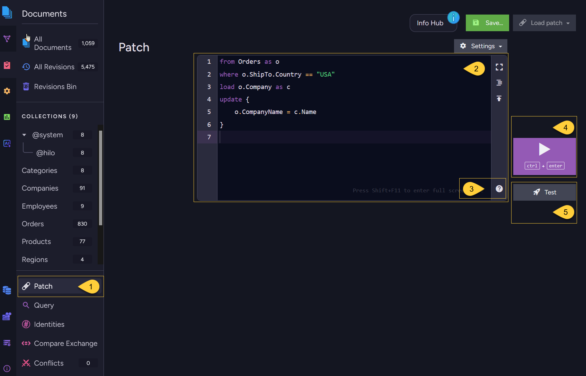
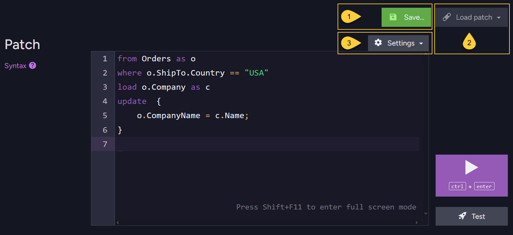
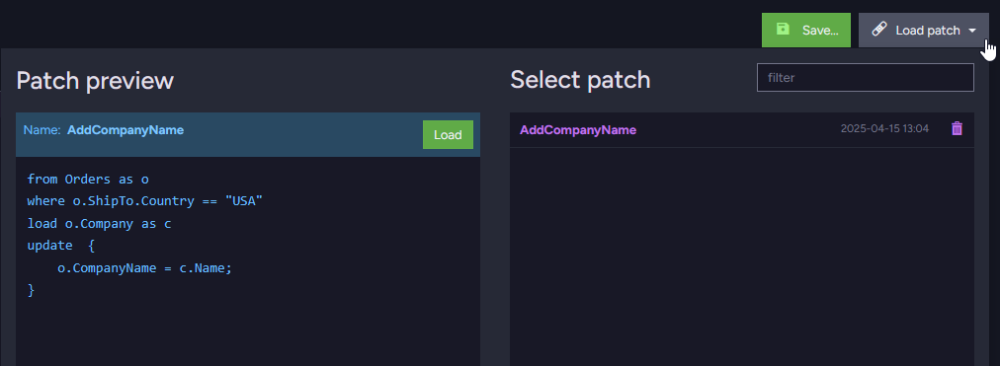
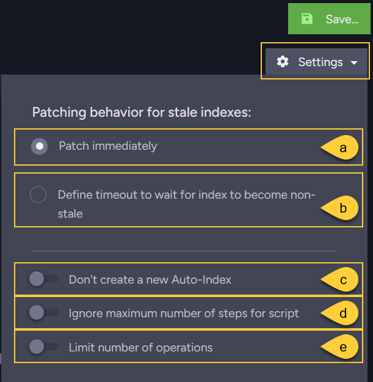
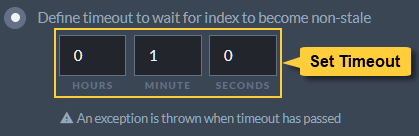
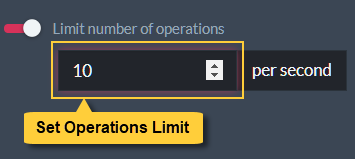
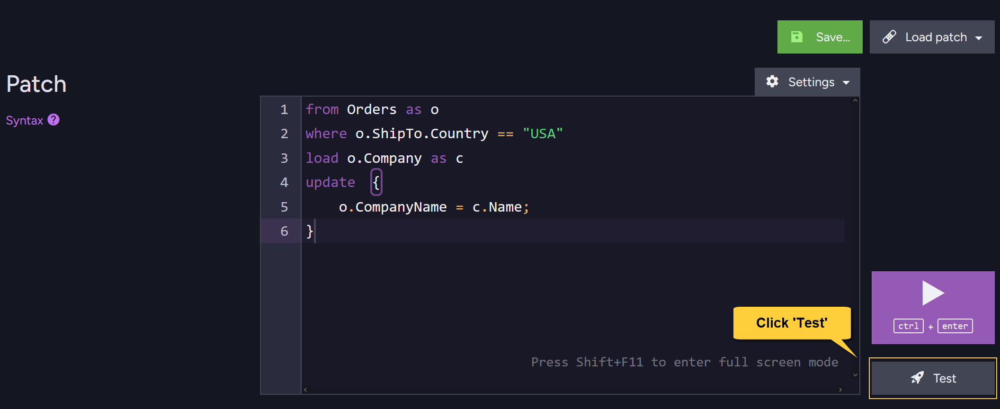
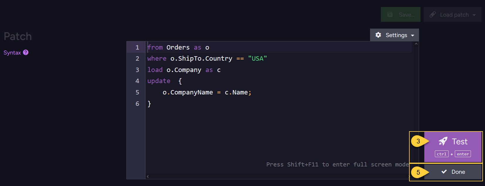
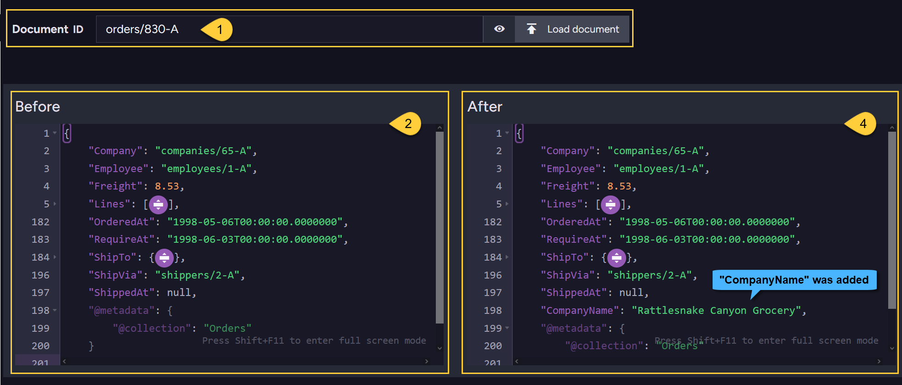
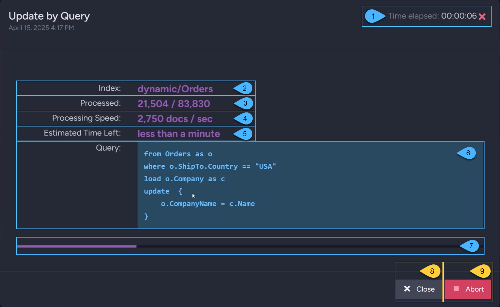

import Admonition from '@theme/Admonition';
import LanguageSwitcher from "@site/src/components/LanguageSwitcher";
import LanguageContent from "@site/src/components/LanguageContent";
import Tabs from '@theme/Tabs';
import TabItem from '@theme/TabItem';
import Panel from '@site/src/components/Panel';
import ContentFrame from '@site/src/components/ContentFrame';

<Admonition type="note" title="">

* Use the **Patch View** in Studio to apply a patch script to multiple documents in a single operation.  
    
* The entire patch script runs on the server:  
  the RQL query selects the documents, and the JavaScript `update` clause modifies each selected document.

* To patch documents using the Client API, see:
    * [Patch a Single Document: API Overview](../../../documents/patching-documents/patch-a-single-document/api-overview.mdx)
    * [Patch Multiple Documents Using the Client API](../../../documents/patching-documents/patch-multiple-documents/client-api.mdx)
    
* In this article:  
  * [The patch view](#the-patch-view)  
  * [The patch script](#the-patch-script)  
  * [Patch configuration](#patch-configuration)
  * [Test patch](#test-patch)
  * [Output debug information when testing](#output-debug-information-when-testing)    
  * [Apply patch](#apply-patch)  

</Admonition>

<Panel heading="The patch view">



1. **Open the patch view**  
   Go to _Documents &gt; Patch_.
2. **Enter the patch script**  
   Enter your [patch script](../../../documents/patching-documents/patch-multiple-documents/patch-view.mdx#the-patch-script) in the editor.
3. **Browse sample scripts and methods**  
   Click the help icon to open:
   * **Sample scripts** - Browse sample patch scripts and load one into the editor.
   * **Methods** - Browse available script methods and view their signatures, descriptions, and return types.  
   For additional examples, see [Patch multiple documents using the Client API](../../../documents/patching-documents/patch-multiple-documents/client-api.mdx#examples).
4. **Apply the patch**  
   Click the play button or press **Ctrl+Enter** to apply the patch to the documents selected by its RQL query.  
   See [Apply patch](../../../documents/patching-documents/patch-multiple-documents/patch-view.mdx#apply-patch) below.
5. **Test the patch**  
   Click **Test** to preview the patch on a selected document without modifying the stored document.  
   See [Test patch](../../../documents/patching-documents/patch-multiple-documents/patch-view.mdx#test-patch) below.

</Panel>

<Panel heading="The patch script">

* A patch script consists of two parts:
 
  1. **The `query`**:  
  An [RQL](../../../querying/rql/what-is-rql.mdx) query that selects the documents to update.  
  The selection portion uses the same RQL syntax used to query collections and indexes.    

  2. **The `update` clause**:  
  A JavaScript block that defines the changes to apply to each selected document.

* When the patch is applied, the server runs the query and executes the `update` clause for each selected document.
    

* For example, the following script selects orders shipped to the _USA_, loads each order's related _Company_ document,
  and adds the company's name to the order in a new `CompanyName` field:

```sql
// Update a set of documents from the Orders collection:
// =====================================================

// The RQL part:
from Orders as o
where o.ShipTo.Country == "USA"
load o.Company as c


// The UPDATE part:
update  {
    o.CompanyName = c.Name;
}
```

</Panel>

<Panel heading="Patch configuration">



1. **Save Patch**  
   Click **Save...**, enter a name for the patch, and then click **Save**.  
   The patch is saved in the browser's local storage for the current database.  
     
2. **Load Patch**  
   Click **Load patch** to view saved patches and recently executed patches.  
   Studio automatically stores up to six recent patches in the browser's local storage.  
     
   Hover over a patch name to preview its script.  
   Click the patch name or the preview's **Load** button to load it into the editor.  
3. <a id="patch-settings"/> **Patch Settings**  
     

    * **a. Patch immediately**  
      Allow the patch to run without waiting for the index used by the query to become non-stale.  
      If the index is stale, document selection is based on stale index results.

    * **b. Define timeout to wait for index to become non-stale**  
      Wait up to the specified timeout for the index used by the query to become [non-stale](../../../indexes/indexing-basics.mdx#stale-indexes).  
      If the timeout expires while the index is still stale, the operation fails with an exception and the patch is not applied.  
        

    * **c. Don't create a new Auto-Index**  
      Prevent the patch query from creating a new auto-index.  
      If no existing index can satisfy the query, the operation fails with an exception.  

      This toggle initially reflects the database's saved Studio configuration.  
      Changing it here affects patches run from this view but does not update the saved configuration.  
      To configure the default behavior for future Studio queries and patches, see
      [Disabling Auto-Index Creation on Studio Queries or Patches](../../../studio/database/settings/studio-configuration.mdx#disabling-auto-index-creation-on-studio-queries-or-patches).

    * **d. Ignore maximum number of steps for script**  
      By default, the server limits the number of steps that a patch script can execute.  
      The limit is defined by [Patching.MaxStepsForScript](../../../server/configuration/patching-configuration.mdx#patchingmaxstepsforscript) and defaults to 10,000.  
      Enable this option to ignore the limit for this patch operation.

    * **e. Limit number of operations**  
      Set the maximum number of matched documents that the patch operation can process per second.  
        

</Panel>

<Panel heading="Test patch">

* Before applying a patch, use test mode to preview its effect on a selected document without persisting any changes.

* Test mode does not execute the document-selection portion of the query.  
  Instead, Studio executes the `update` clause against the document whose ID you specify.  
  The query alias and any `load` clauses remain available to the update script.

* You can test the update against any existing document, even if that document would not match the query criteria.  
  Testing verifies the update script's behavior on that document;  
  it does not verify that the query selects the intended documents.

Click **Test** beside the patch editor to enter test mode:

  

The test view is displayed:




1. **Document ID**  
   Enter the ID of the document to test, and then click **Load document**.  
   The original document appears in the **Before** area.
2. **Before**  
   View the original document before the test patch is applied.
3. **Test**  
   Click **Test** or press **Ctrl+Enter** to execute the patch against the selected document in test mode.  
   No changes are persisted.
4. **After**  
   View the document as it would appear after the patch.  
   In this example, the new `CompanyName` property appears in the resulting document.
5. **Done**  
   Click **Done** to leave test mode and return to the patch view.

<ContentFrame>
    
---    

### Output debug information when testing

* Use `output(message)` to display debugging information while testing a patch in Studio.  
  Each call adds a message to the **Output** tab in the test view.

* Calls to `output()` are ignored when the patch operation runs normally;  
  they are not written to a server log.

    ```sql
    from Orders as o
    update {
        output("Freight before patch: " + o.Freight);
    
        o.Freight += 10;
    
        output("Freight after patch: " + o.Freight);
    }
    ```

</ContentFrame>     

</Panel>

<Panel heading="Apply patch">

Click the play button or press **Ctrl+Enter** to apply the patch.  
Studio displays a confirmation dialog containing the number of matching documents and the selected patch settings.  
Click **Patch all** to start the background operation.

The operation details dialog displays its progress:



1. **Time elapsed**  
   The time elapsed since the patch operation started.
2. **Index**  
   The query source used by the operation:
   * The index name, when the query explicitly specifies an index.
   * `dynamic/<collection>` for a dynamic query, as shown by `dynamic/Orders` in this example.
   * `collection/<collection>` for a collection query.
3. **Processed**  
   The number of documents processed so far, followed by the total number of selected documents.
4. **Processing speed**  
   The average number of documents processed per second since the operation started.
5. **Estimated time left**  
   The estimated time required to process the remaining documents, based on the current average processing speed.
6. **Query**  
   The RQL query and `update` clause being executed.
7. **Progress bar**  
   The proportion of the selected documents processed so far.
8. **Close**  
   Close the dialog without stopping the patch operation.  
   You can reopen the dialog from the Studio's Notification Center.
9. **Abort**  
   Request cancellation of the patch operation. Studio asks for confirmation before sending the request.   
   Changes committed before cancellation takes effect are not rolled back.  
   Documents that have not yet been processed remain unchanged.

</Panel>