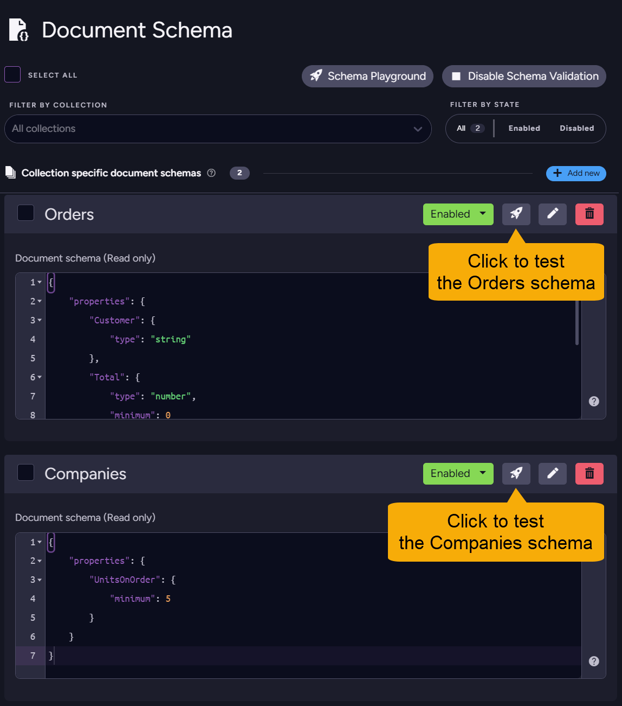
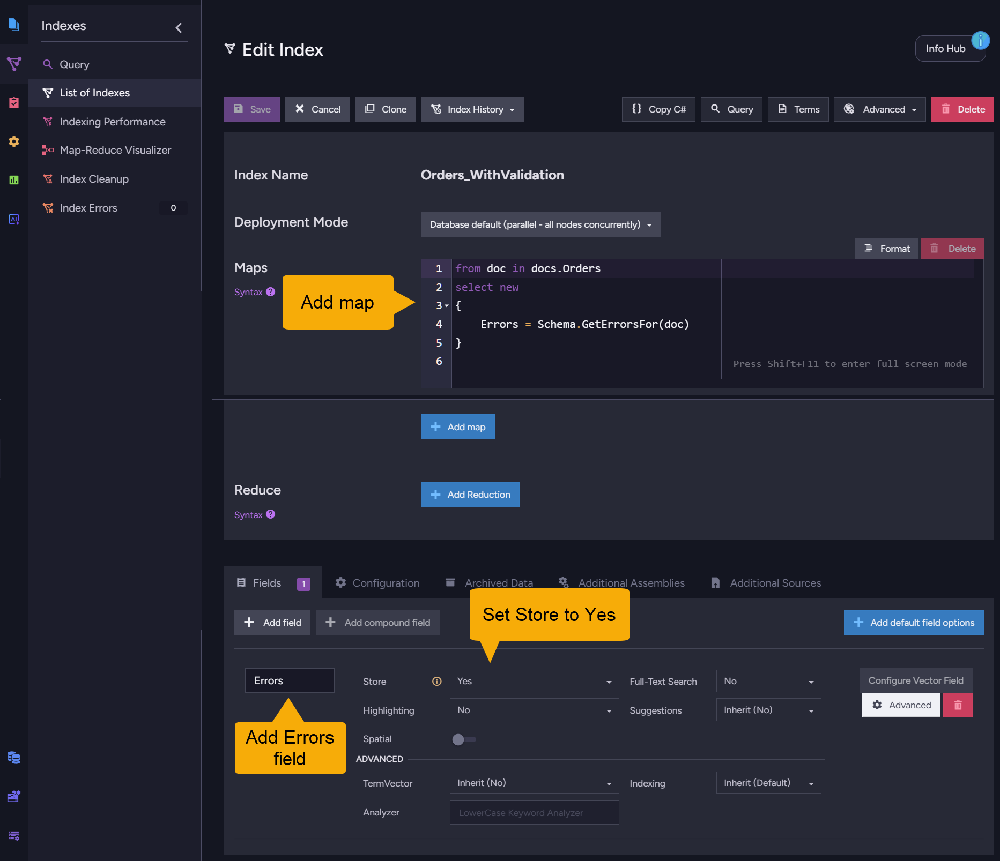
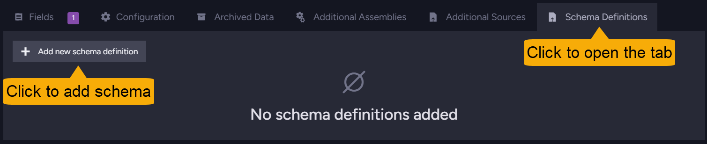
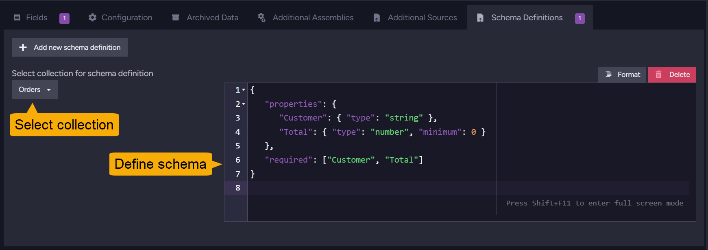
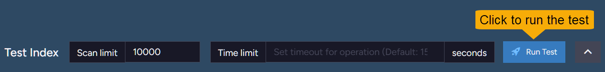
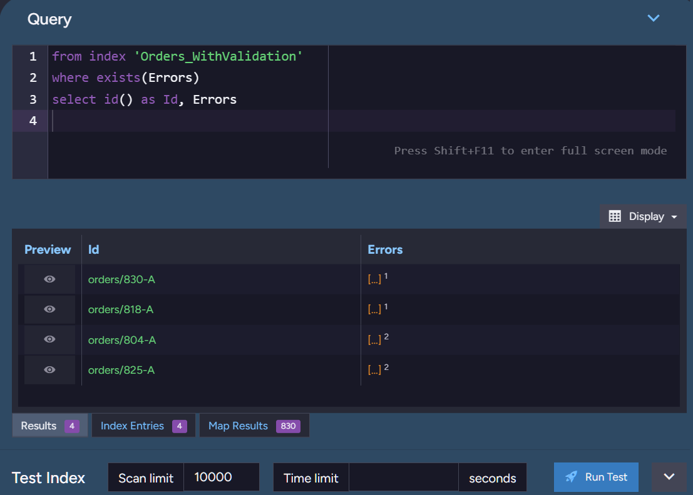
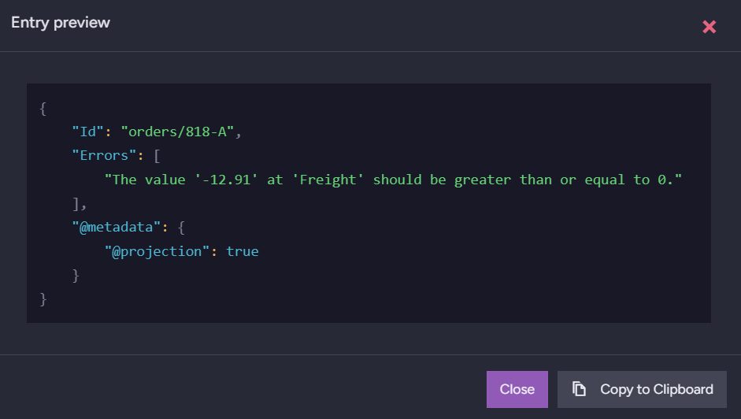

import Admonition from '@theme/Admonition';
import Tabs from '@theme/Tabs';
import TabItem from '@theme/TabItem';
import CodeBlock from '@theme/CodeBlock';
import LanguageSwitcher from "@site/src/components/LanguageSwitcher";
import LanguageContent from "@site/src/components/LanguageContent";
import ContentFrame from "@site/src/components/ContentFrame";
import Panel from "@site/src/components/Panel";

# Auditing document compliance: Studio
<Admonition type="note" title="">

To check document compliance with a validation schema via Studio, you can:  
 - Run a manual [validation test operation](../../../documents/schema-validation/auditing-document-compliance/auditing-document-compliance_studio#running-a-validation-test), that goes through a collection or a part of it and reports invalid documents and their validation errors.  
 - Create an [audit index](../../../documents/schema-validation/auditing-document-compliance/auditing-document-compliance_studio#audit-documents-compliance-by-index), that validates documents during indexing and stores any validation error messages in the index, so the documents can be queried by compliance status and specific validation error messages.  

* In this article:  
  * [Running a validation test](../../../documents/schema-validation/auditing-document-compliance/auditing-document-compliance_studio#running-a-validation-test)
    * [Test a schema using the Document Schema view](../../../documents/schema-validation/auditing-document-compliance/auditing-document-compliance_studio#test-a-schema-using-the-document-schema-view)  
    * [Test a schema using the Schema Playground](../../../documents/schema-validation/auditing-document-compliance/auditing-document-compliance_studio#test-a-schema-using-the-schema-playground)  
  * [Audit documents compliance by index](../../../documents/schema-validation/auditing-document-compliance/auditing-document-compliance_studio#audit-documents-compliance-by-index)
    * [Define a validation schema](../../../documents/schema-validation/auditing-document-compliance/auditing-document-compliance_studio#define-a-validation-schema)
    * [Create the audit index](../../../documents/schema-validation/auditing-document-compliance/auditing-document-compliance_studio#create-the-audit-index)
    * [Query the index](../../../documents/schema-validation/auditing-document-compliance/auditing-document-compliance_studio#query-the-index)

</Admonition>

<Panel heading="Running a validation test">

You can initiate a compliance test operation that validates documents against a schema, using either a defined schema listed in the [Document Schema view](../../../documents/schema-validation/write-validation/write-validation_studio#managing-and-testing-existing-schemas) or the [Schema playground](../../../documents/schema-validation/write-validation/write-validation_studio#the-schema-playground) views.  

<ContentFrame>

### Test a schema using the Document Schema view

The validation schemas that you already defined are displayed in the [Document Schema view](../../../documents/schema-validation/write-validation/write-validation_studio#creating-a-collection-schema), where you can test each schema against documents in the associated collection.  



* Use this method to verify schema effectiveness and documents compliance with schema constraints.  
* Test results include the number and names of invalid documents, and the validation error messages generated for each document.  
* You can validate an entire collection or a specified number of documents. This is helpful when working with large collections.  
* Find [here](../../../documents/schema-validation/write-validation/write-validation_studio#managing-and-testing-existing-schemas) a detailed explanation of this view. 

</ContentFrame>

<ContentFrame>

### Test a schema using the Schema Playground

The [Document Schema](../../../documents/schema-validation/write-validation/write-validation_studio#creating-a-collection-schema) view also provides an isolated playground environment for experimentation, allowing you to define schemas and try them out on your data without affecting your existing collections or schemas.


* Use the playground to experiment with schema definitions and test them against documents in your collections.  
* You can validate an entire collection or a specified number of documents.  
* You can test multiple schemas in a single run, including multiple schemas for the same collection. This is helpful when you want to compare the effectiveness of different schema definitions, validate a specific field across collections, or test a large dataset.
* Test results are presented per schema, detailing the number and names of invalid documents and the validation error messages generated for each document.  
* Find [here](../../../documents/schema-validation/write-validation/write-validation_studio#the-schema-playground) a detailed explanation of the playground.

</ContentFrame>

</Panel>

<Panel heading="Audit documents compliance by index">

You can define an **audit index** that validates documents against a schema during indexing and stores any validation error messages in the index.  
* The audit index can then be queried to find documents by compliance status and specific validation error messages.  
* Indexing is performed continuously in the background, preparing for validation queries that remain quick and efficient even with large datasets.  

<Admonition type="note" title="">
**Note** that disabling validation for the database or for the collection does **not** disable auditing by an index.  
</Admonition>

<ContentFrame>

#### Define a validation schema

The index will use the schema defined in its index configuration.  
See how to add a schema to the index configuration [below](../../../documents/schema-validation/auditing-document-compliance/auditing-document-compliance_studio#create-the-audit-index).  
* If no schema is defined in the index configuration, the index will use the [database-level schema](../../../documents/schema-validation/write-validation/write-validation_studio#creating-a-collection-schema).  
* If no schema is defined either in the index configuration or at the database level, the index will not perform any validation.

<Admonition type="note" title="">
**Note**: When the index uses a database-level schema, [disabling validation at the database level](../../../documents/schema-validation/write-validation/write-validation_studio#managing-and-testing-existing-schemas) will also disable auditing by the index.  
However, when the index uses an index-level schema, disabling database-level validation will **not** disable auditing by the index.
</Admonition>

</ContentFrame>

<ContentFrame>

#### Create the audit index

To [create the index](../../../studio/database/indexes/create-map-index), open **Indexes** > **List of indexes** and click the **New index** button.  

* Name the index, and add to its map a call to the validation method: `Schema.GetErrorsFor()` for a static index, or `schema.getErrorsFor()` for a JavaScript map.  
  Assign the value returned by the validation method to a dedicated index field, e.g., `Errors`.  

  <Tabs>
  
  <TabItem value="Static" label="Static">
  ```csharp
  from doc in docs
  let errors = Schema.GetErrorsFor(doc)
  where errors != null && errors.Length > 0
  select new 
  {
      Id = doc.Id,
      Errors = errors
  }
  ```  
  </TabItem>

  <TabItem value="JavaScript" label="JavaScript">
  ```javascript
  map("@all_docs", (doc) => { 
  let errors = schema.getErrorsFor(doc);
  if( errors != null && errors.length > 0)
      return {
          Id: id(doc),
          Errors: errors
      };
  })
  ```
  </TabItem>

  </Tabs>

* Add the validation error messages field (defined in the map) to the index.  
  Set the [Store](../../../indexes/storing-data-in-index/) option for this field to **Yes**, to store actual error messages in the index rather than just their tokens.  

  

* If you prefer that the index use an index-level schema, add it in the **Schema definition** tab.  
 
  Open the **Schema definition** tab and add a new schema definition.
  


  Select a collection to associate the schema with, and define the schema using JSON syntax.
  

* When you're done, remember to save the index.

</ContentFrame>

<ContentFrame>

#### Query the index

Query the index to find documents by compliance status and specific error messages.

* While building or editing the index, you can use the **Test Index** bar to query the index and verify its functionality.  
  

* Run queries that filter documents based on the `Errors` field.  
  

  Click an item's preview (eye) icon to view the document details, including the validation error messages stored in the index.  
  

</ContentFrame>

</Panel>


