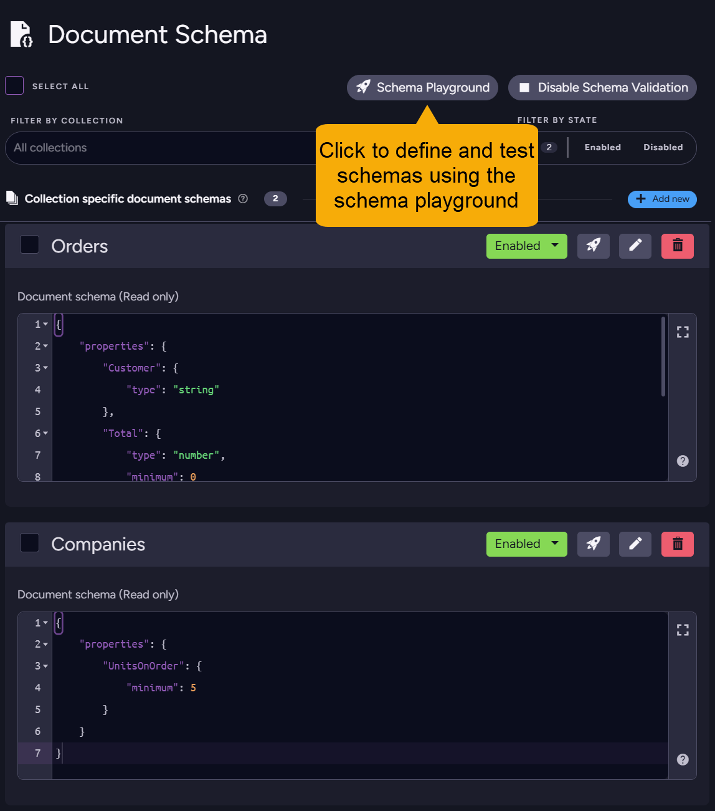
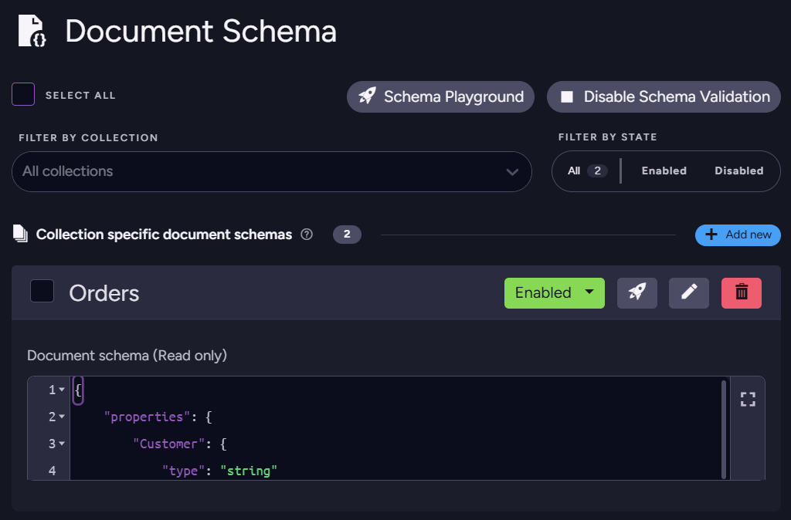

import Admonition from '@theme/Admonition';
import Tabs from '@theme/Tabs';
import TabItem from '@theme/TabItem';
import CodeBlock from '@theme/CodeBlock';
import LanguageSwitcher from "@site/src/components/LanguageSwitcher";
import LanguageContent from "@site/src/components/LanguageContent";
import ContentFrame from "@site/src/components/ContentFrame";
import Panel from "@site/src/components/Panel";

# Auditing document compliance: Studio
<Admonition type="note" title="">

To check document compliance with a validation schema via Studio, you can:  
 - Run a manual [validation test](../../../documents/schema-validation/auditing-document-compliance/auditing-document-compliance_studio#running-a-validation-test) operation, that goes through a collection or a part of it and reports invalid documents and their validation errors.  
 - Create an [audit index](../../../documents/schema-validation/auditing-document-compliance/auditing-document-compliance_studio#audit-documents-compliance-by-index), that validates documents during indexing and embeds any validation error messages into the index, so the documents can be queried by compliance status and specific validation errors.  

* In this article:  
  * [Running a validation test](../../../documents/schema-validation/auditing-document-compliance/auditing-document-compliance_studio#running-a-validation-test)
    * [Test a schema using the Document schema view](../../../documents/schema-validation/auditing-document-compliance/auditing-document-compliance_studio#test-a-schema-using-the-document-schema-view)  
    * [Test a schema using the Schema Playground](../../../documents/schema-validation/auditing-document-compliance/auditing-document-compliance_studio#test-a-schema-using-the-schema-playground)  
  * [Audit documents compliance by index](../../../documents/schema-validation/auditing-document-compliance/auditing-document-compliance_studio#audit-documents-compliance-by-index)
    * [Create a validation schema](../../../documents/schema-validation/auditing-document-compliance/auditing-document-compliance_studio#1-create-a-validation-schema)
    * [Create the index](../../../documents/schema-validation/auditing-document-compliance/auditing-document-compliance_studio#2-create-the-index)
    * [Query the index](../../../documents/schema-validation/auditing-document-compliance/auditing-document-compliance_studio#3-query-the-index)

</Admonition>

<Panel heading="Running a validation test">

You can initiate a compliance test operation that validates documents against a schema, using either a defined schema listed in the [Document Schema](../../../documents/schema-validation/write-validation/write-validation_studio#managing-and-testing-existing-schemas) view or the [Schema playground](../../../documents/schema-validation/write-validation/write-validation_studio#the-schema-playground) views.  

<ContentFrame>

### Test a schema using the Document schema view

The validation schemas that you already defined are displayed in the [Document schema view](../../../documents/schema-validation/write-validation/write-validation_studio#creating-a-collection-schema), where you can test each schema against documents in the associated collection.  


* Use this method to verify schemas' effectiveness and documents compliance with schema constraints.  
* Test results include the number and names of invalid documents, and the validation errors generated for each document.  
* You can validate an entire collection or a specified number of documents. This is helpful when working with large collections.  
* Find [here](../../../documents/schema-validation/write-validation/write-validation_studio#managing-and-testing-existing-schemas) a detailed explanation of this view. 

</ContentFrame>

<ContentFrame>

### Test a schema using the Schema Playground

The [Document schema view](../../../documents/schema-validation/write-validation/write-validation_studio#creating-a-collection-schema) view also provides an isolated playground environment for experimentation, allowing you to define schemas and try them out on your data without affecting your existing collections or schemas.



* Use the playground to experiment with schema definitions and test them against documents in your collections.  
* You can validate an entire collection or a specified number of documents.  
* You can test multiple schemas in a single run, including multiple schemas for the same collection. This is helpful when you want to compare the effectiveness of different schema definitions, validate a specific field across collections, or test a large dataset.
* Test results are presented per schema, detailing the number and names of invalid documents and the validation errors generated for each document.  
* Find [here](../../../documents/schema-validation/write-validation/write-validation_studio#the-schema-playground) a detailed explanation of the playground.

</ContentFrame>

</Panel>

<Panel heading="Audit documents compliance by index">

You can define an audit index that validates documents against a schema during indexing and embeds validation error messages in the index.  
* Query an audit index to find documents by compliance status and specific validation errors.  
* Use this method to prepare indexes over time for quick validation queries, keeping querying cheap even with large datasets, complex schemas, and frequently changing collections.  

<ContentFrame>

#### 1. Create a validation schema

* You can associate a validation schema with a collection using the 
[Document schema](../../../documents/schema-validation/write-validation/write-validation_studio#creating-a-collection-schema) view.  
  E.g. -  
  ```json
  {
  "properties": {
      "Customer": { "type": "string" },
      "Total": { "type": "number", "minimum": 0 }
  },
  "required": ["Customer", "Total"]
  }
  ```
  

* You can also define the schema as part of the index definition.  
  In this case, the index schema will take precedence over any schema defined for the collection.  
  If no schema is defined for the index, it will inherit the schema defined for the collection.  

</ContentFrame>

<ContentFrame>

#### 2. Create the index

* [Create an index](../../../studio/database/indexes/create-map-index) whose map includes a call to a validation method: `Schema.GetErrorsFor()` for a static index, or `schema.getErrorsFor()` for a JavaScript map.  
  Assign the value returned by the validation method to a dedicated index field, e.g., `Errors`.  
  <Tabs>
  <TabItem value="Static" label="Static">
  ```csharp
  from doc in docs.Orders
  select new
  {
    Errors = Schema.GetErrorsFor(doc)
  }
  ```  
  </TabItem>

  <TabItem value="JavaScript" label="JavaScript">
  ```javascript
  map('Orders', function (doc) {
    return {
      Errors: schema.getErrorsFor(doc)
    };
  })
  ```
  </TabItem>
  </Tabs>

 * Add to the index the field defined in the map for validation errors, e.g., `Errors`.  
   Set the "Store" option for this field to **Yes**, indicating that querying the index will retrieve errors from the index rather than from indexed documents.  

   
   
</ContentFrame>

<ContentFrame>

#### 3. Query the index

Query the index to find documents by their compliance status and specific errors.

* While building or editing the index, you can use the **Test Index** bar to query the index and verify its functionality.  
  

* Run queries that filter documents based on the `Errors` field.  
  

  Click an item's preview icon to view the document details, including the validation errors embedded in the index.  
  

</ContentFrame>

</Panel>


