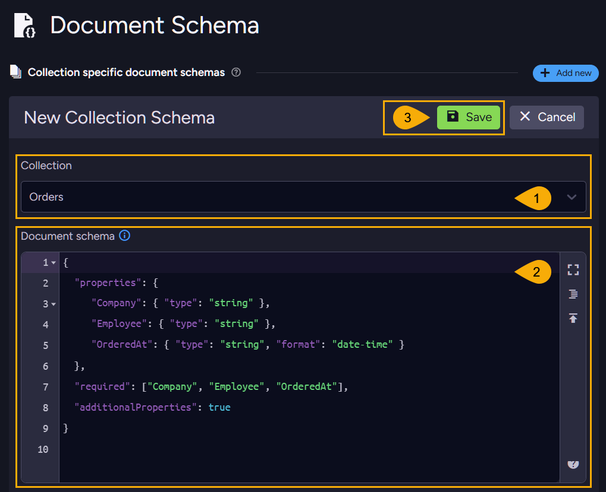
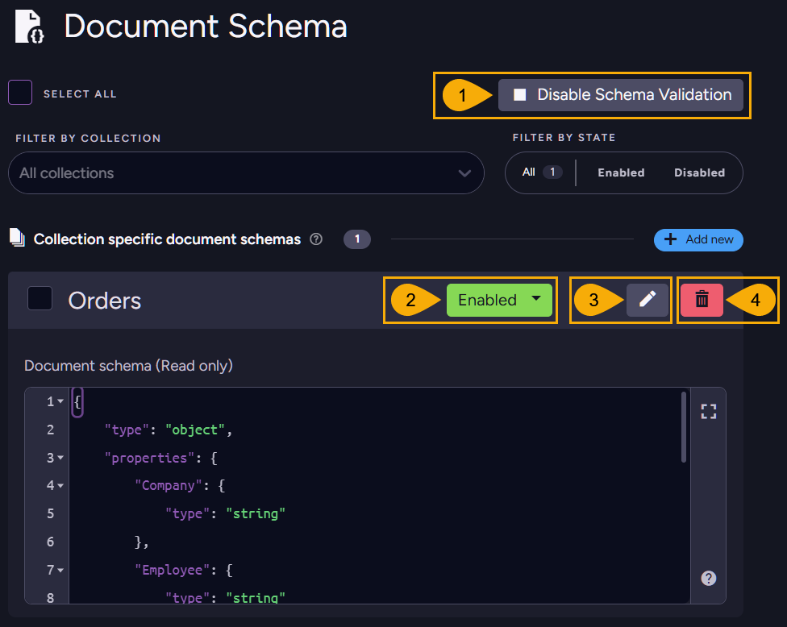

import Admonition from '@theme/Admonition';
import Tabs from '@theme/Tabs';
import TabItem from '@theme/TabItem';
import CodeBlock from '@theme/CodeBlock';
import LanguageSwitcher from "@site/src/components/LanguageSwitcher";
import LanguageContent from "@site/src/components/LanguageContent";
import Panel from "@site/src/components/Panel";

# Validate documents: Studio
<Admonition type="note" title="">

You can use Studio to manage document validation schemas.

* In this article:  
   * [The Document Scheme view](../../../documents/schema-validation/validate-documents/validate-documents_studio#the-document-scheme-view)  
   * [Creating a collection schema](../../../documents/schema-validation/validate-documents/validate-documents_studio#creating-a-collection-schema)  
   * [Managing existing schemas](../../../documents/schema-validation/validate-documents/validate-documents_studio#managing-existing-schemas)  
   
</Admonition>

## The Document Scheme view
<Panel>
To create a validation schema:


1. **Database settings**  
   Click to open this view.
2. **Document schema**  
   Click to open this view.
3. **Add new**  
   Click to create a new validation schema.  
   
</Panel>

## Creating a collection schema
<Panel>
To define a schema and associate it with a collection:


1. **Collection selection**  
   Pick the collection whose documents you want to validate.  
   You can create one validation schema per collection, so if a schema already exists for a collection it will not be listed here.
2. **Define the schema using JSON syntax**  
   The depicted schema, for example, sets constraints for documents in the "Orders" collection.  
   A textual version is also provided below. Note that the comments included in it are meant to explain its structure and constraints, but comments are not supported in actual JSON syntax.  
   ```json
   {
      // Enforce property types
      "properties": {
         // Company ID (e.g., "companies/65-A")
         "Company": { "type": "string" },

         // Employee ID (e.g., "orders/1-A")
         "Employee": { "type": "string" },

         // Order time (e.g., "1998-05-06T00:00:00.0000000")
         "OrderedAt": { "type": "string", "format": "date-time" }
      },

      // These properties must be present in every Order document
      "required": ["Company", "Employee", "OrderedAt"],

      // Allow additional properties beyond those defined here
      "additionalProperties": true
   }
   ```
3. **Save**  
   Click to save and enable the schema.  
   When enabled, any document saved to the "Orders" collection will be validated against it.  
   E.g., attempting to save an "Order" document missing the "Company" field will result in a validation error:
   ```plain
   Raven.Client.Exceptions.SchemaValidation.SchemaValidationException: The required property 'Company' is missing.
   ```
   <Admonition type="note" title="">
   Note that once a schema is enabled for a collection, collection documents are validated when they are saved directly, as well as when they are added or modified by operations such as patching or ETL tasks. (See a list of [operations that trigger validation](../../../documents/schema-validation/schema-validation_overview#a-list-of-operations-that-trigger-validation).)
   </Admonition>
</Panel>

## Managing existing schemas
<Panel>
Created validation schemas are listed in the **Document schema** view, where you can edit,disable, enable, or delete them. 


1. **Disable/Enable validation per database**  
   Toggle to enable or disable schema validation for all collections.  
   This setting overrides per-collection schema settings.  
2. **Disable/Enable validation per collection**  
   Toggle to enable or disable schema validation for this collection.  
   Note that if validation is disabled for the database, this setting will have no effect.
3. **Edit**  
   Click to edit an existing schema.  
4. **Delete**  
   Click to delete an existing schema.  
</Panel>
