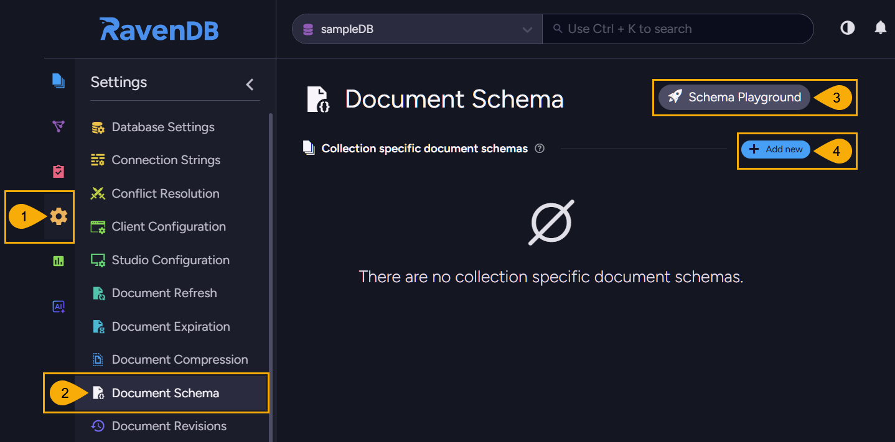
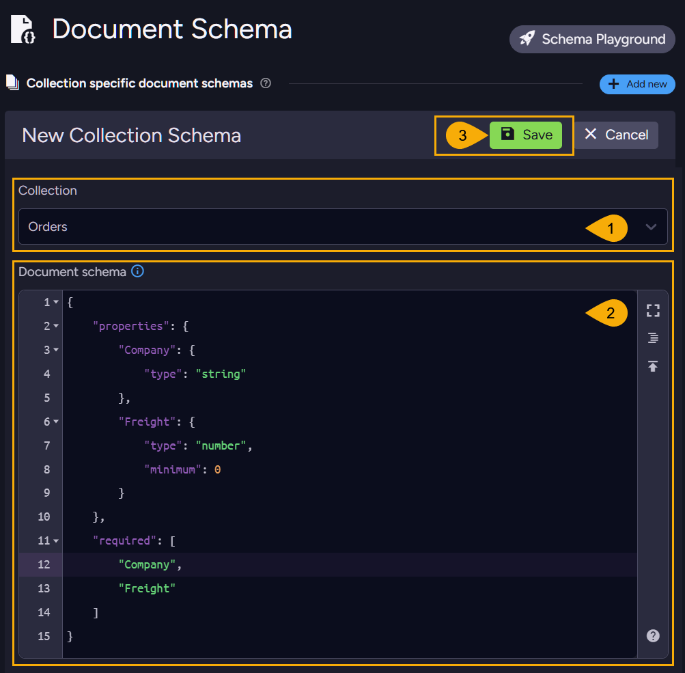
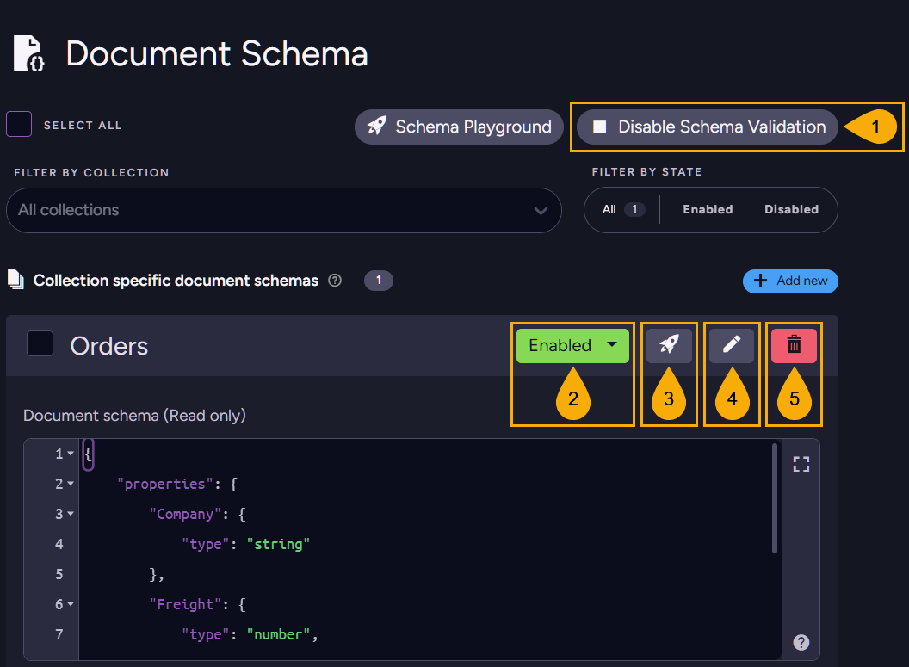
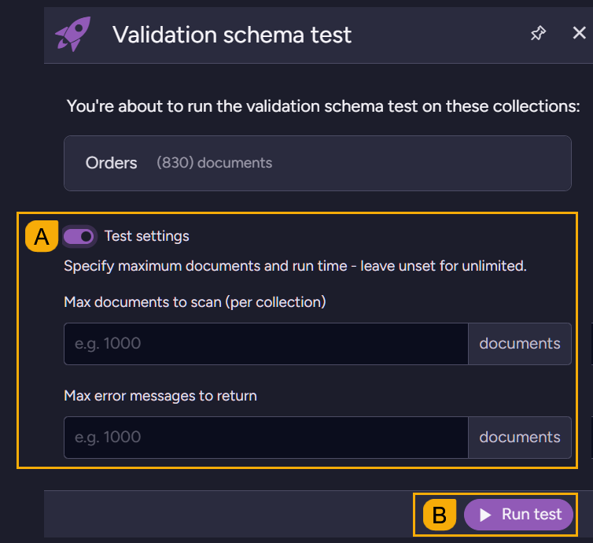
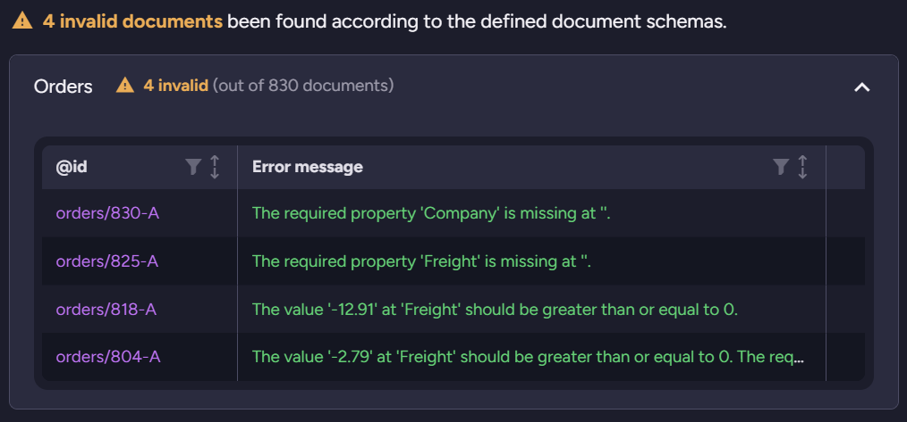
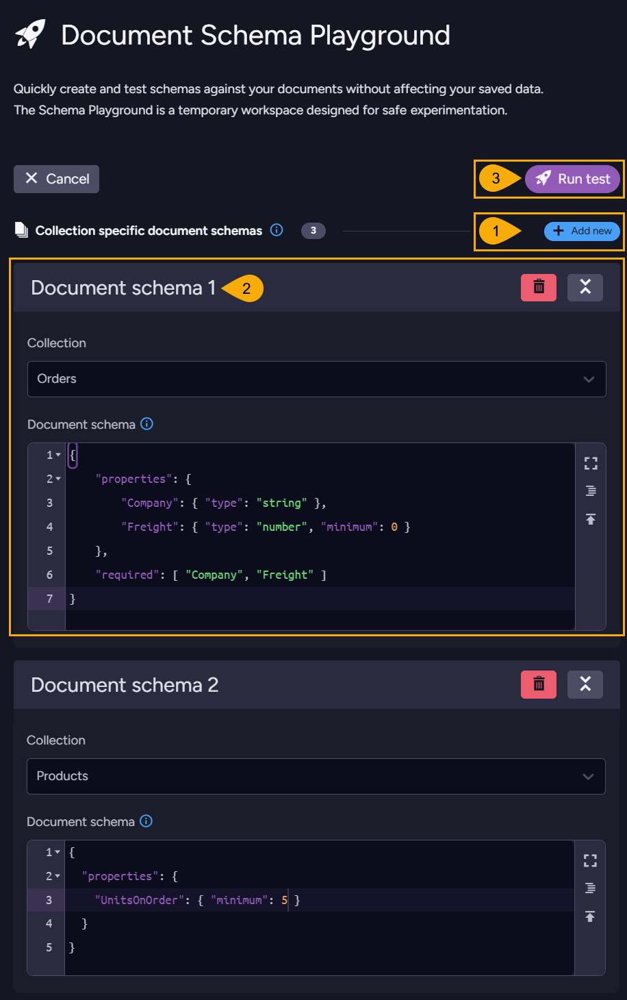
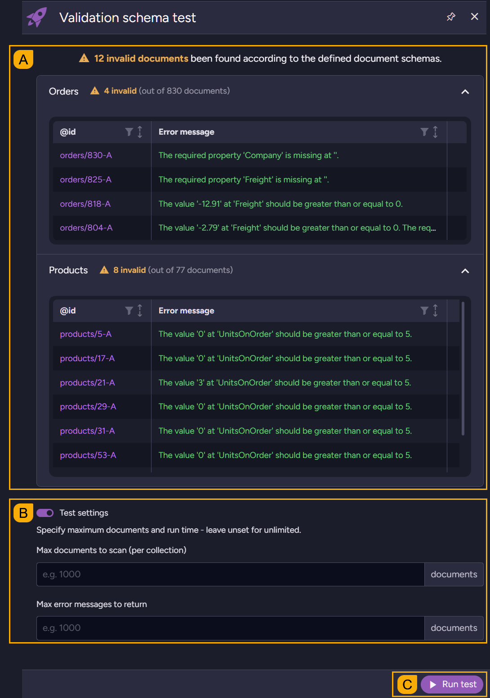

import Admonition from '@theme/Admonition';
import Tabs from '@theme/Tabs';
import TabItem from '@theme/TabItem';
import CodeBlock from '@theme/CodeBlock';
import LanguageSwitcher from "@site/src/components/LanguageSwitcher";
import LanguageContent from "@site/src/components/LanguageContent";
import ContentFrame from '@site/src/components/ContentFrame';
import Panel from "@site/src/components/Panel";

# Write validation: Studio
<Admonition type="note" title="">

Manage [schema validation](../../../documents/schema-validation/schema-validation_overview) using the Studio **Document Schema** view, to condition documents storage on their compliance with a defined JSON schema.  

* In this article:  
   * [The Document Scheme view](../../../documents/schema-validation/write-validation/write-validation_studio#the-document-scheme-view)  
   * [Creating a collection schema](../../../documents/schema-validation/write-validation/write-validation_studio#creating-a-collection-schema)  
   * [Managing and Testing existing schemas](../../../documents/schema-validation/write-validation/write-validation_studio#managing-and-testing-existing-schemas)  
   * [The schema playground](../../../documents/schema-validation/write-validation/write-validation_studio#the-schema-playground)  
   
</Admonition>

## The Document Scheme view
<Panel heading="Use this view to create, test, and manage document schemas for your database collections.">


1. **Database settings**  
   Click to open this view.
2. **Document schema**  
   Click to open this view.
3. **Schema playground**  
   Click to create and test schemas in a [secluded playground](../../../documents/schema-validation/write-validation/write-validation_studio#the-schema-playground).  
3. **Add new**  
   Click to create a [new schema](../../../documents/schema-validation/write-validation/write-validation_studio#creating-a-collection-schema) associated with one of your document collections.  
</Panel>

## Creating a collection schema
<Panel heading="To create a validation schema open: Settings > Document schema > Add new">


1. **Select a collection**  
   Pick the collection for which you want to validate documents.  
   You can create one validation schema per collection. If a collection is already associated with a schema, the collection name will not be listed here.
2. **Define the schema using JSON syntax**  
   The depicted schema, for example, sets constraints for documents in the "Orders" collection: orders must include the string property "Company" and the positive numeric property "Freight".
   ```json
   {
      "properties": {
         "Company": {
               "type": "string"
         },
         "Freight": {
               "type": "number",
               "minimum": 0
         }
      },
      "required": [
         "Company",
         "Freight"
      ]
   }
   ```

   <Admonition type="note" title="">
   [See a list of available constraints.](../../../documents/schema-validation/schema-validation_overview#available-constraints)  
   </Admonition>

3. **Save**  
   Click to save and enable the schema.  
   When enabled, any document saved to the "Orders" collection will be validated against this schema.  
   E.g., attempting to save an "Order" document missing the "Company" field will generate a validation error:
   ```plain
   Raven.Client.Exceptions.SchemaValidation.SchemaValidationException: The required property 'Company' is missing.
   ```

   <Admonition type="note" title="">
   Note that once a schema is enabled for a collection, collection documents are validated when they are saved directly, as well as when they are added or modified by operations such as patching or ETL tasks.  
   [See a list of operations that trigger validation](../../../documents/schema-validation/schema-validation_overview#a-list-of-operations-that-trigger-validation).
   </Admonition>
</Panel>

## Managing and Testing existing schemas
<Panel heading="Existing schemas are listed in the Document Schema view, where you can disable, enable, test, edit, or delete schemas.">


1. **Disable/Enable schema validation for all database collections.**  
    - **Disable** to deactivate validation for all collections regardless of individual collection settings (validation will **not** take place even when allowed locally for a collection).  
    - **Enable** to activate validation based on individual collection settings (validation will be enabled or disabled by per-collection configuration).  

2. **Disable/Enable schema validation for this collection.**  
    - **Disable** to deactivate validation for this collection (regardless of global settings).  
    - **Enable** to activate validation for this collection (providing validation is enabled for the database).  

3. **Test**  
   Click to test the validity of documents in the selected collection against the defined schema.  
   <ContentFrame>
   
    * **A. Test settings**  
      Validating a large number of documents against a schema may be tolling on server resources.  
      Set **Max documents to scan** to the number of documents that you want to validate. E.g., set it to 100 to validate the first 100 documents in the collection.  
      Set **Max error messages to return** to the maximum number of validation errors to return.  
    * **B. Run test**  
      Click to start the validation test.  
      When the test is complete, you will get a summary of the results, including the number of invalid documents and the errors that were generated for each invalid document.  
      
   </ContentFrame>
4. **Edit**  
   Click to edit this schema.  
5. **Delete**  
   Click to delete this schema.  
</Panel>

## The schema playground
<Panel heading="To create and test schemas in a secluded environment, without affecting your production data, open: Settings > Document schema > Schema Playground">



1. **Add new**  
   Click to add a schema to the playground.  
   You can add multiple schemas to the playground, and test them all in a single run.  
   This can be helpful when, for example, you want to validate documents of multiple collections by the existence of a specific field in all of them.  

2. **Define a schema**  
   <ContentFrame>
    * **Collection**  
      Select the collection that the schema will be associated with.  
    * **Document schema**  
      Define the schema using JSON syntax.  
      In the depicted example we define two schemas:  
      The first, for the Orders collection, validates documents by fields existence, type, and minimum value.  
      ```json
      {
         "properties": {
            "Company": { "type": "string" }, 
            "Freight": { "type": "number", "minimum": 0 }
         },
         "required": [ "Company", "Freight" ]
      }
      ```
      The second schema, for the Products collection, validates documents by the minimum value of the "UnitsOnOrder" field.
      ```json
      {
         "properties": {
            "UnitsOnOrder": { "minimum": 5 }
         }
      }
      ```
   </ContentFrame>

3. **Run test**  
   Click to run the validation test for all schemas defined in the playground.  
   The test will generate a summary of the results for each schema, including the number of invalid documents and the errors that were generated for each document.  
   <ContentFrame>
   

    * **A. Test results**  
      Scroll to view all error messages generated for each collection.  
    * **B. Test settings**  
      Validating a large number of documents against a schema may be tolling on server resources.  
      Set **Max documents to scan** to the number of documents that you want to validate. E.g., set it to 100 to validate the first 100 documents of each collection participating the test.  
      Set **Max error messages to return** to the maximum number of validation errors to return for each collection participating the test.  
    * **C. Run test**  
      Click to re-run the test, e.g., after changing test settings.  
   </ContentFrame>
</Panel>


