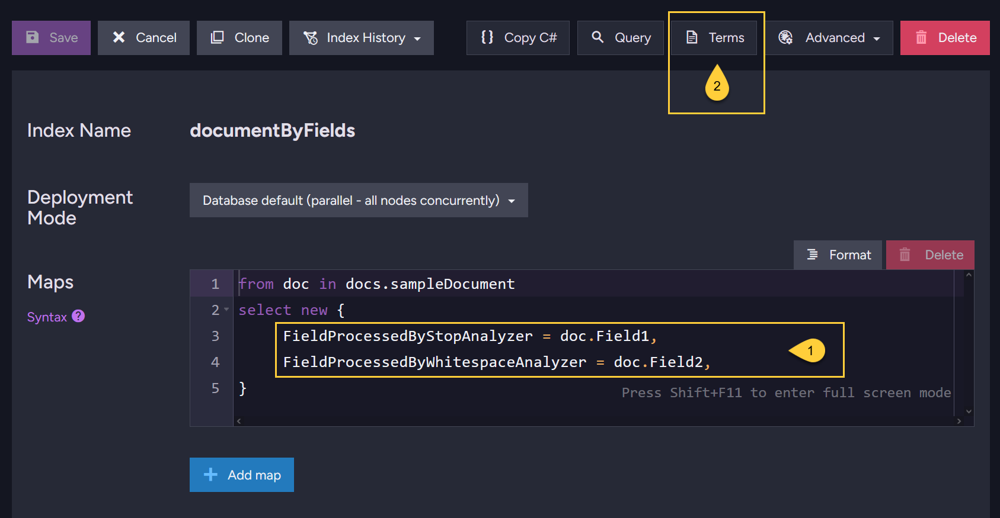
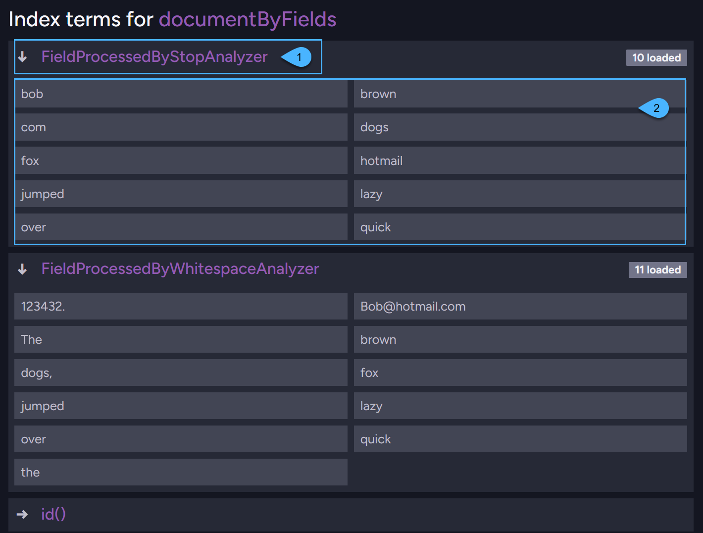

import Admonition from '@theme/Admonition';
import Tabs from '@theme/Tabs';
import TabItem from '@theme/TabItem';
import CodeBlock from '@theme/CodeBlock';
import Panel from "@site/src/components/Panel";
import ContentFrame from "@site/src/components/ContentFrame";

<Admonition type="note" title="">

* RavenDB supports fast and efficient querying through indexes,
  which are powered by either [Lucene](http://lucene.apache.org/) or [Corax](../../indexes/search-engine/corax.mdx),  
  a high-performance search engine developed specifically for RavenDB.  
  (You can choose which search engine to use for each index).

* **Analyzers** are components used in the indexing and querying processes of the search engines,   
  controlling how data is indexed and how search queries interact with the indexed data.

* **The Corax search engine fully respects and supports all Lucene analyzers**,  
  ensuring that existing configurations work seamlessly,  
  while also leveraging Corax's optimized performance for faster query execution.

* This means you can use any analyzer with either search engine,  
  giving you full flexibility in configuring your indexes.

* In this article:
   * [Understanding the role of analyzers](#understanding-the-role-of-analyzers)
      * [Analyzers in the index definition](#analyzers-in-the-index-definition)
      * [Analyzers at indexing time](#analyzers-at-indexing-time)
      * [Analyzers at query time](#analyzers-at-query-time)
      * [Full-text search](#full-text-search)
   * [Analyzers available in RavenDB](#analyzers-available-in-ravendb)
      * [Analyzers that remove common stop words](#analyzers-that-remove-common-stop-words)
      * [Analyzers that do not remove common stop words](#analyzers-that-do-not-remove-common-stop-words)
      * [Analyzers that tokenize according to the defined number of characters](#analyzers-that-tokenize-according-to-the-defined-number-of-characters)
   * [Setting analyzer for index-field](#setting-analyzer-for-index-field)
   * [RavenDB's default analyzers](#ravendb-s-default-analyzers)
      * [Using the Default Search Analyzer](#using-the-default-search-analyzer)
      * [Using the Default Exact Analyzer](#using-the-default-exact-analyzer)
      * [Using the Default Analyzer](#using-the-default-analyzer)
   * [Disabling indexing for index-field](#disabling-indexing-for-index-field)
   * [Creating custom analyzers](#creating-custom-analyzers)
      * [Add custom analyzer via Studio](#add-custom-analyzer-via-studio)
      * [Add custom analyzer via Client API](#add-custom-analyzer-via-client-api)
      * [Add custom analyzer directly to RavenDB's binaries](#add-custom-analyzer-directly-to-ravendbs-binaries)
   * [Viewing the indexed terms](#viewing-the-indexed-terms)

</Admonition>

<Panel heading="Understanding the role of analyzers">

<ContentFrame>

### Analyzers in the index definition

The [index definition](../../studio/database/indexes/indexes-overview.mdx#index-definition) determines what content from the documents will be indexed for each index-field.  
For each index-field you can specify a particular analyzer to process the content of that field.

</ContentFrame>
<ContentFrame>

### Analyzers at indexing time

During the [indexing process](../../studio/database/indexes/indexes-overview.mdx#indexing-process),
the content to be indexed is processed and broken down into smaller components called tokens (or terms) through a process known as **tokenization**.  
This is done by the **Analyzers**, which are objects that determine how text is split into tokens.

Different analyzers vary in how they split the text stream ("tokenize"), and how they process those tokens after tokenization.  
Analyzers can apply additional transformations, such as converting text to lowercase, removing stop words  
(e.g., "the," "and"), or applying stemming (reducing words to their base forms, e.g., "running" → "run").

The resulting tokens are then stored in the index for each index-field and can later be searched by queries,  
enabling [Full-text search](../../indexes/querying/searching.mdx).

</ContentFrame>
<ContentFrame>

### Analyzers at query time

When running a [Full-text search with a dynamic query](../../client-api/session/querying/text-search/full-text-search.mdx),  
the auto-index created by the server breaks down the text of the searched document field using the [default search analyzer](#using-the-default-search-analyzer).

---
    
When running a [Full-text search on a static-index](../../indexes/querying/query-index.mdx),  
the **same analyzer** used to tokenize field content at indexing time is typically applied
to process the terms provided in the full-text search query before they are sent to the search engine to retrieve matching documents.

There are two exceptions to this rule:

1. When setting the [NGramAnalyzer](#analyzers-that-tokenize-according-to-the-defined-number-of-characters) in the index definition,
   it tokenizes the index field at indexing time.  
   However, at query time, when performing a full-text search on that field,  
   the default [RavenStandardAnalyzer](#using-the-default-search-analyzer) is used to tokenize the search term from the query predicate.

     Currently, for query time, you cannot specify a different analyzer than the one defined in the index definition,  
     so to address this issue, you have two options:
      * Increase the [MaxGram](../../server/configuration/indexing-configuration.mdx#indexingluceneanalyzersngrammaxgram) value to generate larger tokens during indexing (when using Lucene).
      * Use a different analyzer other than _NGramAnalyzer_ that better matches your requirements.

2. Behavior is also different when making a full-text search with wildcards in the search terms.  
   This is explained in detail in [Searching with wildcards](../../indexes/querying/searching.mdx#searching-with-wildcards).

---
    
For each non-wildcard search term, the number of tokens produced by the query-time analyzer determines how RavenDB matches it:

* When the analyzer produces **one token**, RavenDB searches for that token as a term.
* When it produces **multiple tokens**, RavenDB searches them as a **phrase**.  
  The corresponding tokens in the searched field must be adjacent and occur in the same order.
* When it produces **no tokens**, the search term contributes no condition to the query.  
  If no term in the `search()` call produces a token, that call matches no documents.

This behavior is the same for both search engines.  
Learn more in [Search with analyzer-generated phrases](../../client-api/session/querying/text-search/full-text-search.mdx#search-with-analyzer-generated-phrases)  
and, for static indexes, in [Analyzer-generated phrases in static-index searches](../../indexes/querying/searching.mdx#analyzer-generated-phrases-in-static-index-searches).
    
</ContentFrame>
<ContentFrame>

### Full-text search

In most cases, Lucene's [StandardAnalyzer](#analyzers-that-remove-common-stop-words) is sufficient for full-text searches.  
For languages other than English, or when a custom analysis process is needed, you can provide your own [Custom analyzer](#creating-custom-analyzers).  
It is straightforward and may already be available as a contrib package for Lucene.

You can also configure a specific collation for an index field to sort based on culture specific rules.  
Learn more in [Sorting and Collation](../../indexes/sorting-and-collation.mdx#collation).

</ContentFrame>

</Panel>

<Panel heading="Analyzers available in RavenDB">

* RavenDB offers the following Lucene analyzers 'out of the box' (their details are listed below):

    * **StandardAnalyzer**
    * **StopAnalyzer**
    * **SimpleAnalyzer**
    * **WhitespaceAnalyzer**
    * **LowerCaseWhitespaceAnalyzer**
    * **KeywordAnalyzer**
    * **NGramAnalyzer**

* If needed, you can create your own [Customized Analyzers](#creating-custom-analyzers).

* To assign the analyzer of your choice to a specific index-field,
  see: [Setting analyzer for index-field](#setting-analyzer-for-index-field).

* When no analyzer is explicitly assigned to an index-field in the index definition,  
  RavenDB will use its [Default Analyzers](#ravendb-s-default-analyzers) to process and tokenize the content of a field.

<Admonition type="info" title="">
All examples below use the following text:  
`The quick brown fox jumped over the lazy dogs, Bob@hotmail.com 123432.`  
</Admonition>

<ContentFrame>

### Analyzers that remove common "stop words"

* **StandardAnalyzer**, which is Lucene's default, will produce the following tokens:

    `[quick] [brown] [fox] [jumped] [over] [lazy] [dogs] [bob@hotmail.com] [123432]`

    This analyzer:

    * Removes common "stop words".
    * Converts text to lowercase, ensuring searches are case-insensitive.
    * Separates on whitespace and punctuation that is followed by whitespace - a dot that is not followed by whitespace is considered part of the token.
    * Email addresses and internet hostnames are treated as a single token.
    * Splits words at hyphens, unless there's a number in the token, in which case the whole token is interpreted as a product number and is not split.

* **StopAnalyzer**, which works similarly, will produce the following tokens:

    `[quick] [brown] [fox] [jumped] [over] [lazy] [dogs] [bob] [hotmail] [com]`

    This analyzer:

    * Removes common "stop words".
    * Converts text to lowercase, ensuring searches are case-insensitive.
    * Separates and tokenizes text based on whitespace without performing light stemming.
    * Removes numbers and symbols, separating tokens at those positions.  
      This means email and web addresses are split into separate tokens.

<Admonition type="info" title="">

* **Stop words**:

  * [Stop words](https://en.wikipedia.org/wiki/Stop_word) (e.g. the, it, a, is, this, that...)  
    are often removed to narrow search results by focusing on less frequently used words.
    
  * If you want to include words such as IT (Information Technology), 
    be aware that analyzers removing common stop words may treat IT as a stop word and exclude it from the resulting terms.
    This can also affect names that contain stop words, such as "The IT Crowd".
    
  * At query time, a search term consisting only of stop words produces no tokens and contributes no condition to the query.
    If every term in a `search()` call is dropped this way, that call matches no documents; the call itself is not ignored.
    For example, searching for "IT" returns an empty result set.
    
  * To avoid excluding acronyms, you can either spell out the full title instead of abbreviating it
    or use an [Analyzer that doesn't remove stop words](#analyzers-that-do-not-remove-common-stop-words).

</Admonition>

</ContentFrame>
<ContentFrame>

### Analyzers that do not remove common "stop words"

* **SimpleAnalyzer** will produce the following tokens:

    `[the] [quick] [brown] [fox] [jumped] [over] [lazy] [dogs] [bob] [hotmail] [com]`

    This analyzer:

    * Includes common "stop words".
    * Converts text to lowercase, ensuring searches are case-insensitive.
    * Separates on white spaces.
    * Will tokenize on all non-alpha characters.
    * Removes numbers and symbols, separating tokens at those positions.  
      This means email and web addresses are split into separate tokens.

* **WhitespaceAnalyzer** will produce the following tokens:

    `[The] [quick] [brown] [fox] [jumped] [over] [the] [lazy] [dogs,] [Bob@hotmail.com] [123432.]`
  
    This analyzer:
  
    * Includes common "stop words".
    * Tokenizes text by separating it on whitespaces.
    * Preserves upper/lower case in text, which means that searches will be case-sensitive.
    * Keeps forms like email addresses, phone numbers, and web addresses whole.

* **LowerCaseWhitespaceAnalyzer** will produce the following tokens:

    `[the] [quick] [brown] [fox] [jumped] [over] [lazy] [dogs,] [bob@hotmail.com] [123432.]`
  
    This analyzer:
  
    * Includes common "stop words".
    * Tokenizes text by separating it on whitespaces.
    * Converts text to lowercase, ensuring searches are case-insensitive.
    * Keeps forms like email addresses, phone numbers, and web addresses whole.

* **KeywordAnalyzer** will produce the following single token:

    `[The quick brown fox jumped over the lazy dogs, bob@hotmail.com 123432.]`

    This analyzer:

    * Will perform no tokenization, and will consider the whole text as one token.
    * Preserves upper/lower case in text, which means that searches will be case-sensitive.
    * Useful in situations like IDs and codes where you do not want to separate into multiple tokens.

</ContentFrame>
<ContentFrame>

### Analyzers that tokenize according to the defined number of characters

* **NGramAnalyzer** tokenizes based on predefined token lengths.

    By default, the minimum token length is **2** characters, and the maximum is **6** characters.  
    Using these defaults, the following tokens will be generated:

    `[.c] [.co] [.com] [12] [123] [1234] [12343] [123432] [23] [234] [2343] [23432]  
     [32] [34] [343] [3432] [43] [432] [@h] [@ho] [@hot] [@hotm] [@hotma]  
     [ai] [ail] [ail.] [ail.c] [ail.co] [az] [azy] [b@] [b@h] [b@ho] [b@hot] [b@hotm]  
     [bo] [bob] [bob@] [bob@h] [bob@ho] [br] [bro] [brow] [brown] [ck] [co] [com]  
     [do] [dog] [dogs] [ed] [er] [fo] [fox] [gs] [ho] [hot] [hotm] [hotma] [hotmai]  
     [ic] [ick] [il] [il.] [il.c] [il.co] [il.com] [ju] [jum] [jump] [jumpe] [jumped]  
     [l.] [l.c] [l.co] [l.com] [la] [laz] [lazy] [ma] [mai] [mail] [mail.] [mail.c]  
     [mp] [mpe] [mped] [ob] [ob@] [ob@h] [ob@ho] [ob@hot] [og] [ogs] [om] [ot] [otm] 
     [otma] [otmai] [otmail] [ov] [ove] [over] [ow] [own] [ox] [pe] [ped] [qu] [qui] 
     [quic] [quick] [ro] [row] [rown] [tm] [tma] [tmai] [tmail] [tmail.] 
     [ui] [uic] [uick] [um] [ump] [umpe] [umped] [ve] [ver] [wn] [zy]`

* **Overriding default token length**: (only when using Lucene as the search engine)

    You can override the default token lengths of the NGram analyzer by setting the following configuration keys:  
    [Indexing.Lucene.Analyzers.NGram.MinGram](../../server/configuration/indexing-configuration.mdx#indexingluceneanalyzersngrammingram)
    and [Indexing.Lucene.Analyzers.NGram.MaxGram](../../server/configuration/indexing-configuration.mdx#indexingluceneanalyzersngrammaxgram).

    For example, setting them to 3 and 4, respectively, will generate the following tokens:

    `[.co] [.com] [123] [1234] [234] [2343] [343] [3432] [432] [@ho] [@hot]  
     [ail] [ail.] [azy] [b@h] [b@ho] [bob] [bob@] [bro] [brow] [com] [dog] [dogs] [fox]  
     [hot] [hotm] [ick] [il.] [il.c] [jum] [jump] [l.c] [l.co] [laz] [lazy] [mai] [mail]  
     [mpe] [mped] [ob@] [ob@h] [ogs] [otm] [otma] [ove] [over] [own] [ped] [qui] [quic]  
     [row] [rown] [tma] [tmai] [uic] [uick] [ump] [umpe] [ver]`

* **Querying with NGram analyzer**:

    In RavenDB, the analyzer configured in the index definition is typically used both at indexing time and query time (the same analyzer).
    However, the `NGramAnalyzer` is an exception to this rule.
  
    Refer to section [Analyzers at query time](#analyzers-at-query-time) to learn about the different behaviors.

</ContentFrame>

</Panel>

<Panel heading="Setting analyzer for index-field">

* To explicitly set an analyzer that will process/tokenize the content of a specific index-field,  
  use the `_analyze()` method within the index definition for that field.

* Either:
    * Specify an analyzer from the [Analyzers available in RavenDB](#analyzers-available-in-ravendb),
    * Or specify your own custom analyzer (see [Creating custom analyzers](#creating-custom-analyzers)).

* If you want RavenDB to use the default analyzers, see [RavenDB's default analyzers](#ravendb-s-default-analyzers).

* An analyzer may also be set from the Edit Index view in the Studio, see [Index field options](../../studio/database/indexes/create-map-index.mdx#index-field-options).

<Tabs groupId='languageSyntax'>
<TabItem value="AbstractIndexCreationTask" label="AbstractIndexCreationTask">

```python
class BlogPosts_ByTagsAndContent(AbstractIndexCreationTask):
    def __init__(self):
        super().__init__()

        self.map = (
            "from post in docs.Posts "
            "select new { Tags = post.Tags, Content = post.Content }"
        )

        # Field 'Tags' will be tokenized by Lucene's SimpleAnalyzer
        self._analyze("Tags", "SimpleAnalyzer")

        # Field 'Content' will be tokenized by the custom analyzer SnowballAnalyzer
        self._analyze("Content", "Raven.Sample.SnowballAnalyzer")
```
</TabItem>
<TabItem value="PutIndexesOperation" label="PutIndexesOperation">

```python
builder = IndexDefinitionBuilder("BlogPosts/ByTagsAndContent")
builder.map = (
    "from post in docs.Posts "
    "select new { Tags = post.Tags, Content = post.Content }"
)

# Field 'Tags' will be tokenized by Lucene's SimpleAnalyzer
builder.analyzers_strings["Tags"] = "SimpleAnalyzer"

# Field 'Content' will be tokenized by the custom analyzer SnowballAnalyzer
builder.analyzers_strings["Content"] = "Raven.Sample.SnowballAnalyzer"

index_definition = builder.to_index_definition(store.conventions)
store.maintenance.send(PutIndexesOperation(index_definition))
```
</TabItem>
</Tabs>

</Panel>

<Panel heading="RavenDB's default analyzers">

*  When no specific analyzer is explicitly assigned to an index-field in the index definition,  
   RavenDB will use the Default Analyzers to process and tokenize the content of the field,  
   depending on the specified Indexing Behavior.

* The **Default Analyzers** are:
    * `RavenStandardAnalyzer` - Serves as the [Default Search Analyzer](#using-the-default-search-analyzer).
    * `KeywordAnalyzer` - Servers as the [Default Exact Analyzer](#using-the-default-exact-analyzer).
    * `LowerCaseKeywordAnalyzer`- Serves as the [Default Analyzer](#using-the-default-analyzer).

* The available **Indexing Behavior** values are:
    * `FieldIndexing.EXACT`
    * `FieldIndexing.SEARCH`
    * `FieldIndexing.NO` - This behavior [disables field indexing](#disabling-indexing-for-index-field).

* See the detailed explanation for each scenario below:

<ContentFrame>

### Using the Default Search Analyzer

* When the indexing behavior is set to `FieldIndexing.SEARCH` and no analyzer is specified for the index-field,  
  RavenDB will use the Default Search Analyzer.  
  By default, this analyzer is the `RavenStandardAnalyzer` (inherits from Lucene's _StandardAnalyzer_).

* To customize a different analyzer that will serve as your Default Search Analyzer,  
  set the [Indexing.Analyzers.Search.Default](../../server/configuration/indexing-configuration.mdx#indexinganalyzerssearchdefault) configuration key.

* Using a search analyzer enables full-text search queries against the field.  
  Given the same sample text from above, _RavenStandardAnalyzer_ will produce the following tokens:  
  `[quick] [brown] [fox] [jumped] [over] [lazy] [dogs] [bob@hotmail.com] [123432]`

```python
class BlogPosts_ByContent(AbstractIndexCreationTask):
    def __init__(self):
        super().__init__()

        self.map = (
            "from post in docs.Posts "
            "select new { Title = post.Title, Content = post.Content }"
        )

        # Set the Indexing Behavior:
        # ==========================

        # Set 'FieldIndexing.SEARCH' on index-field 'Content'
        self._index("Content", FieldIndexing.SEARCH)

        # => Index-field 'Content' will be processed by the "Default Search Analyzer"
        #    since no other analyzer is set.
```

</ContentFrame>
<ContentFrame>

### Using the Default Exact Analyzer

* When the indexing behavior is set to `FieldIndexing.EXACT`, RavenDB will use the Default Exact Analyzer.  
  By default, this analyzer is the `KeywordAnalyzer`.

* _KeywordAnalyzer_ treats the entire content of the index-field as a single token,
  preserving the original text's case and ensuring no transformations, such as case normalization or stemming, are applied.  
  The field's value is indexed exactly as provided, enabling precise, case-sensitive matching at query time.

* To customize a different analyzer that will serve as your Default Exact Analyzer,  
  set the [Indexing.Analyzers.Exact.Default ](../../server/configuration/indexing-configuration.mdx#indexinganalyzersexactdefault) configuration key.

* Given the same sample text from above, _KeywordAnalyzer_ will produce a single token:            
  `[The quick brown fox jumped over the lazy dogs, Bob@hotmail.com 123432.]`

```python
class Employees_ByFirstAndLastName(AbstractIndexCreationTask):
    def __init__(self):
        super().__init__()

        self.map = (
            "from employee in docs.Employees "
            "select new { LastName = employee.LastName, FirstName = employee.FirstName }"
        )

        # Set the Indexing Behavior:
        # ==========================

        # Set 'FieldIndexing.EXACT' on index-field 'FirstName'
        self._index("FirstName", FieldIndexing.EXACT)

        # => Index-field 'FirstName' will be processed by the "Default Exact Analyzer"
```

</ContentFrame>
<ContentFrame>

### Using the Default Analyzer

* When no indexing behavior is set and no analyzer is specified for the index-field,  
  RavenDB will use the Default Analyzer.
  By default, this analyzer is the `LowerCaseKeywordAnalyzer`.

* _LowerCaseKeywordAnalyzer_ behaves like Lucene's _KeywordAnalyzer_, but additionally performs case normalization, converting all characters to lowercase.
  The entire content of the field is processed into a single, lowercased token.

* To customize a different analyzer that will serve as your Default Analyzer,  
  set the [Indexing.Analyzers.Default](../../server/configuration/indexing-configuration.mdx#indexinganalyzersdefault) configuration key.

* Given the same sample text from above, _LowerCaseKeywordAnalyzer_ will produce a single token:            
  `[the quick brown fox jumped over the lazy dogs, bob@hotmail.com 123432.]`

```python
class Employees_ByFirstName(AbstractIndexCreationTask):
    def __init__(self):
        super().__init__()

        self.map = (
            "from employee in docs.Employees "
            "select new { LastName = employee.LastName }"
        )

        # Index-field 'LastName' will be processed by the "Default Analyzer"
        # since:
        # * No analyzer was specified
        # * No Indexing Behavior was specified
        #   (neither FieldIndexing.EXACT nor FieldIndexing.SEARCH)
```

</ContentFrame>

</Panel>

<Panel heading="Disabling indexing for index-field">

* Use the `FieldIndexing.NO` indexing behavior option to disable indexing of a particular index-field.  
  In this case:
    * No analyzer will process the field, and no terms will be generated from its content.
    * The field will not be available for querying.
    * The field will still be accessible for extraction when [projecting query results](../../indexes/querying/projections.mdx).

* This is useful when you need to [store the field data in the index](../../indexes/storing-data-in-index.mdx) and only intend to use it for query projections.

```python
class BlogPosts_ByTitle(AbstractIndexCreationTask):
    def __init__(self):
        super().__init__()

        self.map = (
            "from post in docs.Posts "
            "select new { Title = post.Title, Content = post.Content }"
        )

        # Set the Indexing Behavior:
        # ==========================

        # Set 'FieldIndexing.NO' on index-field 'Content'
        self._index("Content", FieldIndexing.NO)

        # Set 'FieldStorage.YES' to store the original content of field 'Content'
        # in the index
        self._store("Content", FieldStorage.YES)

        # => No analyzer will process field 'Content',
        #    it will only be stored in the index.
```

</Panel>

<Panel heading="Creating custom analyzers">

* **Availability & file type**:  
  The custom analyzer you are referencing must be available to the RavenDB server instance.  
  You can create and add custom analyzers to RavenDB as `.cs` files.

* **Scope**:  
  Custom analyzers can be defined as:

    * **Database Custom Analyzers** - can only be used by indexes of the database where they are defined.
    * **Server-Wide Custom Analyzers** - can be used by indexes on all databases across all servers in the cluster.

      A database analyzer may have the same name as a server-wide analyzer.  
      In this case, the indexes of that database will use the database version of the analyzer.  
      You can think of database analyzers as overriding server-wide analyzers with the same names.

* **Ways to create**:  
  There are three ways to create a custom analyzer and add it to your server:

    1. [Add custom analyzer via Studio](#add-custom-analyzer-via-studio)
    2. [Add custom analyzer via Client API](#add-custom-analyzer-via-client-api)
    3. [Add custom analyzer directly to RavenDB's binaries](#add-custom-analyzer-directly-to-ravendbs-binaries)

<ContentFrame>

### Add custom analyzer via Studio

Custom analyzers can be added from the Custom Analyzers view in the Studio.  
Learn more in this [Custom analyzers](../../studio/database/settings/custom-analyzers.mdx) article.

</ContentFrame>
<ContentFrame>

### Add custom analyzer via Client API

First, create a class that inherits from the abstract `Lucene.Net.Analysis.Analyzer` class.  
To do this, reference `Lucene.Net.dll`, found at `Server/Lucene.Net.dll` in the RavenDB server package available from the [RavenDB download page](https://ravendb.net/download).  
Use the DLL from the server package so that its version matches the Lucene build your server runs, rather than a copy from NuGet.   
For example:

```csharp
public class MyAnalyzer : Lucene.Net.Analysis.Analyzer
{
    public override TokenStream TokenStream(string fieldName, TextReader reader)
    {
        // Implement your analyzer's logic
        throw new CodeOmitted();
    }
}
```
<br />

The Python client supports deploying a custom analyzer server-wide with `PutServerWideAnalyzersOperation`.

<Admonition type="note" title="">

The Python client v7.2 does not expose the database-scoped `PutAnalyzersOperation`.  
To deploy an analyzer to a specific database, use the [Custom Analyzers view in Studio](../../studio/database/settings/custom-analyzers.mdx).

</Admonition>

<Tabs groupId='languageSyntax'>
<TabItem value="put_server_wide_analyzers" label="PutServerWideAnalyzersOperation">

```python
store.maintenance.server.send(
    PutServerWideAnalyzersOperation(analyzer_definition)
)
```
</TabItem>
<TabItem value="analyzer_definition" label="AnalyzerDefinition">

```python
analyzer_definition = AnalyzerDefinition(
    name="analyzerName",
    code="code"
)
```
</TabItem>
</Tabs>

| Parameter  | Type  | Description                                                                                                                                                       |
|------------|-------|-------------------------------------------------------------------------------------------------------------------------------------------------------------------|
| **name**   | `str` | The class name of your custom analyzer, as defined in your code.                                                                                                  |
| **code**   | `str` | Compilable C# code:<br/>A class that inherits from `Lucene.Net.Analysis.Analyzer`,<br/>including the containing namespace and the necessary `using` statements. |

**Client API example**:

```python
analyzer_definition = AnalyzerDefinition(
    name="MyAnalyzer",
    code="""
using System.IO;
using Lucene.Net.Analysis;
using Lucene.Net.Analysis.Standard;

namespace MyAnalyzer
{
    public class MyAnalyzer : Lucene.Net.Analysis.Analyzer
    {
        public override TokenStream TokenStream(string fieldName, TextReader reader)
        {
            throw new CodeOmitted();
        }
    }
}
"""
)

store.maintenance.server.send(
    PutServerWideAnalyzersOperation(analyzer_definition)
)
```

</ContentFrame>
<ContentFrame>

### Add custom analyzer directly to RavenDB's binaries

Another way to add custom analyzers to RavenDB is by placing them next to RavenDB's binaries.

* The fully qualified name must be specified for any index-field that will be tokenized by the analyzer.
* Note that the analyzer must be compatible with .NET Core 2.0 (e.g., a .NET Standard 2.0 assembly).
* This is the only method for adding custom analyzers in RavenDB versions older than 5.2.

</ContentFrame>
    
---
    
<Admonition type="info" title="">

**Tokenization affects how search terms are matched**:  
    
* A custom analyzer used for a searchable index field processes both the field content at indexing time  
  and non-wildcard search terms at query time.
    
* If the analyzer produces **multiple tokens from a single search term**  
  (for example when splitting compound words, segmenting CJK text, or breaking on punctuation),  
  a `search()` for that term uses a **phrase query**.     
  The tokens must appear in the indexed field adjacent to one another and in the same order.  
    
* Learn more in [Analyzer-generated phrases in static-index searches](../../indexes/querying/searching.mdx#analyzer-generated-phrases-in-static-index-searches).

</Admonition>  

</Panel>

<Panel heading="Viewing the indexed terms">

The terms generated for each index-field can be viewed in the Studio.



1. These are the index-fields
2. Click the "Terms" button to view the generated terms for each field

---



1. This is the "index-field name".
2. These are the terms generated for the index-field.  
   In this example the `StopAnalyzer` was used to tokenize the text.

</Panel>

