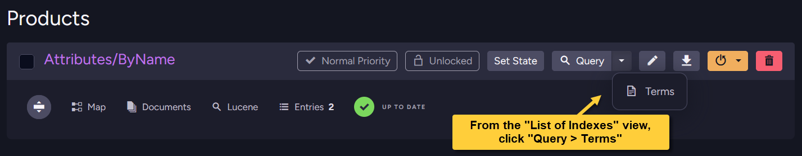
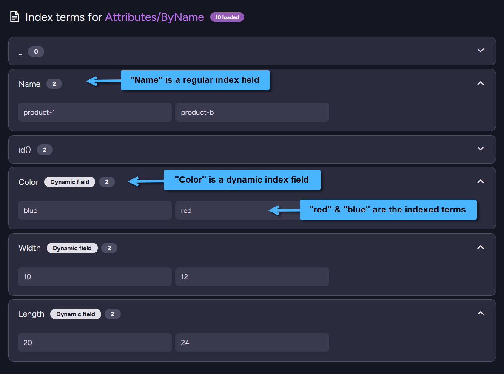

import Admonition from '@theme/Admonition';
import Tabs from '@theme/Tabs';
import TabItem from '@theme/TabItem';
import CodeBlock from '@theme/CodeBlock';
import ContentFrame from '@site/src/components/ContentFrame';
import Panel from '@site/src/components/Panel';

<Admonition type="note" title="">

* In RavenDB, different documents can have different shapes.  
  Documents are schemaless - new fields can be added or removed as needed.  
  For such dynamic data, you can define indexes with **dynamic-index-fields**.

* Dynamic-index-fields are created at indexing time, with names and values derived from document content,  
  rather than being predefined as fixed index fields in the index definition.    
  This allows you to query the index by fields that are not known at index definition or deployment time,  
  which is very useful when working with highly dynamic systems.

* Any value type can be indexed, string, number, date, etc.  
  An index definition can contain both dynamic-index-fields and regular-index-fields.

* In this article:
  * [Indexing field KEYS](#indexing-field-keys)
      * [Example - index every field under an object](#example---index-every-field-under-an-object)
      * [Example - index every field](#example---index-every-field)
  * [Indexing field VALUES](#indexing-field-values)
      * [Example - basic](#example---basic)
      * [Example - list](#example---list)
  * [Indexing dynamic fields for full-text search](#indexing-dynamic-fields-for-full-text-search)
      * [Configuring analyzers for dynamic fields](#configuring-analyzers-for-dynamic-fields)
      * [Which analyzer is used for the query term?](#which-analyzer-is-used-for-the-query-term)
  * [`CreateField` syntax](#createfield-syntax)
  * [Indexed fields & terms view](#indexed-fields-terms-view)

</Admonition>

<Panel heading="Indexing field KEYS">

<ContentFrame>
    
### Example - index every field under an object

<Admonition type="note" title="">
The following example allows you to:    
  * Index any field that is under the same object from the document.  
  * After index is deployed, any new field added to this object will be indexed as well.
</Admonition>

* **The document**:  
    
    <TabItem>
    ```java
    public class Product {
        private String id;

        // The KEYS under the attributes object will be dynamically indexed
        // Fields added to this object after index creation time will also get indexed
        private Map<String, Object> attributes;

        // getters and setters ...
    }
    ```
    </TabItem>
        
    <TabItem>
    ```json
    // Sample document content
    {
        "attributes": {
            "color": "Red",
            "size": 42
        }
    }
    ```
    </TabItem>

* **The index**:  
    
  The following index will index any field under the `attributes` object from the document,  
  a dynamic-index-field will be created for each such field.  
  New fields added to the object after index creation time will be dynamically indexed as well.  
  
    The actual dynamic-index-field name on which you can query will be the attribute field **key**.  
    E.g., Keys `color` & `size` will become the actual dynamic-index-fields.  

    <Tabs groupId='languageSyntax'>
    <TabItem value="Index" label="Index">
    ```java
    public class Products_ByAttributeKey extends AbstractIndexCreationTask {
        public Products_ByAttributeKey() {

            // Call 'CreateField' to generate dynamic-index-fields
            // from the attributes object keys.

            // Using '_' is just a convention.
            // Any other string can be used instead of '_'.

            // The actual field name will be 'item.Key'
            // The actual field terms will be derived from 'item.Value'
            map = "docs.Products.Select(p => new { " +
                  "    _ = p.attributes.Select(item => " +
                  "        this.CreateField(item.Key, item.Value)) " +
                  "})";
        }
    }
    ```
    </TabItem>
    <TabItem value="JavaScript_index" label="JavaScript_index">
    ```java
    public class Products_ByAttributeKey_JS extends AbstractJavaScriptIndexCreationTask {
        public Products_ByAttributeKey_JS() {
            setMaps(Sets.newHashSet(
                "map('Products', function (p) { " +
                "    return { " +
                // The field name will be the key
                // The field terms will be derived from the corresponding value
                "        _: Object.keys(p.attributes) " +
                "               .map(key => createField(key, p.attributes[key])) " +
                "    }; " +
                "})"
            ));
        }
    }
    ```
    </TabItem>
    </Tabs>

* **The query**:  
    
  You can now query the generated dynamic-index fields.  
  The `_` property is Not queryable but used only in the index definition syntax.  
    
    To get all documents with a specific _size_ use:  
    
    <Tabs groupId='languageSyntax'>
    <TabItem value="DocumentQuery" label="DocumentQuery">
    ```java
    List<Product> matchingDocuments = session
        .advanced()
        .documentQuery(Product.class, Products_ByAttributeKey.class)
         // 'size' is a dynamic-index-field that was indexed from the attributes object
        .whereEquals("size", 42)
        .toList();
    ```
    </TabItem>
    <TabItem value="RQL" label="RQL">
    ```sql
    // 'size' is a dynamic-index-field that was indexed from the attributes object
    from index 'Products/ByAttributeKey' where size = 42
    ```
    </TabItem>
    </Tabs>
    
    <Admonition type="info" title="">
    Dynamic index fields are queried with _DocumentQuery_ or _RQL_ because the field names (e.g. `size`, `color`)  
    are generated at indexing time and are not properties on the _Product_ class.
    
    Use the string-based `whereEquals("size", 42)` or RQL `where size = 42` instead.
    </Admonition>

</ContentFrame>    

<ContentFrame>
    
### Example - index every field

<Admonition type="note" title="">
The following example allows you to:    
  * Define an index on a collection **without** needing any common structure between the indexed documents.  
  * After the index is deployed, any new field added to any document in the collection will be indexed as well.
</Admonition>
    
<Admonition type="info" title="">
* Use this approach with care.  
* Indexing every field can increase indexing time, memory usage, and disk space,  
  especially for large or frequently updated documents.
</Admonition>

* **The document**:  
    
    <TabItem>
    ```java
    public class Product {
        private String id;

        // All KEYS in the document will be dynamically indexed
        // Fields added to the document after index creation time will also get indexed
        private String firstName;
        private String lastName;
        private String title;
        // ...

        // getters and setters ...
    }
    ```
    </TabItem>

    <TabItem>
    ```json
    // Sample document content
    {
        "firstName": "John",
        "lastName": "Doe",
        "title": "Engineer"
        // ...
    }
    ```
    </TabItem>

* **The index**:  
    
  The following index will index any field from the document,  
  a dynamic-index-field will be created for each field.  
  New fields added to the document after index creation time will be dynamically indexed as well.  
  
    The actual dynamic-index-field name on which you can query will be the field **key**.  
    E.g., Keys `firstName` & `lastName` will become the actual dynamic-index-fields.  
    
    The example uses an `AbstractJavaScriptIndexCreationTask` because it enumerates all top-level document fields at indexing time with `Object.keys(...)`.
    LINQ indexes typically create dynamic fields from a known enumerable structure, such as a map or collection.

    <Tabs groupId='languageSyntax'>
    <TabItem value="JavaScript_index" label="JavaScript_index">
    ```java
    public class Products_ByAnyField_JS extends AbstractJavaScriptIndexCreationTask {
        public Products_ByAnyField_JS() {

            // This will index EVERY FIELD under the top level of the document
            setMaps(Sets.newHashSet(
                "map('Products', function (p) { " +
                "    return { " +
                "        _: Object.keys(p).map(key => createField(key, p[key])) " +
                "    }; " +
                "})"
            ));
        }
    }
    ```
    </TabItem>
    </Tabs>

* **The query**:
    
  To get all documents with a specific _lastName_ use:  
    
    <Tabs groupId='languageSyntax'>
    <TabItem value="DocumentQuery" label="DocumentQuery">
    ```java
    List<Product> matchingDocuments = session
        .advanced()
        .documentQuery(Product.class, Products_ByAnyField_JS.class)
         // 'lastName' is a dynamic-index-field that was indexed from the document
        .whereEquals("lastName", "Doe")
        .toList();
    ```
    </TabItem>
    <TabItem value="RQL" label="RQL">
    ```sql
    // 'lastName' is a dynamic-index-field that was indexed from the document
    from index 'Products/ByAnyField/JS' where lastName = "Doe"
    ```
    </TabItem>
    </Tabs>
    
</ContentFrame>
    
</Panel>    

<Panel heading="Indexing field VALUES">

<ContentFrame>
    
### Example - basic

<Admonition type="note" title="">    
The following example shows:    
  * Only the **basic concept** of creating a dynamic-index-field from the **value** of a document field.  
  * Documents can then be queried based on those indexed values.  
  * For a more practical usage see the [Example](#example---list) below.  
</Admonition>

* **The document**:  
    
    <TabItem>
    ```java
    public class Product {
        private String id;

        // The VALUE of productType will be dynamically indexed
        private String productType;
        private int pricePerUnit;

        // getters and setters ...
    }
    ```
    </TabItem>
    
    <TabItem>
    ```json
    // Sample document content
    {
        "productType": "Electronics",
        "pricePerUnit": 23
    }
    ```
    </TabItem>

* **The index**:  
    
  The following index will index the **value** of document field 'productType'.  
  
    This value will be the dynamic-index-field name on which you can query.  
    E.g., Field value `Electronics` will be the dynamic-index-field.  

    <Tabs groupId='languageSyntax'>
    <TabItem value="Index" label="Index">
    ```java
    public class Products_ByProductType extends AbstractIndexCreationTask {
        public Products_ByProductType() {

            // Call 'CreateField' to generate the dynamic-index-field.
            // The field name will be the value of document field 'productType'.
            // The field terms will be derived from document field 'pricePerUnit'.
            map = "docs.Products.Select(p => new { " +
                  "    _ = this.CreateField(p.productType, p.pricePerUnit) " +
                  "})";
        }
    }
    ```
    </TabItem>
    <TabItem value="JavaScript_index" label="JavaScript_index">
    ```java
    public class Products_ByProductType_JS extends AbstractJavaScriptIndexCreationTask {
        public Products_ByProductType_JS() {
            setMaps(Sets.newHashSet(
                "map('Products', function (p) { " +
                "    return { " +
                // The field name will be the value of document field 'productType'
                // The field terms will be derived from document field 'pricePerUnit'
                "        _: createField(p.productType, p.pricePerUnit) " +
                "    }; " +
                "})"
            ));
        }
    }
    ```
    </TabItem>
    </Tabs>

* **The query**:  
    
  To get all documents of some product type having a specific price per unit use:  
    
    <Tabs groupId='languageSyntax'>
    <TabItem value="DocumentQuery" label="DocumentQuery">
    ```java
    List<Product> matchingDocuments = session
        .advanced()
        .documentQuery(Product.class, Products_ByProductType.class)
         // 'Electronics' is the dynamic-index-field that was indexed
         // from document field 'productType'
        .whereEquals("Electronics", 23)
        .toList();
    ```
    </TabItem>
    <TabItem value="RQL" label="RQL">
    ```sql
    // 'Electronics' is the dynamic-index-field that was indexed
    // from document field 'productType'
    from index 'Products/ByProductType' where Electronics = 23
    ```
    </TabItem>
    </Tabs>
    
</ContentFrame>    
    
<ContentFrame>  

### Example - list

<Admonition type="note" title="">
The following example allows you to:    
  * Index **values** from items in a list
  * After index is deployed, any item added to this list in the document will be dynamically indexed as well.
</Admonition>

* **The document**:  
    
    <TabItem>
    ```java
    public class Product {
        private String id;
        private String name;

        // For each element in this list,
        // the VALUE of property 'propName' will be dynamically indexed.
        // e.g. Color, Width, Length (in ex. below) will become dynamic-index-fields.
        private List<Attribute> attributes;

        // getters and setters ...
    }

    public class Attribute {
        private String propName;
        private String propValue;

        // getters and setters ...
    }
    ```
    </TabItem>
    
    <TabItem>
    ```json
    // Sample document content
    {
        "name": "SomeName",
        "attributes": [
           {
               "propName": "Color",
               "propValue": "Blue"
           },
           {
               "propName": "Width",
               "propValue": "10"
           },
           {
               "propName": "Length",
               "propValue": "20"
           }
           // ...
       ]
    }
    ```
    </TabItem>

* **The index**:  
    
  The following index will create a dynamic-index-field per item in the document's `attributes` list.  
  New items added to the attributes list after index creation time will be dynamically indexed as well.  
  
    The actual dynamic-index-field name on which you can query will be the item's propName **value**.  
    E.g., 'propName' value `Width` will be a dynamic-index-field.  

    <Tabs groupId='languageSyntax'>
    <TabItem value="Index" label="Index">
    ```java
    public class Attributes_ByName extends AbstractIndexCreationTask {
        public Attributes_ByName() {

            // Define the dynamic-index-fields by calling 'CreateField'.
            // A dynamic-index-field will be generated for each item in 'attributes'.

            // For each item, the field name will be the value of field 'propName'
            // The field terms will be derived from field 'propValue'.
            // A regular index field (Name) is defined as well.
            map = "docs.Products.Select(p => new { " +
                  "    _ = p.attributes.Select(item => " +
                  "        this.CreateField(item.propName, item.propValue)), " +
                  "    Name = p.name " +
                  "})";
        }
    }
    ```
    </TabItem>
    <TabItem value="JavaScript_index" label="JavaScript_index">
    ```java
    public class Attributes_ByName_JS extends AbstractJavaScriptIndexCreationTask {
        public Attributes_ByName_JS() {
            setMaps(Sets.newHashSet(
                "map('Products', function (p) { " +
                "    return { " +
                // For each item,
                // the field name will be the value of field 'propName'.
                // The field terms will be derived from field 'propValue'.
                "        _: p.attributes.map(item => " +
                "               createField(item.propName, item.propValue)), " +
                // A regular index field can be defined as well:
                "        Name: p.name " +
                "    }; " +
                "})"
            ));
        }
    }
    ```
    </TabItem>
    </Tabs>

* **The query**:  
    
  To get all documents matching a specific attribute property use:  
    
    <Tabs groupId='languageSyntax'>
    <TabItem value="DocumentQuery" label="DocumentQuery">
    ```java
    List<Product> matchingDocuments = session
        .advanced()
        .documentQuery(Product.class, Attributes_ByName.class)
         // 'Width' is a dynamic-index-field that was indexed from the attributes list
        .whereEquals("Width", 10)
        .toList();
    ```
    </TabItem>
    <TabItem value="RQL" label="RQL">
    ```sql
    // 'Width' is a dynamic-index-field that was indexed from the attributes list
    from index 'Attributes/ByName' where Width = 10
    ```
    </TabItem>
    </Tabs>

</ContentFrame>
    
</Panel>

<Panel heading="Indexing dynamic fields for full-text search">
    
<Admonition type="note" title="">    

Dynamic fields can be indexed for [Full-text search](../../indexes/querying/searching.mdx) by setting `indexing: 'Search'` in the `createField` options object (`AbstractJavaScriptIndexCreationTask`)
or `FieldIndexing.Search` in the `CreateFieldOptions` (`AbstractIndexCreationTask`).

* **At indexing time**:      
  At indexing time, RavenDB analyzes the dynamic field value and creates the indexed terms.  
  The analyzer used at indexing time is resolved from the index definition.  
  You can configure an analyzer for a specific generated field name, or configure `ALL_FIELDS` as a fallback.  
  See [Configuring analyzers for dynamic fields](#configuring-analyzers-for-dynamic-fields) below.    

    * If the generated dynamic field name has an explicit analyzer configuration, that analyzer is used.  
    * Otherwise, if `ALL_FIELDS` has an analyzer configuration, RavenDB uses it as a fallback.
    * If no analyzer is configured for the field, RavenDB uses the [Default search analyzer](../../indexes/using-analyzers.mdx#using-the-default-search-analyzer).

* **At querying time**:  
  For full-text search to return the expected results, the analyzer used at indexing time and the analyzer used for the query term should produce compatible terms.  

    When a `search()` query targets a dynamic field that does **not** have an explicit analyzer configuration for its generated field name,
    RavenDB uses the [Default analyzer](../../indexes/using-analyzers.mdx#using-the-default-analyzer) to analyze the query term by default.

    Set the [Indexing.Querying.UseSearchAnalyzerForDynamicFieldsIfNotSetExplicitlyInSearchQuery](../../server/configuration/indexing-configuration.mdx#indexingqueryingusesearchanalyzerfordynamicfieldsifnotsetexplicitlyinsearchquery)  
    configuration key to `true` to make RavenDB use the [Default search analyzer](../../indexes/using-analyzers.mdx#using-the-default-search-analyzer) as the fallback analyzer for the query term instead.

    This configuration can be set at different scopes: server-wide, per database, or per index.  
    The example below sets it at the index scope, in the index definition.

    For a summary of how RavenDB resolves the analyzer used for the query term,  
    see [Which analyzer is used for the query term](#which-analyzer-is-used-for-the-query-term) below.

</Admonition>
    
---    
    
The following example indexes localized product descriptions as dynamic fields and queries one of those generated fields using full-text search:    
    
* **The document**:

    <TabItem>
    ```java
    public class Product {
        private String id;

        private Map<String, String> descriptions;

        // getters and setters ...
    }
    ```
    </TabItem>

    <TabItem>
    ```json
    // Sample document content
    {
        "descriptions": {
            "English": "North wind jacket",
            "French": "Veste vent du nord"
        }
    }
    ```
    </TabItem>

* **The index**:

    The following index creates one dynamic field for each entry in the `descriptions` map.  
    For example, the key `English` creates the dynamic field `Description_English`.

    Each generated dynamic field is indexed for **full-text search**.

    <Tabs groupId="languageSyntax">
    <TabItem value="Index" label="Index">
    ```java
    public class Products_ByLocalizedDescription extends AbstractIndexCreationTask {

        private static final String USE_SEARCH_ANALYZER_FOR_DYNAMIC_FIELDS =
            "Indexing.Querying.UseSearchAnalyzerForDynamicFieldsIfNotSetExplicitlyInSearchQuery";

        public Products_ByLocalizedDescription() {
            map = "docs.Products.Select(product => new { " +
                  "    _ = product.descriptions.Select(x => " +
                  "        this.CreateField( " +
                  "            \"Description_\" + x.Key, " +
                  "            x.Value, " +
                  "            new CreateFieldOptions { " +
                  // Index each generated dynamic field for FTS
                  "                Indexing = FieldIndexing.Search, " +
                  "                Storage = FieldStorage.No " +
                  "            })) " +
                  "})";

            storeAllFields(FieldStorage.NO);

            // Set this configuration key to true so that search() queries on dynamic fields
            // will use the 'Default Search Analyzer' when the generated field name
            // has no explicit analyzer configuration.
            getConfiguration().put(USE_SEARCH_ANALYZER_FOR_DYNAMIC_FIELDS, "true");
        }
    }
    ```
    </TabItem>
    <TabItem value="JavaScript_index" label="JavaScript_index">
    ```java
    public class Products_ByLocalizedDescription_JS extends AbstractJavaScriptIndexCreationTask {

        private static final String USE_SEARCH_ANALYZER_FOR_DYNAMIC_FIELDS =
            "Indexing.Querying.UseSearchAnalyzerForDynamicFieldsIfNotSetExplicitlyInSearchQuery";

        public Products_ByLocalizedDescription_JS() {
            setMaps(Sets.newHashSet(
                "map('Products', function (product) { " +
                "    return { " +
                "        _: Object.keys(product.descriptions) " +
                "            .map(function (key) { " +
                "                return createField( " +
                "                    'Description_' + key, " +
                "                    product.descriptions[key], " +
                "                    { " +
                // Index each generated dynamic field for FTS
                "                        indexing: 'Search', " +
                "                        storage: false " +
                "                    }); " +
                "            }) " +
                "    }; " +
                "})"
            ));

            Map<String, IndexFieldOptions> fields = new HashMap<>();
        
            IndexFieldOptions allFieldsOptions = new IndexFieldOptions();
            allFieldsOptions.setStorage(FieldStorage.NO);
        
            fields.put(Constants.Documents.Indexing.Fields.ALL_FIELDS, allFieldsOptions);
            setFields(fields);

            // Set this configuration key to true so that search() queries on dynamic fields
            // will use the 'Default Search Analyzer' when the generated field name
            // has no explicit analyzer configuration.
            getConfiguration().put(USE_SEARCH_ANALYZER_FOR_DYNAMIC_FIELDS, "true");
        }
    }
    ```
    </TabItem>
    </Tabs>

* **Full-text search query**:

    Query the generated dynamic field by its field name.

    In this example, the query targets the generated field `Description_English`.

    Since `Indexing.Querying.UseSearchAnalyzerForDynamicFieldsIfNotSetExplicitlyInSearchQuery` is set to `true`,  
    the searched term `"north wind"` is analyzed with the [Default search analyzer](../../indexes/using-analyzers.mdx#using-the-default-search-analyzer).

    <Tabs groupId="languageSyntax">
    <TabItem value="DocumentQuery" label="DocumentQuery">
    ```java
    List<Product> results = session.advanced()
        .documentQuery(Product.class, Products_ByLocalizedDescription.class)
        .search("Description_English", "north wind")
        .toList();
    ```
    </TabItem>

    <TabItem value="RQL" label="RQL">
    ```sql
    from index "Products/ByLocalizedDescription"
    where search(Description_English, "north wind")
    ```
    </TabItem>
    </Tabs>    

---    

<Admonition type="note" title="">
    
### Configuring analyzers for dynamic fields    

The `CreateFieldOptions` (and the JavaScript `createField` options) do **not** let you specify a custom analyzer directly.  
However, you can still configure which analyzer RavenDB will use for dynamic fields in the index definition by either:
    
* Configuring an analyzer for a specific generated dynamic field name.
* Configuring `ALL_FIELDS` as a fallback for fields that do not have their own explicit analyzer configuration.
    
Use `ALL_FIELDS` with care, since it can affect any field that does not have its own explicit analyzer configuration.    

---

#### Configure analyzer for a specific dynamic field

<Tabs groupId="languageSyntax">
<TabItem value="Index" label="Index">
```java
public class Products_ByLocalizedDescription extends AbstractIndexCreationTask {
    public Products_ByLocalizedDescription() {
        map = "docs.Products.Select(product => new { " +
              "    _ = product.descriptions.Select(x => " +
              "        this.CreateField( " +
              "            \"Description_\" + x.Key, " +
              "            x.Value, " +
              "            new CreateFieldOptions { " +
              "                Indexing = FieldIndexing.Search, " +
              "                Storage = FieldStorage.No " +
              "            })) " +
              "})";

        storeAllFields(FieldStorage.NO);

        // Configure an analyzer for a known generated dynamic field name
        // ==============================================================
        analyze("Description_English", "StopAnalyzer");
    }
}
```    
</TabItem>
<TabItem value="JavaScript_index" label="JavaScript_index">
```java
public class Products_ByLocalizedDescription_JS extends AbstractJavaScriptIndexCreationTask {
    public Products_ByLocalizedDescription_JS() {
        setMaps(Sets.newHashSet(
            "map('Products', function (product) { " +
            "    return { " +
            "        _: Object.keys(product.descriptions) " +
            "            .map(function (key) { " +
            "                return createField( " +
            "                    'Description_' + key, " +
            "                    product.descriptions[key], " +
            "                    { " +
            "                        indexing: 'Search', " +
            "                        storage: false " +
            "                    }); " +
            "            }) " +
            "    }; " +
            "})"
        ));

        Map<String, IndexFieldOptions> fields = new HashMap<>();

        IndexFieldOptions allFieldsOptions = new IndexFieldOptions();
        allFieldsOptions.setStorage(FieldStorage.NO);
        fields.put(Constants.Documents.Indexing.Fields.ALL_FIELDS, allFieldsOptions);

        // Configure an analyzer for a known generated dynamic field name
        // ==============================================================
        IndexFieldOptions englishOptions = new IndexFieldOptions();
        englishOptions.setAnalyzer("StopAnalyzer");
        fields.put("Description_English", englishOptions);

        setFields(fields);
    }
}
```    
</TabItem>
</Tabs>

#### Configure a fallback analyzer for all fields

<Tabs groupId="languageSyntax">
<TabItem value="Index" label="Index">
```java
public class Products_ByLocalizedDescription extends AbstractIndexCreationTask {
    public Products_ByLocalizedDescription() {
        map = "docs.Products.Select(product => new { " +
              "    _ = product.descriptions.Select(x => " +
              "        this.CreateField( " +
              "            \"Description_\" + x.Key, " +
              "            x.Value, " +
              "            new CreateFieldOptions { " +
              "                Indexing = FieldIndexing.Search, " +
              "                Storage = FieldStorage.No " +
              "            })) " +
              "})";

        storeAllFields(FieldStorage.NO);

        // Use this as a fallback for fields that do not have
        // their own explicit analyzer configuration
        // ==================================================
        analyze(Constants.Documents.Indexing.Fields.ALL_FIELDS, "StopAnalyzer");
    }
}
```    
</TabItem>
<TabItem value="JavaScript_index" label="JavaScript_index">
```java
public class Products_ByLocalizedDescription_JS extends AbstractJavaScriptIndexCreationTask {
    public Products_ByLocalizedDescription_JS() {
        setMaps(Sets.newHashSet(
            "map('Products', function (product) { " +
            "    return { " +
            "        _: Object.keys(product.descriptions) " +
            "            .map(function (key) { " +
            "                return createField( " +
            "                    'Description_' + key, " +
            "                    product.descriptions[key], " +
            "                    { " +
            "                        indexing: 'Search', " +
            "                        storage: false " +
            "                    }); " +
            "            }) " +
            "    }; " +
            "})"
        ));

        Map<String, IndexFieldOptions> fields = new HashMap<>();

        // Use this as a fallback for fields that do not have
        // their own explicit analyzer configuration
        // ==================================================
        IndexFieldOptions allFieldsOptions = new IndexFieldOptions();
        allFieldsOptions.setStorage(FieldStorage.NO);
        allFieldsOptions.setAnalyzer("StopAnalyzer");
        fields.put(Constants.Documents.Indexing.Fields.ALL_FIELDS, allFieldsOptions);

        setFields(fields);
    }
}
```    
</TabItem>
</Tabs>

</Admonition> 
    
<Admonition type="note" title="">
    
### Which analyzer is used for the query term?    

The following applies when a `search()` query targets a **dynamic field**:

| Index configuration | [Configuration key](../../server/configuration/indexing-configuration.mdx#indexingqueryingusesearchanalyzerfordynamicfieldsifnotsetexplicitlyinsearchquery) | Analyzer used for the query term |
| ------------------- | ----------------------------------------------------------------------------------------------------------------------------------------------------------- | -------------------------------- |
| No analyzer is explicitly configured for the generated field name | `false` | The [Default analyzer](../../indexes/using-analyzers.mdx#using-the-default-analyzer)                |
| No analyzer is explicitly configured for the generated field name | `true`  | The [Default search analyzer](../../indexes/using-analyzers.mdx#using-the-default-search-analyzer)  |
| `ALL_FIELDS` is configured with a specific analyzer,<br/>e.g. `WhitespaceAnalyzer` | `false` | The analyzer resolved by the normal field fallback path,<br/>e.g. `WhitespaceAnalyzer` |
| `ALL_FIELDS` is configured with a specific analyzer,<br/>e.g. `WhitespaceAnalyzer` | `true`  | The [Default search analyzer](../../indexes/using-analyzers.mdx#using-the-default-search-analyzer) |
| The generated field name is explicitly configured,<br/>e.g. `analyze("Description_English", "StopAnalyzer")` | `false` | The explicitly configured analyzer,<br/>e.g. `StopAnalyzer` |
| The generated field name is explicitly configured,<br/>e.g. `analyze("Description_English", "StopAnalyzer")` | `true`  | The explicitly configured analyzer,<br/>e.g. `StopAnalyzer` |

</Admonition>    

</Panel>

<Panel heading="CreateField syntax">

#### Syntax for `AbstractIndexCreationTask`

<TabItem>
```csharp
object CreateField(string name, object value);

object CreateField(string name, object value, bool stored, bool analyzed);

object CreateField(string name, object value, CreateFieldOptions options);
```
</TabItem>

#### Syntax for `AbstractJavaScriptIndexCreationTask`

<TabItem>
```js
createField(fieldName, fieldValue, options); // returns object
```
</TabItem>

| Parameters     | Type                 | Description                                                                                                                                                     |
|----------------|----------------------|-----------------------------------------------------------------------------------------------------------------------------------------------------------------|
| **fieldName**  | `string`             | Name of the dynamic-index-field                                                                                                                                 |
| **fieldValue** | `object`             | Value of the dynamic-index-field <br/> The field terms are derived from this value.                                                                             |
| **stored**     | `bool`               | Sets [FieldStorage](../../indexes/storing-data-in-index.mdx) <br/><br/> `false` - will set `FieldStorage.No` (default value) <br/> `true` - will set `FieldStorage.Yes` |
| **analyzed**   | `bool`               | Sets [FieldIndexing](../../indexes/using-analyzers.mdx) <br/><br/> `null` - `FieldIndexing.Default` (default value) <br/> `false` - `FieldIndexing.Exact` <br/> `true` - `FieldIndexing.Search` |
| **options**    | `CreateFieldOptions` | Dynamic-index-field options                                                                                                                                     |

| CreateFieldOptions |                    |                                                                                   |
|--------------------|--------------------|-----------------------------------------------------------------------------------|
| **Storage**        | `FieldStorage?`    | Learn about [storing data](../../indexes/storing-data-in-index.mdx) in the index. |
| **Indexing**       | `FieldIndexing?`   | Sets the field indexing behavior.<br/>Learn about [using analyzers](../../indexes/using-analyzers.mdx) in the index.    |
| **TermVector**     | `FieldTermVector?` | Sets the field term-vector behavior.<br/>Learn about [term vectors](../../indexes/using-term-vectors.mdx) in the index. |

<Admonition type="info" title="">

* The `CreateField` syntax (and the `CreateFieldOptions` shape) above describes what is available inside the server-side `map` string of an `AbstractIndexCreationTask`, 
  since the Java client sends the `map` source to the server for compilation. 
  The JavaScript `createField` function is the equivalent for `AbstractJavaScriptIndexCreationTask` map sources.

* All above examples have used the character `_` in the dynamic-index-field definition.  
  However, using `_` is just a convention. Any other string can be used instead.

* This property is Not queryable, it is only used in the index definition syntax.  
  The actual dynamic-index-fields that are generated are defined by the `CreateField` method (or the `createField` JS function).

</Admonition>

</Panel>    
    
<Panel heading="Indexed fields & terms view">

The generated dynamic index fields and their indexed terms can be viewed in the **Terms View** in Studio.  
Below are sample index fields & their terms generated from [this example](#example---list).
    

    

    
</Panel>
