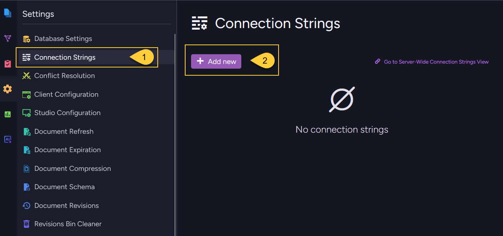
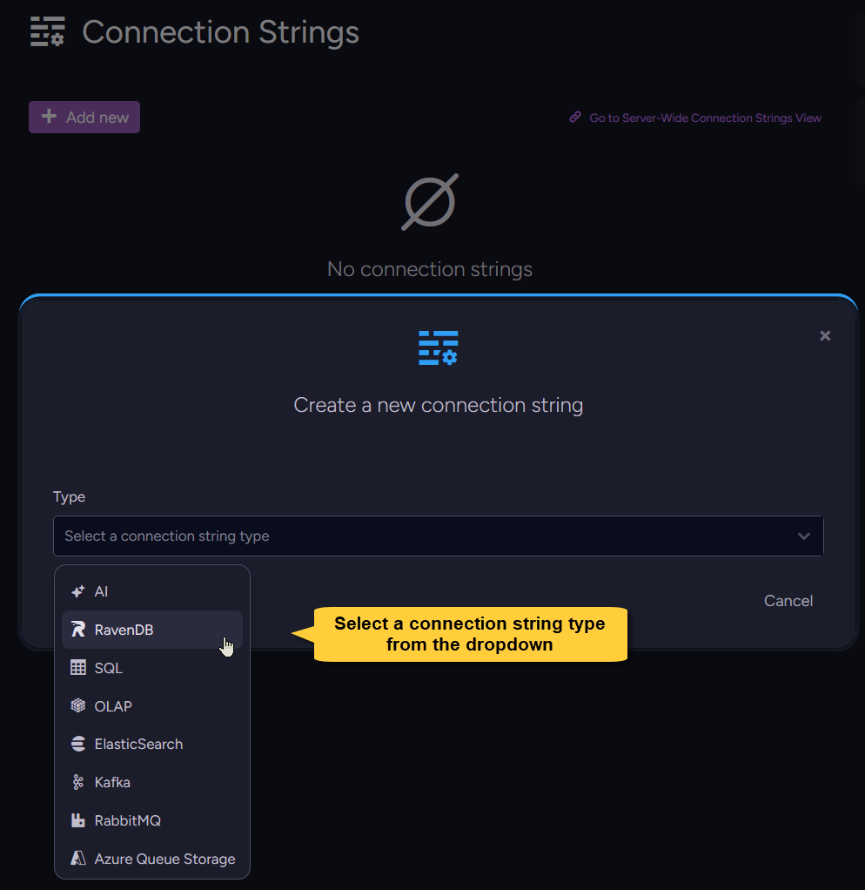
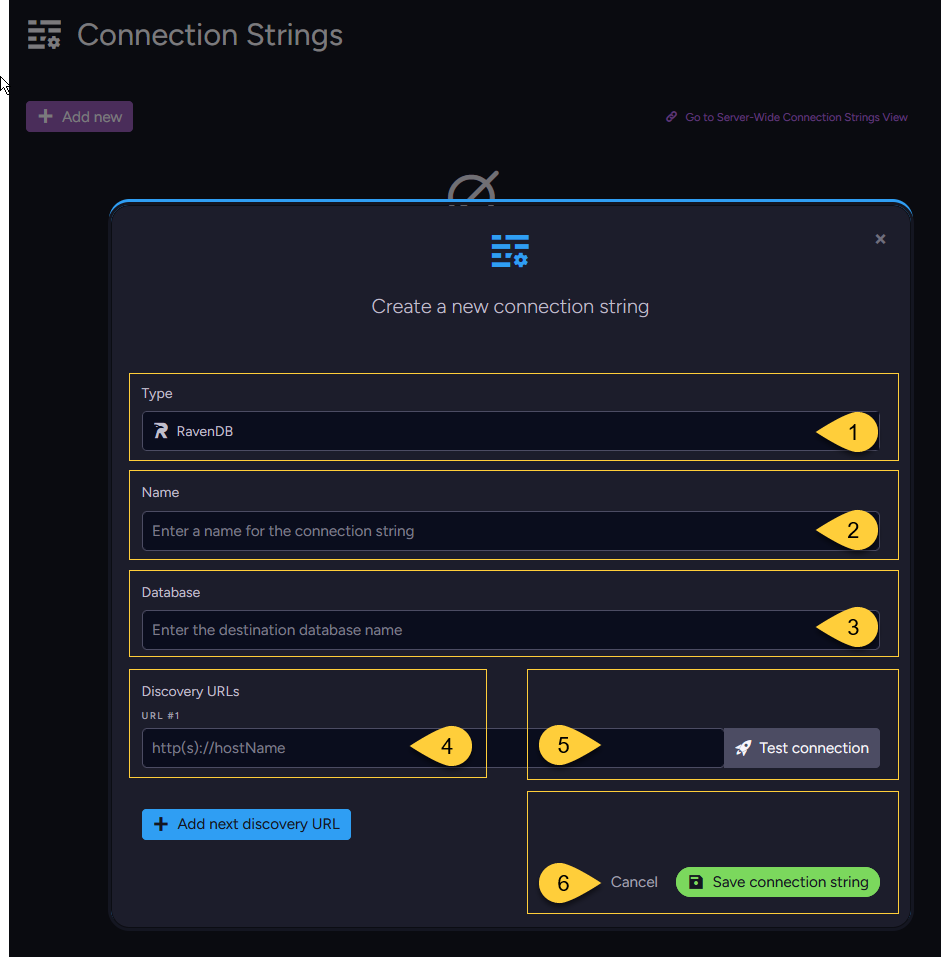
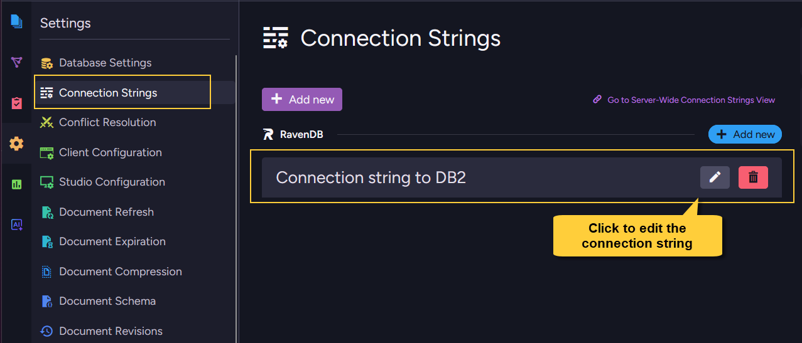

import Tabs from '@theme/Tabs';
import TabItem from '@theme/TabItem';
import Admonition from '@theme/Admonition';
import Panel from "@site/src/components/Panel";

<Admonition type="note" title="">
    
* A **per-database connection string** defines reusable connection details for tasks and AI agents in one database.  
  It is stored in that database's record and can be used only by tasks and AI agents defined for that database.    

* This article shows how to **add** a new per-database connection string or **update** an existing one,  
  from Studio or from the Client API.  

* RavenDB supports multiple connection string types, each with its own destination and required settings.  
  This article covers the common add/update flow.
  The type-specific fields are documented in the relevant task or feature article;
  see [Connection string per type](../../../../integrations/connection-strings/per-database/add-or-update-connection-string.mdx#connection-string-per-type) for links to those articles.

* To define a connection string once and share it across many databases,
  add a [Server-wide connection string](../../../../integrations/connection-strings/server-wide/add-or-update-connection-string.mdx) instead.

* In this article:
  * [Add a connection string - from Studio](../../../../integrations/connection-strings/per-database/add-or-update-connection-string.mdx#add-a-connection-string-from-studio)
  * [Update a connection string - from Studio](../../../../integrations/connection-strings/per-database/add-or-update-connection-string.mdx#update-a-connection-string-from-studio)
  * [Add a connection string - from the Client API](../../../../integrations/connection-strings/per-database/add-or-update-connection-string.mdx#add-a-connection-string-from-the-client-api)
  * [Update a connection string - from the Client API](../../../../integrations/connection-strings/per-database/add-or-update-connection-string.mdx#update-a-connection-string-from-the-client-api)
  * [Connection string per type](../../../../integrations/connection-strings/per-database/add-or-update-connection-string.mdx#connection-string-per-type)
  * [Syntax](../../../../integrations/connection-strings/per-database/add-or-update-connection-string.mdx#syntax)

</Admonition>

<Panel heading="Add a connection string - from Studio">

<Admonition type="note" title="">
    
The screenshots below show how to add a `RavenDB` connection string from Studio.  
Use the same flow for other connection string types; only the type-specific fields change.  
For links to the type-specific articles, see [Connection string per type](../../../../integrations/connection-strings/per-database/add-or-update-connection-string.mdx#connection-string-per-type).    

</Admonition>
    
---    
    

    
1. Open your database and go to **Settings > Connection Strings**.
2. Click **Add new**.
    
---
    

  
Select a connection string type from the dropdown.
    
---
   

    
For a `RavenDB` connection string, fill in:

1. **Type** - The selected connection string type.
2. **Name** - A unique name for the connection string.
3. **Database** - The destination database name.
4. **Discovery URLs** - One or more URLs used to discover the destination RavenDB server topology.
5. **Test connection** - Verifies that RavenDB can reach the destination using the details you entered.  
   On success, you can save the connection string.  
   On failure, RavenDB displays the error returned by the destination so you can correct the details  
   (for example, a wrong URL, database name, or invalid credentials) and test again.  
6. **Save connection string** - Saves the connection string.

---    

<Admonition type="info" title="">

#### Adding a per-database connection string while creating a task    

* You don't have to open the **Connection Strings** view first.
  When you create a task that uses a connection string, the task setup dialog lets you select an existing connection string or create a new one inline.

* Connection strings created this way are saved in the database and also appear in  
  **Settings > Connection Strings**.

</Admonition>

</Panel>

<Panel heading="Update a connection string - from Studio">
    
The **Settings > Connection Strings** view lists the connection strings available to the current database,  
grouped by connection string type.
    
**Per-database** connection strings can be edited from this view.  
Inherited **server-wide** connection strings are also shown here, but they are read-only from the database scope.  
To edit an inherited connection string see [Update a server-wide connection string - from Studio](../../../../integrations/connection-strings/server-wide/add-or-update-connection-string.mdx#update-a-server-wide-connection-string-from-studio)
    

    
Click the edit button next to a per-database connection string to open its settings.
    
The connection string **Name** is read-only when editing.  
If you want the connection string to have a different name, create a new per-database connection string,  
then update every task or AI agent in the database that references the old connection string.    
    
After making changes, test the connection and save it.    

<Admonition type="info" title="">

#### Editing a connection string that is in use
    
* A connection string cannot be deleted while tasks or AI agents reference it, but it can be edited.

* The saved changes replace the existing definition and apply to every task or AI agent in the database that uses this connection string.
  This is useful for changes such as rotating credentials or updating a destination URL without recreating each task.

* For AI connection strings, some options cannot be edited while the connection string is used by an Embeddings Generation or GenAI task.
  This includes settings that affect the model or generated embeddings, such as the connector, model, or embedding dimensions.
  Connection details such as API keys or endpoints can still be edited.    

</Admonition> 

</Panel> 

<Panel heading="Add a connection string - from the Client API">

Use [PutConnectionStringOperation](../../../../integrations/connection-strings/per-database/add-or-update-connection-string.mdx#the-putconnectionstringoperation-operation)
to add a connection string to a database.

The operation is sent through the database maintenance store: `store.Maintenance.Send(...)`.  
By default, it is applied to the [default database](../../../../client-api/setting-up-default-database.mdx).  
To apply it to a different database, see [switch operations to a different database](../../../../client-api/operations/how-to/switch-operations-to-a-different-database.mdx).

For every connection string type, create the matching connection string class  
(e.g.: `RavenConnectionString`, `SqlConnectionString`, etc.) and pass it to `PutConnectionStringOperation`.

For type-specific fields and links to full examples, see
[Connection string per type](../../../../integrations/connection-strings/per-database/add-or-update-connection-string.mdx#connection-string-per-type).  
The following example adds a `RavenDB` connection string.    

#### Example

<Tabs groupId='languageSyntax'>
<TabItem value="Sync" label="Sync">
```csharp
// Define a connection string to a RavenDB database destination
// ============================================================
var ravenDBConStr = new RavenConnectionString
{
    Name = "ravendb-connection-string-name",
    Database = "target-database-name",
    TopologyDiscoveryUrls = new[] { "https://rvn2:8080" }
};

// Deploy (send) the connection string to the server via the PutConnectionStringOperation
// ======================================================================================
var putConnectionStringOp = new PutConnectionStringOperation<RavenConnectionString>(ravenDBConStr);
PutConnectionStringResult connectionStringResult = store.Maintenance.Send(putConnectionStringOp);
```
</TabItem>
<TabItem value="Async" label="Async">
```csharp
// Define a connection string to a RavenDB database destination
// ============================================================
var ravenDBConStr = new RavenConnectionString
{
    Name = "ravendb-connection-string-name",
    Database = "target-database-name",
    TopologyDiscoveryUrls = new[] { "https://rvn2:8080" }
};

// Deploy (send) the connection string to the server via the PutConnectionStringOperation
// ======================================================================================
var putConnectionStringOp = new PutConnectionStringOperation<RavenConnectionString>(ravenDBConStr);
PutConnectionStringResult connectionStringResult = await store.Maintenance.SendAsync(putConnectionStringOp);
```
</TabItem>
</Tabs>

</Panel>

<Panel heading="Update a connection string - from the Client API">
    
Use the same `PutConnectionStringOperation` to update an existing per-database connection string.

To update a connection string, send a connection string with the **same** `Name`.    
The submitted definition replaces the existing per-database connection string with that name.  
The change applies to every task or AI agent in the database that references this connection string.

To use a different name, create a new connection string and update the tasks or AI agents that reference the old one.

</Panel>

<Panel heading="Connection string per type">

Each connection string type uses the same add/update flow, but has its own destination-specific fields.  
The specific fields and complete examples are documented in the relevant task or feature article:    

* **RavenDB** - used by [RavenDB ETL](../../../../server/ongoing-tasks/etl/raven.mdx),
  [External Replication](../../../../server/ongoing-tasks/external-replication.mdx),
  and [Hub/Sink Replication](../../../../server/ongoing-tasks/hub-sink-replication.mdx).  
  See [Add a RavenDB connection string](../../../../server/ongoing-tasks/etl/raven.mdx#add-a-ravendb-connection-string).

* **SQL** - used by [SQL ETL](../../../../server/ongoing-tasks/etl/sql.mdx)
  and [CDC Sink](../../../../server/ongoing-tasks/cdc-sink/overview.mdx).  
  See [Add an SQL connection string](../../../../server/ongoing-tasks/etl/sql.mdx#add-an-sql-connection-string).

* **Snowflake** - used by [Snowflake ETL](../../../../server/ongoing-tasks/etl/snowflake.mdx).  
  See [Add a Snowflake connection string](../../../../server/ongoing-tasks/etl/snowflake.mdx#add-a-snowflake-connection-string).

* **OLAP** - used by [OLAP ETL](../../../../server/ongoing-tasks/etl/olap.mdx).  
  See [Add an OLAP connection string](../../../../server/ongoing-tasks/etl/olap.mdx#add-an-olap-connection-string).

* **Elasticsearch** - used by [Elasticsearch ETL](../../../../server/ongoing-tasks/etl/elasticsearch.mdx).  
  See [Add an Elasticsearch connection string](../../../../server/ongoing-tasks/etl/elasticsearch.mdx#add-an-elasticsearch-connection-string).

* **Kafka** - used by [Kafka Queue ETL](../../../../server/ongoing-tasks/etl/queue-etl/kafka.mdx) 
  and [Kafka Queue Sink](../../../../server/ongoing-tasks/queue-sink/kafka-queue-sink.mdx).  
  See the connection string section in the [Queue ETL](../../../../server/ongoing-tasks/etl/queue-etl/kafka.mdx#add-a-kafka-connection-string)
  or [Queue Sink](../../../../server/ongoing-tasks/queue-sink/kafka-queue-sink.mdx#adding-a-kafka-connection-string) article.

* **RabbitMQ** - used by [RabbitMQ Queue ETL](../../../../server/ongoing-tasks/etl/queue-etl/rabbit-mq.mdx)
  and [RabbitMQ Queue Sink](../../../../server/ongoing-tasks/queue-sink/rabbit-mq-queue-sink.mdx).  
  See the connection string section in the [Queue ETL](../../../../server/ongoing-tasks/etl/queue-etl/rabbit-mq.mdx#add-a-rabbitmq-connection-string)
  or [Queue Sink](../../../../server/ongoing-tasks/queue-sink/rabbit-mq-queue-sink.mdx#adding-a-rabbitmq-connection-string) article.

* **Azure Queue Storage** - used by [Azure Queue Storage Queue ETL](../../../../server/ongoing-tasks/etl/queue-etl/azure-queue.mdx).  
  See [Add an Azure Queue Storage connection string](../../../../server/ongoing-tasks/etl/queue-etl/azure-queue.mdx#add-an-azure-queue-storage-connection-string).

* **Amazon SQS** - used by [Amazon SQS Queue ETL](../../../../server/ongoing-tasks/etl/queue-etl/amazon-sqs.mdx).  
  See [Add an Amazon SQS connection string](../../../../server/ongoing-tasks/etl/queue-etl/amazon-sqs.mdx#add-an-amazon-sqs-connection-string).

* **Azure Service Bus** - used by [Azure Service Bus Queue Sink](../../../../server/ongoing-tasks/queue-sink/azure-service-bus-queue-sink.mdx).  
  See [Adding an Azure Service Bus connection string](../../../../server/ongoing-tasks/queue-sink/azure-service-bus-queue-sink.mdx#adding-an-azure-service-bus-connection-string).

* **AI** - used by RavenDB's AI features (embeddings generation, Gen AI, and AI agents).  
  See [AI connection strings](../../../../ai-integration/connection-strings/overview.mdx).

</Panel>

<Panel heading="Syntax">

#### The `PutConnectionStringOperation` operation

```csharp
public PutConnectionStringOperation(T connectionString)
    where T : ConnectionString
```
<br/>    

| Parameter            | Type                            | Description                                        |
|----------------------|---------------------------------|----------------------------------------------------|
| **connectionString** | `RavenConnectionString`         | Object that defines the RavenDB connection string. |
| **connectionString** | `SqlConnectionString`           | Object that defines the SQL connection string. |
| **connectionString** | `SnowflakeConnectionString`     | Object that defines the Snowflake connection string. |
| **connectionString** | `OlapConnectionString`          | Object that defines the OLAP connection string. |
| **connectionString** | `ElasticSearchConnectionString` | Object that defines the Elasticsearch connection string. |
| **connectionString** | `QueueConnectionString`         | Object that defines the connection string for the queue broker tasks - Queue ETL (Kafka, RabbitMQ, Azure Queue Storage, Amazon SQS) and Queue Sink (Kafka, RabbitMQ, Azure Service Bus). |
| **connectionString** | `AiConnectionString`            | Object that defines the AI connection string. |    

#### The `ConnectionString` base class

All the connection string class types inherit from this abstract class:

```csharp
public abstract class ConnectionString
{
    // A name for the connection string
    public string Name { get; set; }
    
    // The connection string type
    public abstract ConnectionStringType Type { get; } 
}

public enum ConnectionStringType
{
    None,
    Raven,
    Sql,
    Olap,
    ElasticSearch,
    Queue,
    Snowflake,
    Ai
}
```
<br/>
    
<Admonition type="note" title="">
    
Connection string type-specific fields and complete examples are documented in the task or feature articles listed under  
[Connection string per type](../../../../integrations/connection-strings/per-database/add-or-update-connection-string.mdx#connection-string-per-type).
    
</Admonition>
    
</Panel>