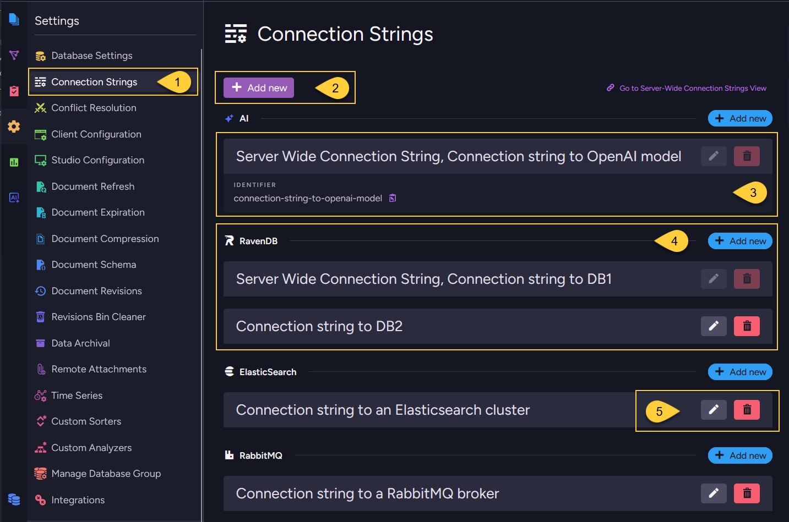

import Admonition from '@theme/Admonition';
import Panel from "@site/src/components/Panel";

<Admonition type="note" title="">

* A **per-database connection string** is defined within a single database.  
  It is stored in that database's record and can be used only by tasks and AI agents defined for that database.

* For the available connection string types,  
  see [Supported connection string types](../../../integrations/connection-strings/overview.mdx#supported-connection-string-types)
  in the [Connection strings overview](../../../integrations/connection-strings/overview.mdx) article.    

* In this article:
  * [When to use a per-database connection string](../../../integrations/connection-strings/per-database/overview.mdx#when-to-use-a-per-database-connection-string)
  * [Using per-database connection strings](../../../integrations/connection-strings/per-database/overview.mdx#using-per-database-connection-strings)
  * [Managing per-database connection strings](../../../integrations/connection-strings/per-database/overview.mdx#managing-per-database-connection-strings)
  * [Interaction with server-wide connection strings](../../../integrations/connection-strings/per-database/overview.mdx#interaction-with-server-wide-connection-strings)
  * [Export, import, backup, and restore behavior](../../../integrations/connection-strings/per-database/overview.mdx#export-import-backup-and-restore-behavior)

</Admonition>

<Panel heading="When to use a per-database connection string">

Use a per-database connection string when:

* The connection details are relevant only to tasks or features in one database.  
* Different databases need different endpoints, credentials, or provider settings.
* The connection should be managed from the database scope.

For shared connection details used by many databases,
use a [Server-wide connection string](../../../integrations/connection-strings/server-wide/overview.mdx) instead.

</Panel>

<Panel heading="Using per-database connection strings">

The connection string is referenced by its name.
The task or agent configuration defines what RavenDB should do, while the connection string stores the reusable connection details.    

Multiple tasks and AI agents in the same database can reuse the same connection string.

If you edit the connection string, the change affects every task or AI agent in that database that references it.    

</Panel>

<Panel heading="Managing per-database connection strings">
    
Per-database connection strings can be managed from Studio or the Client API.

---
    
**From Studio**

  

  1. Go to **Settings > Connection Strings** in the database scope.  
     The view lists every connection string available to the database.   
     From this view, you can create, edit, delete, and test connection strings for the current database.

  2. Click **Add new** to create a new per-database connection string.

  3. Server-wide connection strings are also shown in this view after they are propagated to the database.  
     They can be used by tasks and AI agents in the database, but they cannot be edited or deleted from the database scope.
     Their names use the reserved prefix `Server Wide Connection String`.

  4. In each connection string type section, the view can show both inherited server-wide connection strings and connection strings defined for the current database.

  5. Connection strings defined for the current database can be edited or deleted from the database scope.
      
---
    
**From the Client API**
    
Use the per-database operations:
  * [Add or update a per-database connection string](../../../integrations/connection-strings/per-database/add-or-update-connection-string.mdx)
  * [Get per-database connection strings](../../../integrations/connection-strings/per-database/get-connection-strings.mdx)
  * [Remove a per-database connection string](../../../integrations/connection-strings/per-database/remove-connection-string.mdx)

---
    
<Admonition type="note" title="">

#### Deletion behavior
    
A connection string cannot be deleted while it is still used by an ongoing task or an AI agent.  
Before editing or removing a connection string, check which tasks reference it.
    
</Admonition>

</Panel>

<Panel heading="Interaction with server-wide connection strings">

* **Available entries**:  
  The database **Settings > Connection Strings** view shows both kinds of entries:
  * **Per-database connection strings** - created in the current database and editable from the database scope.
  * **Inherited server-wide connection strings** - propagated from the cluster-level server-wide configuration.

* **Read-only inherited entries**:   
  Inherited server-wide connection strings are read-only from the database scope.  
  They cannot be edited or deleted from the database scope, but tasks and AI agents in the database can reference them.
    
  To change an inherited entry, open **Manage Server > Server-Wide Connection Strings** or use the server-wide connection string API.
  Learn more in [Server-wide connection strings](../../../integrations/connection-strings/server-wide/overview.mdx).    
    
* **Reserved name prefix**:  
  When a server-wide connection string is propagated into a database,
  the `Server Wide Connection String` prefix is automatically prepended to its name in the database scope, producing a full name of the form  
  `Server Wide Connection String, <name>` (for example, `Server Wide Connection String, MyRavenCS`).

  Per-database connection string names **cannot** start with this name prefix,  
  because that prefix is reserved for propagated server-wide entries.

  Use that full name when a task or AI agent references the server-wide connection string in the database.   
    
</Panel>

<Panel heading="Export, import, backup, and restore behavior"> 
    
Per-database connection strings are stored in the database record and are handled as database-level metadata during export, import, backup, and restore.    

* **Export** 
  Included by default.  
  They are written to the dump as part of the database record,  
  unless the relevant connection string item types are excluded from the Smuggler options.
* **Import**  
  Imported into the target database when they are present in the dump.
* **Backup (Backup type)**  
  Included, since a logical backup uses the export pipeline.
* **Backup (Snapshot type)**  
  Included, since the snapshot stores the database record.
* **Restore from backup**  
  Restored from the database record in the backup.
* **Restore from snapshot**  
  Restored from the database record stored in the snapshot.

After moving a database to another environment, review the restored or imported per-database connection strings.  
Their URLs, credentials, provider settings, or target database names may still point to the source environment.
    
For the corresponding **server-wide** behavior,
see [Export, import, backup, and restore behavior - Server-wide](../../../integrations/connection-strings/server-wide/overview.mdx#export-import-backup-and-restore-behavior)    

</Panel>