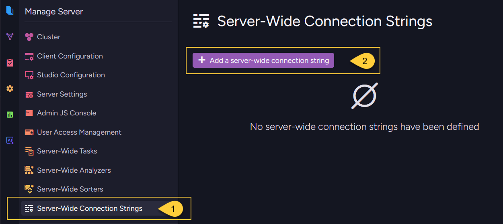
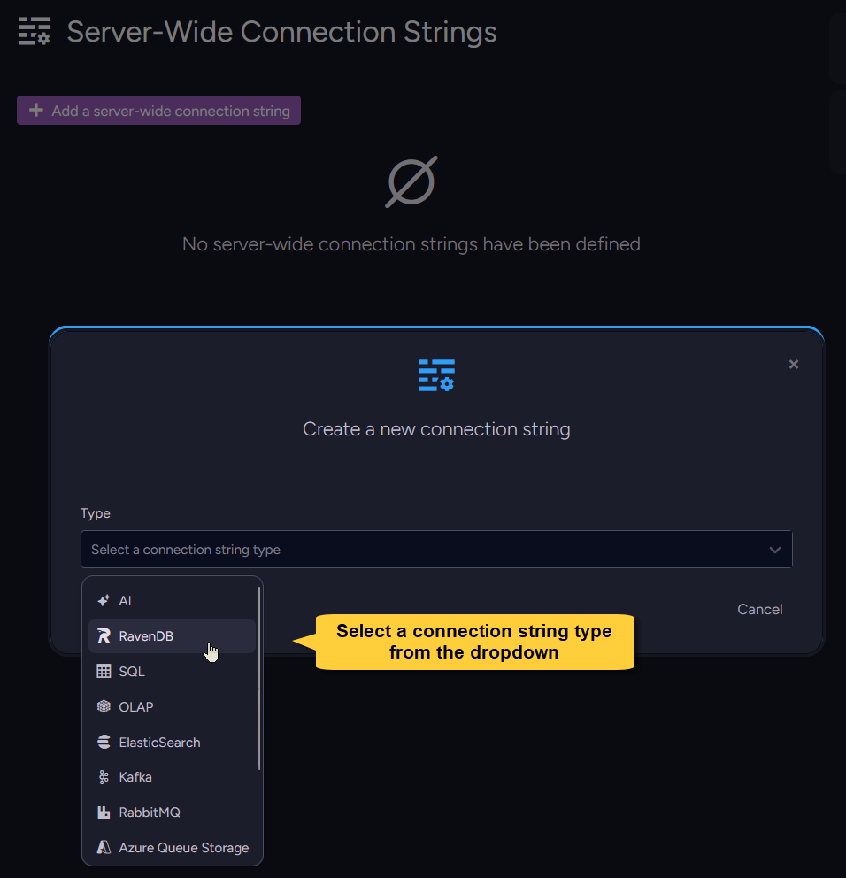
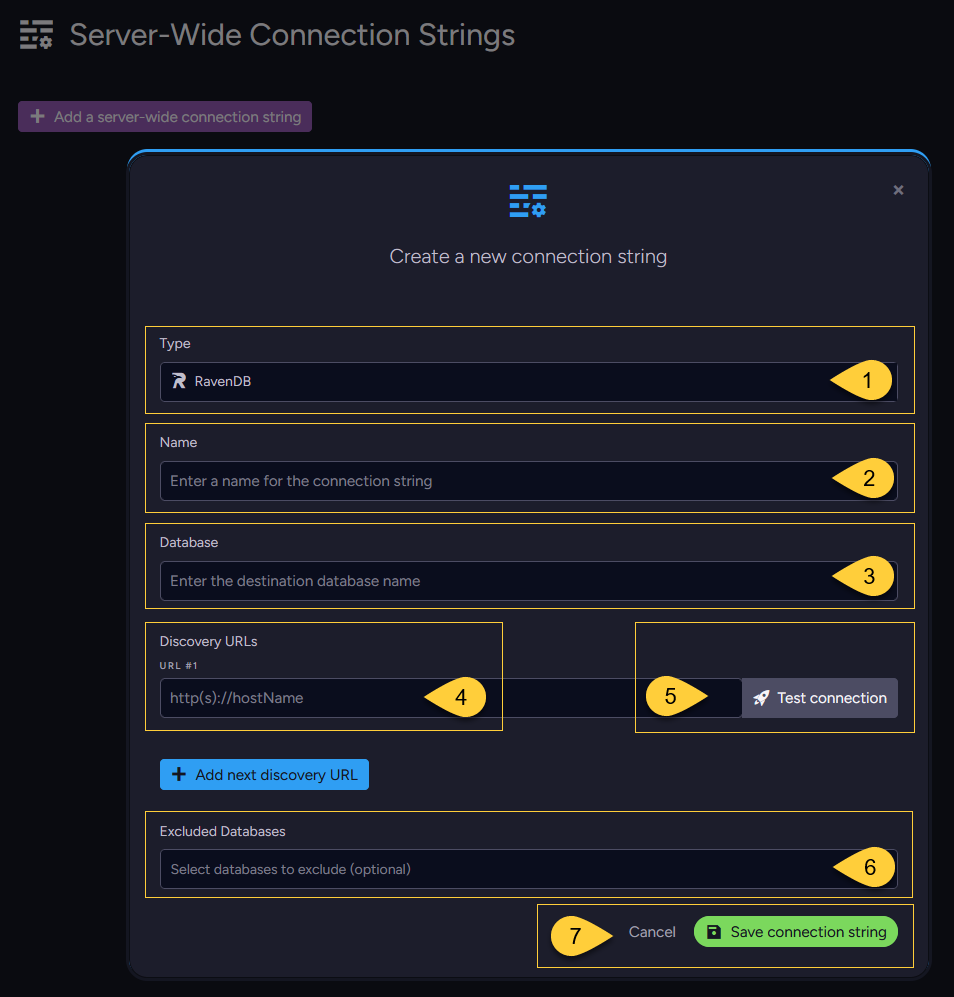
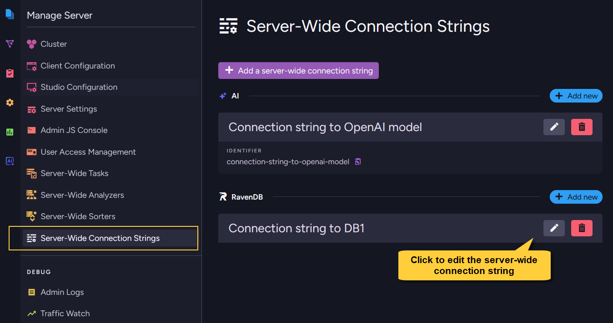

import Admonition from '@theme/Admonition';
import Panel from "@site/src/components/Panel";
import Tabs from '@theme/Tabs';
import TabItem from '@theme/TabItem';

<Admonition type="note" title="">

* A **server-wide connection string** is defined once at the cluster level and propagated automatically
  to all databases in the cluster, except databases that are explicitly excluded.
  See [Server-wide connection strings overview](../../../../integrations/connection-strings/server-wide/overview.mdx).

* This article shows how to **add** a new server-wide connection string or **update** an existing one,  
  from Studio or from the Client API.

* RavenDB supports multiple connection string types, each with its own destination and required settings.  
  This article covers the common add/update flow for server-wide connection strings.
  The type-specific fields are documented in the relevant task or feature article;
  see [Connection string per type](../../../../integrations/connection-strings/per-database/add-or-update-connection-string.mdx#connection-string-per-type) for links to those articles.

* For connection details that are relevant only to one database,
  use a [per-database connection string](../../../../integrations/connection-strings/per-database/add-or-update-connection-string.mdx) instead.

* In this article:
  * [Add a server-wide connection string - from Studio](../../../../integrations/connection-strings/server-wide/add-or-update-connection-string.mdx#add-a-server-wide-connection-string-from-studio)
  * [Update a server-wide connection string - from Studio](../../../../integrations/connection-strings/server-wide/add-or-update-connection-string.mdx#update-a-server-wide-connection-string-from-studio)
  * [Add a server-wide connection string - from the Client API](../../../../integrations/connection-strings/server-wide/add-or-update-connection-string.mdx#add-a-server-wide-connection-string-from-the-client-api)
  * [Update a server-wide connection string - from the Client API](../../../../integrations/connection-strings/server-wide/add-or-update-connection-string.mdx#update-a-server-wide-connection-string-from-the-client-api)
  * [Excluding databases](../../../../integrations/connection-strings/server-wide/add-or-update-connection-string.mdx#excluding-databases)
  * [Syntax](../../../../integrations/connection-strings/server-wide/add-or-update-connection-string.mdx#syntax)

</Admonition>

<Panel heading="Add a server-wide connection string - from Studio">
   
<Admonition type="note" title="">
    
The screenshots below show how to add a server-wide `RavenDB` connection string from Studio.  
Use the same flow for other connection string types; only the type-specific fields change.  
For links to the type-specific articles, see [Connection string per type](../../../../integrations/connection-strings/per-database/add-or-update-connection-string.mdx#connection-string-per-type).
    
</Admonition>    

---
    

    
1. Go to **Manage Server &gt; Server-Wide Connection Strings**.
2. Click **Add a server-wide connection string**.    
    
---
    

  
Select a connection string type from the dropdown.
    
---
    

    
For a `RavenDB` connection string, fill in:

1. **Type** - The selected connection string type.
2. **Name** - A unique name for the connection string.
3. **Database** - The destination database name.
4. **Discovery URLs** - One or more URLs used to discover the destination RavenDB server topology.  
   To add another URL, click **Add next discovery URL**.
5. **Test connection** - Verifies that RavenDB can reach the destination using the details you entered.  
   On success, you can save the connection string.  
   On failure, RavenDB displays the error returned by the destination so you can correct the details  
   (for example, a wrong URL, database name, or invalid credentials) and test again.
6. **Excluded databases** - Optionally select databases that should **not** receive this connection string.  
   All other existing databases, and any database created later, receive it automatically.
7. **Save connection string** - Saves the connection string. 

</Panel>

<Panel heading="Update a server-wide connection string - from Studio">
    
The **Manage Server > Server-Wide Connection Strings** view lists the server-wide connection strings defined in the cluster.
You can edit server-wide connection strings from this view. The propagated entries are read-only from the database scope.    
    

    
Click the edit button next to the server-wide connection string to open its settings.    
    
The connection string **Name** is read-only when editing.  
If you want the connection string to have a different name, create a new server-wide connection string,  
then update every task or AI agent that references the old propagated connection string.    
    
You can update the connection details and the **Excluded databases** list.      
    
Before saving, click **Test connection** to verify the updated destination details.  
Then click **Save connection string**.    
    
After saving, RavenDB updates the cluster-level definition and propagates the changes to all databases in the cluster except for those that are excluded.   

<Admonition type="info" title="">

#### Editing a server-wide connection string that is in use
    
* A server-wide connection string cannot be deleted while tasks or AI agents in any database reference it,  
  but it can be edited.     
    
* Saved changes apply to every task or AI agent that uses the propagated server-wide connection string in a database that receives it.
  This is useful for changes such as rotating credentials or updating a destination URL without updating each database separately.    

* Updating **Excluded databases** changes which databases receive the propagated connection string.
    
* For AI connection strings, some options cannot be edited while the connection string is used by an Embeddings Generation or GenAI task.
  This includes settings that affect the model or generated embeddings, such as the connector, model, or embedding dimensions.
  Connection details such as API keys or endpoints can still be edited.    

</Admonition>    

</Panel> 

<Panel heading="Add a server-wide connection string - from the Client API">

Use [PutServerWideConnectionStringOperation](../../../../integrations/connection-strings/server-wide/add-or-update-connection-string.mdx#syntax)
to add a connection string at the cluster level.

Create the connection string object for the required type (for example, `RavenConnectionString` or `SqlConnectionString`),
then wrap it in a `ServerWideConnectionString`.  
Send the operation through the server maintenance store: `store.Maintenance.Server.Send(...)`.

Set `ExcludedDatabases` on the `ServerWideConnectionString` wrapper to prevent specific databases from receiving the connection string.
When the list is `null` or empty, the connection string is propagated to all databases.

For type-specific fields and links to full examples, see
[Connection string per type](../../../../integrations/connection-strings/per-database/add-or-update-connection-string.mdx#connection-string-per-type).  
The following example adds a server-wide `RavenDB` connection string and excludes two databases.    

#### Example  

<Tabs groupId='languageSyntax'>
<TabItem value="Sync" label="Sync">
```csharp
// Define the underlying connection string (same as a per-database connection string)
// ==================================================================================
var ravenDBConStr = new RavenConnectionString
{
    Name = "ravendb-connection-string-name",
    Database = "target-database-name",
    TopologyDiscoveryUrls = new[] { "https://rvn2:8080" }
};

// Wrap it in a ServerWideConnectionString
// =======================================
var serverWideConStr = new ServerWideConnectionString
{
    ConnectionString = ravenDBConStr,
    
    // Optional: these databases will NOT receive this server-wide connection string.
    // When null or empty, it is propagated to all databases in the cluster.
    ExcludedDatabases = new[] { "Northwind", "HR" }
};

// Deploy (send) it to the cluster via the server maintenance store
// ================================================================
var putServerWideConStrOp = new PutServerWideConnectionStringOperation(serverWideConStr);
PutServerWideConnectionStringResult result = store.Maintenance.Server.Send(putServerWideConStrOp);
```
</TabItem>
<TabItem value="Async" label="Async">
```csharp
// Define the underlying connection string (same as a per-database connection string)
// ==================================================================================
var ravenDBConStr = new RavenConnectionString
{
    Name = "ravendb-connection-string-name",
    Database = "target-database-name",
    TopologyDiscoveryUrls = new[] { "https://rvn2:8080" }
};

// Wrap it in a ServerWideConnectionString
// =======================================
var serverWideConStr = new ServerWideConnectionString
{
    ConnectionString = ravenDBConStr,
    
    // Optional: these databases will NOT receive this server-wide connection string.
    // When null or empty, it is propagated to all databases in the cluster.
    ExcludedDatabases = new[] { "Northwind", "HR" }
};

// Deploy (send) it to the cluster via the server maintenance store
// ================================================================
var putServerWideConStrOp = new PutServerWideConnectionStringOperation(serverWideConStr);
PutServerWideConnectionStringResult result = await store.Maintenance.Server.SendAsync(putServerWideConStrOp);
```
</TabItem>
</Tabs>

</Panel>

<Panel heading="Update a server-wide connection string - from the Client API">
    
Use the same `PutServerWideConnectionStringOperation` to update an existing server-wide connection string.

To update a server-wide connection string, send a `ServerWideConnectionString` whose underlying connection string has the **same** `Name`.
The submitted definition replaces the existing cluster-level definition with that name.

After the update, RavenDB propagates the new definition to all non-excluded databases.  
The change applies wherever the propagated server-wide connection string is used.

You can also update `ExcludedDatabases`.
If you exclude a database that already uses the propagated connection string, the update is **rejected** so the database is not left with a task or AI agent that references a missing connection string.

To use a different name for the connection string,  
create a new server-wide connection string and update the tasks or AI agents that reference the old one.

</Panel>

<Panel heading="Syntax">
    
#### The `PutServerWideConnectionStringOperation` operation    

```csharp
public PutServerWideConnectionStringOperation(ServerWideConnectionString connectionString)
```
<br/>    

| Parameter            | Type                         | Description                                              |
|----------------------|------------------------------|----------------------------------------------------------|
| **connectionString** | `ServerWideConnectionString` | The server-wide connection string to create or update.   |

#### The `ServerWideConnectionString` class    
    
```csharp
public sealed class ServerWideConnectionString
{
    // The underlying connection string definition
    // (e.g.: RavenConnectionString, SqlConnectionString, OlapConnectionString, etc.)
    public ConnectionString ConnectionString { get; set; }
    
    // Optional. Databases that should NOT receive this connection string.
    // When null or empty, it is propagated to all databases in the cluster.
    public string[] ExcludedDatabases { get; set; }
    
    // Delegated from the underlying ConnectionString
    public string Name => ConnectionString?.Name;
    public ConnectionStringType Type => ConnectionString?.Type ?? ConnectionStringType.None;
}
```
<br/>    
    
The `ConnectionString` object can be any supported connection string type, such as
`RavenConnectionString`, `SqlConnectionString`, `SnowflakeConnectionString`, `OlapConnectionString`,
`ElasticSearchConnectionString`, `QueueConnectionString`, or `AiConnectionString`.
    
For the fields of each concrete connection string type, see
[Connection string per type](../../../../integrations/connection-strings/per-database/add-or-update-connection-string.mdx#connection-string-per-type).    


| Operation result                      |                                                                         |
|---------------------------------------|-------------------------------------------------------------------------|
| `PutServerWideConnectionStringResult` | Contains `RaftCommandIndex` - the Raft index assigned to the operation. |    
    
</Panel>
