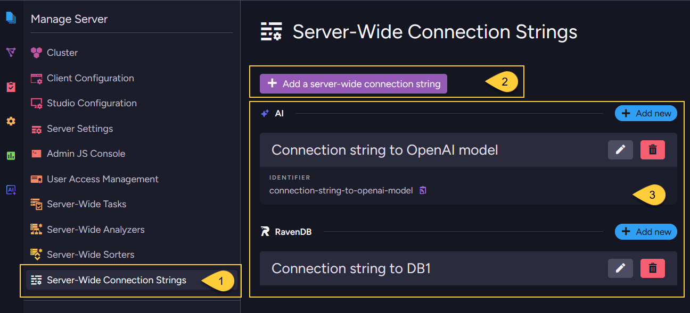

import Admonition from '@theme/Admonition';
import Panel from "@site/src/components/Panel";

<Admonition type="note" title="">

* A **server-wide connection string** is defined once at the cluster level.  
  RavenDB propagates it to databases in the cluster, except databases that are explicitly excluded.

* Tasks and AI agents in a database can use the propagated server-wide connection string like a per-database connection string, but it is read-only from the database scope.
  To edit or delete the server-wide definition, see [Managing server-wide connection strings](../../../integrations/connection-strings/server-wide/overview.mdx#managing-server-wide-connection-strings).    

* For the available connection string types,  
  see [Supported connection string types](../../../integrations/connection-strings/overview.mdx#supported-connection-string-types)
  in the [Connection strings overview](../../../integrations/connection-strings/overview.mdx) article.

* In this article:
  * [When to use a server-wide connection string](../../../integrations/connection-strings/server-wide/overview.mdx#when-to-use-a-server-wide-connection-string)
  * [How server-wide connection strings work](../../../integrations/connection-strings/server-wide/overview.mdx#how-server-wide-connection-strings-work)
  * [Managing server-wide connection strings](../../../integrations/connection-strings/server-wide/overview.mdx#managing-server-wide-connection-strings)
  * [Export, import, backup, and restore behavior](../../../integrations/connection-strings/server-wide/overview.mdx#export-import-backup-and-restore-behavior)

</Admonition>

<Panel heading="When to use a server-wide connection string">

Use a server-wide connection string when:

* The connection details, such as endpoints, credentials, or provider settings, are relevant to tasks or AI agents in many databases.
* You want one cluster-level definition to manage and update.
* You want new databases to automatically receive the same connection settings, unless they are excluded.    

For connection details that are relevant only to tasks or AI agents in one database,  
use a [per-database connection string](../../../integrations/connection-strings/per-database/overview.mdx) instead.

</Panel>

<Panel heading="How server-wide connection strings work">

* **Propagation**:  
  Server-wide connection strings are stored in the cluster and automatically made available to databases.    
  When a server-wide connection string is created or updated:    
  * RavenDB saves the cluster-level definition.
  * RavenDB makes it available to every database in the cluster, except databases that are explicitly excluded.
    Excluded databases can be configured when creating or editing the server-wide connection string.
  * Databases created later also receive the server-wide connection string automatically, unless they are excluded.
  * Tasks and AI agents in a database can reference the propagated connection string.

* **Reserved name format**:  
  In the database scope, a propagated server-wide connection string is named using the reserved format:    
  `Server Wide Connection String, <name>`

  For example, a server-wide connection string named `SharedConnection` appears in database scope as:  
  `Server Wide Connection String, SharedConnection`

  This reserved prefix prevents a regular per-database connection string from colliding with a propagated server-wide entry.

* **Database-scope visibility**:  
  Server-wide connection strings are visible in each database's **Settings > Connection Strings** view after they are propagated.
  From the database scope, propagated server-wide connection strings are read-only:
  * They cannot be edited from the database scope.
  * They cannot be deleted through the per-database connection string API.
  * To modify them, see [Managing server-wide connection strings](../../../integrations/connection-strings/server-wide/overview.mdx#managing-server-wide-connection-strings).

</Panel>

<Panel heading="Managing server-wide connection strings">

Server-wide connection strings can be managed from Studio or the Client API.

---
    
**From Studio**

     
    
  1. Go to **Manage Server > Server-Wide Connection Strings**.  
     From this view, you can create, edit, delete, and test server-wide connection strings.

  2. Click **Add a server-wide connection string** to create a new server-wide connection string.

  3. Server-wide connection strings are listed under their connection string type.   

---
    
**From the Client API**
    
  Use the server-wide operations:
  * [Add or update a server-wide connection string](../../../integrations/connection-strings/server-wide/add-or-update-connection-string.mdx)
  * [Get server-wide connection strings](../../../integrations/connection-strings/server-wide/get-connection-strings.mdx)
  * [Remove a server-wide connection string](../../../integrations/connection-strings/server-wide/remove-connection-string.mdx)
    
---
    
<Admonition type="note" title="">

#### Deletion behavior
    
A server-wide connection string cannot be deleted while it is still used by an ongoing task or AI agent in any database.
Before editing or removing a connection string, check which tasks or AI agents reference it.

When a server-wide connection string is deleted, RavenDB removes both:

* The cluster-level server-wide definition.
* The propagated connection string entries from all databases that received it.

</Admonition>    
    
</Panel>

<Panel heading="Export, import, backup, and restore behavior">

Server-wide connection strings are cluster-level configuration.
RavenDB propagates them into database records using the reserved name prefix `Server Wide Connection String`, 
but they remain server-wide metadata and are handled differently from per-database connection strings during export, import, backup, and restore.

* **Export**  
  Filtered out. Entries whose name starts with `Server Wide Connection String` are not written to the dump.
* **Import**  
  Not recreated from a RavenDB export, because those entries were filtered out when the dump was created.
* **Backup (Backup type)**  
  Filtered out, because a logical backup uses the export pipeline.
* **Backup (Snapshot type)**  
  Captured in the raw database record. A snapshot is not filtered at creation time.
* **Restore from backup**  
  Not restored, because those entries were not included in the backup.
* **Restore from snapshot**  
  Although present in the snapshot, these entries are filtered out during restore before the database record is saved.

After import or restore, the destination cluster can propagate its own server-wide connection strings to the database.
Review the server-wide definitions on the destination cluster if the environments differ.
    
For the corresponding **per-database** behavior,
see [Export, import, backup, and restore behavior - per-database](../../../integrations/connection-strings/per-database/overview.mdx#export-import-backup-and-restore-behavior). 

</Panel>