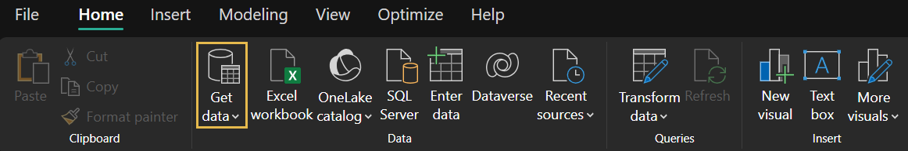
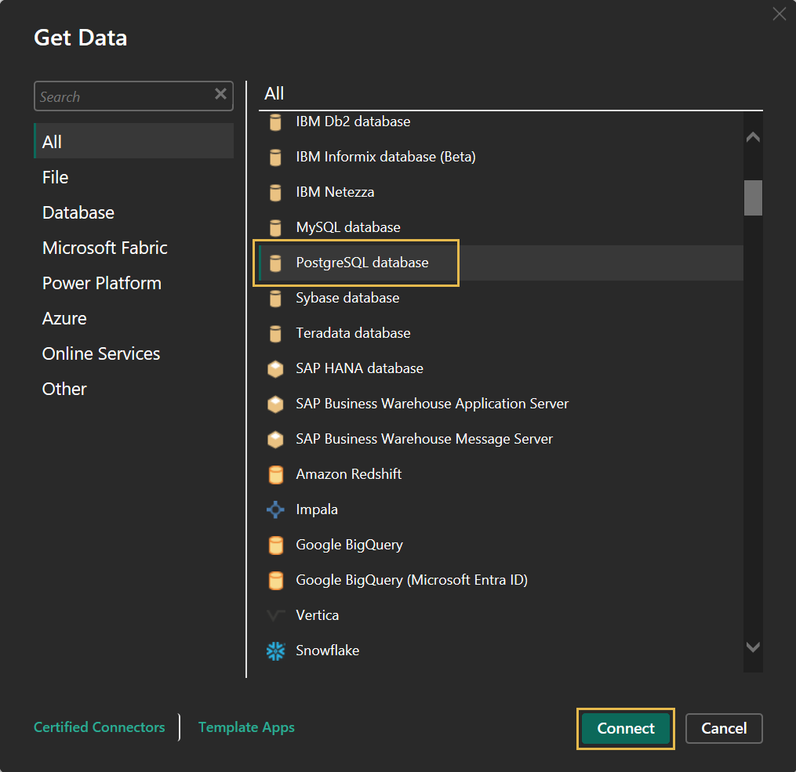
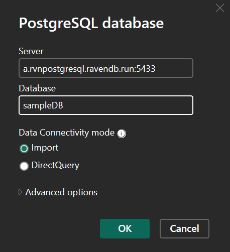
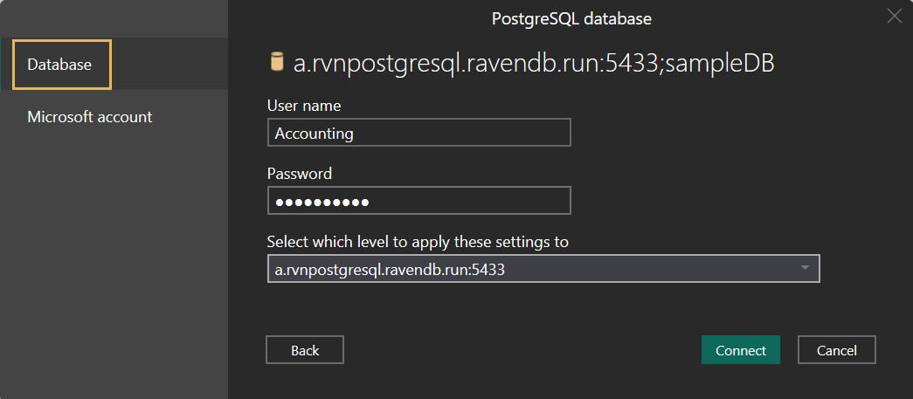
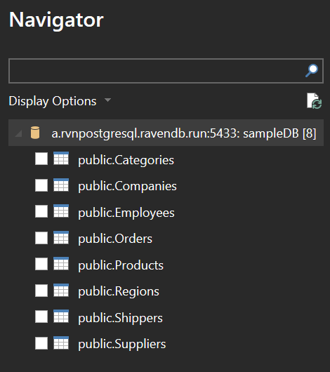
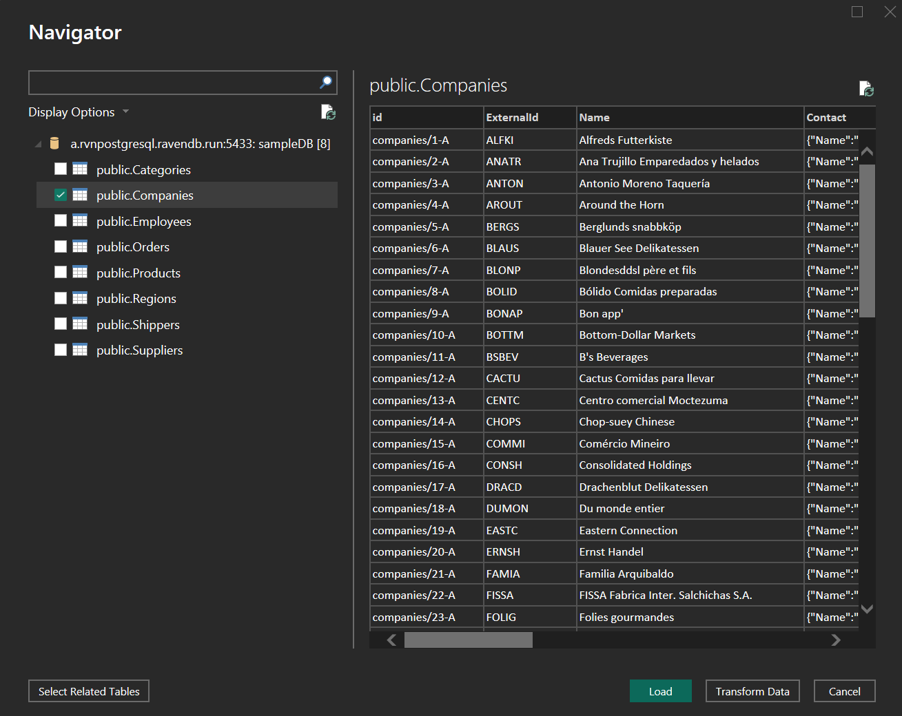
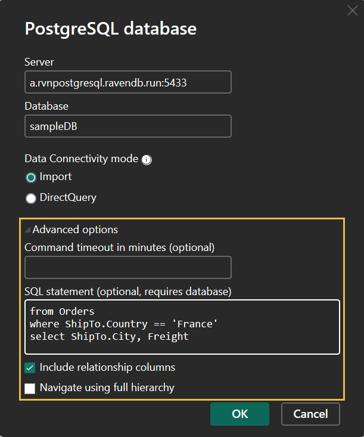
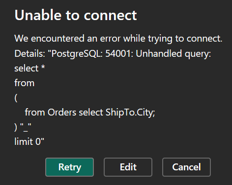
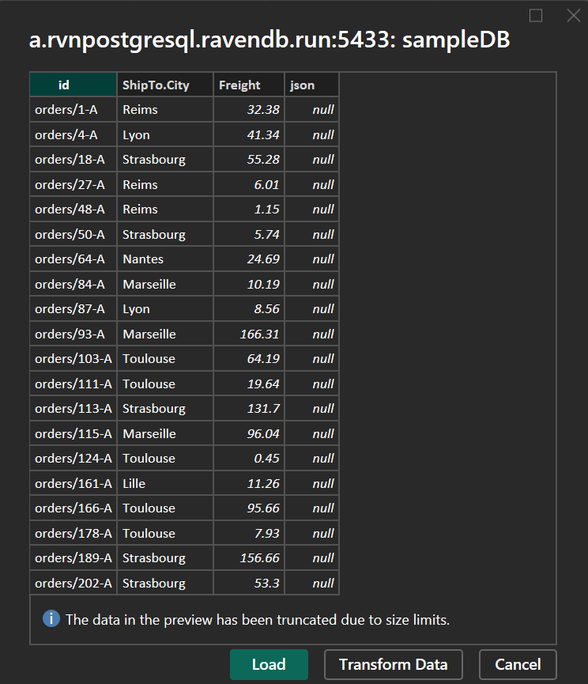

import Admonition from '@theme/Admonition';
import Panel from "@site/src/components/Panel";
import ContentFrame from "@site/src/components/ContentFrame";

# PostgreSQL Protocol: Power BI
<Admonition type="note" title="">

* [Power BI](https://en.wikipedia.org/wiki/Microsoft_Power_BI) can use RavenDB as a 
  PostgreSQL data source, in both the Power BI Desktop application and the online service.  

* Both of Power BI's data connectivity modes are supported: **Import** and **DirectQuery**.  

* You can load entire collections into Power BI, or import the results of 
  [RQL](../../querying/rql/what-is-rql.mdx) or SQL queries.  

* Before connecting, verify that 
  [PostgreSQL integration](../../integrations/postgresql-protocol/overview.mdx#settings) is 
  enabled for your RavenDB server, and your 
  [license](../../integrations/postgresql-protocol/overview.mdx#license) enables Power BI.  

* The examples on this page use the 
  [Northwind sample data](../../studio/database/tasks/create-sample-data.mdx).  

* In this article:  
   * [Connect to RavenDB](../../integrations/postgresql-protocol/power-bi.mdx#connect-to-ravendb)  
   * [Load collection data](../../integrations/postgresql-protocol/power-bi.mdx#load-collection-data)  
   * [Query with RQL or SQL](../../integrations/postgresql-protocol/power-bi.mdx#query-with-rql-or-sql)  
   * [Incremental refresh](../../integrations/postgresql-protocol/power-bi.mdx#incremental-refresh)  

</Admonition>

<Panel heading="Connect to RavenDB">

To connect Power BI Desktop to a RavenDB database:  

---

#### 1. Get data:



* Click **Get data** on Power BI Desktop's **Home** ribbon.  

---

#### 2. Select the PostgreSQL database connector:



* Select the **PostgreSQL database** connector and click **Connect**.  

---

#### 3. Enter connection details:



* **Server**  
  Enter the RavenDB server's URL and PostgreSQL port number in the form: **Hostname:Port**  
  e.g., `a.rvnpostgresql.ravendb.run:5433`  
   * Do **not** include the `https://` prefix.  
   * The default PostgreSQL port is 5433, and the port is 
     [configurable](../../integrations/postgresql-protocol/overview.mdx#postgresql-port).  
* **Database**  
  Enter the name of the RavenDB database to retrieve data from.  
* <a id="data-connectivity-mode"/> **Data Connectivity mode**  
  Select **Import** or **DirectQuery**:  
   * **Import**  
     Power BI copies the data you load into its own in-memory model.  
     The report works on this copy and responds quickly, but shows changes made in RavenDB 
     only after you refresh the data.  
     Select **Import** when you're reporting on a stable snapshot of the data, 
     e.g., a monthly sales summary.  
   * **DirectQuery**  
     Power BI keeps no local copy, and queries RavenDB each time the report needs data.  
     Select **DirectQuery** when you're reporting on live data, e.g., for a dashboard that 
     tracks orders as they arrive, or when the dataset is too large to load into memory.  
* Click **OK** to connect to the database.  

---

#### 4. Provide credentials:



* On your first connection to a server, Power BI opens a credentials dialog.  
* In the **Database** tab, provide the 
  [credentials](../../studio/database/settings/integrations.mdx) that RavenDB 
  requires to authenticate your Power BI client, and click **Connect**.  
  Power BI stores the credentials, so subsequent connections to this server skip this step.  
  Note that credentials are checked only when RavenDB runs as a 
  [secure server](../../integrations/postgresql-protocol/overview.mdx#security).  

  <Admonition type="info" title="">
  To change or remove the stored credentials, go to **File** > **Options and settings** > 
  **Data source settings** and select the server.  

  * Click **Edit Permissions** to enter different credentials.  
  * Click **Clear Permissions** to remove the stored credentials.  
    The next connection to the server will open the credentials dialog again.  
  </Admonition>

</Panel>

<Panel heading="Load collection data">

After you connect Power BI to a database, the **Navigator** window opens:  

---

#### 1. Select collections:



* The Navigator lists the database's collections as tables.  
* Tick the collections whose data you want to load.  

---

#### 2. Preview and load the data:



* Click a collection's name to preview its documents, one document per row.  
* Click **Load** to retrieve the ticked collections into your report, or **Transform Data** 
  to shape the collection data in the Power Query Editor first.  

</Panel>

<Panel heading="Query with RQL or SQL">

Instead of loading whole collections, you can import just the results of a query.  

---

#### 1. Enter your query:

To import query results, open a new connection as explained above.  
Click **Get data** > **PostgreSQL database** > **Connect**, and fill in the 
[connection details](../../integrations/postgresql-protocol/power-bi.mdx#connect-to-ravendb) 
as before: server, database, and connectivity mode.  



* Expand **Advanced options** and enter your query, written in 
  [RQL](../../querying/rql/what-is-rql.mdx) or in 
  [SQL](../../integrations/postgresql-protocol/querying-with-sql.mdx), in the 
  **SQL statement** box.  
  RavenDB detects the query language automatically.  
  
  The following RQL query runs on the 
  [Northwind sample data](../../studio/database/tasks/create-sample-data.mdx), retrieving 
  the destination city and freight charge of orders shipped to France.  

  ```rql
  from Orders
  where ShipTo.Country == 'France'
  select ShipTo.City, Freight
  ```
  <br />

  <Admonition type="warning" title="Do not end the query with a semicolon.">
  Power BI embeds your query in a larger query, where a trailing `;` is invalid.  
  A query such as `from Orders select ShipTo.City;` will result in the following error:  

  
  </Admonition>

* Click **OK** to run the query and preview its results.  

---

#### 2. Load the query results:



* The preview shows only the fields the query selects, plus two columns added by RavenDB:  
  `id`, holding each document's ID, and `json`, holding document properties that do not 
  fit the regular columns.  

  <Admonition type="note" title="">
  Earlier RavenDB versions exposed these columns as `id()` and `json()`.  
  The server still recognizes these earlier names, so existing reports that reference 
  `id()` and `json()` keep working.  
  </Admonition>

* Click **Load** to retrieve the results into your report, or **Transform Data** to shape 
  the results in the Power Query Editor first.  

</Panel>

<Panel heading="Incremental refresh">

When a table is loaded in 
[Import](../../integrations/postgresql-protocol/power-bi.mdx#data-connectivity-mode) mode, 
Power BI can refresh it incrementally: instead of reloading the whole table, each refresh 
retrieves only the rows whose date field falls within a recent time window, and keeps 
earlier rows as they are.  

* RavenDB supports Power BI's incremental refresh without requiring any setup on the 
  RavenDB side.  
  The date-window queries that Power BI sends are translated to RQL range filters and 
  executed like any other query.  
* To set up incremental refresh, follow 
  [Microsoft's incremental refresh documentation](https://learn.microsoft.com/en-us/power-bi/connect-data/incremental-refresh-overview).  
  The setup runs entirely in Power BI, through these main stages:  
   * [Define two date/time parameters](https://learn.microsoft.com/en-us/power-bi/connect-data/incremental-refresh-overview#create-parameters) 
     with the reserved names `RangeStart` and `RangeEnd`.  
   * [Filter the table](https://learn.microsoft.com/en-us/power-bi/connect-data/incremental-refresh-overview#filter-data) 
     by a date field of the loaded collection, like an order's `OrderedAt`, using these 
     parameters.  
   * [Define the table's refresh policy](https://learn.microsoft.com/en-us/power-bi/connect-data/incremental-refresh-overview#define-policy): 
     the historical period to keep, and the refresh period whose rows are reloaded on 
     each refresh.  
   * [Publish the report](https://learn.microsoft.com/en-us/power-bi/connect-data/incremental-refresh-overview#publish); 
     the Power BI service applies the policy with each refresh.  

</Panel>
