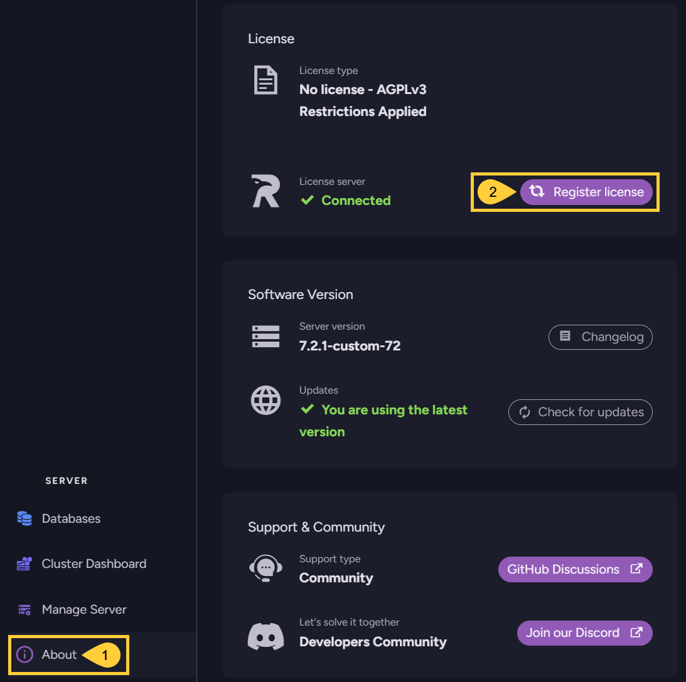

import Admonition from '@theme/Admonition';
import Tabs from '@theme/Tabs';
import TabItem from '@theme/TabItem';
import CodeBlock from '@theme/CodeBlock';
import LanguageSwitcher from "@site/src/components/LanguageSwitcher";
import LanguageContent from "@site/src/components/LanguageContent";
import Panel from "@site/src/components/Panel";
import ContentFrame from "@site/src/components/ContentFrame";

# Activate license 

<Admonition type="note" title="">

* Each RavenDB cluster must be registered with its own license.  

* The license is sent to the email address that was provided while obtaining it.  

* You can activate your license using configuration keys, or via Studio.  

* In this article:
   * [Activate your license using a configuration key](../licensing/activate-license.mdx#activate-your-license-using-a-configuration-key)
   * [Activate your license via Studio](../licensing/activate-license.mdx#activate-your-license-via-studio)

</Admonition>

<Panel heading="Activate your license using a configuration key">

* You can activate your license using either of the following configuration keys:  
  * [License](../licensing/configuration.mdx#license)  
    Allows you to provide the license text directly, as the key's value.  
    e.g., `"License": "{ your full license text here }"`  
  * [License.Path](../licensing/configuration.mdx#licensepath)  
    Allows you to provide a path to a file that contains your license.  
    e.g., `"License.Path": "D:\\RavenDB\\Server\\license.json"`  

* The configuration keys can be set in the `settings.json` file or as environment variables.  
  Learn more in the [configuration overview](../server/configuration/configuration-options.mdx) page.

</Panel>

<Panel heading="Activate your license via Studio">

To activate your license via Studio, open the **About** view and click the **Register license** option:

1. **About**  
   Click to open the **About** view.
   
2. **Register license**  
   Click to register and submit your license using the following form:  
   

</Panel>
