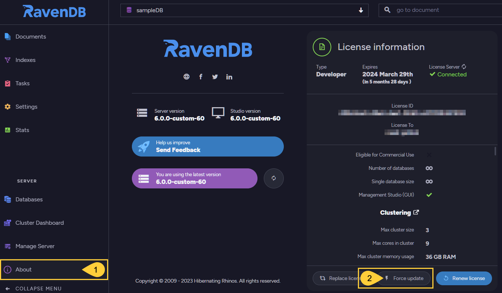

import Admonition from '@theme/Admonition';
import Tabs from '@theme/Tabs';
import TabItem from '@theme/TabItem';
import CodeBlock from '@theme/CodeBlock';
import LanguageSwitcher from "@site/src/components/LanguageSwitcher";
import LanguageContent from "@site/src/components/LanguageContent";
import Panel from "@site/src/components/Panel";
import ContentFrame from "@site/src/components/ContentFrame";

# Force License Update
<Admonition type="note" title="">

* RavenDB contacts the License server at `api.ravendb.net` every 24 hours (counted from server startup), to check if there are any updates in your current license that need to be applied.  
  This routine is implemented for all license types.  
  <Admonition type="note" title="">
  The automatic update is applied provided that:  
   * There is an active connection to the License server,  
   * **And** the [DisableAutoUpdate](../licensing/configuration.mdx#licensedisableautoupdate) configuration option is set to **false**.  
  </Admonition>

* You can also **force an immediate update** via Studio, as described below, if changes were made to your current license and you want to apply them immediately.  
  This option, too, is only available if there is an active connection to the License server.

* In this page:
   * [Force license update from Studio](../licensing/force-update.mdx#force-license-update-from-studio)

</Admonition>

<Panel heading="Force license update from Studio">

To force an immediate update of your license, open the **About** view and click the **Force update** option:

1. **About**  
   Click to open the **About** view.  

2. **Force update**  
   Click to force an immediate update of your current license.  
   <Admonition type="note" title="">
   Set the [DisableAutoUpdateFromApi](../licensing/configuration.mdx#licensedisableautoupdatefromapi) configuration option to determine where the license is updated from:  
   * When **true**, the license is updated from the [configuration keys](../licensing/activate-license#activate-your-license-using-a-configuration-key).  
   * When **false**, the license is updated from the License server, provided there is an active connection to it.  
    </Admonition>

</Panel>

