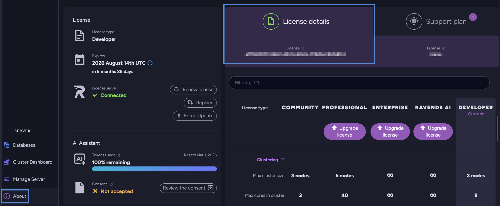

import Admonition from '@theme/Admonition';
import Tabs from '@theme/Tabs';
import TabItem from '@theme/TabItem';
import CodeBlock from '@theme/CodeBlock';
import LanguageSwitcher from "@site/src/components/LanguageSwitcher";
import LanguageContent from "@site/src/components/LanguageContent";
import Panel from "@site/src/components/Panel";
import ContentFrame from "@site/src/components/ContentFrame";

# License under Docker

<Admonition type="note" title="">

* This page explains how to pass a license to a RavenDB server that runs in a Docker container or under Linux or Unix.  
* A license can be passed to RavenDB in one of the following ways:  
   * A path to the license file can be passed to the server via CLI.  
   * Either a path to the license file or the full license text can be passed to the server in the `settings.json` configuration file.  
   * A `RAVEN_License` environment variable can be set.  

* In this article:  
  * [Prerequisites](../licensing/license-under-docker.mdx#prerequisites)  
  * [Licensing a RavenDB docker image](../licensing/license-under-docker.mdx#licensing-a-ravendb-docker-image)  
     * [Passing a Path to the License File via CLI](../licensing/license-under-docker.mdx#passing-a-path-to-the-license-file-via-cli)  
     * [Passing a License via `settings.json`](../licensing/license-under-docker.mdx#passing-a-license-via-settingsjson)  
     * [Setting a `RAVEN_License` Environment Variable](../licensing/license-under-docker#setting-a-raven_license-environment-variable)  
  * [Licensing RavenDB under Linux](../licensing/license-under-docker.mdx#licensing-ravendb-under-linux)  

</Admonition>

<Panel heading="Prerequisites">

* Docker images of RavenDB versions up to `5.x` require no special permissions 
  since they are installed and handled by the `root` user, that is inherently allowed to access any RavenDB property, including its license.  
* Docker images of RavenDB `6.0` and later are executed by a **regular user** for 
  security reasons, requiring that this user would be explicitly permitted to access 
  RavenDB properties, including any mounted license folder.  
* Read more about this in the dedicated [migration page](../migration/server/docker.mdx).  

</Panel>

<Panel heading="Licensing a RavenDB docker image">

Find below a few methods to license a RavenDB server that runs in a Docker container.  

<ContentFrame>

## Passing a Path to the License File via CLI

Store the license in a folder that can be accessed by the host machine that runs Docker.  
RavenDB, within Docker, will have **no direct access** to the license.  
Allow RavenDB to access the license by **mounting the license folder** when you run RavenDB 
using Docker's CLI.  

* From Docker's CLI, use this syntax:  
  ```bash
  docker run -v <host_dir>:<container_dir> -e <env.var>
  ```
  The `-v` option points at the host directory.  
  The `-e` option sets the Docker `RAVEN_License_Path` environment variable with the license.  

* **Example**:  
  ```bash
  docker run -v "C:\\docker-license\\config:/ravendb/license" -e RAVEN_License_Path=/ravendb/license/license.json  
  ```

When RavenDB is executed this way, the license folder will be mounted and the environment variable set with the license.  
RavenDB will fetch the license from the environment variable the first time it accesses a database.  

To verify that the server is licensed, run it as shown above, create a new database or access an existing one, and then open the **About** view.   



</ContentFrame>
<ContentFrame>

## Passing a License via `settings.json`

Provide the license as a property of the `settings.json` configuration file in one of the following ways.  

* Add the **full license text** to `settings.json` as the value of the "License" key, [as explained here](../licensing/configuration.mdx).  
  Mount `settings.json` as [explained above](../licensing/license-under-docker.mdx#passing-a-path-to-the-license-file-via-cli), using the location of `settings.json` instead of the location of a license file.  
* **Or**, add the **license path** to `settings.json` as the value of the “License.Path” key and mount the license directory.  

</ContentFrame>
<ContentFrame>

## Setting a `RAVEN_License` Environment Variable

The full license text can also be added as a docker `RAVEN_License` environment variable when the server is executed.  

* Special characters must be escaped.  
* Each line of the license key is provided as a single string.  
* **Example**:  
  ```json
  docker run -e 'RAVEN_License={ 
    \"Id\": \"4b167357-42f5-48a8-bef5-29ca557ef0ce\",  
    \"Name\": \"asdf\",   \"Keys\": [
      \"6aoht+NE3zvJidqIspOIa/5N1\",
      \"320e9G95NFsNwbKkNfl3R/qO9\",
      \"IHuEgp9OHVjxwV9ekur/L/FiF\",
      \"RCfFywsNR0O2ghqZo6N0r4onp\",
      \"fGNula2WJv0iz5Tq+xt99/A6t\",
      \"oHfaSXrNOdgilfCqLkoyFI9E8\",
      \"MHMmcIfBoQelf/qZKOpE5ABYE\",
      \"DNi4wBSYoSQMmKywtLL8wJzEy\",
      \"MzQVFjc4OTo7PD0+nwIfIJ8CI\",
      \"CCfAiEgnwIjIJ8CJCMfAiUgnw\",
      \"ImIJ8CJyCfAiggnwIpI12CKiC\",
      \"fAisgwvJsIJ8CLSCfAi4gnwIv\",
      \"IJ8CMCCfAzZAAUMkRAlio9g=\"]}'
  ```

</ContentFrame>
</Panel>

<Panel heading="Licensing RavenDB under Linux">

To license RavenDB under Linux, pass a license **file** rather than a **directory**.  

**Example**:  
```bash
docker run -v "/home/ubuntu/ravendb-docker-license/license.json:/ravendb/license" -e RAVEN_License_Path=/ravendb/license
```

</Panel>


