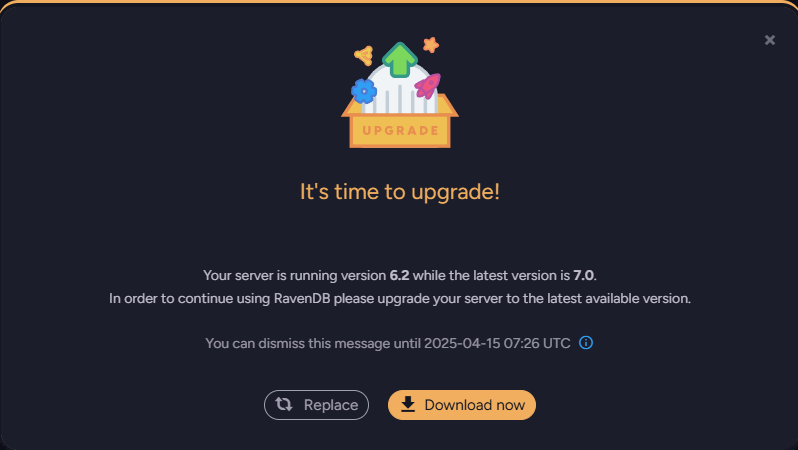
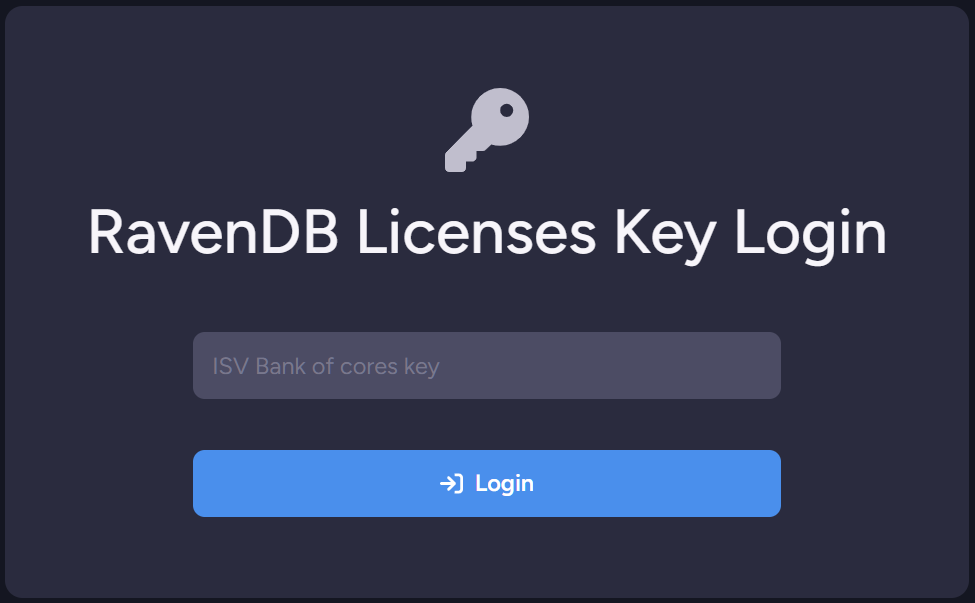
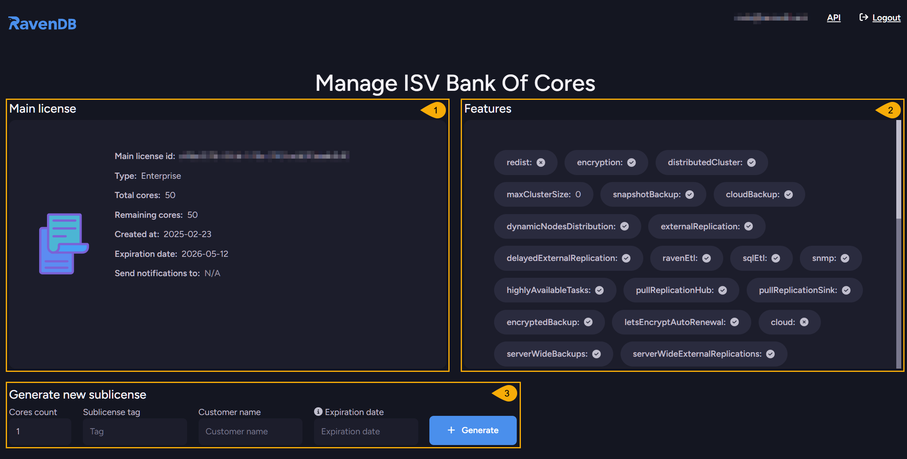
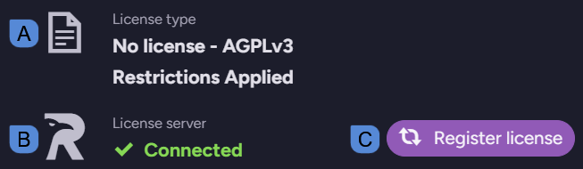
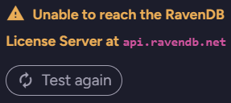
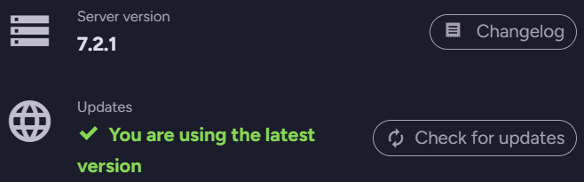
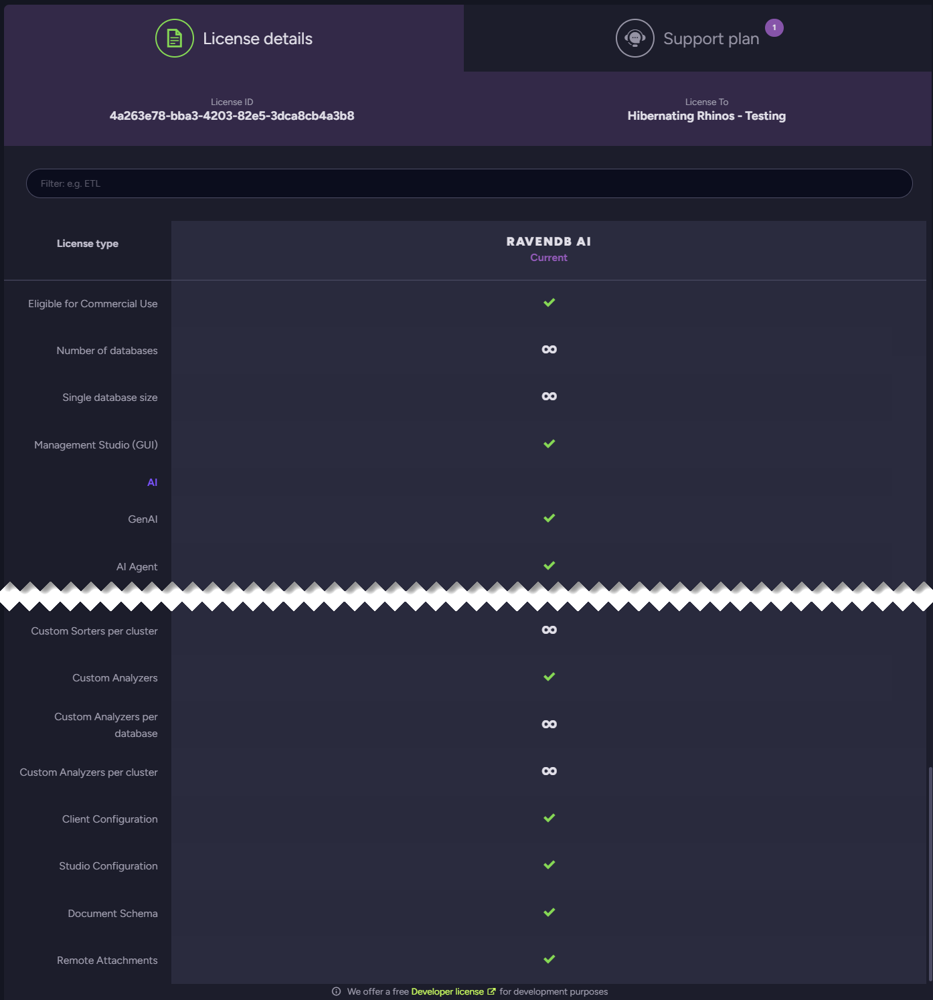
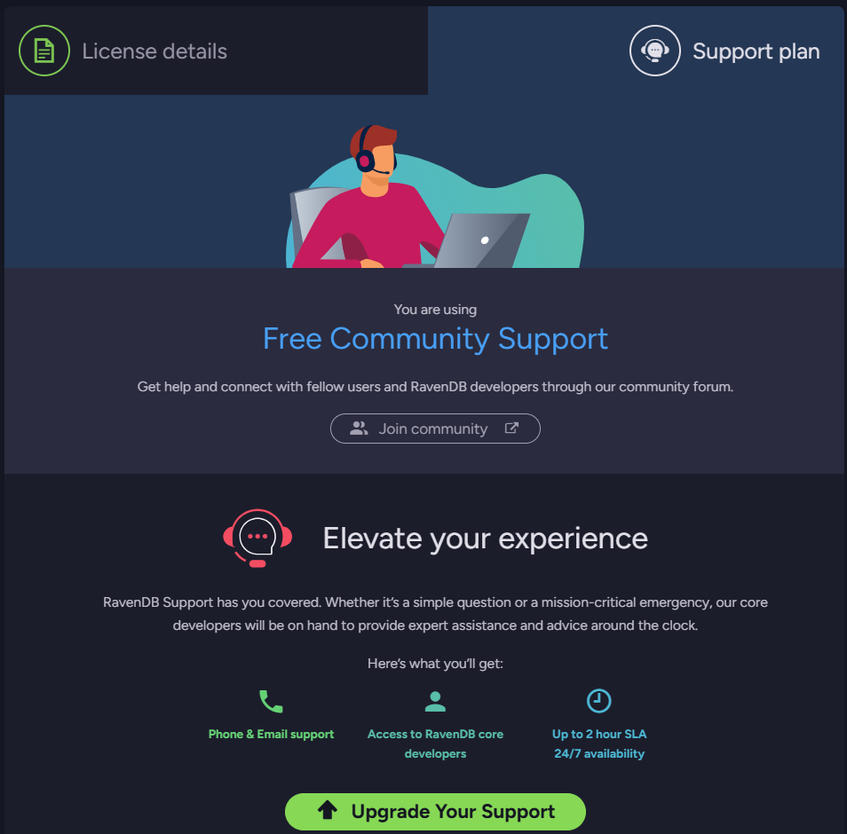

import Admonition from '@theme/Admonition';
import Tabs from '@theme/Tabs';
import TabItem from '@theme/TabItem';
import CodeBlock from '@theme/CodeBlock';
import LanguageSwitcher from "@site/src/components/LanguageSwitcher";
import LanguageContent from "@site/src/components/LanguageContent";
import Panel from "@site/src/components/Panel";
import ContentFrame from "@site/src/components/ContentFrame";

# Licensing Overview

<Admonition type="note" title="">

* RavenDB is activated using a JSON format license.  
  The license is sent to the email address provided while obtaining it.  

* A few license types are available.  
  The license type you acquire and activate RavenDB with, determines the database's feature set.  
   * Learn more below about each license type.  
   * visit the [pricing page](https://ravendb.net/buy) to see the entire feature set 
     made available by each type.  
 
* Each license has a specific expiration date.  
  To renew your license see [renew license](../licensing/renew-license.mdx).  

* In this page:
    * [License types](../licensing/overview#license-types)
        * [Developer license](../licensing/overview#developer-license)
        * [Community license](../licensing/overview#community-license)
        * [Professional license](../licensing/overview#professional-license)
        * [Enterprise license](../licensing/overview#enterprise-license)
        * [ISV licenses](../licensing/overview#isv-licenses)
    * [ISV Bank-of-Cores license](../licensing/overview#isv-bank-of-cores-license)
    * [Manage License view](../licensing/overview#manage-license-view)

</Admonition>

<Panel heading="License types">

<Admonition type="info" title="">
Visit the [pricing page](https://ravendb.net/buy) to see which features are included with each license type.
</Admonition>

<ContentFrame>

### Developer license

* The developer license is for development use only and isn't applicable for commercial use.  
  You must upgrade this license before going into production.   
* It is fully featured but temporary - the license lasts 6 months and can be renewed.  
* Certificates whose expiration period exceeds 4 months **cannot** be used with this license.  
  Automatic renewal of Let’s Encrypt certificates is disabled.  
* When you are ready to go into production:  
   * Be sure to choose a license that offers all the features with which your client was developed.  
     <Admonition type="note" title="Note">
     If you use [Let's encrypt](../start/installation/setup-wizard#secure-setup-with-a-free-lets-encrypt-certificate) for the new license, you will not be able to simply replace the license since you are using a dev subdomain.  
     Instead, you can create a new cluster.  
      </Admonition>
   * [Upgrade to a production license](https://ravendb.net/buy) and then [replace](../licensing/replace-license.mdx) the developer license.  
* The developer license can be obtained [here](https://ravendb.net/buy#developer).

</ContentFrame>
<ContentFrame>

### Community license

* A basic production-grade license.
* Community licenses last one year and can be renewed every year.  
* Servers using a Community license are **required to run the latest major version**.  
  E.g., if RavenDB `7.0` is released and your server runs RavenDB `6.2` with a Community license, 
  you will be required to upgrade RavenDB to version `7.0`.  
  Running RavenDB of an older version than the latest with a Community license will **block your 
  server's access to Studio**.  
  <Admonition type="note" title="Grace Period" id="grace-period" href="#grace-period">
  If you run your server with a Community license and a new RavenDB major version is released, 
  Studio will continue to function for **14 days** before it is blocked.  
  During this period, a pop-up notification will show when Studio is started:  

  

  You can: 
   * **Close the notification and keep on working**  
     For 14 days, after which Studio will be blocked until the server is upgraded or the license replaced.  
   * **Replace your license**  
     Acquire a non community license that allows you to use an older version.  
   * **Download a new server version**  
     Upgrade to the latest major version.  
  
  </Admonition>

</ContentFrame>
<ContentFrame>

### Professional license

* A standard production-grade license.  
* Extended automatically if the server has access to RavenDB's License server.  

</ContentFrame>
<ContentFrame>

### Enterprise license

* A high-performance, fully-featured production-grade license.  
* Extended automatically if the server has access to RavenDB's License server.  

</ContentFrame>
<ContentFrame>

### ISV licenses

* ISV licenses are commercial licenses that allow you to redistribute RavenDB with your software  
  for on-premise installation and use by your customers.  
* Available ISV license types are: Essential, Professional, and Enterprise.  
* [Contact RavenDB for more details](https://ravendb.net/contact).

</ContentFrame>
</Panel>

<Panel heading="ISV Bank-of-Cores license">

An ISV Bank-of-Cores license allows you to generate RavenDB licenses on your own for a given number of cores.  
If you purchase a 128-cores license, for example, you can use it to generate 8 licenses for 8-core machines, 
16 licenses for 4-core machines, or any other combination that suits your needs.  

* Available bank-of-cores license types are: Essential, Professional, and Enterprise.  
* The same license type, allowing the same feature set, is available for all generated sublicenses.  
  E.g., if the license type you acquire includes the AI integration feature, this feature will be 
  enabled by all the sublicenses you create.  
* [Contact RavenDB for more details](https://ravendb.net/contact).  

<ContentFrame>

## Generating bank-of-cores licenses

* When you purchase a bank-of-cores license, you are given a login key.  
  To generate licenses, enter your key at: [https://licenses.ravendb.net/isv](https://licenses.ravendb.net/isv)  
  
     

* You will be requested to provide an email address associated with your license key.  
  Authorizing license generation through your email provides an additional security layer.  
  You can contact RavenDB's support to associate your key with additional addresses or with 
  all addresses of a given domain.  

     

* An email message with a sign-in link will be sent to the provided email address.  
  Use this link to enter the bank of cores management page.  

     

     1. **Main License**  
        The details of your bank-of-cores license.  
     2. **Features**  
        The features that are available for the licenses you generate here.  
     3. **Generate new sublicense**  
        Use this section to assign cores to a new sublicense.  
          
          * _Cores count_ - The number of cores you want to assign this sublicense.  
          * _Sublicense tag_ - A tag you want to recognize the sublicense by.  
          * _Customer name_ - The identity of the sublicense's owner.  
          * _Expiration date_ - The date in which this sublicense will expire and its cores will be returned to your bank.  
            **Note**: Leavine this field empty will set the expiration date to that of the main license.  
          * _Generate_ - Click to generate the new sublicense.  

* Generating a sublicense will create a key that you can copy or download and register RavenDB with.  

     

* The new sublicense will then be listed in the sublicenses list at the bottom of the page.  

     

</ContentFrame>
</Panel>

<Panel heading="Manage License view">

1. **About**  
   Click to open the About page and view RavenDB version, license, support info, and more.  

2. **License**  
   

      * **A**. **License type**  
        shows whether your server runs with a valid license,  
        and if so - displays the license type and expiration date.  
      * **B**. **License server**  
        Shows whether your server can reach the License server to update or renew the license.
        <Admonition type="note" title="">
        Connectivity issues are often caused by a firewall blocking the connection, or RavenDB running offline.  
        If the License server is unavailable, the following dialog will be displayed:
        
         * Make sure that RavenDB has access to `api.ravendb.net`.  
         * Click **Test again** to recheck the connection.  
        </Admonition>
      * **C**. **Register license**  
        Click to [submit and activate](../licensing/activate-license) your license.  
        <Admonition type="note" title="">
        When the license is activated, the **Register license** button will be replaced with these buttons:  
         * [Renew](../licensing/renew-license)  
           Use this button to renew your license and extend its validity. The renewed license will have the same license ID as the current license.  
           Note that the **Renew** button is only available for **Developer** and **Community** licenses, as other (commercial) licenses are automatically renewed.  
         * [Replace](../licensing/replace-license)  
           Use this button to replace your license with a new one.
         * [Force update](../licensing/force-update)  
           Use this button to trigger an immediate license update.
        </Admonition>
3. **Software Version**  
   
      
   
      * **Server version**  
        Shows your current server version.  
        Click **Changelog** to see logged version changes. 
      * **Updates**  
        Informs you whether you are using the latest server version.  
        Click **Check for updates** to see if an update is available.  

4. **Support & Community**  

      

      * **Support type**  
        Informs you of the support type you are entitled to,  
        and allows you to join our community GitHub discussions.  
      * **Let's solve it together**  
        Allows you to join our developers Discord community.  

5. **License details** tab  
   Details the features that your license enables for your server.  
   Use the scrollbar to slide through the full features list.  

      

6. **Support plan** tab  
   Specifies your current support plan and allows you to upgrade it.  

      

</Panel>

