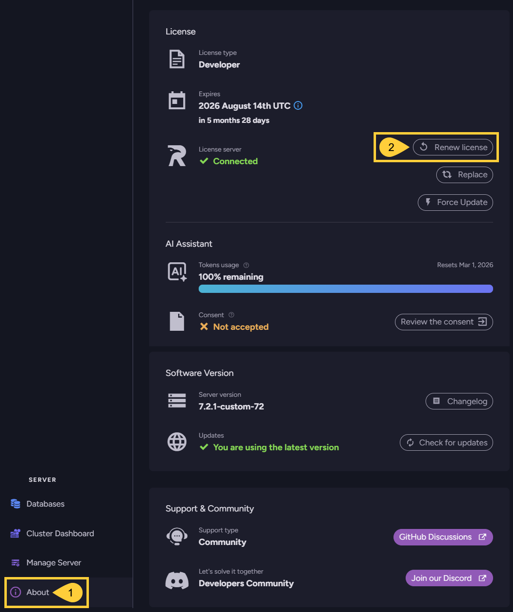
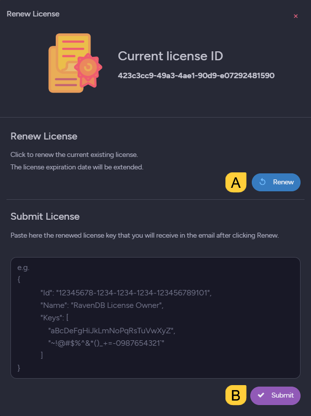

import Admonition from '@theme/Admonition';
import Tabs from '@theme/Tabs';
import TabItem from '@theme/TabItem';
import CodeBlock from '@theme/CodeBlock';
import LanguageSwitcher from "@site/src/components/LanguageSwitcher";
import LanguageContent from "@site/src/components/LanguageContent";
import Panel from "@site/src/components/Panel";
import ContentFrame from "@site/src/components/ContentFrame";

# Renew license
<Admonition type="note" title="">

* When your license expires, managing RavenDB via Studio is blocked.  
  Client API operations and other RavenDB features will continue to work. However, any usage of an expired RavenDB license is outside the license agreement and doesn't comply with the [EULA terms](https://ravendb.net/terms).  

* Commercial licenses (Professional, Enterprise, and ISV) are automatically renewed as long as your server has an active connection to RavenDB's License server and automatic updates are enabled.  
  If automatic renewal is unavailable, the licenses can be renewed manually.  

* Non-commercial licenses (Developer and Community) can be renewed via Studio.

* In this article:
   * [Renew commercial licenses](../licensing/renew-license.mdx#renew-commercial-licenses)
     * [Automatic renewal](../licensing/renew-license.mdx#automatic-renewal)
     * [Manual renewal](../licensing/renew-license.mdx#manual-renewal)
   * [Renew Developer & Community licenses](../licensing/renew-license.mdx#renew-developer-community-licenses)

</Admonition>

<Panel heading="Renew commercial licenses">

This section relates to all commercial licenses: **Professional**, **Enterprise**, and all **ISV licenses**.  

<ContentFrame>

#### Automatic renewal:  

Commercial licenses will be automatically renewed if:  
* Your server has an active connection to RavenDB's License server at `api.ravendb.net`,  
* **And** the [DisableAutoUpdate](../licensing/configuration.mdx#licensedisableautoupdate) configuration key is set to **false**.  

</ContentFrame>

<ContentFrame>

#### Manual renewal:  

If the connection to RavenDB's License server at `api.ravendb.net` is unavailable, contact [customer service](https://ravendb.net/contact) to extend your license.  
A renewal email will be sent to you with a new license that keeps your existing license ID.  
Copy the renewed license to the clipboard and register it using either Studio or a configuration key, as you prefer.  

* To register your new license **using Studio**:  
  Follow the procedure described [here](../licensing/replace-license.mdx#replace-license-from-studio).

* To register your new license **using a configuration key**:  
   - Set the [DisableAutoUpdateFromApi](../licensing/configuration.mdx#licensedisableautoupdatefromapi) configuration key to **true**.
   - Activate the new license using a configuration key as described [here](../licensing/activate-license.mdx#activate-your-license-using-a-configuration-key).
   - Restart your server to make it read the set configuration key.  

</ContentFrame>
</Panel>

<Panel heading="Renew Developer & Community licenses">

**Developer** and **Community** licenses can be renewed from Studio using a **Renew** button.  
* The **Renew** button is available only for these license types.  
* Renewal can be initiated when less than 30 days remain until expiration.  

<Admonition type="note" title="">
Servers using a **Community** license are **required to run the latest major version**.  
e.g., if RavenDB `7.0` is released and your server runs RavenDB `6.2` with a Community license, you will be required to upgrade RavenDB to version `7.0`.  
Running a major version older than the latest with a Community license, will **block your server's access to Studio**.  
</Admonition>
 
<ContentFrame>

To renew your license, open the **About** view and click the **Renew license** option:

1. **About**  
   Click to open the **About** view.  

2. **Renew license**  
   Click to request and register a license.  
     
   **A**. **Renew**  
   Click to request a new license with the same license ID as your current license.  
   **B**. **Submit**  
   When the renewed license arrives via email, paste and submit it.

</ContentFrame>
</Panel>

