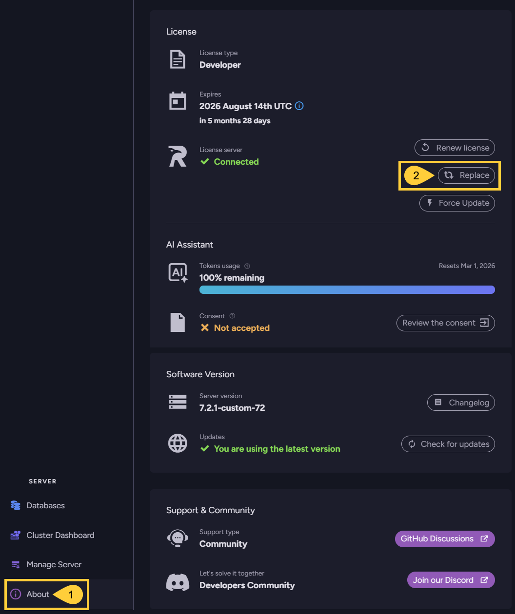
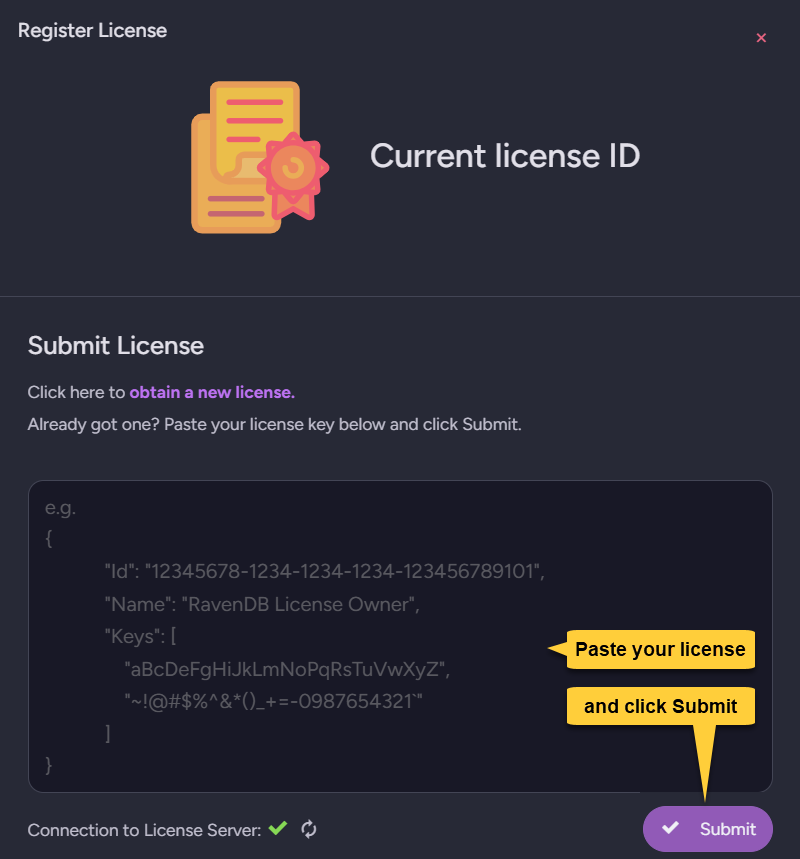
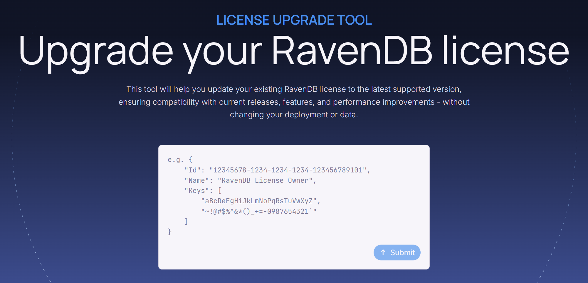

import Admonition from '@theme/Admonition';
import Tabs from '@theme/Tabs';
import TabItem from '@theme/TabItem';
import CodeBlock from '@theme/CodeBlock';
import LanguageSwitcher from "@site/src/components/LanguageSwitcher";
import LanguageContent from "@site/src/components/LanguageContent";
import Panel from "@site/src/components/Panel";
import ContentFrame from "@site/src/components/ContentFrame";

# Replace License

<Admonition type="note" title="">

* You can replace an existing license with a new one using configuration keys or Studio.  

* A new license will be sent to the email address you provided [while obtaining it](https://ravendb.net/buy).  

* To upgrade RavenDB from a version older than `6.x` to version `6.x` and above, you must upgrade your current license before applying it to your new RavenDB. Learn [below](../licensing/replace-license#upgrade-a-license-older-than-6-x) how to do this.  

* In this page:
    * [Replace your license using a configuration key](../licensing/replace-license#replace-your-license-using-a-configuration-key)  
    * [Replace your license via Studio](../licensing/replace-license#replace-your-license-via-studio)  
    * [Maintain auto-renewal of Let's Encrypt certificates](../licensing/replace-license#maintain-auto-renewal-of-let-s-encrypt-certificates)  
    * [Upgrade a license older than 6.x](../licensing/replace-license#upgrade-a-license-older-than-6-x)

</Admonition>

<Panel heading="Replace your license using a configuration key">

If you [activated your license](../licensing/activate-license) using a configuration key, you may have used either the `License` or the `License.Path` key. Replace the value of the key you used with the new license information:

  * [License](../licensing/configuration.mdx#license)  
    Use this key to provide your license as a string value.  
    E.g., `"License": "{ replace with your new license }"`  
  * [License.Path](../licensing/configuration.mdx#licensepath)  
    Use this key to provide the path to a file that contains your license.  
    E.g., `"License.Path": "D:\\RavenDB\\Server\\license.json"`  

* The configuration keys can be set in the `settings.json` file or as environment variables.  
  Learn more in the [configuration overview](../server/configuration/configuration-options.mdx) page.

</Panel>

<Panel heading="Replace your license via Studio">

To replace your existing license with a new one, open the **About** view and click the **Replace** option:

1. **About**  
   Click to open the **About** view.  

2. **Replace**  
   Click to paste and submit your new license.  
   

</Panel>

<Panel heading="Maintain auto-renewal of Let's Encrypt certificates">

* If you installed RavenDB using the [Setup Wizard](../start/installation/setup-wizard.mdx) and applied a Let's Encrypt certificate, contact [customer support](https://ravendb.net/contact) before replacing your license to keep automatic certificate renewal working.  
* Otherwise, the change in your license ID will cause a mismatch between your new ID and the ID that Let's Encrypt expects during certificate renewal.  

</Panel>

<Panel heading="Upgrade a license older than 6.x">

If you have a license for a RavenDB version lower than `6.x`, you must upgrade the license before applying it to RavenDB `6.x` or above.  
You can upgrade your license in a few seconds using our online [License upgrade tool](https://ravendb.net/l/8O2YU1).  

A new license will be sent to the email address you registered your current license with.  
[Replace](../licensing/replace-license#replace-your-license-via-studio) your current license with the new one.  

</Panel>

