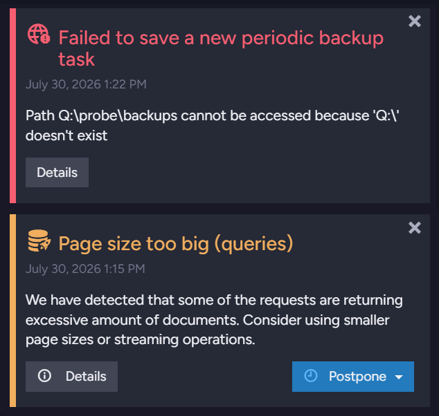
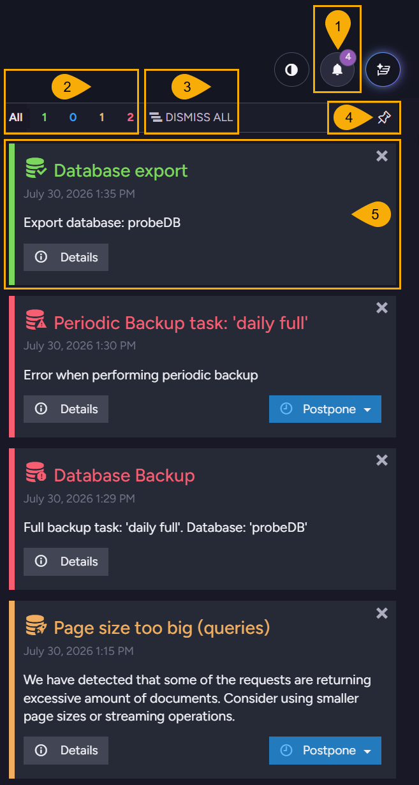
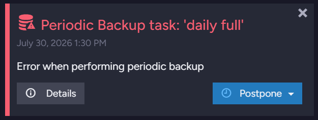
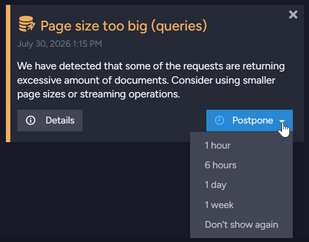
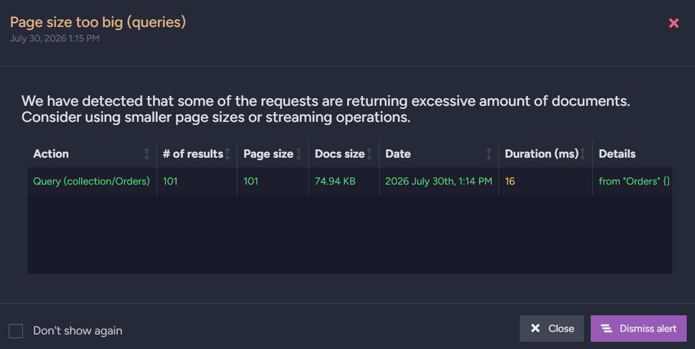
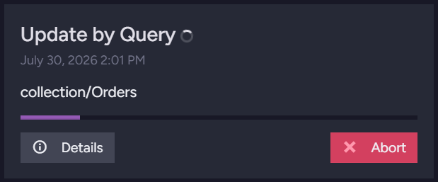
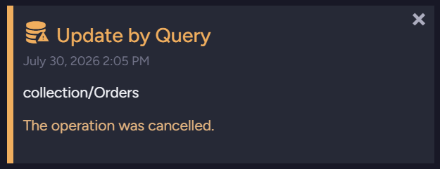
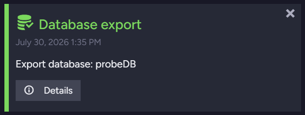
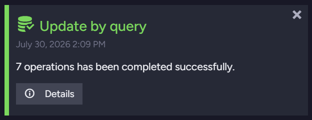
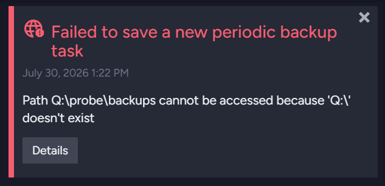

import Admonition from '@theme/Admonition';
import Panel from "@site/src/components/Panel";
import ContentFrame from "@site/src/components/ContentFrame";

# Notification center

<Admonition type="note" title="">

* The Studio **notification center** presents alerts, performance hints, reports of running
  operations, and errors, raised by the server or by Studio itself.  

* Open the notification center using the bell button, shown at the top of every Studio view.  

* Each cluster node keeps its own notifications: the notification center shows the
  notifications of the node that Studio is connected to.  
  To read another node's notifications, open that node's Studio.  

* In this article:
   * [Overview](../../monitoring/alerts-and-notifications/notification-center.mdx#overview)
      * [Server-wide and database notifications](../../monitoring/alerts-and-notifications/notification-center.mdx#server-wide-and-database-notifications)
   * [The notification center panel](../../monitoring/alerts-and-notifications/notification-center.mdx#the-notification-center-panel)
   * [Notification types](../../monitoring/alerts-and-notifications/notification-center.mdx#notification-types)
      * [Alerts](../../monitoring/alerts-and-notifications/notification-center.mdx#alerts)
      * [Performance hints](../../monitoring/alerts-and-notifications/notification-center.mdx#performance-hints)
      * [Operations](../../monitoring/alerts-and-notifications/notification-center.mdx#operations)
      * [Studio errors](../../monitoring/alerts-and-notifications/notification-center.mdx#studio-errors)
   * [Dismissing and postponing](../../monitoring/alerts-and-notifications/notification-center.mdx#dismissing-and-postponing)
   * [Access requirements](../../monitoring/alerts-and-notifications/notification-center.mdx#access-requirements)
   * [Configuration](../../monitoring/alerts-and-notifications/notification-center.mdx#configuration)
      * [Values for notification types](../../monitoring/alerts-and-notifications/notification-center.mdx#values-for-notification-types)
      * [Values for performance-hint reasons](../../monitoring/alerts-and-notifications/notification-center.mdx#values-for-performance-hint-reasons)
      * [Values for alert reasons](../../monitoring/alerts-and-notifications/notification-center.mdx#values-for-alert-reasons)

</Admonition>

<Panel heading="Overview">

RavenDB reports events that need your attention by raising notifications: a failing backup
task, for example, raises an alert, a query that returns an excessive number of results raises
a performance hint, and a lengthy patch operation reports its progress.  
The notification center collects these notifications and presents them in one panel.  
Learn [below](../../monitoring/alerts-and-notifications/notification-center.mdx#notification-types)
about each notification type, the actions it offers, and its lifetime.  

Alerts and performance hints are stored by the node that raised them: they remain available
through server restarts and browser refreshes until you dismiss them.  
Reports of operations and errors are more short-lived, and most are gone once the Studio
browser tab is closed or refreshed.  

<ContentFrame>

### Server-wide and database notifications

A notification applies either server-wide or to a specific database.  
The icon beside the notification's title shows its scope: a globe for a server-wide
notification, and a database icon for a notification that concerns a specific database.  



The notification center lists server-wide notifications as well as notifications for the
database you are working on.  
Moving to another database replaces the database notifications and keeps the server-wide
notifications.  

</ContentFrame>

</Panel>

<Panel heading="The notification center panel">

To open the notification center, click the bell button, shown at the top of every Studio view.  



1. **Notification center button**  
   Open and close the notification center.  
   The counter on the bell shows the number of notifications the notification center currently
   holds.

2. **Severity filter**  
   Each numbered button counts the notifications of one severity.  
   Click a number to list only the notifications of the selected severity, or `All` to remove
   the filter.  

   | Severity | Color | Typical notifications |
   | -------- | ----- | --------------------- |
   | **Success** | Green | Completed operations (e.g., a finished database export). |
   | **Info** | Blue | Informational performance hints (e.g., a slow-writes report). |
   | **Warning** | Orange | Most performance hints, canceled operations, and alerts (e.g., a potential GC slowdown). |
   | **Error** | Red | Failed operations, Studio errors, and alerts (e.g., a failed backup). |

   Note that a running operation carries no severity yet: its report is listed only while
   `All` is selected.

3. **Dismiss all**  
   Dismiss every notification in the notification center, including notifications hidden by
   the severity filter.

4. **Pin**  
   Keep the notification center open: while pinned, it is docked beside the view area and
   stays open as you work elsewhere in Studio.

5. **Notifications**  
   Each notification is presented as a card, colored by its severity, with the notification's
   title, timestamp, message, and the actions available for this notification.  
   Learn [below](../../monitoring/alerts-and-notifications/notification-center.mdx#notification-types)
   about the notification types and the actions each type offers.

</Panel>

<Panel heading="Notification types">

The notification center presents four types of notifications:

| Type | Description |
| ---- | ----------- |
| **[Alerts](../../monitoring/alerts-and-notifications/notification-center.mdx#alerts)** | Server conditions that require your attention. |
| **[Performance hints](../../monitoring/alerts-and-notifications/notification-center.mdx#performance-hints)** | Inefficiencies the server detects, and advice for handling them. |
| **[Operations](../../monitoring/alerts-and-notifications/notification-center.mdx#operations)** | The progress and results of long-running operations. |
| **[Studio errors](../../monitoring/alerts-and-notifications/notification-center.mdx#studio-errors)** | Errors Studio encounters while you work. |

<ContentFrame>

### Alerts

The server raises an **alert** when a condition requires your attention, like a failed backup
task, an ETL task that cannot reach its destination, a certificate nearing its expiration, or
low disk space.  



Each alert carries a severity: the failed backup shown above is an Error alert, and a potential
GC (Garbage Collection) slowdown is a Warning.  
Click `Details` for the full report, including any exception the server recorded.  

Note that license-related alerts cannot be postponed, and the license-agreement alert cannot
be dismissed.  

</ContentFrame>
<ContentFrame>

### Performance hints

The server raises a **performance hint** when it detects an inefficiency you can remove, like a
query that retrieves an excessive number of results, an oversized document, or an index with a
high fanout ratio.  
The hint describes the detected condition and suggests a remedy.  



Open `Postpone` to postpone the hint for a set period, or select `Don't show again` to hide the
hint permanently, even if the condition recurs.  

A hint that recurs does not raise a new notification: each new occurrence is recorded in the
existing hint's details.  
Click `Details` to list the recorded occurrences:  



The dialog's `Don't show again` checkbox works like the `Postpone` option: check the box and
click `Dismiss alert` to hide the hint permanently.  

Learn in the
[Performance hints](../../monitoring/alerts-and-notifications/performance-hints.mdx) article
about the hints the server raises and the conditions they report.  

</ContentFrame>
<ContentFrame>

### Operations

Operations that you start, like a collection-wide patch, a database import or export, or a
restore, report their progress and results to the notification center.  



While an operation runs, its card shows a progress bar when the operation's progress can be
measured, and a red `Abort` button if the operation can be aborted.  
Click `Abort` to cancel the operation; Studio asks you to confirm first.  



A canceled operation is reported as a warning, a failed operation as an error, and an operation
that completed successfully as a success:  



An operation's card remains listed in the notification center until you dismiss it, but does
not survive a browser refresh: after a refresh, the notification center lists again only
operations that are still running, and the results of a few operation types that the server
stores, like a database import, export, or restore.  

Repeated bulk operations do not create multiple cards in the notification center: completed
runs of the same kind (a bulk insert, an update by query, or a delete by query) are merged
into a single card that counts them.  



</ContentFrame>
<ContentFrame>

### Studio errors

A failed Studio action, like an attempt to save a misconfigured task or to run a malformed
query, raises an error notification.  



Unlike the other notification types, Studio errors are raised by Studio itself, in your
browser, and are never stored by the server: an error remains listed in the notification
center until you dismiss it or the browser page is refreshed.  
Click `Details` for the full error message.  

Note that Studio errors always carry the globe icon, even when the failed action concerns a
specific database.  

</ContentFrame>

</Panel>

<Panel heading="Dismissing and postponing">

Each notification card carries an `X` button; click it to remove the notification from the
notification center.  
To remove all notifications at once, click `Dismiss all`, shown in
[The notification center panel](../../monitoring/alerts-and-notifications/notification-center.mdx#the-notification-center-panel)
above.  
Dismissing removes the notification, not its cause: a condition that persists or recurs raises
a new notification.  

Alerts and performance hints also carry a `Postpone` button, shown open in
[Performance hints](../../monitoring/alerts-and-notifications/notification-center.mdx#performance-hints)
above.  
Select a period (`1 hour`, `6 hours`, `1 day`, or `1 week`) to hide the notification for this
period: the notification stays hidden even if its condition recurs, and returns when the
period ends.  
A performance hint's postpone options also include `Don't show again`, hiding the hint
permanently.  

</Panel>

<Panel heading="Access requirements">

* Users of every security clearance can open the notification center.  

* Users with `User` clearance see only the notifications of the databases their certificates
  grant access to.  
  Server-wide notifications are shown only to users with `Operator` or `Cluster Admin`
  clearance.  

* Dismissing or postponing a database's notifications requires write access to the database.  
  Users whose access level is
  [Read Only](../../studio/server/certificates/read-only-access-level.mdx) can read
  notifications, but cannot postpone them, and can dismiss only notifications the server does
  not store, like a Studio error.  

* On an unsecure server, these restrictions do not apply.  

</Panel>

<Panel heading="Configuration">

To keep chosen notifications from appearing in the notification center, list them in the
`Notifications.FilterOut` [configuration key](../../server/configuration/configuration-options.mdx).  

| Configuration key | Description |
| ----------------- | ----------- |
| `Notifications.FilterOut` | A semicolon-separated list of notifications that the server drops. A dropped notification is neither stored nor shown.<br />Each entry names a whole notification type (e.g., `PerformanceHint`), a performance-hint *reason* (e.g., `SlowIO`), or an alert *reason* (e.g., `Server_NewVersionAvailable`). The three name sets are described below.<br />Default: `null` (no notification is dropped). |

The key is server-wide and cannot be set for a specific database. Set it in the server's
`settings.json` file; the change applies after a server restart.  
Notifications raised before the key was set remain listed: dismiss them once, and the filter
stops further occurrences from appearing.  

#### Example: Filter out a hint reason and an alert reason

```json
{
    "Notifications.FilterOut": "SlowIO;Server_NewVersionAvailable"
}
```

<ContentFrame>

### Values for notification types

To filter out all the notifications of one type, list the type:

| Type | Filters out |
| ---- | ----------- |
| `AlertRaised` | All alerts |
| `PerformanceHint` | All performance hints |
| `OperationChanged` | All operation reports |
| `RecentError` | Studio errors.<br />The server never raises this type, so listing it has no effect. |
| `DatabaseStatsChanged` | Internal statistics updates that keep Studio's collections view current |
| `DatabaseChanged` | Internal updates about database record changes, like a database being created or deleted |
| `ClusterTopologyChanged` | Internal updates about changes in the cluster topology |
| `NotificationUpdated` | Internal events that synchronize dismissing and postponing between open Studio sessions |

Note that Studio relies on the internal types to keep its views current: filtering them out
disables these updates.  

---

#### Example: Filter out all performance hints

```json
{
    "Notifications.FilterOut": "PerformanceHint"
}
```

</ContentFrame>
<ContentFrame>

### Values for performance-hint reasons

To filter out only the hints raised for a specific *reason*, list the *reason*:

| Reason | Filters out hints about |
| ---- | ----------------------- |
| [`Paging`](../../monitoring/alerts-and-notifications/performance-hints.mdx#paging) | Requests that return an excessive number of results |
| [`RequestLatency`](../../monitoring/alerts-and-notifications/performance-hints.mdx#request-latency) | Queries whose duration exceeds the configured threshold |
| [`UnusedCapacity`](../../monitoring/alerts-and-notifications/performance-hints.mdx#unused-capacity) | A server that uses fewer cores than the machine provides |
| [`SlowIO`](../../monitoring/alerts-and-notifications/performance-hints.mdx#slow-writes) | Extremely slow disk writes |
| [`HugeDocuments`](../../monitoring/alerts-and-notifications/performance-hints.mdx#huge-documents) | Documents that exceed the configured size |
| [`SqlEtl_SlowSql`](../../monitoring/alerts-and-notifications/performance-hints.mdx#slow-sql) | Slow SQL statements in a SQL ETL task |
| [`Indexing`](../../monitoring/alerts-and-notifications/performance-hints.mdx#indexing) | Indexing performance issues, like a high fanout ratio |
| [`Indexing_References`](../../monitoring/alerts-and-notifications/performance-hints.mdx#indexing-references) | A high rate of `LoadDocument()` calls per referenced item |
| [`Replication`](../../monitoring/alerts-and-notifications/performance-hints.mdx#replication) | Tombstone accumulation caused by a disabled replication destination |

---

#### Example: Filter out the paging and slow-writes hints

```json
{
    "Notifications.FilterOut": "Paging;SlowIO"
}
```

</ContentFrame>
<ContentFrame>

### Values for alert reasons

To filter out only the alerts raised for a specific *reason*, list the *reason*.  

An alert's *reason* is not shown on its card. To find the *reason*, fetch the server's stored
notifications from the `/admin/server/notifications`
[debug endpoint](../../monitoring/debug/debug-endpoints.mdx) (requires `Operator` clearance),
or a database's notifications from `/databases/<database name>/notifications` (requires access
to the database), and read the alert's `Reason` field.  

e.g., the swap-on-HDD alert filtered in the example below appears in the endpoint's output as
(among other fields):

```json
{
    "Type": "AlertRaised",
    "Title": "Swap Storage Type Warning",
    "Reason": "SwappingHddInsteadOfSsd"
}
```
<br />

---

#### Example: Filter out three routine alerts

```json
{
    "Notifications.FilterOut": "Server_NewVersionAvailable;LicenseManager_LeaseLicenseSuccess;SwappingHddInsteadOfSsd"
}
```

</ContentFrame>

</Panel>
