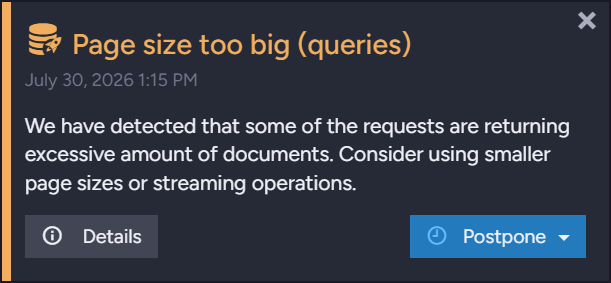

import Admonition from '@theme/Admonition';
import Panel from "@site/src/components/Panel";
import ContentFrame from "@site/src/components/ContentFrame";

# Performance hints

<Admonition type="note" title="">

* The server raises a **performance hint** when it detects an inefficiency you can remove,
  like a query that retrieves an excessive number of results or an index with a high
  fanout ratio.  
  The hint describes the detected condition and suggests a remedy.  

* Hints are presented in the
  [notification center](../../monitoring/alerts-and-notifications/notification-center.mdx#performance-hints),
  where you can read, dismiss, and postpone them.  

* Most hints are triggered by configurable thresholds, set by the `PerformanceHints.*`
  [configuration keys](../../monitoring/alerts-and-notifications/configuration.mdx).  

* In this article:
   * [Overview](../../monitoring/alerts-and-notifications/performance-hints.mdx#overview)
   * [Performance hint reasons](../../monitoring/alerts-and-notifications/performance-hints.mdx#performance-hint-reasons)
      * [Paging](../../monitoring/alerts-and-notifications/performance-hints.mdx#paging)
      * [Request latency](../../monitoring/alerts-and-notifications/performance-hints.mdx#request-latency)
      * [Slow writes](../../monitoring/alerts-and-notifications/performance-hints.mdx#slow-writes)
      * [Huge documents](../../monitoring/alerts-and-notifications/performance-hints.mdx#huge-documents)
      * [Indexing](../../monitoring/alerts-and-notifications/performance-hints.mdx#indexing)
      * [Indexing references](../../monitoring/alerts-and-notifications/performance-hints.mdx#indexing-references)
      * [Slow SQL](../../monitoring/alerts-and-notifications/performance-hints.mdx#slow-sql)
      * [Replication](../../monitoring/alerts-and-notifications/performance-hints.mdx#replication)
      * [Unused capacity](../../monitoring/alerts-and-notifications/performance-hints.mdx#unused-capacity)
   * [Configuration](../../monitoring/alerts-and-notifications/performance-hints.mdx#configuration)

</Admonition>

<Panel heading="Overview">

In the notification center, a performance hint is presented as follows:

Learn in the [notification center](../../monitoring/alerts-and-notifications/notification-center.mdx#performance-hints)
article how to work with hint cards: reading the details of recorded occurrences,
dismissing, postponing, and hiding a hint permanently.  

You can also track hint counts without opening the notification center:

* The [databases list view](../../studio/database/databases-list-view.mdx#database-stats) shows
  the number of hints raised for each database.  
* The cluster dashboard's
  [Databases Notifications widget](../../monitoring/cluster-dashboard/widgets.mdx#databases-notifications)
  lists each database's alerts and performance hints.  
* RavenDB exposes per-database hint counts to external monitoring tools, through the
  [monitoring endpoints](../../monitoring/json-monitoring-endpoints.mdx#the-databases-endpoint) and over
  [SNMP](../../monitoring/integrations/snmp/overview.mdx#database-oids).  

</Panel>

<Panel heading="Performance hint reasons">

The server raises performance hints for nine *reasons*:

<ContentFrame>

### Paging

<Admonition type="note" title="">

The server raises a paging hint when a request returns more results than the threshold set by
the `PerformanceHints.MaxNumberOfResults`
[configuration key](../../monitoring/alerts-and-notifications/configuration.mdx#performancehintsmaxnumberofresults)
(`2048` by default).

</Admonition>

* A separate paging hint is raised for each of the four request types: documents, queries,
  revisions, and compare exchange.  
  A paging hint's title names the request type in parentheses: the hint shown in
  [Overview](../../monitoring/alerts-and-notifications/performance-hints.mdx#overview) above,
  for example, was raised for queries, so it is titled `Page size too big (queries)`.
  A hint raised for revisions would be titled `Page size too big (revisions)`.  

* Paging hints are Warnings. Their details list the recent excessive requests, with each
  request's action, number of results, page size, data size, time, and duration.  
  A query's text is recorded as well.  

* To avoid this hint and the inefficiency it reports, retrieve the results in
  [pages](../../indexes/querying/paging.mdx), or
  [stream](../../querying/stream-query-results.mdx) them.  

</ContentFrame>
<ContentFrame>

### Request latency

<Admonition type="note" title="">

The server raises a request-latency hint when a query runs longer than the threshold set by
the `PerformanceHints.TooLongRequestThresholdInSec`
[configuration key](../../monitoring/alerts-and-notifications/configuration.mdx#performancehintstoolongrequestthresholdinsec)
(`30` seconds by default).

</Admonition>

* Request-latency hints are Warnings. Their details list the recent slow queries, with each
  query's text, parameters, and duration.  

* To find the slow part of a recorded query, run the query with its
  [timings](../../client-api/session/querying/debugging/query-timings.mdx) included.  

</ContentFrame>
<ContentFrame>

### Slow writes

<Admonition type="note" title="">

The server raises a slow-writes hint when a disk write is extremely slow: a journal write
that took at least half a second, or a data flush or data sync that took at least two
minutes, at a write speed of 1 MB per second or lower.

</Admonition>

* These operation types are explained on the
  [IO Stats](../../monitoring/performance-views/io-stats.mdx#what-the-bars-measure) page.  

* Slow-writes hints are Info notifications. Their details list the recorded slow writes,
  with each write's operation type, file path, amount of data written, duration, and speed.  

* To watch the database's disk activity and locate slow operations as they happen, open the
  [IO Stats](../../monitoring/performance-views/io-stats.mdx) view.  

</ContentFrame>
<ContentFrame>

### Huge documents

<Admonition type="note" title="">

The server raises a huge-documents hint when a document exceeds the size threshold set by
the `PerformanceHints.Documents.HugeDocumentSizeInMb`
[configuration key](../../monitoring/alerts-and-notifications/configuration.mdx#performancehintsdocumentshugedocumentsizeinmb)
(`5` MB by default).

</Admonition>

* Huge-documents hints are Warnings. Their details list the recently detected huge
  documents, with each document's ID, size, and time.  

* To avoid this hint and the inefficiency it reports, keep documents small, e.g., by storing
  large binary content as [attachments](../../document-extensions/attachments/overview.mdx).  

</ContentFrame>
<ContentFrame>

### Indexing

<Admonition type="note" title="">

The server raises indexing hints when an index definition causes inefficient indexing.  
Three conditions raise indexing hints, each governed by its own configuration key.

</Admonition>

* **High fanout ratio**  
  Raised as a Warning when an index produces more index entries from a single document than
  the threshold set by the `PerformanceHints.Indexing.MaxIndexOutputsPerDocument`
  [configuration key](../../monitoring/alerts-and-notifications/configuration.mdx#performancehintsindexingmaxindexoutputsperdocument)
  (`1024` by default).  
  Learn more about fanout indexes and this hint in
  [Indexing nested data](../../indexes/indexing-nested-data.mdx#performanceHints).  

* **Source document included in the index output**  
  Raised as a Warning when an index stores whole source documents in its entries.  
  Including the document in the index output is rarely intentional, and in a fanout index
  the document is included multiple times.  
  This hint is enabled by the
  `PerformanceHints.Indexing.AlertWhenSourceDocumentIncludedInOutput`
  [configuration key](../../monitoring/alerts-and-notifications/configuration.mdx#performancehintsindexingalertwhensourcedocumentincludedinoutput)
  (`true` by default).  

* **Many `let` clauses**  
  Raised as an Info notification when a LINQ index definition contains more `let` clauses
  than the threshold set by the `PerformanceHints.Indexing.MaxDepthOfRecursionInLinqSelect`
  [configuration key](../../monitoring/alerts-and-notifications/configuration.mdx#performancehintsindexingmaxdepthofrecursioninlinqselect)
  (`32` by default).  
  Stack memory is allocated for each `let` clause, so a long chain of `let` clauses can
  consume a lot of memory.  
  To avoid this hint and the inefficiency it reports, simplify the index definition.  

</ContentFrame>
<ContentFrame>

### Indexing references

<Admonition type="note" title="">

The server raises an indexing-references hint when the number of times an index loads the same
[related document](../../indexes/indexing-related-documents.mdx) or compare-exchange value
reaches the threshold set by the
`PerformanceHints.Indexing.MaxNumberOfLoadsPerReference`
[configuration key](../../monitoring/alerts-and-notifications/configuration.mdx#performancehintsindexingmaxnumberofloadsperreference)
(`1024` by default).

</Admonition>

* An index loads related items using `LoadDocument()` and `LoadCompareExchangeValue()` calls.  
  A high number of loads per item means many index entries depend on the item, and each
  update of the item triggers reindexing of every referencing document.  

* Indexing-references hints are Warnings. Their details list, per index, the most-loaded
  references and the number of loads for each.  

* To examine the indexing impact, open the
  [Indexing Performance](../../studio/database/indexes/indexing-performance.mdx) view.  

</ContentFrame>
<ContentFrame>

### Slow SQL

<Admonition type="note" title="">

The server raises a slow-SQL hint when a SQL statement executed by a
[SQL ETL](../../server/ongoing-tasks/etl/sql.mdx) task runs for longer than 3 seconds.

</Admonition>

* A separate hint is raised for each of a SQL ETL task's transform scripts.  
  The hint's title names the task and the script: the hint for a task named `OrdersToSql`
  and a script named `OrdersScript`, for example, is titled
  `SQL ETL: 'OrdersToSql/OrdersScript'`.  

* Slow-SQL hints are Warnings. Their details list the most recent 500 slow statements, with
  each statement's text, duration, and time.  

* Slow statements often result from missing indexes on the destination tables: consider
  indexing the columns the statements filter by.  

</ContentFrame>
<ContentFrame>

### Replication

<Admonition type="note" title="">

The server raises a replication hint when a disabled replication destination prevents the
cleanup of a large number of [tombstones](../../monitoring/tombstones/overview.mdx)
(more than 16,384).

</Admonition>

* Tombstones that a replication destination has not received yet cannot be cleaned up.  
  While the destination's replication task is disabled, the destination receives no
  deletions, so tombstones accumulate in the source database.  

* Replication hints are Warnings; each hint's message names the disabled destination.  

* To let the accumulated tombstones be cleaned up, re-enable the disabled
  [replication task](../../studio/database/tasks/ongoing-tasks/general-info.mdx), or delete
  the task if the destination is no longer needed.  

</ContentFrame>
<ContentFrame>

### Unused capacity

<Admonition type="note" title="">

The server raises an unused-capacity hint when it uses fewer CPU cores than the machine
provides, e.g., when the [license](https://ravendb.net/buy) limits the number of cores
RavenDB can use.

</Admonition>

* The unused-capacity hint is the only performance hint raised server-wide: its card
  carries the globe icon that marks
  [server-wide notifications](../../monitoring/alerts-and-notifications/notification-center.mdx#server-wide-and-database-notifications).  

* Unused-capacity hints are Info notifications, re-raised at most once a week while the
  condition persists, and dismissed automatically once the server uses all machine
  cores.  

* To use the machine's full capacity, assign the server more cores, e.g., by raising the
  license's core limit or
  [reassigning cores](../../studio/cluster/cluster-view.mdx#reassign-cores) among the
  cluster's nodes.  

</ContentFrame>

</Panel>

<Panel heading="Configuration">

* The `PerformanceHints.*` configuration keys, named in the sections above, are listed on
  the [Configuration options](../../monitoring/alerts-and-notifications/configuration.mdx)
  page.  
  Most of the keys can be set both server-wide and per database; the page states each key's
  scope, type, and default value.  

* To keep hints raised for chosen *reasons* from appearing in the notification center, list
  the *reasons* in the `Notifications.FilterOut` configuration key, described in the
  notification center article's
  [Configuration](../../monitoring/alerts-and-notifications/notification-center.mdx#configuration)
  section.  
  The names that the key accepts are listed under
  [Values for performance-hint reasons](../../monitoring/alerts-and-notifications/notification-center.mdx#values-for-performance-hint-reasons).  

</Panel>
