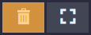
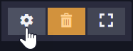
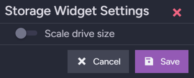
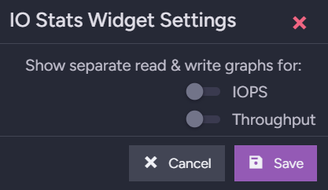
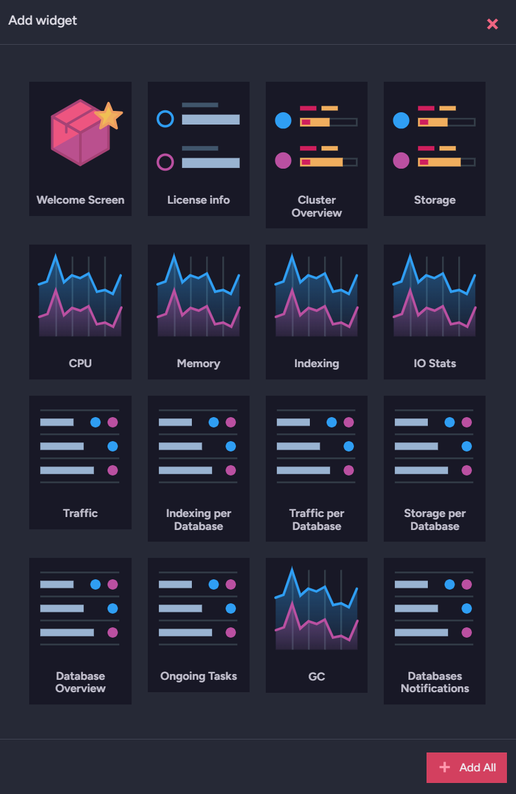
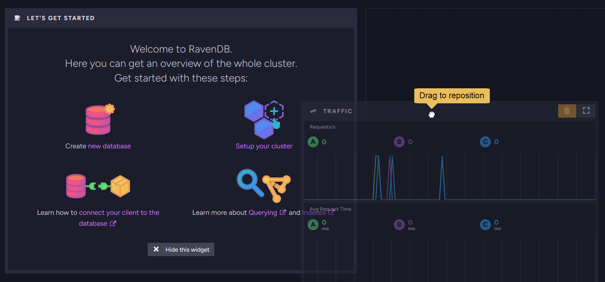

import Admonition from '@theme/Admonition';
import Panel from "@site/src/components/Panel";
import ContentFrame from "@site/src/components/ContentFrame";

# Cluster Dashboard: Customize

<Admonition type="note" title="">

* Customize the **Cluster Dashboard** to suit the way you monitor your cluster: keep the widgets you
  use, remove those you do not, and size and position the rest for the clearest possible view.  

* You do this by adding, removing, resizing, repositioning, and configuring widgets.  

* Hovering over a widget's top bar reveals the controls for resizing and removing it, and, on some
  widgets, for configuring it.  

* In this article:
   * [Customizing the dashboard](../../monitoring/cluster-dashboard/customize.mdx#customizing-the-dashboard)
      * [Removing and sizing a widget](../../monitoring/cluster-dashboard/customize.mdx#removing-and-sizing-a-widget)
      * [Configuring a widget](../../monitoring/cluster-dashboard/customize.mdx#configuring-a-widget)
      * [Adding a widget](../../monitoring/cluster-dashboard/customize.mdx#adding-a-widget)
      * [Repositioning a widget](../../monitoring/cluster-dashboard/customize.mdx#repositioning-a-widget)

</Admonition>

<Panel heading="Customizing the dashboard">

<ContentFrame>

### Removing and sizing a widget

Hovering over a widget's top bar reveals a remove button and a resize toggle.  

* **Remove**  
  Click the remove button (the recycle bin) to remove the widget from the dashboard.  
  Removing a widget is reversible: you can add it back using the
  [Add widget](../../monitoring/cluster-dashboard/customize.mdx#adding-a-widget) window.  

* **Resize**  
  Click the resize toggle to expand the widget to its full size, and toggle it back to collapse the widget.  

</ContentFrame>

<ContentFrame>

### Configuring a widget

A settings gear appears on the top bar of the widgets that have configurable options.
Click it to open the widget's settings.  

For example:

* The **Storage** widget offers **Scale drive size**.  
  When off, every node's bar is drawn at the same width.  
  When on, each node's bar is sized in proportion to its drive's capacity, so you can compare drive
  sizes across nodes: the largest drive fills the full width, and smaller drives get shorter bars.  

  

* The **IO Stats** widget can show separate read and write graphs for **IOPS** and **Throughput**.  

  

</ContentFrame>

<ContentFrame>

### Adding a widget

To add a widget, click the **`+`** button at the bottom-right corner of the dashboard.  

This opens the **Add widget** window.  

The widgets you can add appear in color, and the widgets already on the dashboard are grayed out and
cannot be selected. Click a widget to add it, or click **Add All** to add every widget.  

</ContentFrame>

<ContentFrame>

### Repositioning a widget

Drag a widget by its top bar to move it to a new position on the dashboard.  

</ContentFrame>

</Panel>
