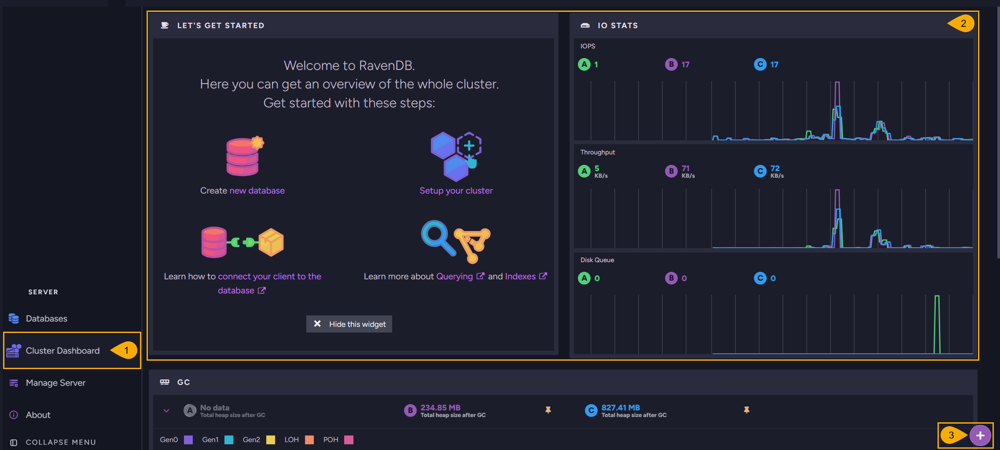

import Admonition from '@theme/Admonition';
import Panel from "@site/src/components/Panel";

# Cluster Dashboard: Overview

<Admonition type="note" title="">

* The **Cluster Dashboard** Studio view presents live diagnostics for a whole RavenDB cluster.  

* Each widget on the dashboard shows a set of metrics, gathered from every cluster node.  
  See [Available widgets](../../monitoring/cluster-dashboard/widgets.mdx) for the full set.  

* You can customize the dashboard by adding, removing, resizing, and repositioning its widgets.  
  See [Customizing the dashboard](../../monitoring/cluster-dashboard/customize.mdx).  

* In this article:
   * [The Cluster Dashboard view](../../monitoring/cluster-dashboard/overview.mdx#the-cluster-dashboard-view)

</Admonition>

<Panel heading="The Cluster Dashboard view">

The **Cluster Dashboard** view shows a live overview of an entire RavenDB cluster.  
Each widget shows a set of metrics gathered from every node, so you can follow CPU, memory,
storage, traffic, and indexing across the whole cluster without opening each node separately.  

1. **Cluster Dashboard**  
   Open the cluster dashboard view.  

2. **Widgets**  
   Each widget shows a set of live cluster metrics.  
   See [Available widgets](../../monitoring/cluster-dashboard/widgets.mdx) for the full set.  

3. **Add widget**  
   Click to add a widget to the dashboard.  
   See [Customizing the dashboard](../../monitoring/cluster-dashboard/customize.mdx) for more about arranging widgets.  

</Panel>
