import Admonition from '@theme/Admonition';
import Panel from "@site/src/components/Panel";
import ContentFrame from "@site/src/components/ContentFrame";

# Cluster Dashboard: Widgets

<Admonition type="note" title="">

* The **Cluster Dashboard** widgets show live diagnostics for the whole cluster, reporting each
  metric for every node.  

* This article describes the available widgets, grouped by the kind of information each one shows.  

* You can add, remove, resize, and reposition widgets.  
  See [Customizing the dashboard](../../monitoring/cluster-dashboard/customize.mdx).  

* In this article:
   * [Cluster and license information](../../monitoring/cluster-dashboard/widgets.mdx#cluster-and-license-information)
      * [Let's Get Started](../../monitoring/cluster-dashboard/widgets.mdx#lets-get-started)
      * [Cluster Overview](../../monitoring/cluster-dashboard/widgets.mdx#cluster-overview)
      * [License](../../monitoring/cluster-dashboard/widgets.mdx#license)
   * [Server resource usage](../../monitoring/cluster-dashboard/widgets.mdx#server-resource-usage)
      * [CPU](../../monitoring/cluster-dashboard/widgets.mdx#cpu)
      * [Memory](../../monitoring/cluster-dashboard/widgets.mdx#memory)
      * [Storage](../../monitoring/cluster-dashboard/widgets.mdx#storage)
      * [IO Stats](../../monitoring/cluster-dashboard/widgets.mdx#io-stats)
      * [GC](../../monitoring/cluster-dashboard/widgets.mdx#gc)
   * [Server workload](../../monitoring/cluster-dashboard/widgets.mdx#server-workload)
      * [Traffic](../../monitoring/cluster-dashboard/widgets.mdx#traffic)
      * [Indexing](../../monitoring/cluster-dashboard/widgets.mdx#indexing)
   * [Databases and tasks](../../monitoring/cluster-dashboard/widgets.mdx#databases-and-tasks)
      * [Database Overview](../../monitoring/cluster-dashboard/widgets.mdx#database-overview)
      * [Databases Notifications](../../monitoring/cluster-dashboard/widgets.mdx#databases-notifications)
      * [Ongoing Tasks](../../monitoring/cluster-dashboard/widgets.mdx#ongoing-tasks)
      * [Traffic per Database](../../monitoring/cluster-dashboard/widgets.mdx#traffic-per-database)
      * [Indexing per Database](../../monitoring/cluster-dashboard/widgets.mdx#indexing-per-database)
      * [Storage per Database](../../monitoring/cluster-dashboard/widgets.mdx#storage-per-database)

</Admonition>

<Panel heading="Cluster and license information">

<ContentFrame>

### Let's Get Started

The **Let's Get Started** widget gives a new cluster a starting point,
with links to the main setup tasks and to key RavenDB concepts.  

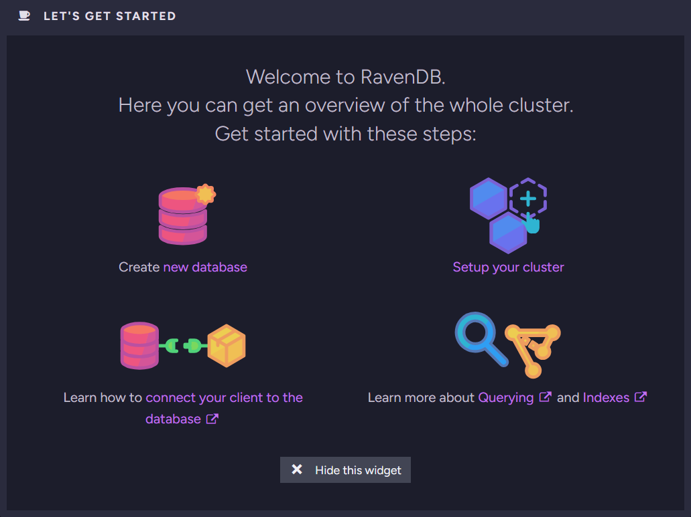

* **Create new database**  
  [Create new database](../../studio/database/create-new-database/general-flow.mdx) flow.  

* **Setup your cluster**  
  Opens Studio's [Cluster View](../../studio/cluster/cluster-view.mdx), where you can create and manage the cluster.  

* **Connect your client to the database**  
  Links to the [Getting Started](../../start/getting-started.mdx#client) documentation page, where you can learn to
  connect a client through the API.  

* **Querying and Indexes**  
  Links to the [RQL](../../querying/rql/what-is-rql.mdx) and [What are Indexes](../../indexes/what-are-indexes.mdx) documentation pages.  

* **Hide this widget**  
  Removes the widget from the dashboard. You can add it back later, see
  [Customizing the dashboard](../../monitoring/cluster-dashboard/customize.mdx).  

</ContentFrame>

<ContentFrame>

### Cluster Overview

The **Cluster Overview** widget shows the current state of each node in the cluster.  

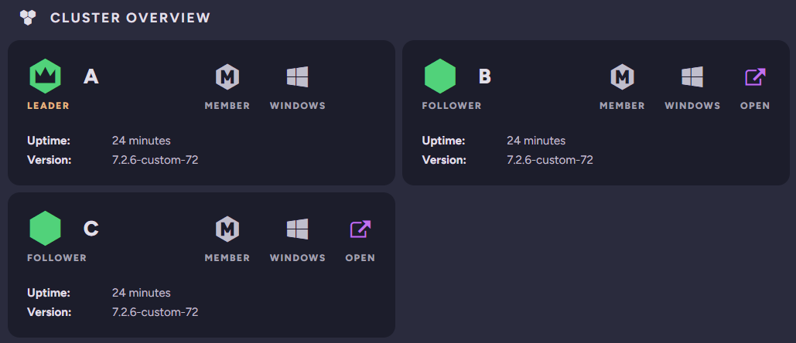

For each node, the widget shows:

* the node's tag and role in the cluster, such as `Leader` or `Follower`.  
* the node's membership type, such as `Member`.  
* the operating system the node runs on.  
* the node's uptime and RavenDB version.  
* an **Open** button that opens a node's cluster dashboard in a new browser tab, shown for every node except the one you are currently connected to.  

</ContentFrame>

<ContentFrame>

### License

The **License** widget shows the details of your RavenDB license.  

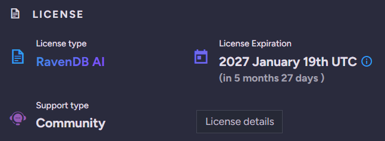

* **License type**  
  The type of your RavenDB license.  

* **License Expiration**  
  The expiration date and remaining time.  

* **Support type**  
  Your support plan.  

* **License details**  
  Click to open the [About view](../../licensing/overview.mdx), with the full information about your
  license and support plan.  

</ContentFrame>

</Panel>

<Panel heading="Server resource usage">

<ContentFrame>

### CPU

The **CPU** widget shows CPU usage across the cluster, per node.  

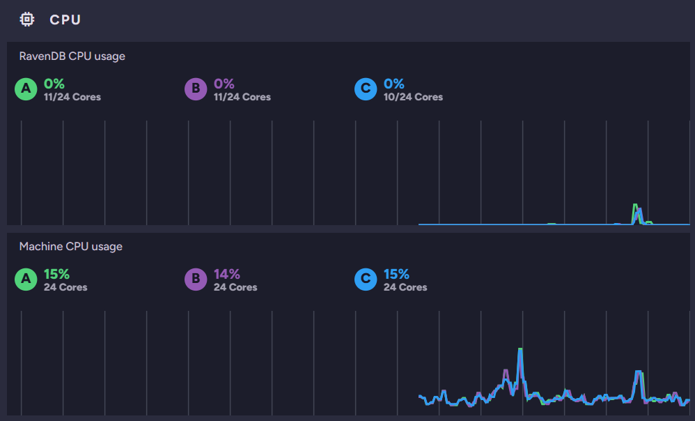

* **RavenDB CPU usage**  
  The RavenDB process's CPU usage on each node, as a percentage, and the number of cores assigned to RavenDB.  

* **Machine CPU usage**  
  The overall CPU usage on each node's machine, as a percentage, and the machine's total number of cores.  

Hovering over the timeline shows earlier values.  

</ContentFrame>

<ContentFrame>

### Memory

The **Memory** widget shows memory usage across the cluster, per node.  

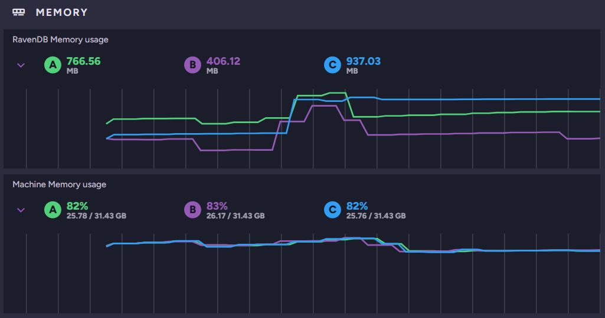

* **RavenDB Memory usage**  
  The memory the RavenDB process uses on each node.  
  Expand **RavenDB Memory usage** to see the allocation breakdown per node:  

  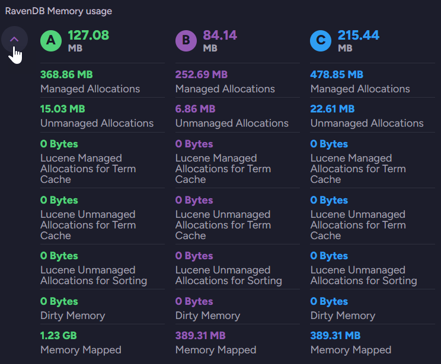

* **Machine Memory usage**  
  The memory used on each node's machine, shown as a percentage and as used out of total.  
  Expand **Machine Memory usage** to see each node's swap usage, available memory, and memory available for processing:  

  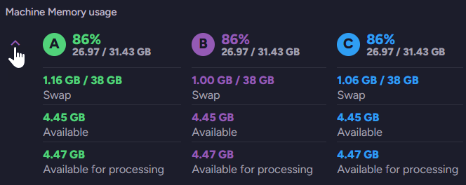

Hovering over the timeline shows earlier values.  

</ContentFrame>

<ContentFrame>

### Storage

The **Storage** widget shows disk usage on each node.  

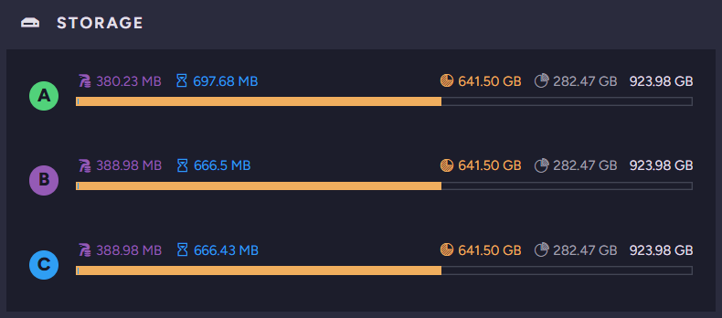

For each node, the widget shows:

* **Used by RavenDB Data**  
  The storage occupied by RavenDB's data.  

* **Used by RavenDB Temporary Buffers**  
  The storage occupied by RavenDB's temporary buffers.  

* **Storage used**  
  The total storage used on the drive.  

* **Storage free**  
  The free storage remaining on the drive.  

* **Total storage available**  
  The drive's total storage capacity.  

</ContentFrame>

<ContentFrame>

### IO Stats

The **IO Stats** widget shows disk input/output activity on each node.  

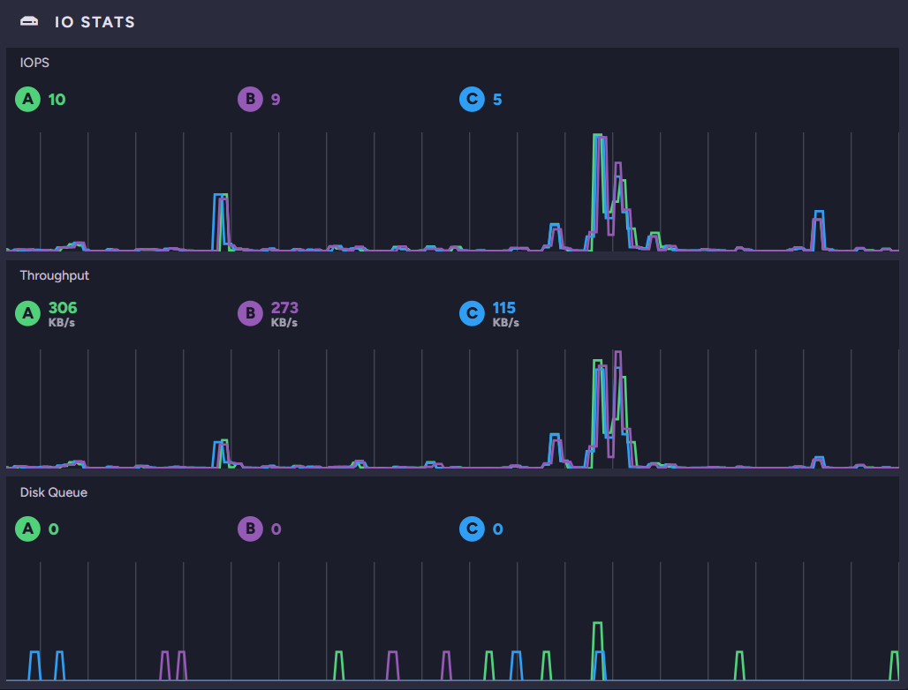

* **IOPS**  
  The number of disk input/output operations per second on each node.  

* **Throughput**  
  The amount of data read from and written to disk per second on each node.  

* **Disk Queue**  
  The number of input/output operations queued on each node's disk.  

Hovering over the timeline shows earlier values.  

</ContentFrame>

<ContentFrame>

### GC

The **GC ([Garbage Collection](../../server/configuration/memory-configuration.mdx#net-gc-garbage-collection))** widget shows .NET garbage-collection activity for the RavenDB
process on each node.  

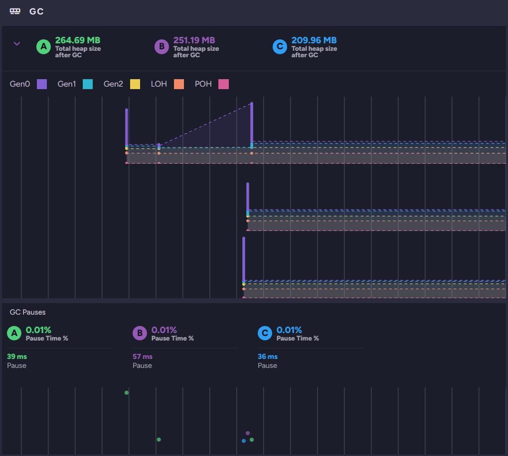

* **Total heap size after GC**  
  The size of the [managed heap](../../server/configuration/memory-configuration.mdx#net-gc-garbage-collection) on each node after its last garbage collection.  
  Expand **Total heap size after GC** to see the details of the last garbage collection on each node:  

  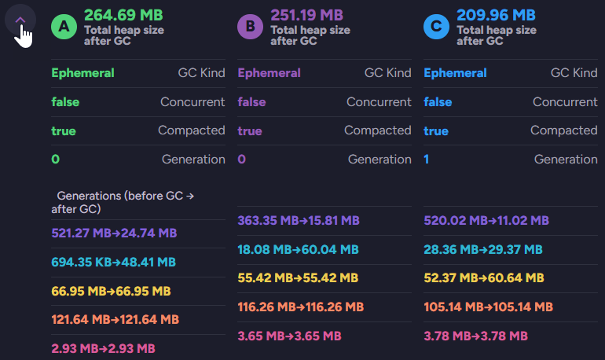

  * **GC Kind**  
    The type of the collection: `Ephemeral`, `Background`, or `FullBlocking`.  
  * **Concurrent**  
    Whether the collection ran concurrently with the RavenDB process.  
  * **Compacted**  
    Whether the collection compacted the heap.  
  * **Generation**  
    The generation the collection ran on: `0`, `1`, or `2`.  
  * **Generations (before GC → after GC)**  
    The size of each generation before and after the collection: Gen0, Gen1, Gen2, LOH, and POH.  

  The graph shows the size of each part of the managed heap, keyed by the colors in the legend: Gen0, Gen1, Gen2, LOH ([Large Object Heap](../../server/configuration/memory-configuration.mdx#net-loh-large-object-heap)), and POH (Pinned Object Heap).  

* **GC Pauses**  
  The percentage of time the process spent paused for garbage collection, and the duration of the most recent pause, per node.  

</ContentFrame>

</Panel>

<Panel heading="Server workload">

<ContentFrame>

### Traffic

The **Traffic** widget shows request and write activity on each node.  

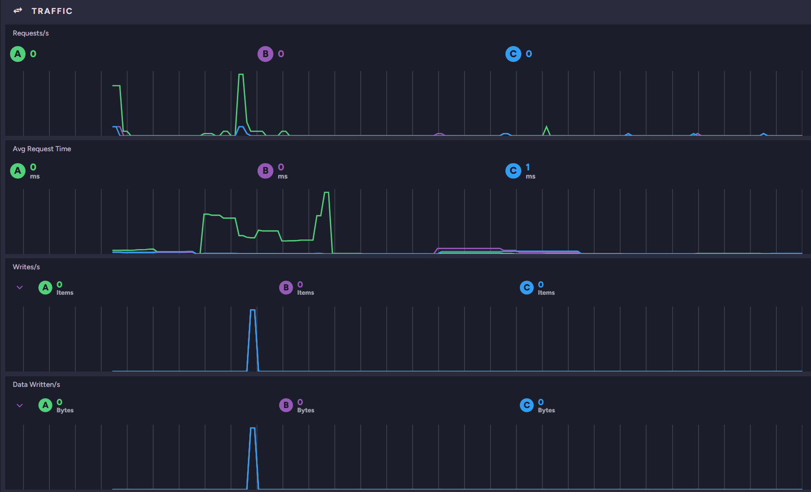

* **Requests/s**  
  The number of requests made to each node per second.  

* **Avg Request Time**  
  The average time each node takes to handle a request, in milliseconds.  

* **Writes/s**  
  The number of items written on each node per second.  
  Expand **Writes/s** to see the write rate for documents, attachments, counters, and time series on each node:  

  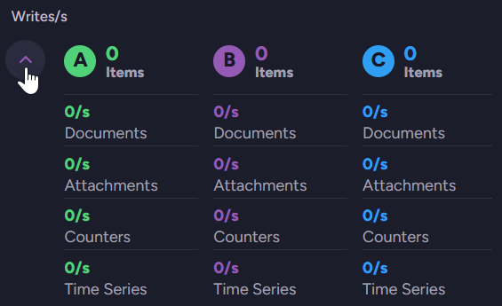

* **Data Written/s**  
  The amount of data written on each node per second.  
  Expand **Data Written/s** to see the data written for documents, attachments, counters, and time series on each node:  

  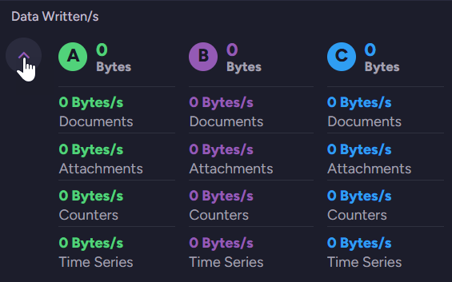

Hovering over the timeline shows earlier values.  

</ContentFrame>

<ContentFrame>

### Indexing

The **Indexing** widget shows indexing throughput on each node.  

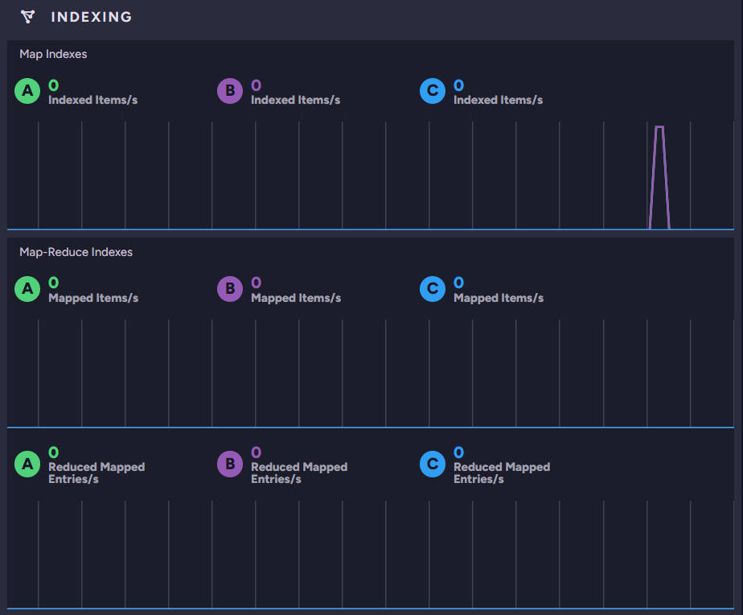

* **Map Indexes**  
  The number of items indexed per second on each node.  

* **Map-Reduce Indexes**  
  The number of items mapped per second, and the number of reduced mapped entries per second, on each node.  

Hovering over the timeline shows earlier values.  

</ContentFrame>

</Panel>

<Panel heading="Databases and tasks">

<ContentFrame>

### Database Overview

The **Database Overview** widget lists the databases in the cluster and shows the state of each one
on every node. The header shows the total number of databases and how many are online, offline, and
disabled.  

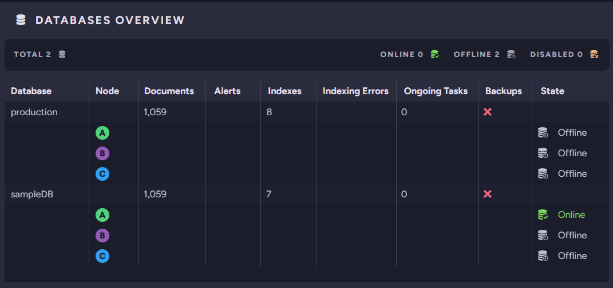

| Column | Description |
|--------|-------------|
| **Database** | The database name. |
| **Node** | The cluster node the row reports on. |
| **Documents** | The number of documents in the database. |
| **Alerts** | The number of alerts raised for the database. |
| **Indexes** | The number of indexes defined in the database. |
| **Indexing Errors** | The number of indexing errors in the database. |
| **Ongoing Tasks** | The number of ongoing tasks defined for the database. |
| **Backups** | The database's backup state. |
| **State** | The database's state on the node, such as `Online`. |

Click a node under a database to open the database's [Documents view](../../studio/database/documents/documents-and-collections.mdx) on the selected node.  

</ContentFrame>

<ContentFrame>

### Databases Notifications

The **Databases Notifications** widget lists the
[alerts and performance hints](../../monitoring/alerts-and-notifications/notification-center.mdx)
raised for each database, per node. The header shows the totals across the cluster. Only databases that are
currently online appear.  

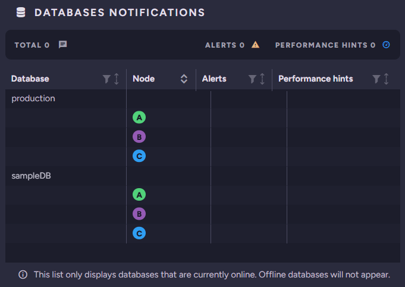

| Column | Description |
|--------|-------------|
| **Database** | The database the row reports on. |
| **Node** | The cluster node the row reports on. |
| **Alerts** | The alerts raised for the database on the node. |
| **Performance hints** | The performance hints raised for the database on the node. |

Click the tag of the node currently running the cluster dashboard to open its notifications. Click a different node's tag to open the selected node's cluster dashboard in a new browser tab.  

</ContentFrame>

<ContentFrame>

### Ongoing Tasks

The **Ongoing Tasks** widget lists the ongoing tasks defined across the cluster, by type.  

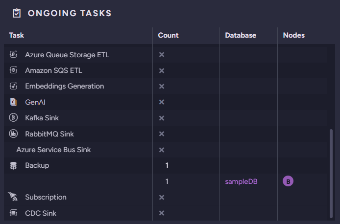

| Column | Description |
|--------|-------------|
| **Task** | The ongoing task type, such as an ETL, sink, backup, or subscription task. |
| **Count** | The number of tasks of this type. |
| **Database** | The database the task belongs to. |
| **Nodes** | The node or nodes responsible for the task. |

</ContentFrame>

<ContentFrame>

### Traffic per Database

The **Traffic per Database** widget breaks request and write activity down by database and node.  

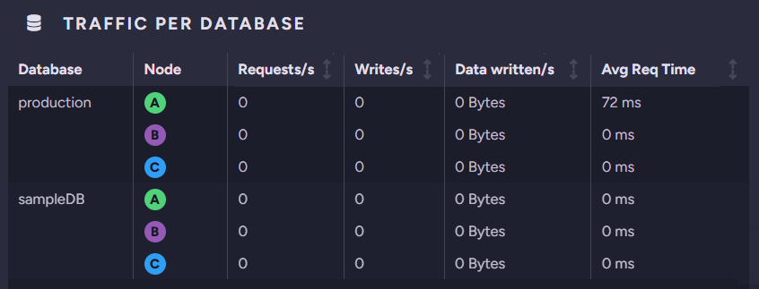

| Column | Description |
|--------|-------------|
| **Database** | The database the row reports on. |
| **Node** | The cluster node the row reports on. |
| **Requests/s** | The number of requests handled per second. |
| **Writes/s** | The number of items written per second. |
| **Data written** | The amount of data written per second. |
| **Avg Req Time** | The average request time, in milliseconds. |

Click a node's tag to open the selected node's Traffic Watch view, where you can see the requests made to the node.  

</ContentFrame>

<ContentFrame>

### Indexing per Database

The **Indexing per Database** widget breaks indexing throughput down by database and node.  

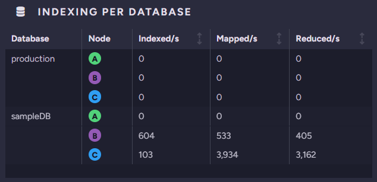

| Column | Description |
|--------|-------------|
| **Database** | The database the row reports on. |
| **Node** | The cluster node the row reports on. |
| **Indexed/s** | The number of items indexed per second. |
| **Mapped/s** | The number of items mapped per second. |
| **Reduced/s** | The number of reduced mapped entries per second. |

Click a node's tag to open the [Indexing Performance view](../../studio/database/indexes/indexing-performance.mdx) for the selected node.  

</ContentFrame>

<ContentFrame>

### Storage per Database

The **Storage per Database** widget breaks disk usage down by database and node.  

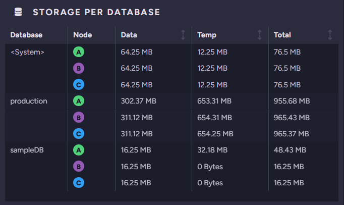

| Column | Description |
|--------|-------------|
| **Database** | The database the row reports on. |
| **Node** | The cluster node the row reports on. |
| **Data** | The disk space used by the database's data. |
| **Temp** | The disk space used by the database's temporary files. |
| **Total** | The total disk space used by the database. |

The list includes a `<System>` row, which reports the storage used by the server's own system data (server-wide and cluster-level data), not a user database.  

Click a node's tag to open the selected node's Storage Report view.  

</ContentFrame>

</Panel>
