import Admonition from '@theme/Admonition';
import ContentFrame from '@site/src/components/ContentFrame';
import Panel from '@site/src/components/Panel';

# Advanced-debug view

<Admonition type="note" title="">

* Studio's **advanced-debug** view has six diagnostic tabs.  
  Use these tabs to inspect the server's threads and memory mapped files, follow the
  Cluster Observer's decisions, browse the Raft log, and record and replay a database's
  transaction commands.

* Open the view from the `Manage Server` menu's `Debug` section.

* In this article:
   * [The advanced-debug view](../../monitoring/debug/advanced-debug-view.mdx#the-advanced-debug-view)
   * [Threads Runtime Info tab](../../monitoring/debug/advanced-debug-view.mdx#threads-runtime-info-tab)
   * [Memory Mapped Files tab](../../monitoring/debug/advanced-debug-view.mdx#memory-mapped-files-tab)
   * [Cluster Observer Log tab](../../monitoring/debug/advanced-debug-view.mdx#cluster-observer-log-tab)
   * [Cluster Debug tab](../../monitoring/debug/advanced-debug-view.mdx#cluster-debug-tab)
      * [The cluster summary](../../monitoring/debug/advanced-debug-view.mdx#the-cluster-summary)
      * [The Log Entries table](../../monitoring/debug/advanced-debug-view.mdx#the-log-entries-table)
   * [Record Transaction Commands tab](../../monitoring/debug/advanced-debug-view.mdx#record-transaction-commands-tab)
   * [Replay Transaction Commands tab](../../monitoring/debug/advanced-debug-view.mdx#replay-transaction-commands-tab)

</Admonition>

<Panel heading="The advanced-debug view">

Each tab of the **advanced-debug** view is an independent utility.  
Any user with an Operator or Cluster Admin
[security clearance](../../server/security/authorization/security-clearance-and-permissions.mdx)
can open the view.  
**`Manage Server` > `Advanced`**

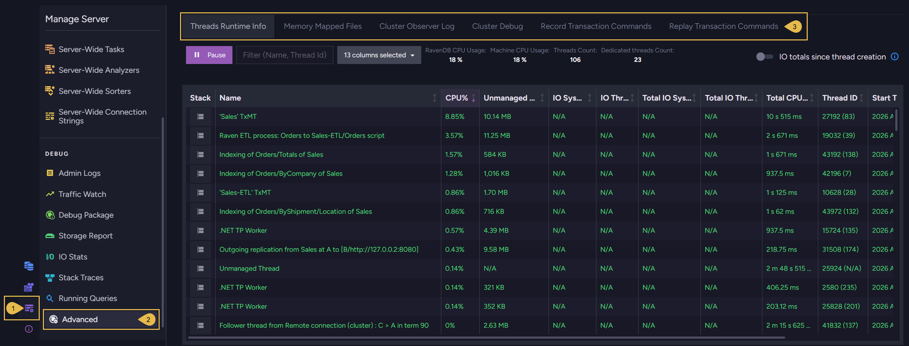

1. **Manage Server**  
   Open the **Manage Server** menu.

2. **Advanced**  
   Open the **advanced-debug** view.

3. **Tabs**  
   Switch between the view's tabs.  
   Each of the following sections describes one tab.

</Panel>

<Panel heading="Threads Runtime Info tab">

When the server consumes more CPU or memory than you expect, use the `Threads Runtime Info`
tab to find out which threads are responsible.  
This tab lists the threads of the server you are connected to, along with the resources each
thread consumes.  
RavenDB names the threads it dedicates to a job, so a thread's name often points directly at
the component at fault.  
The table is live: the server streams thread statistics to Studio, and the rows are updated as
the data arrives.

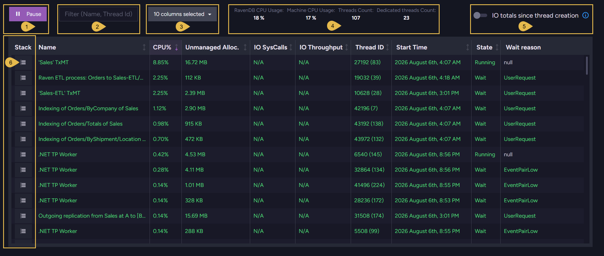

1. **Pause**  
   Stop the live updates.  
   After pausing, reconnect the stream using the same button (now labeled **Resume**).

2. **Filter**  
   List only the threads whose name or thread ID contains the text you enter.

3. **Columns**  
   Select the columns the table shows.

   <ContentFrame>

   The table's columns describe each thread's identity, CPU and memory consumption, I/O
   activity, and current state.

   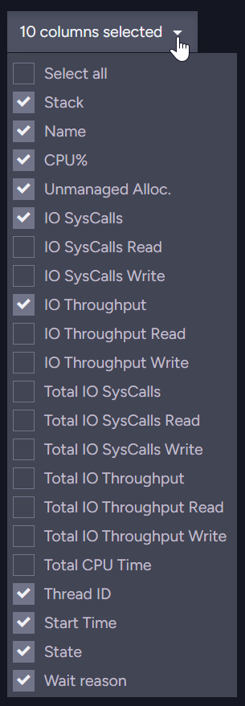

   I/O statistics are collected on Linux only; on other operating systems the I/O columns
   show `N/A`.

   | Column | Description |
   | ------ | ----------- |
   | `Stack` | Click to see the thread's stack trace. |
   | `Name` | The thread's name. |
   | `CPU%` | The portion of CPU the thread used over the last sampling interval. |
   | `Unmanaged Alloc.` | The unmanaged memory allocated by the thread. |
   | `IO SysCalls` | The rate of the thread's I/O system calls, per second. |
   | `IO SysCalls Read` `IO SysCalls Write` | The read and write portions of `IO SysCalls`. |
   | `IO Throughput` | The rate of data the thread reads and writes, per second. |
   | `IO Throughput Read` `IO Throughput Write` | The read and write portions of `IO Throughput`. |
   | `Total IO SysCalls` | The number of I/O system calls the thread performed over the period set by the `IO totals since thread creation` toggle. |
   | `Total IO SysCalls Read` `Total IO SysCalls Write` | The read and write portions of `Total IO SysCalls`. |
   | `Total IO Throughput` | The amount of data the thread read and wrote over the period set by the `IO totals since thread creation` toggle. |
   | `Total IO Throughput Read` `Total IO Throughput Write` | The read and write portions of `Total IO Throughput`. |
   | `Total CPU Time` | The processor time the thread has consumed since the thread started. |
   | `Thread ID` | The thread's operating-system ID, with the managed (.NET) thread ID in parentheses. `N/A` marks a thread with no managed ID. |
   | `Start Time` | The time the thread started. |
   | `State` | The thread's current state, e.g., `Running` or `Wait`. |
   | `Wait reason` | The reason a waiting thread waits, when the operating system reports one. |

   </ContentFrame>

4. **Counters**  
   * `RavenDB CPU Usage`  
     The portion of the machine's CPU that the RavenDB server consumes.
   * `Machine CPU Usage`  
     The CPU usage of all running processes together.  
     When the machine's CPU is overloaded, compare this figure with `RavenDB CPU Usage` to
     tell whether RavenDB is the source of the overload.
   * `Threads Count`  
     The number of threads the tab's table currently lists (with the filter applied).
   * `Dedicated threads Count`  
     The number of threads RavenDB dedicates to a specific job (e.g., a database's
     transaction merger or an index's worker thread).

5. **IO totals since thread creation**  
   Enable this toggle to accumulate the `Total IO` statistics over each thread's whole
   lifetime, or disable the toggle to restart the count each time the stream starts.

6. **Stack**  
   Click a thread's stack icon to see the corresponding stack trace.

   <ContentFrame>

   A thread's stack trace is the chain of method calls the thread is executing.  
   When a thread consumes excessive CPU or seems stuck, read the trace to learn the exact
   code the thread executes, and the RavenDB feature this code belongs to.

   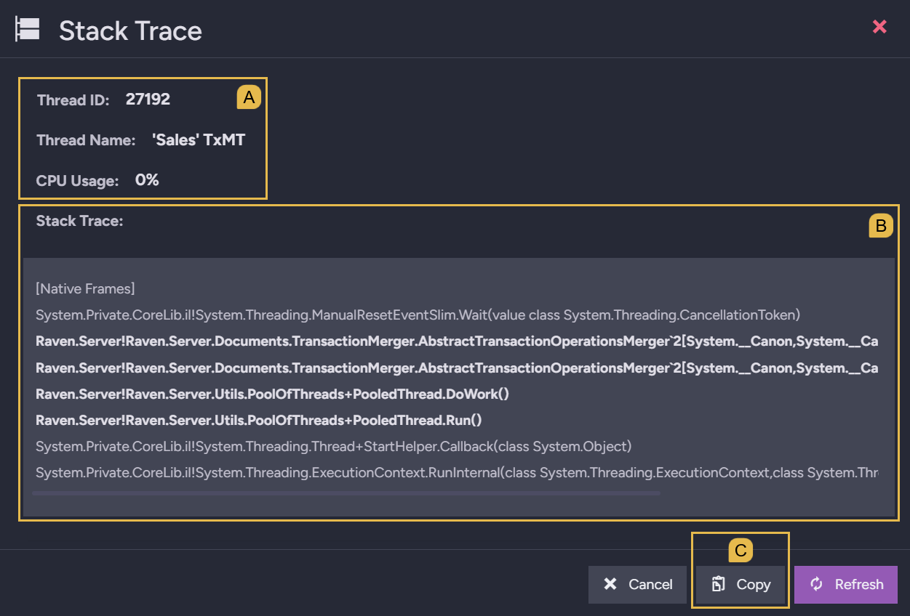

   * **A. Thread details**  
     The thread's ID, name, and current CPU usage.
   * **B. Stack Trace**  
     The captured stack trace.
      * The trace is a snapshot, listing the methods the thread had started and not yet
        finished at the moment of capture.
      * Each line holds a frame, a record of one method call
        (e.g., `Raven.Server!Raven.Server.Utils.PoolOfThreads+PooledThread.Run()` in the
        image above).
      * The frames are ordered from the newest method call at the top to the oldest at the
        bottom: each frame's method was called by the method in the frame beneath, so the
        trace opens with the method the thread executes right now and ends with the
        thread's first method.
      * The trace includes methods of RavenDB's own code and methods of the .NET runtime
        environment that runs RavenDB.  
        RavenDB's methods are shown in bold, so the frames that tie the thread to a RavenDB
        feature stand out.

   * **C. Copy**  
     Copy the stack trace to the clipboard.

   Click **Refresh** to sample the stack trace again without closing the dialog.

   <Admonition type="info" title="">

   This dialog captures the stack trace of a single thread.  
   To capture the stack traces of **all server threads at once**, use the
   [Stack Traces view](../../monitoring/debug/stack-traces.mdx).

   </Admonition>

   </ContentFrame>

</Panel>

<Panel heading="Memory Mapped Files tab">

RavenDB's [storage engine](../../server/storage/storage-engine.mdx) is based on memory mapped
files.  
When the server's memory usage seems excessive, use the `Memory Mapped Files` tab to check the
extent of these mappings: the tab lists the files the server currently maps, and the portion
of each file that is mapped into memory.

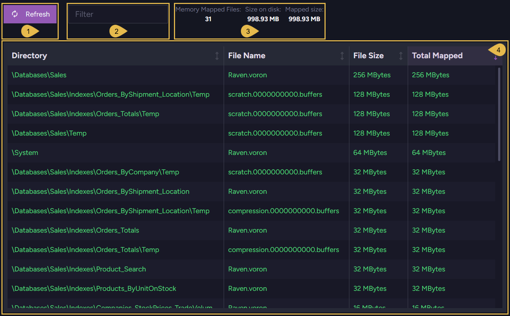

1. **Refresh**  
   Reload the list of mapped files.  
   The list is loaded once, when the tab opens, and the server continues to map and unmap
   files while the tab is open; refresh the list to load the current mappings.

2. **Filter**  
   List only the files whose name or directory contains the text you enter.

3. **Counters**  
   * `Memory Mapped Files`  
     The number of files listed.
   * `Size on disk`  
     The total size of the listed files.
   * `Mapped size`  
     The total portion of the listed files that is mapped into memory.

   All three counters cover only the files the table currently lists; files hidden by the
   filter are not counted.

4. **The table**  
   Each row describes one mapped file: the file's directory, name, size on disk, and total
   mapped size.  
   The table opens sorted by the `Total Mapped` column, from the largest mapped size to the
   smallest.  
   A file can be mapped into memory more than once; `Total Mapped` sums these mappings, and
   hovering over a row's `Total Mapped` cell shows each mapping separately.

</Panel>

<Panel heading="Cluster Observer Log tab">

The [Cluster Observer](../../server/clustering/distribution/cluster-observer.mdx) supervises
the cluster's databases: running on the leader node, the observer monitors the health of each
database and adjusts the database group topology when a node fails or recovers.  
When a database group changes without your intervention (e.g., a node moved to `Rehab`, or a
replacement node added to the group), read the `Cluster Observer Log` tab to learn the
decision behind each change.  
The log is retrieved from the current leader node regardless of the node your Studio is
connected to.

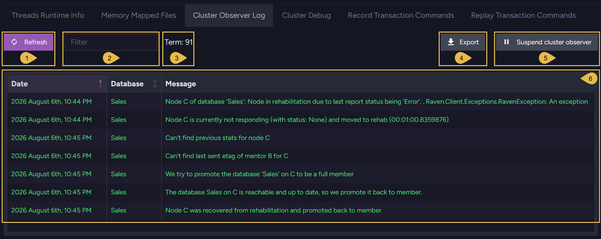

1. **Refresh**  
   Load the newest decisions.  
   The log is loaded once, when the tab opens, and the observer continues to make decisions
   as the cluster runs; refresh the table to load decisions made since the last load.

2. **Filter**  
   List only the decisions whose message contains the text you enter.

3. **Term**  
   The cluster's current term; a term begins when a new leader is elected.  
   The observer runs on the leader node and keeps the log in memory, so when the leadership
   changes, a new observer starts a new log under the new term.  
   When the term changes while the tab is open, the tab shows a warning saying that the results are
   stale, with a link to refresh the log.

4. **Export**  
   Download the log as a comma-separated text file.

5. **Suspend cluster observer**  
   Stop the observer from making topology decisions, e.g., while you are taking cluster nodes down
   for maintenance and do not want the observer to rearrange database groups around the
   missing nodes.  
   The suspension holds until the term changes; after suspending, re-enable the observer
   using the same button (now labeled **Resume cluster observer**).

6. **The table**  
   Each row holds one observer decision: the time of the decision, the database the decision
   concerns, and a message describing the decision.  
   In the image above the log is sorted by `Date`, oldest first, and follows node C from
   failure through rehabilitation back to `Member`.  
   Hovering over a message shows the full message text.

</Panel>

<Panel heading="Cluster Debug tab">

Every cluster-wide operation, like the creation of a database or the deployment of an index,
is executed as a [Raft command](../../glossary/raft-command.mdx): the leader appends the
command to the cluster's Raft log and replicates the log to the other nodes, and each node
applies the appended commands in order.  
When a cluster-wide change does not take effect (e.g., a command waits uncommitted, or one
node lags behind the others), use the `Cluster Debug` tab to examine the Raft log and the
commit progress of each node.

<ContentFrame>

### The cluster summary

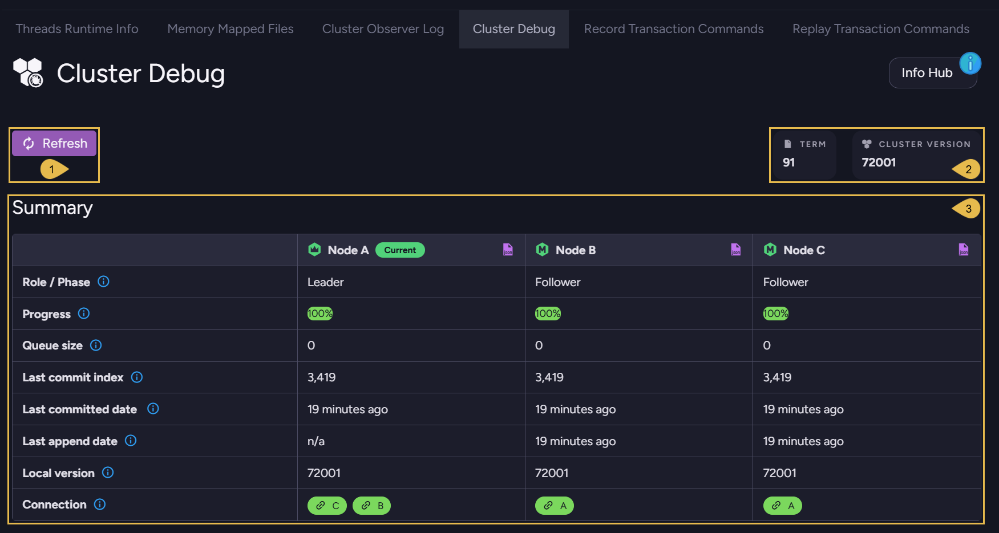

1. **Refresh**  
   Reload the summary and the log entries.  
   The tab is loaded once, when the tab opens; refresh to load the nodes' current state.

2. **Term and Cluster version**  
   * `Term`  
     The cluster's current term; a term begins when a new leader is elected.
   * `Cluster version`  
     The highest Raft command version number the cluster currently uses.  
     The cluster executes only commands that every member recognizes, so this number can be
     lower than an upgraded node's `Local version`.

3. **Summary**  
   One column per cluster node, reporting the node's progress through the log.  
   The node Studio is connected to carries a `Current` badge.  
   Clicking the small purple `json` icon beside a node's name opens the data behind the
   node's column, the log summary and entries, as raw JSON.

---

| Row | Description |
| --- | ----------- |
| `Role / Phase` | The node's role: `Leader`, `Follower`, `Candidate`, or `Passive`. |
| `Progress` | The percentage of the log's Raft commands that the node has committed. Hovering over the bar shows the indexes of the first and last entries in the node's log. |
| `Queue size` | The number of Raft commands the node has not committed yet. |
| `Last commit index` | The index of the last Raft command the node committed. |
| `Last committed date` | The time the last Raft command was committed on the node. |
| `Last append date` | The time the last command was appended to the node's Raft log. |
| `Local version` | The highest Raft command version number the node recognizes. Newer RavenDB versions introduce commands with higher version numbers, unknown to nodes that run older versions. |
| `Connection` | The node's connection to each other node: a green badge marks a live connection, and a red badge marks a broken one. Clicking a badge shows the connection details. |

</ContentFrame>

---

<ContentFrame>

### The Log Entries table

The `Log Entries` table, below the summary, lists the entries of one node's Raft log, the
newest entry first; scrolling down loads older entries.

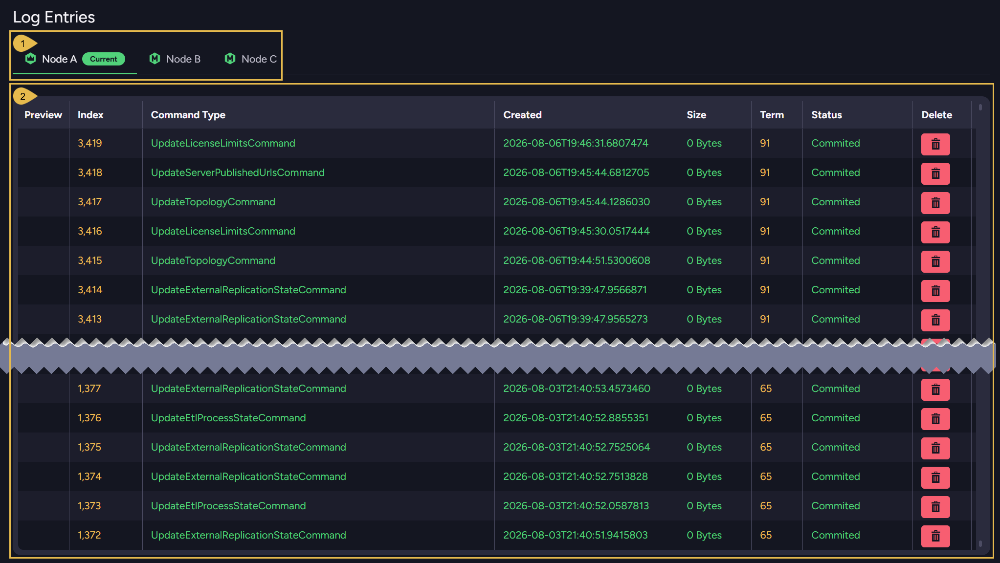

1. **Node tabs**  
   Pick the node whose log the table shows.  
   The leader is marked with a leader icon, and the node Studio is connected to carries a
   `Current` badge.

2. **The table**  
   Each row holds one log entry: the entry's index, the command type, the creation time,
   the entry's size, the term the entry was created under, and the entry's status,
   `Committed` for a command the node has committed and `Appended` for a command not yet
   committed.

---

The `Preview` column holds a button while an entry still carries the entry's content:
once a command has been committed on all cluster nodes, the command's payload is
truncated from the log, and the entry remains listed as history, with a `0 Bytes` size
and no `Preview` button.

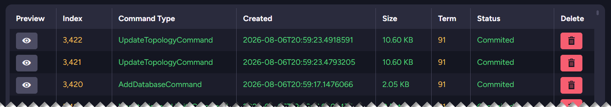

Clicking the `Preview` button displays the command's content in JSON format, as shown in
the image below: the exact change the command carries.

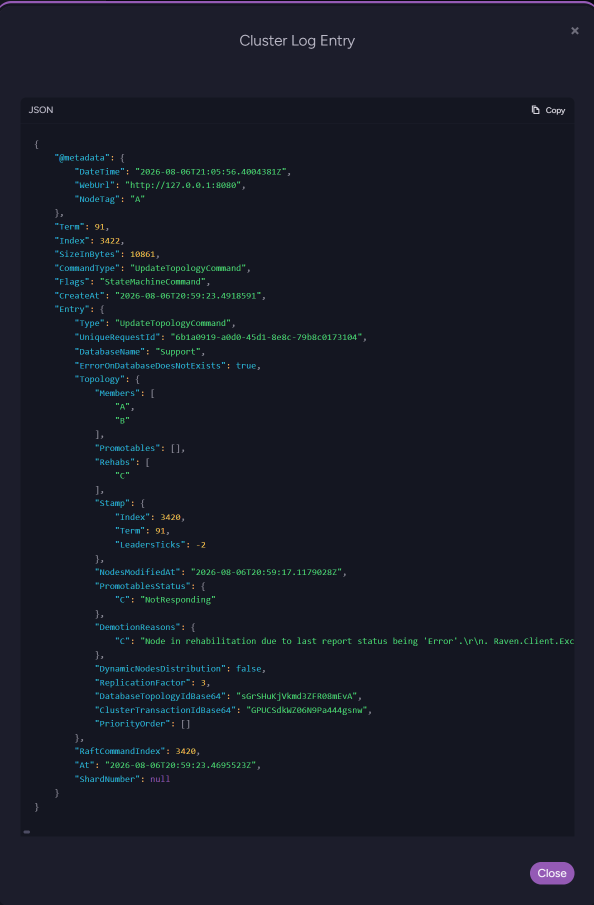

---

Clicking an entry's `Delete` button removes the entry from the Raft log of ALL cluster
nodes.  
Deleting a log entry can lead to data inconsistencies and cluster instability; a
confirmation dialog states the risk, and the deletion requires a `Cluster Admin`
security clearance.

</ContentFrame>

</Panel>

<Panel heading="Record Transaction Commands tab">

A transaction-commands recording captures the write operations a database executes (e.g., `Put`
and `Delete` document operations) in a file that the
[Replay Transaction Commands](../../monitoring/debug/advanced-debug-view.mdx#replay-transaction-commands-tab)
tab can later replay on another database.  
Some problems are triggered only by the exact sequence of operations that reaches the
database (e.g., a document left with unexpected contents after two clients modified the
document in a particular order).  
Record the sequence while the problem occurs, and replay the recording elsewhere (e.g., on
a test machine) to reproduce and investigate the failure.  
Recording might affect the server's performance, as the warning at the top of the tab
states; stop the recording once the sequence has been captured.

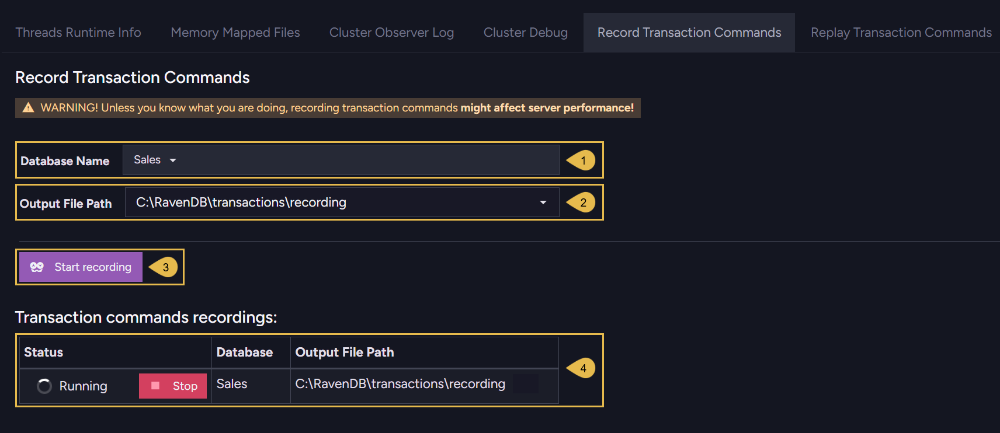

1. **Database Name**  
   Select the database to record.  
   One recording can run per database at a time.

2. **Output File Path**  
   The recording file's full path on the server machine.  
   As you type, the field suggests existing folders from the server file system.  
   The path must name a new file. The server refuses an existing file or a directory path.

3. **Start recording**  
   Start capturing the database's transaction commands into the output file.  
   The recording runs as an operation, tracked in the
   [notification center](../../monitoring/alerts-and-notifications/notification-center.mdx).

   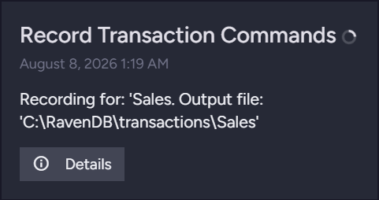

   Click **Details** in the notification to reopen this tab.

4. **Transaction commands recordings**  
   Each row holds one recording: the recording's status (`Running` or `Completed`), the
   recorded database, and the output file path.  
   Click **Stop** to end a running recording; the output file is then ready for replay.

</Panel>

<Panel heading="Replay Transaction Commands tab">

Replaying a
[transaction-commands recording](../../monitoring/debug/advanced-debug-view.mdx#record-transaction-commands-tab)
executes the recorded operations, in the recorded order, on a database of your choice.

<Admonition type="warning" title="">
The replay writes to the target database exactly as the original clients did.  
Choose a target database meant for the investigation, **not** a production database.
</Admonition>

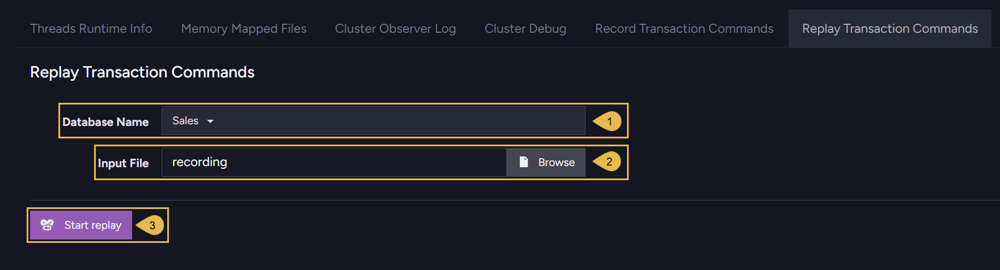

1. **Database Name**  
   Select the database to replay the recording on.

2. **Input File**  
   The recording file to replay.  
   Click **Browse** to select a recording file to upload.

3. **Start replay**  
   Upload the file and execute the recorded operations.  
   The replay runs as an operation; the notification center opens with the operation's
   progress, counting the executed commands.

</Panel>
