import Admonition from '@theme/Admonition';
import ContentFrame from '@site/src/components/ContentFrame';
import Panel from '@site/src/components/Panel';

# Collecting Information for Support

<Admonition type="note" title="">

* When you encounter an incident or an issue with RavenDB, the support team needs relevant information
  to diagnose and resolve it.

* This article describes what information to collect and how to collect it.

* In this article:

  * [Provide incident description](../../monitoring/debug/collect-info.mdx#provide-incident-description)
  * [Create debug package](../../monitoring/debug/collect-info.mdx#create-debug-package)
     * [Create the package](../../monitoring/debug/collect-info.mdx#create-the-package)
     * [Verify the package](../../monitoring/debug/collect-info.mdx#verify-the-package)
  * [Enable logs for ongoing issues](../../monitoring/debug/collect-info.mdx#enable-logs-for-ongoing-issues)
  * [Download logs](../../monitoring/debug/collect-info.mdx#download-logs)
     * [Download the logs](../../monitoring/debug/collect-info.mdx#download-the-logs)
     * [Verify the logs](../../monitoring/debug/collect-info.mdx#verify-the-logs)
  * [Reproduce scenario](../../monitoring/debug/collect-info.mdx#reproduce-scenario)
  * [Create failing test](../../monitoring/debug/collect-info.mdx#create-failing-test)

</Admonition>

<Panel heading="Provide incident description">

Provide the following details about the incident:

| Detail | What to provide |
|-|-|
| **Description** | A detailed description of the incident. Include any error messages, warnings, or unexpected behavior. |
| **Exceptions** | If an exception was thrown, attach the full exception stack trace, including the error message, as plain text. Specify the exception's origin, e.g., RavenDB Studio, the client, or the server logs. |
| **Versions** | Specify your RavenDB server, Studio, and client versions. |

</Panel>

<Panel heading="Create debug package">

<ContentFrame>

### Create the package

Studio's **Debug Package** view allows you to collect diagnostic information about your server or cluster into a debug package (a `.zip` file).  
To create such a package, go to **`Manage Server` > `Debug Package`** and click **Download package for entire cluster** (or choose your current server 
from the dropdown).

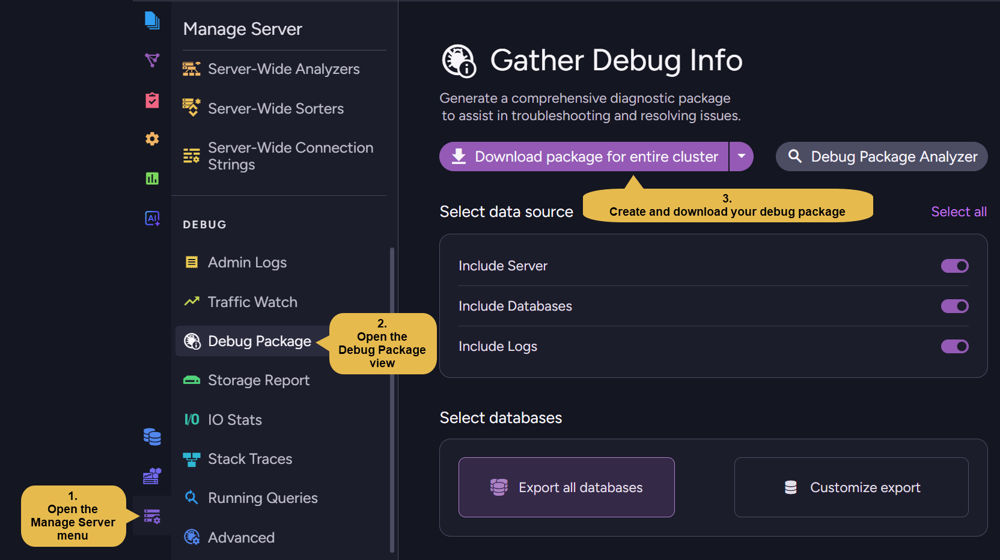

For the full walkthrough, see [Create a Debug Package](../../monitoring/debug/debug-package/create-debug-package.mdx).

---

<Admonition type="info" title="">

**If Studio is unavailable**:

* Try to download the debug package by issuing an HTTP GET request to the following endpoint:  
  `{SERVER_URL}/admin/debug/info-package`.

* Execute this request for each cluster node, replacing `{SERVER_URL}` with the relevant node's URL.

</Admonition>

</ContentFrame>

<ContentFrame>

### Verify the package

**Before sending the debug package zip file**, perform the following checks:

* Verify that the zip file can be successfully extracted.
* Verify that the content is similar to the following sample images:

  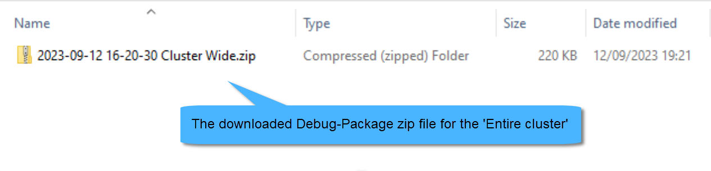

  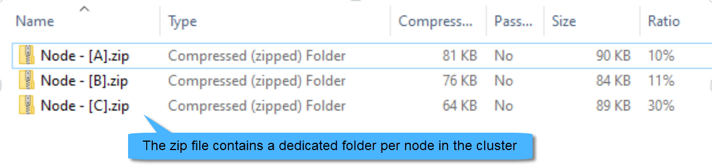

  

  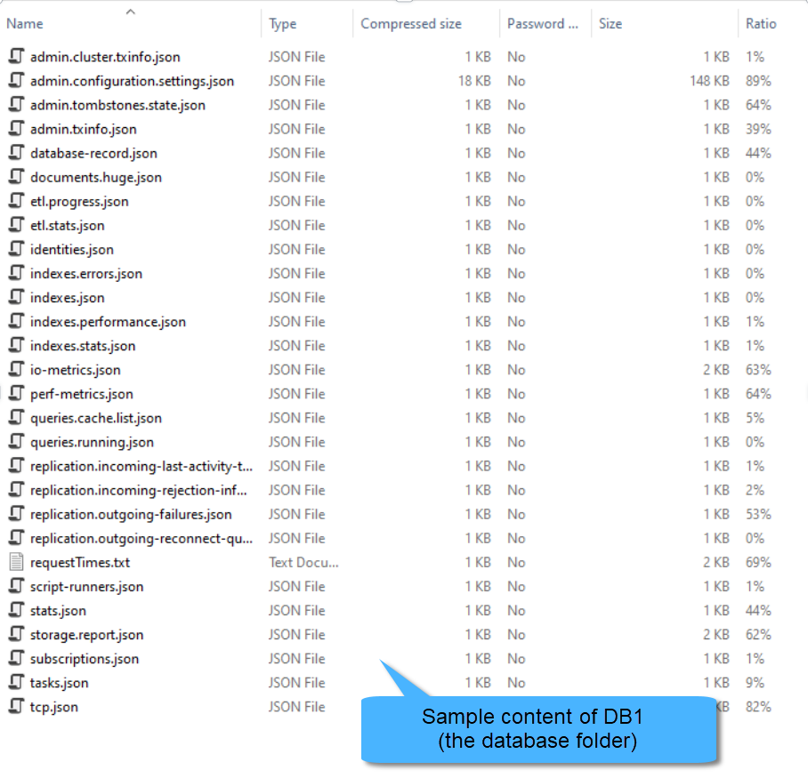

</ContentFrame>

</Panel>

<Panel heading="Enable logs for ongoing issues">

If the issue you're encountering is still **ongoing**, enable debug-level logging on disk as follows
(if not already enabled) to capture helpful information, before [downloading the log files](../../monitoring/debug/collect-info.mdx#download-logs).

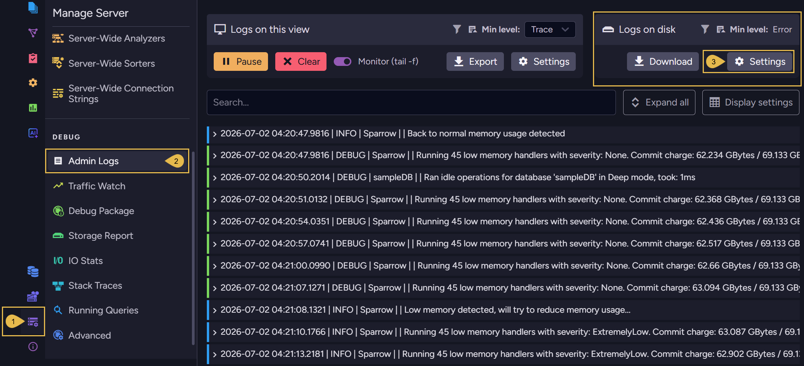

1. Navigate to **Manage Server**.
2. Open the **Admin Logs** view.
3. Click **Settings** in the "Logs on disk" section.  
   The following Settings dialog will open:
   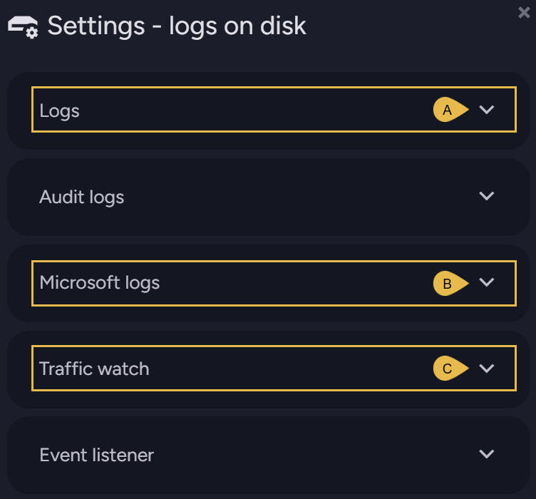

   **`A`**. Click to open the **Logs** (server logs) dialog and change logging level to **Debug**:  
      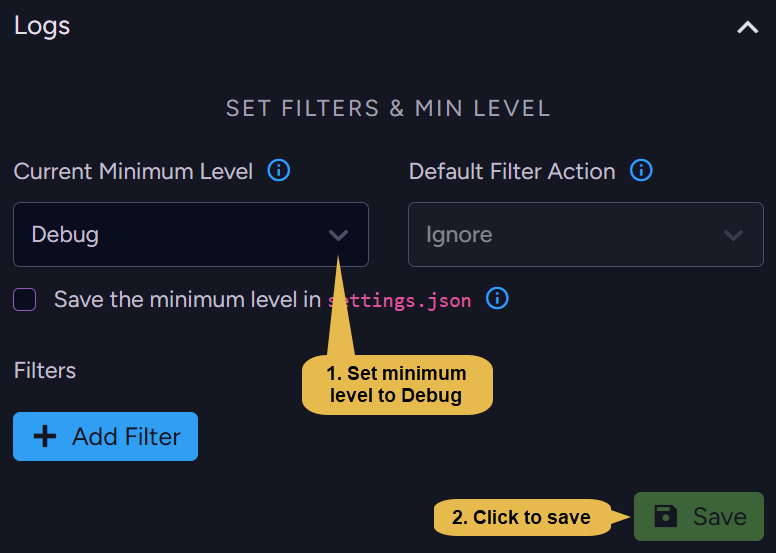

   **`B`**. Click to open the **Microsoft logs** dialog and change logging level to **Debug**:  
      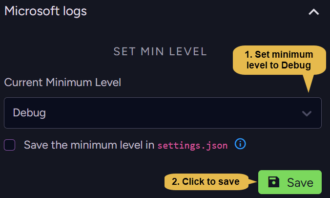

   **`C`**. Click to open the **Traffic watch** dialog and enable logging:  
      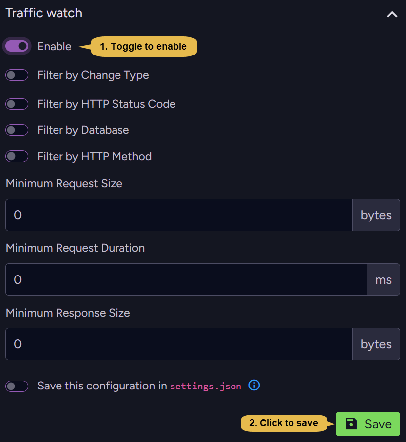

---

<Admonition type="warning" title="">

Be aware that a server restart will **reset all log settings** to their default values.  
To preserve your settings even through a restart, either:

  * **Save the settings** via Studio:  
    [Open each log type dialog](../../monitoring/debug/collect-info.mdx#enable-logs-for-ongoing-issues), 
    check the "Save ... in `settings.json`" checkbox, and **save**.  
    Note: the exact checkbox label varies between the log types.  
    e.g., 
    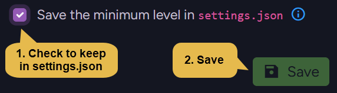

  * or **Set the relevant configuration key** as described in the [configuration overview](../../server/configuration/configuration-options.mdx):
    * For **Server logs**: set the [Logs.MinLevel](../../monitoring/logs/configuration.mdx#logsminlevel) configuration key.  
    * For **Microsoft logs**: set the [Logs.Microsoft.MinLevel](../../monitoring/logs/configuration.mdx#logsmicrosoftminlevel) configuration key.
    * For **Traffic watch logs**: set the [TrafficWatch.Mode](../../monitoring/traffic-watch/configuration.mdx#trafficwatchmode) configuration key.

</Admonition>

</Panel>

<Panel heading="Download logs">

<ContentFrame>

### Download the logs

Perform the following for each cluster node:

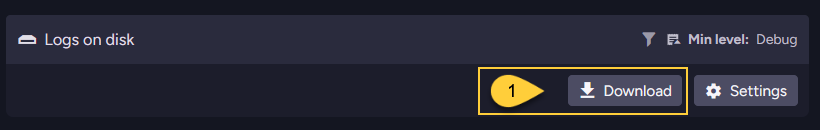

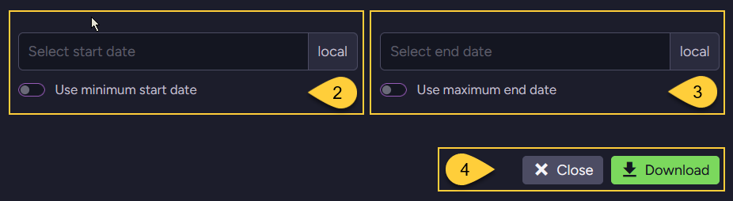

1. Navigate to **`Manage Server` > `Admin Logs`** and click 'Download' in the "Logs on disk" section.

2. Either check 'Use minimum start date' to retrieve logs information from the time the server was started,  
   or enter a specific (local) time.

3. Either check 'Use maximum end date' to retrieve logs information up to the current time,  
   or enter a specific (local) time.

4. Click 'Download'.  
   A zip file containing the logs will be downloaded.

---

<Admonition type="info" title="">

**If Studio is unavailable**, or the logs downloaded via Studio appear erroneous,  
copy the log files directly from disk to another location to ensure they are kept,  
avoiding potentially losing them due to retention policy.

* **Log files location** is set by the [Logs.Path](../../monitoring/logs/configuration.mdx#logspath) configuration key.

* **Logs deletion** is controlled by the following configuration keys:
  * [Logs.MaxArchiveDays](../../monitoring/logs/configuration.mdx#logsmaxarchivedays)
  * [Logs.MaxArchiveFiles ](../../monitoring/logs/configuration.mdx#logsmaxarchivefiles)

</Admonition>

</ContentFrame>

<ContentFrame>

### Verify the logs

**Before sending the log files**, perform the following checks:

* Verify that the zip files can be successfully extracted.
* Confirm that the logs correspond to the time of the incident.
* Verify that the content is similar to the following sample images:

  

  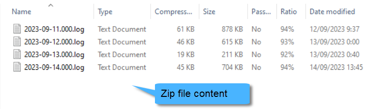

</ContentFrame>

</Panel>

<Panel heading="Reproduce scenario">

* If the incident is over and you can reproduce it, verify first that the logging level is set to '**Debug**'.  

* See how to enable the logs in [Enable logs](../../monitoring/debug/collect-info.mdx#enable-logs-for-ongoing-issues).

</Panel>

<Panel heading="Create failing test">

* If possible, it is advised to create a unit test that showcases the failure in your client code.

* Refer to [Writing your unit test](../../start/test-driver.mdx) to learn how to use RavenDB's **TestDriver**.

</Panel>