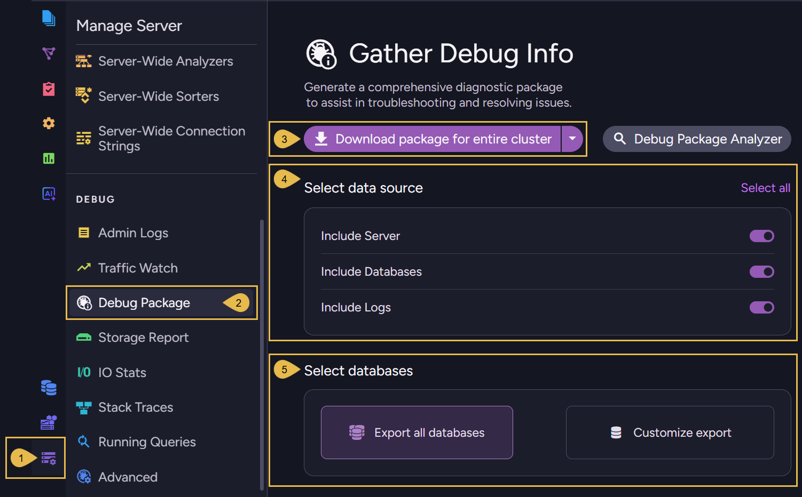
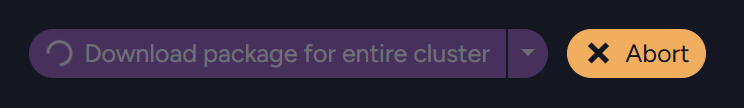
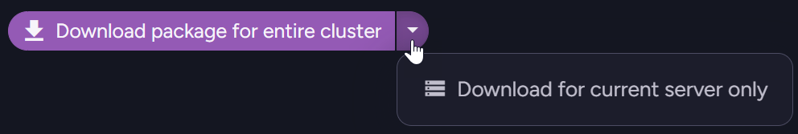
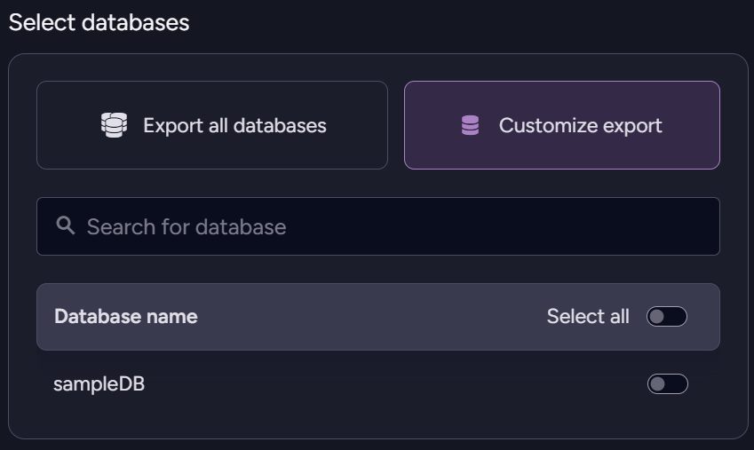

import Admonition from '@theme/Admonition';
import Panel from "@site/src/components/Panel";

# Create a Debug Package

<Admonition type="note" title="">

* Use the **Gather Debug Info** tool, available via Studio's **Debug Package** view, to collect diagnostic information 
  about a server or a cluster into a single **debug package** `.zip` file.

* The debug package `.zip` file contains server information, per-database statistics and configuration, cluster state, and log files.

* See [Debug Package Analyzer](../../../monitoring/debug/debug-package/debug-package-analyzer.mdx) to learn how to analyze a debug package.

* In this article:

  * [Create a debug package](../../../monitoring/debug/debug-package/create-debug-package.mdx#create-a-debug-package)
  * [Download when Studio is unavailable](../../../monitoring/debug/debug-package/create-debug-package.mdx#download-when-studio-is-unavailable)

</Admonition>

<Panel heading="Create a debug package">

To create a debug package, go to **`Manage Server` > `Debug Package`**.

1. **Manage Server**  
   Click to open the Manage Server menu.

2. **Debug Package**  
   Click to open the Debug Package view.

3. **Download package for entire cluster**  
   Click to collect data from **all cluster nodes** and download the package as a `.zip` file.  
   If you want to cancel the operation while the package is being prepared, click the **Abort** button.
   

   To collect data only from the current server, select **Download for current server only** from the dropdown list.  
   
   
4. **Select data source**  
   Choose whether to include in the package debug information related to the **server**, information related to your **databases**, **logs**, or **select all** for all three.

5. **Select databases**  
   Click **Export all databases** to include debug information related to all databases,  
   or **Customize export** for information related only to specific databases.  
   
</Panel>

<Panel heading="Download when Studio is unavailable">

If Studio is unavailable, you can still download a debug package by sending an HTTP request to each node in the cluster.  
See [Collect Info for Support](../../../monitoring/debug/collect-info.mdx#create-debug-package) for the endpoint and the exact steps.

</Panel>
