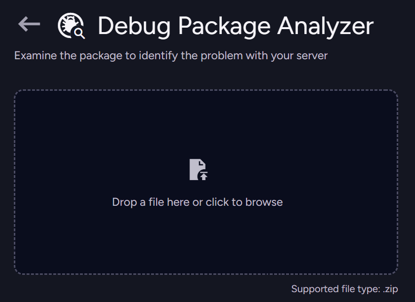
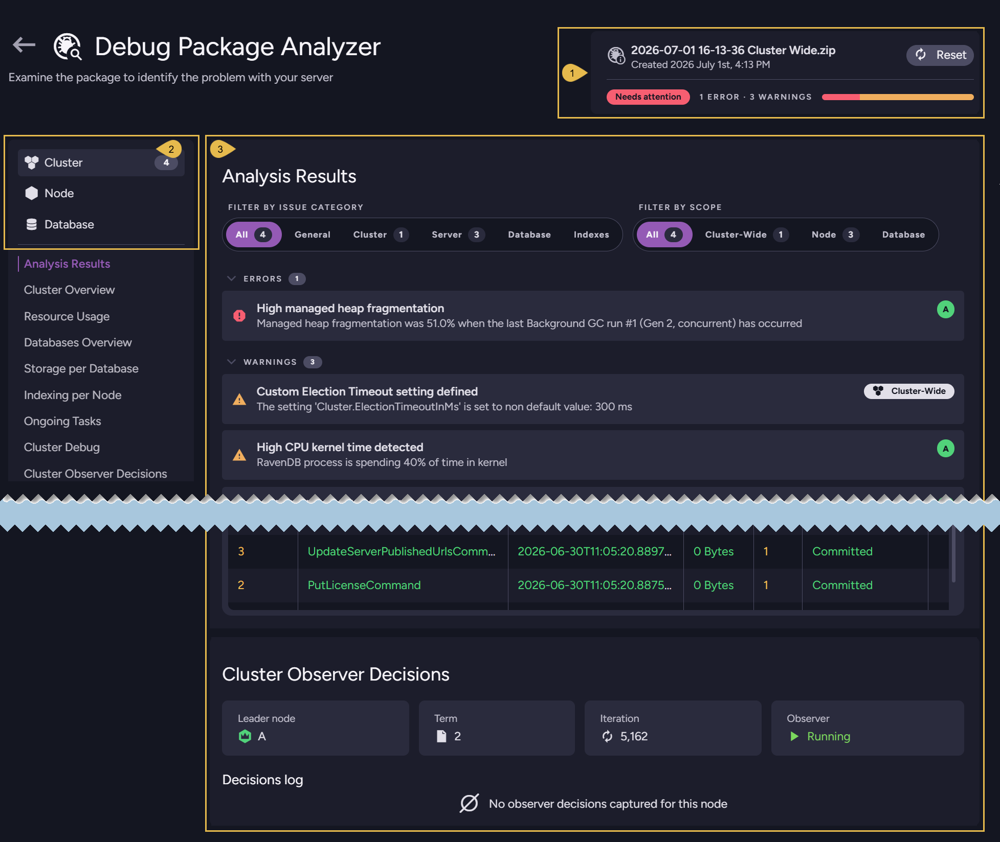

import Admonition from '@theme/Admonition';
import Panel from "@site/src/components/Panel";

# Debug Package Analyzer

<Admonition type="note" title="">

* A debug package is a `.zip` archive of diagnostic data collected from a server or cluster, created in the 
  [Create a Debug Package](../../../monitoring/debug/debug-package/create-debug-package.mdx) view or received from a customer.

* The **Debug Package Analyzer** is a server tool, available via Studio, that inspects a debug package 
  and reports the state of the cluster, its nodes, and its databases, along with any detected issues.  
  The analyzer needs only the package, so you can examine a cluster without connecting to it.

* Support engineers use the analyzer to inspect a customer's debug package, and you can run the analyzer on your own package to look into a problem yourself before contacting support.

* In this article:

  * [Open the Debug Package Analyzer](../../../monitoring/debug/debug-package/debug-package-analyzer.mdx#open-the-debug-package-analyzer)
  * [Review the analysis results](../../../monitoring/debug/debug-package/debug-package-analyzer.mdx#review-the-analysis-results)

</Admonition>

<Panel heading="Open the Debug Package Analyzer">

To open the analyzer, go to **`Manage Server` > `Debug Package`** and click **Debug Package Analyzer**.

Drop a debug package onto the upload area, or click it to browse for a package file.  
The analyzer accepts a single `.zip` file.

</Panel>

<Panel heading="Review the analysis results">

When the analysis is done, the analyzer displays the results.

1. **Package summary**  
   Names the analyzed package and its creation date, and gives an overall verdict, such as **Needs attention**, with the number of errors and warnings found.  
   Click **Reset** to clear the current analysis and upload another package.

2. **Analysis contexts**  
   Switch between the **Cluster**, **Node**, and **Database** contexts to review the findings at each level.  
   Each context lists its own overviews and metrics, such as the cluster's status and resource usage, each node's performance, and each database's statistics and configuration.

3. **Analysis Results**  
   Lists the issues the analyzer detected.  
   Filter them by category and by scope to focus on a particular subsystem or level.

<Admonition type="note" title="">

The analysis is aimed at expert users. It points to potential problems but does not fix them, so it is a good starting point for looking into an issue yourself before contacting [RavenDB support](https://ravendb.net/support/request).

</Admonition>

</Panel>
