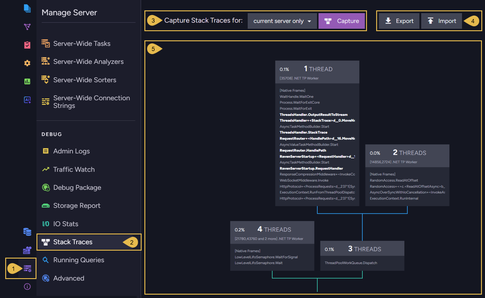
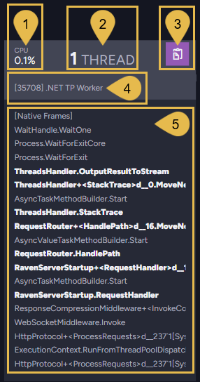
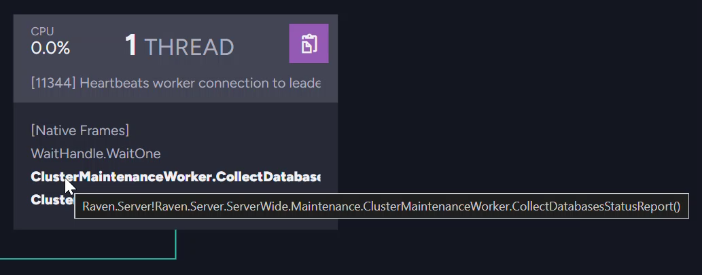
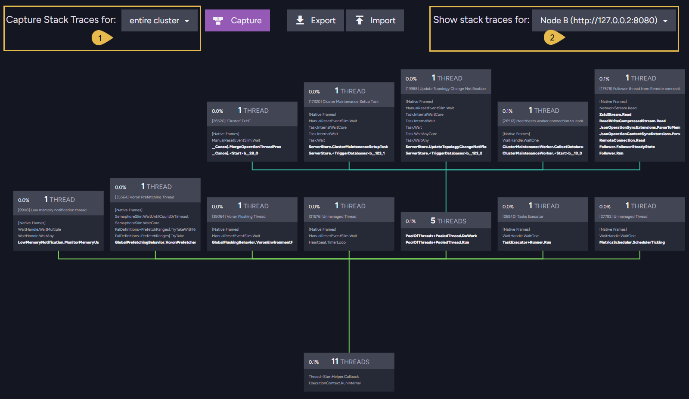
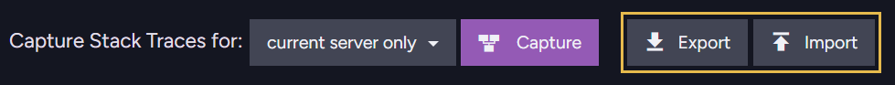

import Admonition from '@theme/Admonition';
import Panel from '@site/src/components/Panel';

# Debug: Stack Traces view

<Admonition type="note" title="">

* Studio's **Stack Traces** view captures the stack traces of all server threads at
  once, and draws the traces as a graph that groups threads running the same code.  
  Use this view to figure out the exact code a misbehaving server runs, for the current
  server or for the entire cluster.

* To capture the stack trace of a single thread rather than that of all threads, use the
  advanced-debug view's
  [Threads Runtime Info](../../monitoring/debug/advanced-debug-view.mdx#threads-runtime-info-tab)
  tab.

* Open the Stack Traces view from the `Manage Server` menu's `Debug` section.

* Capturing stack traces is not supported on macOS servers.

* A captured stack graph is often much larger than the screen, and the images in this
  article show only a portion of the graph.

* In this article:
   * [The Stack Traces view](../../monitoring/debug/stack-traces.mdx#the-stack-traces-view)
   * [Reading the stack graph](../../monitoring/debug/stack-traces.mdx#reading-the-stack-graph)
   * [Cluster-wide capture](../../monitoring/debug/stack-traces.mdx#cluster-wide-capture)
   * [Export and import](../../monitoring/debug/stack-traces.mdx#export-and-import)

</Admonition>

<Panel heading="The Stack Traces view">

Clicking **Capture** takes one snapshot of every server thread, and displays the
collected stack traces as a graph.  
Any user with an Operator or Cluster Admin
[security clearance](../../server/security/authorization/security-clearance-and-permissions.mdx)
can open the view.  
**`Manage Server` > `Stack Traces`**

1. **Manage Server**  
   Open the **Manage Server** menu.

2. **Stack Traces**  
   Open the **Stack Traces** view.

3. **Capture Stack Traces**  
   Select capture scope: **current server only**, or
   [entire cluster](../../monitoring/debug/stack-traces.mdx#cluster-wide-capture).  
   Click **Capture** to take the snapshot.

4. **Export and Import**  
   Save a capture to a file or load a saved capture back into the view.  
   See [Export and import](../../monitoring/debug/stack-traces.mdx#export-and-import) below.

5. **The stack graph**  
   The captured stack traces, drawn as a tree that groups threads running the same code.  
   See [Reading the stack graph](../../monitoring/debug/stack-traces.mdx#reading-the-stack-graph) below.

</Panel>

<Panel heading="Reading the stack graph">

The stack graph gathers the captured traces into a tree:

* Each trace is a list of
  [stack frames](../../monitoring/debug/advanced-debug-view.mdx#threads-runtime-info-tab),
  one method call per frame, read from the bottom up: the method in each frame was called
  by the method in the frame beneath it.
* Traces that begin with the same method calls are merged: the shared frames are drawn in
  a single box, and the box branches upward into boxes that continue the separate ways the
  threads went.
* The tree, too, is read from the bottom up: the lowest box holds the methods all the
  threads started with, and the topmost frames hold the code the threads execute right now.

1. **CPU usage**  
   The CPU usage of the box's threads, summed.

2. **Thread count**  
   The number of threads that execute the frames shown in this box.

3. **Copy**  
   Copy the stack to the clipboard, including: the box's frames, followed by the frames of
   each box on the way down from this box to the bottom of the graph.

4. **Thread ID and name**  
   Each thread is listed by its ID and name on the topmost box of its branch, the box that
   holds the thread's current code.  
   Threads RavenDB dedicates to a specific job are named after the job, e.g.,
   `[26984] 'Orders' TxMT` for the thread that merges the `Orders` database's transactions;
   other threads carry the names the .NET runtime gives them, e.g., `.NET TP Worker` for a
   thread-pool worker.  
   Threads that share a name are listed together: `[47060,40372 and 6 more] .NET TP Worker`.

5. **The frames**  
   The frames shared by the box's threads.  
   RavenDB's own methods are shown in bold, and the method names are shortened to fit the
   box: hovering over a frame for a moment shows it in full.

   

Zoom the graph with the mouse wheel, and drag it to move around.  
Zooming far out shows the shape of the whole tree at a glance: boxes too small to read are
drawn as plain outlines.

</Panel>

<Panel heading="Cluster-wide capture">

Capturing the **entire cluster** takes the snapshot on every cluster node: each node
captures its own threads, and the view collects the captures and displays them one node at
a time.

1. **Capture scope**  
   Set the scope to **entire cluster** and click **Capture**.

2. **Show stack traces**  
   Select a node to display its capture.

If one of the nodes failed to capture its traces (a macOS server, for example), selecting
this node shows the error instead of a graph.

</Panel>

<Panel heading="Export and import">

A capture is kept only in the view: leaving the view discards it.  
Export a capture to keep it, and import saved captures to examine them at any time, on any
server: e.g., compare captures taken before and after a change, or read a capture taken on
a customer's cluster.

* Clicking **Export** saves the displayed capture to a JSON file.  
  The button is disabled until a capture is taken, and hidden when the view shows an
  imported capture (the capture already exists as a file).
* Clicking **Import** loads a saved capture back into the view: a file saved with
  **Export**, or a stack-traces file extracted from a
  [debug package](../../monitoring/debug/debug-package/create-debug-package.mdx).

The [Debug Package Analyzer](../../monitoring/debug/debug-package/debug-package-analyzer.mdx)
can also show a package's captures in this view directly: select a node's
**Performance Metrics** > **Threads** tab and click **Open in Stack Traces viewer**.

</Panel>
